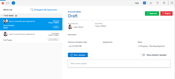

# 檢閱者的[!UICONTROL 首頁]區域

<!--

(NOTE: from Alina: not sure if we should still keep this one or not. In the past, Reviewers had a limited "Home" area which was their default page. Since now they created a "My Updates" area which is their new default, not sure if this makes much sense to still keep. The "My Updates" article is linked from this one, right at the top.)

-->

依預設，會指派檢閱者[!UICONTROL 我的更新]區域。 只有在[!DNL Adobe Workfront]管理員將[!UICONTROL Home]區域新增至其配置範本時，他們才能存取修改過的[!UICONTROL Home]區域版本。

本文說明如果您有[!UICONTROL 檢閱]授權，可在[!UICONTROL 首頁]區域執行的活動。

如需[!UICONTROL 檢閱]授權使用者預設導覽的詳細資訊，請參閱[瞭解[!UICONTROL 檢閱]授權使用者](../../../workfront-basics/navigate-workfront/workfront-navigation/reviewer-global-navigation-bar.md)的導覽。 如需[!UICONTROL 我的更新]區域的詳細資訊，請參閱[使用[!UICONTROL 我的更新]區域](../../../workfront-basics/using-home/using-the-home-area/my-updates-area.md)。

>[!TIP]
>
>* 物件外部的使用者之間的一般更新未啟用。
>* 雖然具有[!UICONTROL 檢閱]授權的使用者可以被指派任務，但他們不會收到有關指派的電子郵件或其他通知，並且他們無法將他們標籤為「[!UICONTROL 完成]」。
>

## 存取需求

您必須具有下列存取權才能執行本文中的步驟：

<table style="table-layout:auto"> 
 <col> 
 </col> 
 <col> 
 </col> 
 <tbody> 
  <tr> 
   <td role="rowheader"><strong>[!DNL Adobe Workfront plan*]</strong></td> 
   <td> 
任何
 </td> 
  </tr> 
  <tr> 
   <td role="rowheader"><strong>[!DNL Adobe Workfront] 授權*</strong></td> 
   <td> 
[！UICONTROL評論] 
 </td> 
  </tr> 
 </tbody> 
</table>

&#42;若要瞭解您擁有的計畫或授權型別，請連絡您的[!DNL Workfront]系統管理員。

## 核准工作

1. （視條件而定）如果您的[!DNL Workfront]管理員將首頁區域新增至您的版面配置範本，請按一下[!DNL Adobe Workfront]左上角的&#x200B;**[!DNL Workfront]頭像**&#x200B;圖示。

   或

   按一下&#x200B;**[!UICONTROL 主功能表]** ，然後按一下&#x200B;**[!UICONTROL 首頁]**。

   >[!NOTE]
   >
   >[!DNL Workfront]管理員可能會對您環境中的[!DNL Workfront]圖示進行下列變更：
   >
   >   
   >   
   >   * 以自訂的影像取代，以說明您的組織。 在此情況下，圖示看起來將會與本文中顯示的有所不同。
   >   * 使用其他頁面取代連結至該頁面的頁面。 在此情況下，請按一下頁面右上角的&#x200B;**[!UICONTROL 主要功能表]** ，然後按一下&#x200B;**[!UICONTROL 首頁]**。

   

1. 從畫面左側的[!UICONTROL 工作清單]中選取核准。
1. 按一下&#x200B;**[!UICONTROL 核准]**、**[!UICONTROL 變更]**&#x200B;或&#x200B;**[!UICONTROL 拒絕]**。

   >[!IMPORTANT]
   >
   >一旦您做出核准決定，便無法變更。

1. （選用）新增註解至您的核准決定。

## 委派核准作業

1. （視條件而定）如果您的[!DNL Workfront]管理員將首頁區域新增至您的版面配置範本，請按一下[!DNL Adobe Workfront]左上角的&#x200B;**[!UICONTROL Workfront]頭像**&#x200B;圖示

   或

   按一下&#x200B;**[!UICONTROL 主功能表]** ，然後按一下&#x200B;**[!UICONTROL 首頁]**。

1. 按一下工作清單上方的&#x200B;**[!UICONTROL 委派我的核准]**。

   

1. 輸入您要委派核准的使用者名稱。 您只能委派專案、任務和問題核准。
1. 選擇&#x200B;**[!UICONTROL 開始日期]**。
1. 選擇&#x200B;**[!UICONTROL 結束日期]**。\
   或\
   選擇&#x200B;**[!UICONTROL 無結束日期]**。

1. 按一下「**[!UICONTROL 儲存]**」。

## 提醒或撤回您已提交的核准

1. （視條件而定）如果您的[!DNL Workfront]管理員將首頁區域新增至您的版面配置範本，請按一下[!DNL Adobe Workfront]左上角的&#x200B;**[!UICONTROL Workfront]頭像**&#x200B;圖示。

   或

   按一下&#x200B;**[!UICONTROL 主功能表]** ，然後按一下&#x200B;**[!UICONTROL 首頁]**。

   

1. 展開工作清單中我已提交的&#x200B;**[!UICONTROL 核准]**&#x200B;群組。
1. 選取核准。
1. 按一下右上角的&#x200B;**[!UICONTROL 撤銷]**&#x200B;或&#x200B;**[!UICONTROL 提醒]**。

## 發表評論

1. （視條件而定）若您的[!DNL Workfront]管理員已將[!UICONTROL 首頁]區域新增至您的版面配置範本，請按一下[!DNL Adobe Workfront]左上角的&#x200B;**[!UICONTROL Workfront]頭像**&#x200B;圖示。

   或

   按一下&#x200B;**[!UICONTROL 主功能表]** ，然後按一下&#x200B;**[!UICONTROL 首頁]**。

   

1. 從畫面左側的[!UICONTROL 工作清單]中選取核准。
1. 在右側面板中，按一下&#x200B;**[!UICONTROL 開始新的更新]**&#x200B;方塊。
1. 進行更新。
1. 按一下&#x200B;**[!UICONTROL 更新]**。

