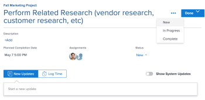

# 將項目標示為 [!UICONTROL 完成] 在 [!UICONTROL 首頁] 區域

如果您是任務或問題受託人，可以將任務或問題標籤為「完成」。 將任務或問題標籤為 [!UICONTROL 完成]，則任務或問題的狀態將更改為 [!UICONTROL 完成].

>[!NOTE]
>
>您沒有看到 [!UICONTROL 完成] 按鈕，除非您是指派給任務或問題的資源之一。

## 存取需求

您必須具備下列存取權，才能執行本文中的步驟：

<table style="table-layout:auto"> 
 <col> 
 </col> 
 <col> 
 </col> 
 <tbody> 
  <tr> 
   <td role="rowheader"><strong>[!DNL Adobe Workfront plan*]</strong></td> 
   <td> 
任何
 </td> 
  </tr> 
  <tr> 
   <td role="rowheader"><strong>[!DNL Adobe Workfront] 授權*</strong></td> 
   <td> 
[!UICONTROL工作]或更高版本
 </td> 
  </tr> 
  <tr> 
   <td role="rowheader"><strong>訪問級別配置*</strong></td> 
   <td> 
[!UICONTROL編輯]對任務和問題的訪問
 
注意：如果您仍無法存取，請詢問您的 [!DNL Workfront] 管理員。 若要了解 [!DNL Workfront] 管理員可修改您的存取層級，請參閱 <a href="../../../administration-and-setup/add-users/configure-and-grant-access/create-modify-access-levels.md" class="MCXref xref">建立或修改自訂存取層級</a>.
 </td> 
  </tr> 
  <tr> 
   <td role="rowheader"><strong>物件權限</strong></td> 
   <td> 
將權限或更高版本貢獻給您需要處理的任務和問題
 
有關請求其他訪問的資訊，請參閱 <a href="../../../workfront-basics/grant-and-request-access-to-objects/request-access.md" class="MCXref xref">請求對對象的訪問 </a>.
 </td> 
  </tr> 
 </tbody> 
</table>

&#42;若要了解您擁有的計畫、授權類型或存取權，請聯絡您的 [!DNL Workfront] 管理員。

## 將任務或問題標籤為 [!UICONTROL 完成]

只有分配給任務或問題的用戶才能將其標籤為 [!UICONTROL 完成].

1. 按一下 **[!UICONTROL 主菜單]**  在右上角，按一下 **[!UICONTROL 首頁]**.
1. 在 **[!UICONTROL 工作清單]**，找出任何等待處理的項目。
1. 執行下列任一操作：

* 按一下 **[!UICONTROL 完成]** 在工作項目上。\
   請參閱 [了解 [!UICONTROL 完成] 按鈕](#understand-the-options-of-the-done-button) 以取得此按鈕可能顯示方式的詳細資訊。

* 選取要標示為完成的項目，然後在右側面板中，按一下 **[!UICONTROL 更新狀態]**，然後將項目狀態變更為相等的狀態 [!UICONTROL 完成] 或 [!UICONTROL 已關閉].

## 了解 [!UICONTROL 完成] 按鈕

依預設，按一下 [!UICONTROL 完成] 工作項的按鈕將該項的狀態更改為 [!UICONTROL 完成] （適用於任務）或 [!UICONTROL 已解決] （針對問題）。

您的 [!DNL Adobe Workfront] 管理員可自訂與 [!UICONTROL 完成] 按鈕，然後將這些自定義項應用到您的「首頁團隊」。

視有多少個狀態與 [!UICONTROL 完成] 按鈕，或指派多少資源給任務或問題、外觀 [!UICONTROL 完成] 按鈕可以變更。

* [[!UICONTROL 完成] 與一個狀態關聯的按鈕](#done-button-associated-with-one-status)
* [[!UICONTROL 完成] 多個狀態關聯的按鈕](#done-button-associated-with-multiple-statuses)
* [[!UICONTROL 完成] 按鈕分配給多個資源的物料](#done-button-for-items-assigned-to-multiple-resources)

### [!UICONTROL 完成] 與一個狀態關聯的按鈕

當 [!UICONTROL 完成] 按鈕與一個狀態關聯，並且工作項僅分配給您，按鈕讀取 **[!UICONTROL 完成]**. 按一下它後，任務或問題的狀態將更改為與 [!UICONTROL 完成] 按鈕。

若要了解哪些狀態與 [!UICONTROL 完成] 按鈕，檢查 [!UICONTROL 團隊設定] 您的家庭團隊 [!UICONTROL 完成按鈕] 一節，如 [編輯團隊設定](../../../people-teams-and-groups/create-and-manage-teams/edit-team-settings.md).

如果未指派給主團隊，則在按一下 [!UICONTROL 完成]，如上所述 [了解 [!UICONTROL 完成] 按鈕](#understand-the-options-of-the-done-button).

### [!UICONTROL 完成] 多個狀態關聯的按鈕

當 [!UICONTROL 完成] 按鈕與多個狀態相關聯，按鈕會顯示字詞 **[!UICONTROL 完成]** 之後會是下拉式功能表。 在此情境中，您無法直接按一下 [!UICONTROL 完成]. 您必須從下拉式功能表中選取狀態。 選擇最適合完成工作項的狀態。 通過執行此操作，您將更改工作項的狀態。

若要了解如何將多個狀態與 [!UICONTROL 完成] 按鈕，請參閱 [設定 [!UICONTROL 完成] 任務按鈕](../../../people-teams-and-groups/create-and-manage-teams/configure-the-done-button-for-tasks.md) 和 [設定 [!UICONTROL 完成] 問題按鈕](../../../people-teams-and-groups/create-and-manage-teams/configure-the-done-button-for-issues.md).

<!--

-->

### [!UICONTROL 完成] 按鈕分配給多個資源的物料

將任務或問題指派給多個資源時，按鈕會顯示該字 **[!UICONTROL 完成]** 之後會是下拉式功能表。 在下拉式功能表中，您可以選擇 **[!UICONTROL 完成我的任務]** （這可讓團隊成員知道您已完成任務的一部分），或與 [!UICONTROL 完成] 按鈕（完成項目）。 選取 **[!UICONTROL 完成我的任務]**，工作項將從「工作清單」中刪除，但仍保留在分配給該工作項的「工作清單」中。\
如果「完成」按鈕與多個狀態相關聯，則會列在 **完成我的任務**.

>[!NOTE]
>
>對於多個受分配者的任務或問題，每個用戶都負責指示他們在任務或問題上的分配實際已完成。 因此，每個受託人必須按一下 [!UICONTROL 完成] 顯示他們已完成在物料上分配給他們的工作。

