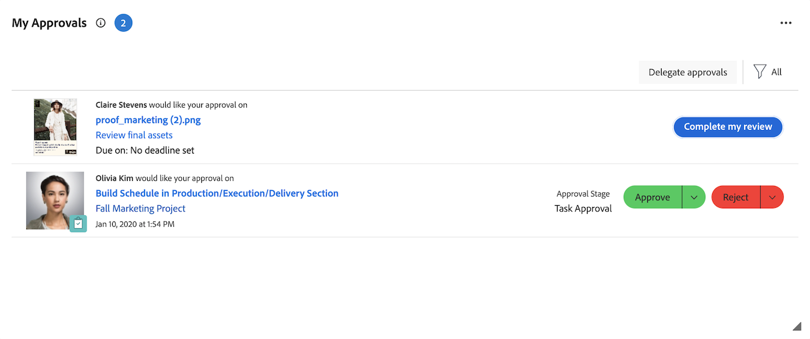

# 使用我的核准Widget管理您的核准

「我的核准」Widget會集中顯示您所有擱置中、已指派、已委派及已提交的核准。 在這裡，您可以依需求篩選及組織核准、做出決定及委派核准。

我的核准Widget支援來自下列Workfront物件的核准：

* 任務
* 問題
* 專案
* 文件
* 校訂
* 計畫記錄請求
* 時程表

## 存取需求

+++ 展開以檢視本文中功能的存取需求。

<table style="table-layout:auto"> 
 <col> 
 <col> 
 <tbody> 
  <tr> 
   <td role="rowheader">Adobe Workfront套件</td> 
   <td> 
任何
 </td> 
  </tr> 
  <tr> 
   <td role="rowheader">Adobe Workfront授權</td> 
   <td> 
   
投稿人或以上

   
評論或以上
 </td> 
  </tr> 
  <tr> 
   <td role="rowheader">存取層級設定</td> 
   <td> 
檢視與核准關聯的物件或更高的存取許可權
</td> 
  </tr> 
  <tr> 
   <td role="rowheader">物件許可權</td> 
   <td> 
檢視與核准相關聯的物件或更高許可權
</td> 
  </tr> 
 </tbody> 
</table>

如需詳細資訊，請參閱Workfront檔案中的[存取需求](/help/quicksilver/administration-and-setup/add-users/access-levels-and-object-permissions/access-level-requirements-in-documentation.md)。

+++

## 從我的核准Widget核准工作

1. 按一下右上角的&#x200B;**[!UICONTROL 主功能表]** ，然後按一下&#x200B;**[!UICONTROL 首頁]**。
1. （視條件而定）按一下&#x200B;**自訂**&#x200B;以新增&#x200B;**我的核准** Widget。
1. （視條件而定）按一下&#x200B;**篩選器**&#x200B;下拉式功能表，然後選取&#x200B;**全部**&#x200B;以檢視指派給您的核准和委派。

   >[!NOTE]
   >
   >指派給工作角色或群組的核准未顯示在首頁中。 指派給團隊的核准會顯示在每個團隊成員的「我的核准」小工具中。

1. 選取您要進行核准決定的專案。

   

1. 在右側面板中作出核准決定時，按一下其中一個可用選項。 下列選項會根據您核准的專案型別，顯示在頁面的右上角：

   <table>
   <tr>
      <td>
      
<strong>存取</strong>

      </td>
      <td>
      
<strong>工作專案</strong>

      </td>
      <td>
      
<strong>文件</strong>

      </td>
      <td>
      
<strong>校訂</strong>

      </td>
   </tr>
   <tr>
      <td>
       <ul>
      <li>授予</li>
      <li>忽略</li>
      </ul>
      如有需要，您可以在<b>變更存取權</b>下拉式功能表中調整存取權等級。
      </td>
      <td>
         <ul>
         <li>核准</li>
         <li>拒絕</li>
         </ul>
      您可以按一下決定按鈕中的下拉式功能表，在決定中留下註解。
      </td>
      <td>
   已指派為核准者
         <ul>
         <li>核准</li>
         <li>核准 (附帶變更)</li>
         <li>需要工作</li>
         </ul>
   已指派為檢閱者
         <ul>
         <li>完成我的審閱</li>
         </ul>
      此欄中的選項僅適用於整合式核准。 舊版檔案核准看起來與工作專案核准相同。 
      </td>
      <td>
         <ul>
         <li>前往校訂</li>
         </ul>
         您會在校訂檢視器中做出決定。 如需檢閱校訂的相關資訊，請參閱<a href="/help/quicksilver/review-and-approve-work/proofing/reviewing-proofs-within-workfront/review-proofs-in-wf.md">在Adobe Workfront中檢閱校訂</a>。
      </td>
   </tr>
   </table>

在您做出決定後，核准會從我的核准Widget中移除。