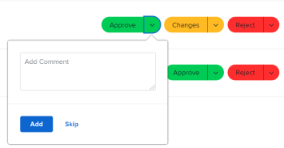

# 使用[!UICONTROL 我的更新]區域

<!--The highlighted information on this page refers to functionality not yet generally available. It is available only in the Preview environment for all customers. After the monthly releases to Production, the same features are also available in the Production environment for customers who enabled fast releases.    

For information about fast releases, see [Enable or disable fast releases for your organization](/help/quicksilver/administration-and-setup/set-up-workfront/configure-system-defaults/enable-fast-release-process.md). -->

您可以使用[!UICONTROL 我的更新]區域來快速檢閱等待您決定的核准或您已加入的交談。

身為擁有[!UICONTROL 檢閱]授權的使用者，您可以依預設在[!UICONTROL 主要功能表]中找到[!UICONTROL 我的更新]區域，而[!UICONTROL 我的更新]區域是您的預設登陸頁面。

如需[!DNL Adobe Workfront]授權的相關資訊，請參閱[[!DNL Adobe Workfront] 授權總覽](../../../administration-and-setup/add-users/access-levels-and-object-permissions/wf-licenses.md)。

如果您的授權型別與[檢閱]不同，[!DNL Workfront]或群組管理員必須將[!UICONTROL 我的更新]區域新增到您的版面配置範本，才能在主要功能表中顯示它。 如需詳細資訊，請參閱[使用配置範本自訂[!UICONTROL 主功能表]](../../../administration-and-setup/customize-workfront/use-layout-templates/customize-main-menu.md)。

## 存取需求

+++ 展開以檢視本文中功能的存取需求。

您必須具有下列存取權才能執行本文中的步驟：

<table style="table-layout:auto"> 
 <col> 
 <col> 
 <tbody> 
  <tr> 
   <td role="rowheader"><strong>[!DNL Adobe Workfront plan]</strong></td> 
   <td> 
任何
 </td> 
  </tr> 
  <tr> 
   <td role="rowheader"><strong>[!DNL Adobe Workfront] 授權*</strong></td> 
   <td> 
新增：投稿人或更高版本

   或   
   
目前： [！UICONTROL Request]或以上
 </td> 
  </tr> 
  <tr> 
   <td role="rowheader"><strong>存取層級設定</strong></td> 
   <td> 
檢視您在對話中被標籤或需要解決核准（專案、任務、問題、檔案）之任何物件的存取權或以上許可權
 </td> 
  </tr> 
  <tr> 
   <td role="rowheader"><strong>物件許可權</strong></td> 
   <td> 
[！UICONTROL檢視]對您在對話中被標籤或需要解決核准的專案、任務、問題和檔案的許可權或更高
 </td> 
  </tr> 
 </tbody> 
</table>

*若要瞭解您擁有的計畫、授權型別或存取權，請連絡您的[!DNL Workfront]管理員。 如需詳細資訊，請參閱Workfront檔案中的[存取需求](/help/quicksilver/administration-and-setup/add-users/access-levels-and-object-permissions/access-level-requirements-in-documentation.md)。

+++

## 先決條件

開始之前，您必須具備下列條件：

* 如果您有[!UICONTROL 檢閱]以外的[!DNL Workfront]授權，您的[!DNL Workfront]或群組管理員必須使用配置範本將[!UICONTROL 我的更新]區域新增到[!UICONTROL 主功能表]，並將您指派給該範本。

* 檢閱授權使用者預設可在[!UICONTROL 主功能表]中檢視[!UICONTROL 我的更新]區域。

## 存取[!UICONTROL 我的更新]區域

1. 在&#x200B;**[!UICONTROL 主功能表]**&#x200B;中按一下&#x200B;**[!UICONTROL 我的更新]**。

   

   [!UICONTROL 我的更新]區域隨即開啟。

   指派給您的核准和存取要求列在頁面前半段的&#x200B;**我的更新**&#x200B;底下。

   

1. （選擇性）捲動至&#x200B;[!UICONTROL **我的更新**]&#x200B;區域底部，然後按一下向右箭頭，以顯示其他頁面上顯示的更多核准。

   >[!TIP]
   >
   >依預設，會顯示前五個核准或存取請求。 其餘核准會顯示在其他頁面上。 您最多可以在[!UICONTROL 我的更新]區域顯示2000個核准。

   我的更新

1. （選擇性）展開&#x200B;**[!UICONTROL 我的更新]**&#x200B;區段右上角的&#x200B;**[!UICONTROL 篩選器]**&#x200B;下拉式功能表，然後選取下列專案：

   <table style="table-layout:auto"> 
    <col> 
    </col> 
    <col> 
    </col> 
    <tbody> 
     <tr> 
      <td role="rowheader"><strong>[！UICONTROL All]</strong></td> 
      <td>由其他使用者提交給您或委派給您的核准。 如需委託核准的詳細資訊，請參閱<a href="../../../review-and-approve-work/manage-approvals/delegate-approval-requests.md" class="MCXref xref">委託核准要求</a>。 </td> 
     </tr> 
     <tr> 
      <td role="rowheader"><strong>[！UICONTROL委派核准]</strong></td> 
      <td>其他使用者委派給您的核准。 </td> 
     </tr> 
     <tr> 
      <td role="rowheader"><strong>[！UICONTROL我的核准]</strong></td> 
      <td> 
核准已提交給您。 
 
如需核准專案的詳細資訊，請參閱<a href="../../../review-and-approve-work/manage-approvals/approving-work.md" class="MCXref xref">核准工作</a>。
 </td> 
     </tr> 
    </tbody> 
   </table>

1. 若要核准或拒絕專案，或在核准前建議對檔案的變更，請執行下列步驟：

   1. （選擇性）按一下核准決定（**[!UICONTROL 核准]**，**[!UICONTROL 變更]**，**[!UICONTROL 拒絕]**）旁的&#x200B;**下拉式清單**&#x200B;圖示並新增註解，然後按一下&#x200B;**[!UICONTROL 新增]**。

      或

      如果您不想輸入註解，請按一下&#x200B;**[!UICONTROL 跳過]**。

      

      >[!NOTE]
      >
      >[!UICONTROL 變更]選項僅針對檔案核准顯示。

      根據您選取的下拉式圖示，專案會被核准、拒絕，或在檔案核准的情況下，會核准進行其他變更的要求。

      >[!TIP]
      >
      >如果您不想在決定中新增註解，可以按一下&#x200B;**[!UICONTROL 核准]**、**[!UICONTROL 拒絕]**&#x200B;或&#x200B;**[!UICONTROL 變更]**&#x200B;按鈕，立即授予核准決定。
      >
      >
      >
      >
      >如需核准工作的詳細資訊，請參閱[核准工作](../../../review-and-approve-work/manage-approvals/approving-work.md)。

1. 按一下&#x200B;**[!UICONTROL 授與存取權]**，以授與您提交的存取權要求

   或

   展開&#x200B;**[!UICONTROL 變更存取權]**&#x200B;下拉式功能表，在您授與存取權之前修改要求的存取權。

   

1. （選擇性）按一下&#x200B;**[!UICONTROL 忽略]**&#x200B;以從核准清單中清除存取要求，而不授予存取要求。
1. 如果您有一段時間無法做出核准決定，請按一下&#x200B;**[!UICONTROL 委派我的核准]**&#x200B;以委派提交給您的核准。 如需委託核准的詳細資訊，請參閱[委託核准要求](../../../review-and-approve-work/manage-approvals/delegate-approval-requests.md)。
1. 捲動至您核准下方的&#x200B;**[!UICONTROL 提及]**&#x200B;區域。 在這裡，您可以檢視您已包含在對話中的所有專案。

   >[!TIP]
   >
   >預設會顯示前50個提及專案。

1. （選擇性）按一下&#x200B;**[!UICONTROL 顯示更多更新]**&#x200B;以檢視更多提及。
1. （選擇性）按一下&#x200B;**[!UICONTROL 回覆]**&#x200B;回覆回應，然後執行下列任一動作：
   * 開始輸入回覆
   * 使用RTF工具列來格式化您的文字、新增連結、清單、表情符號、引號或影像至您的訊息
   * 新增使用者或團隊以通知他們您的回覆。

     如需回覆更新的詳細資訊，請參閱[更新工作](/help/quicksilver/workfront-basics/updating-work-items-and-viewing-updates/update-work.md)。

     新增完回覆後，請按一下&#x200B;**[!UICONTROL 提交]**。

     ![在[我的更新]區域回覆](assets/reply-in-the-my-updates-area.png)

1. （選擇性）按一下「**[!UICONTROL 釘選目前頁面]**」，將「[!UICONTROL 我的更新]」區域釘選到您的頂端導覽列。
