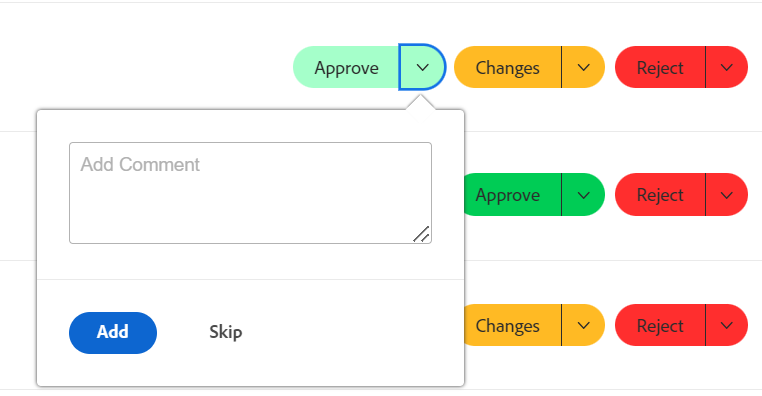

# 使用 [!UICONTROL 我的更新] 區域

<!--

(NOTE: there is a similar article like this in the "My Work" folder that is conditioned for Classic only)

-->

您可以使用 [!UICONTROL 我的更新] 區域以快速檢閱等待您決定的核准，或您已包含的交談。

作為使用者，具有 [!UICONTROL 檢閱] 授權，您可以找到 [!UICONTROL 我的更新] 區域 [!UICONTROL 主要功能表] 依預設，和 [!UICONTROL 我的更新] 區域是您的預設登陸頁面。

如需的相關資訊 [!DNL Adobe Workfront] 授權，請參閱 [[!DNL Adobe Workfront] 授權總覽](../../../administration-and-setup/add-users/access-levels-and-object-permissions/wf-licenses.md).

如果您的授權型別與「檢閱」不同，則 [!DNL Workfront] 或群組管理員必須新增 [!UICONTROL 我的更新] 區域到您的版面範本，以在主功能表中顯示。 如需詳細資訊，請參閱 [自訂 [!UICONTROL 主要功能表] 使用版面範本](../../../administration-and-setup/customize-workfront/use-layout-templates/customize-main-menu.md).

## 存取需求

您必須具有下列存取權才能執行本文中的步驟：

<table style="table-layout:auto"> 
 <col> 
 <col> 
 <tbody> 
  <tr> 
   <td role="rowheader"><strong>[!DNL Adobe Workfront plan]</strong></td> 
   <td> 
任何
 </td> 
  </tr> 
  <tr> 
   <td role="rowheader"><strong>[!DNL Adobe Workfront] 授權*</strong></td> 
   <td> 
新增：投稿人或更高版本

   或   
   
目前： [！UICONTROL Request]或以上
 </td> 
  </tr> 
  <tr> 
   <td role="rowheader"><strong>存取層級設定</strong></td> 
   <td> 
檢視您在對話中被標籤或需要解決核准（專案、任務、問題、檔案）之任何物件的存取權或以上許可權
 </td> 
  </tr> 
  <tr> 
   <td role="rowheader"><strong>物件許可權</strong></td> 
   <td> 
[！UICONTROL檢視]對您在對話中被標籤或需要解決核准的專案、任務、問題和檔案的許可權或更高
 </td> 
  </tr> 
 </tbody> 
</table>

*若要瞭解您擁有的計畫、授權型別或存取權，請連絡 [!DNL Workfront] 管理員。 如需詳細資訊，請參閱 [Workfront檔案中的存取需求](/help/quicksilver/administration-and-setup/add-users/access-levels-and-object-permissions/access-level-requirements-in-documentation.md).

## 先決條件

開始之前，您必須具備下列條件：

* 如果您擁有 [!DNL Workfront] 授權，而不是 [!UICONTROL 檢閱]，您的 [!DNL Workfront] 或群組管理員必須新增 [!UICONTROL 我的更新] 區域至 [!UICONTROL 主要功能表] 使用版面配置範本並將您指派給該範本。

* 檢閱授權使用者可以檢視 [!UICONTROL 我的更新] 區域屬於 [!UICONTROL 主要功能表] 依預設。

## 存取 [!UICONTROL 我的更新] 區域

1. 按一下 **[!UICONTROL 我的更新]** 在 **[!UICONTROL 主要功能表]**.

   

   此 [!UICONTROL 我的更新] 區域隨即開啟。

   指派給您的核准和存取要求會列在頁面前半部分的下方 **我的更新**.

   

1. （可選）捲動至 [!UICONTROL 我的更新] 區域並按一下向右箭頭，以顯示其他頁面上顯示的更多核准。

   >[!TIP]
   >
   >依預設，會顯示前五個核准或存取請求。 其餘核准會顯示在其他頁面上。 您最多可以在以下位置顯示2000個核准： [!UICONTROL 我的更新] 區域。

   

1. （可選）展開 **[!UICONTROL 篩選]** 下拉式功能表  位於的右上角 **[!UICONTROL 我的更新]** 部分，並從下列選項中選取：

   <table style="table-layout:auto"> 
    <col> 
    </col> 
    <col> 
    </col> 
    <tbody> 
     <tr> 
      <td role="rowheader"><strong>[！UICONTROL All]</strong></td> 
      <td>由其他使用者提交給您或委派給您的核准。 如需有關委託核准的資訊，請參閱 <a href="../../../review-and-approve-work/manage-approvals/delegate-approval-requests.md" class="MCXref xref">委派核准請求</a>. </td> 
     </tr> 
     <tr> 
      <td role="rowheader"><strong>[！UICONTROL委派核准]</strong></td> 
      <td>其他使用者委派給您的核准。 </td> 
     </tr> 
     <tr> 
      <td role="rowheader"><strong>[！UICONTROL我的核准]</strong></td> 
      <td> 
核准已提交給您。 
 
如需核准專案的詳細資訊，請參閱 <a href="../../../review-and-approve-work/manage-approvals/approving-work.md" class="MCXref xref">核准工作 </a>.
 </td> 
     </tr> 
    </tbody> 
   </table>

1. 若要核准或拒絕專案，或在核准前建議對檔案的變更，請執行下列步驟：

   1. （可選）按一下 **下拉式清單** 圖示  在您的核准決定旁(**[!UICONTROL 核准]**， **[!UICONTROL 變更]**，**[!UICONTROL 拒絕]**)並新增註解，然後按一下 **[!UICONTROL 新增]**.

      或

      按一下 **[!UICONTROL 略過]** 如果您不想輸入註解。

      

      >[!NOTE]
      >
      >此 [!UICONTROL 變更] 選項僅針對檔案核准顯示。

      根據您選取的下拉式圖示，專案會被核准、拒絕，或在檔案核准的情況下，會核准進行其他變更的要求。

      >[!TIP]
      >
      >如果您不想在決定中新增註解，可以按一下 **[!UICONTROL 核准]**， **[!UICONTROL 拒絕]**，或 **[!UICONTROL 變更]** 按鈕和核准決定會立即授予。
      >
      >
      >
      >
      >如需核准工作的詳細資訊，請參閱 [核准工作](../../../review-and-approve-work/manage-approvals/approving-work.md).

1. 按一下 **[!UICONTROL 授予存取權]** 以授與提交給您的存取權要求

   或

   展開 **[!UICONTROL 變更存取權]** 下拉式功能表，可在您授與存取權之前修改要求的存取權。

   

1. （選用）按一下 **[!UICONTROL 忽略]** 清除核准清單中的存取權要求，而不進行授予。
1. 按一下 **[!UICONTROL 委派我的核准]** 若要委派您在一段時間內無法做出核准決策時所提交的核准。 如需委託核准的詳細資訊，請參閱 [委派核准請求](../../../review-and-approve-work/manage-approvals/delegate-approval-requests.md).
1. 捲動至 **[!UICONTROL 提及]** 在您的核准下方的區域。 在這裡，您可以檢視您已包含在對話中的所有專案。

   

   >[!TIP]
   >
   >預設會顯示前50個提及專案。

1. （選用）按一下 **[!UICONTROL 顯示更多更新]** 以檢視更多提及內容。
1. （選用）按一下 **[!UICONTROL 回覆]** 若要回複評論，請輸入您的回覆，然後按一下 **[!UICONTROL 回覆]** 再來一次。

   如需有關更新專案的詳細資訊，請參閱 [更新工作](../../../workfront-basics/updating-work-items-and-viewing-updates/update-work.md).

1. （選用）按一下 **[!UICONTROL 釘選目前頁面]** 以釘選 [!UICONTROL 我的更新] 區域以導覽至頂端。
