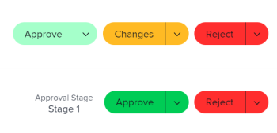

# 使用 [!UICONTROL 我的更新] 區域

<!--

(NOTE: there is a similar article like this in the "My Work" folder that is conditioned for Classic only)

-->

您可以使用 [!UICONTROL 我的更新] 區域，快速審核等待決策的批准或您已加入的對話。

身為具有 [!UICONTROL 檢閱] 許可證，您可以找到 [!UICONTROL 我的更新] 區域 [!UICONTROL 主菜單] 依預設和 [!UICONTROL 我的更新] 區域是您的預設登陸頁面。

如需有關 [!DNL Adobe Workfront] 許可證，請參閱 [[!DNL Adobe Workfront] 授權概述](../../../administration-and-setup/add-users/access-levels-and-object-permissions/wf-licenses.md).

如果您的授權類型與「檢閱」不同，則 [!DNL Workfront] 或群組管理員必須新增 [!UICONTROL 我的更新] 區域顯示在「主菜單」中。 如需詳細資訊，請參閱 [自訂 [!UICONTROL 主菜單] 使用版面範本](../../../administration-and-setup/customize-workfront/use-layout-templates/customize-main-menu.md).

## 存取需求

您必須具備下列存取權，才能執行本文中的步驟：

<table style="table-layout:auto"> 
 <col> 
 <col> 
 <tbody> 
  <tr> 
   <td role="rowheader"><strong>[!DNL Adobe Workfront plan*]</strong></td> 
   <td> 
任何
 </td> 
  </tr> 
  <tr> 
   <td role="rowheader"><strong>[!DNL Adobe Workfront] 授權*</strong></td> 
   <td> 
[!UICONTROL Request]或更高版本
 </td> 
  </tr> 
  <tr> 
   <td role="rowheader"><strong>訪問級別配置*</strong></td> 
   <td> 
查看對對話中標籤的任何對象的訪問或對其進行更高訪問，或需要解析批准（項目、任務、問題、文檔）
 
注意：如果您仍無法存取，請詢問您的 [!DNL Workfront] 管理員。 若要了解 [!DNL Workfront] 管理員可修改您的存取層級，請參閱 <a href="../../../administration-and-setup/add-users/configure-and-grant-access/create-modify-access-levels.md" class="MCXref xref">建立或修改自訂存取層級</a>.
 </td> 
  </tr> 
  <tr> 
   <td role="rowheader"><strong>物件權限</strong></td> 
   <td> 
[!UICONTROL View]權限或更高，適用於在對話中標籤的項目、任務、問題、文檔，或需要解析批准
 
有關請求其他訪問的資訊，請參閱 <a href="../../../workfront-basics/grant-and-request-access-to-objects/request-access.md" class="MCXref xref">請求對對象的訪問 </a>.
 </td> 
  </tr> 
 </tbody> 
</table>

若要了解您擁有的計畫、授權類型或存取權，請聯絡您的 [!DNL Workfront] 管理員。

## 必要條件

開始之前，您必須具備下列條件：

* 如果您有 [!DNL Workfront] 除 [!UICONTROL 檢閱]，您的 [!DNL Workfront] 或群組管理員必須新增 [!UICONTROL 我的更新] 區域 [!UICONTROL 主菜單] 使用版面範本，並將您指派給該範本。

* 檢閱授權使用者可以檢視 [!UICONTROL 我的更新] 區域 [!UICONTROL 主菜單] 依預設。

## 存取 [!UICONTROL 我的更新] 區域

1. 按一下 **[!UICONTROL 我的更新]** 在 **[!UICONTROL 主菜單]**.

   

   此 [!UICONTROL 我的更新] 框。

   指派給您的核准和存取請求會列在頁面的前半部的「我的更新」底下。

   

1. （選用）捲動至 [!UICONTROL 我的更新] 區域，然後按一下右鍵箭頭，以顯示其他頁面上顯示的更多核准。

   >[!TIP]
   >
   >預設會顯示前五個核准或存取要求。 其餘的核准會顯示在其他頁面上。 在 [!UICONTROL 我的更新] 的上界。

   

1. （選用）展開 **[!UICONTROL 篩選]** 下拉式功能表  在 **[!UICONTROL 我的更新]** 區段，然後從下列項目中選取：

   <table style="table-layout:auto"> 
    <col> 
    </col> 
    <col> 
    </col> 
    <tbody> 
     <tr> 
      <td role="rowheader"><strong>[!UICONTROL全部]</strong></td> 
      <td>由其他使用者提交給您或委派給您的核准。 有關委派核准的資訊，請參見 <a href="../../../review-and-approve-work/manage-approvals/delegate-approval-requests.md" class="MCXref xref">委派核准請求</a>. </td> 
     </tr> 
     <tr> 
      <td role="rowheader"><strong>[!UICONTROL委派核准]</strong></td> 
      <td>其他使用者委派給您的核准。 </td> 
     </tr> 
     <tr> 
      <td role="rowheader"><strong>[!UICONTROL我的批准]</strong></td> 
      <td> 
已提交給您的批准。 
 
如需核准項目的詳細資訊，請參閱 <a href="../../../review-and-approve-work/manage-approvals/approving-work.md" class="MCXref xref">核准工作 </a>.
 </td> 
     </tr> 
    </tbody> 
   </table>

1. 要在批准前批准或拒絕項目或建議對文檔進行更改，請執行以下操作：

   1. （選用）按一下 **下拉式清單** 圖示  在您的核准決定旁(**[!UICONTROL 核准]**, **[!UICONTROL 變更]**,**[!UICONTROL 拒絕]**)，然後新增留言，然後按一下 **[!UICONTROL 新增]**.

      或

      按一下 **[!UICONTROL 略過]** 如果您不想輸入注釋。

      

      >[!NOTE]
      >
      >此 [!UICONTROL 變更] 選項僅顯示於文檔批准。

      根據您選擇的下拉表徵圖，項目將被批准、拒絕，或者，如果是文檔批准，則通過請求批准以進行其他更改。

      >[!TIP]
      >
      >如果您不想將留言新增至決策，可以按一下 **[!UICONTROL 核准]**, **[!UICONTROL 拒絕]**，或 **[!UICONTROL 變更]** 按鈕，並立即授予批准決定。
      >
      >
      >      >

      有關批准工作的詳細資訊，請參閱 [核准工作](../../../review-and-approve-work/manage-approvals/approving-work.md).

1. 按一下 **[!UICONTROL 授予存取權]** 向您提交訪問請求

   或

   展開 **[!UICONTROL 變更存取]** 下拉式功能表，在您授予前修改請求的存取權。

   

1. （選用）按一下 **[!UICONTROL 忽略]** 從批准清單中清除訪問請求，而不授予該請求。
1. 按一下 **[!UICONTROL 委派我的核准]** 在您無法做出審批決策一段時間時，將提交給您的審批委託。 有關委派核准的詳細資訊，請參閱 [委派核准請求](../../../review-and-approve-work/manage-approvals/delegate-approval-requests.md).
1. 捲動至 **[!UICONTROL 提及次數]** 區域。 在此，您可以查看包含在對話中的所有項目。

   

   >[!TIP]
   >
   >依預設會顯示前50個提及。

1. （選用）按一下 **[!UICONTROL 顯示更多更新]** 以檢視更多提及。
1. （選用）按一下 **[!UICONTROL 回覆]** 若要回應留言，請輸入您的回應，然後按一下 **[!UICONTROL 回覆]** 。

   如需更新項目的詳細資訊，請參閱 [更新工作](../../../workfront-basics/updating-work-items-and-viewing-updates/update-work.md).

1. （選用）按一下 **[!UICONTROL 固定當前頁]** 來固定 [!UICONTROL 我的更新] 區域。
