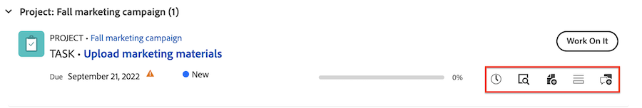

# 使用「我的工作」Widget管理您的工作

「我的工作」Widget會集中顯示您所有指派的任務、問題和請求。 在這裡，您可以篩選及組織您的工作、記錄時間、進行更新並將工作專案標籤為完成。

>[!IMPORTANT]
>
>若要在「我的工作」Widget中顯示任務和問題，其父專案必須處於「目前」狀態或等同於「目前」的狀態。

## 存取需求

+++ 展開以檢視本文中功能的存取需求。

<table style="table-layout:auto"> 
 <col> 
 </col> 
 <col> 
 </col> 
 <tbody> 
  <tr> 
   <td role="rowheader"><strong>[!DNL Adobe Workfront package]</strong></td> 
   <td> 
任何
 </td> 
  </tr> 
  <tr> 
   <td role="rowheader"><strong>[!DNL Adobe Workfront] 授權</strong></td> 
   <td> 
      
淺色或更高

   
Contribute或更高版本

  </td> 
  </tr>
  <tr> 
   <td role="rowheader"><strong>存取層級設定</strong></td> 
   <td> 
[！UICONTROL檢視]或更高的專案、任務、問題和檔案存取權
 </td> 
  </tr>  
  <tr> 
   <td role="rowheader"><strong>物件許可權</strong></td> 
   <td> 
貢獻您需要處理的任務和問題的許可權或更高
  </td> 
  </tr> 
 </tbody> 
</table>

如需詳細資訊，請參閱Workfront檔案中的[存取需求](/help/quicksilver/administration-and-setup/add-users/access-levels-and-object-permissions/access-level-requirements-in-documentation.md)。

+++

## 使用篩選器尋找您的工作

您可以微調「我的工作」篩選器以專注於工作清單中的特定專案：

### 篩選器詳細資訊

<table>
  <tbody>
    <tr>
      <td>正在處理</td>
      <td>顯示您目前正在處理的專案</td>
    </tr>
    <tr>
      <td>已就緒可開始</td>
      <td>顯示專案與 
      <ul>
      <li>沒有未完成的前置任務或任務限制</li>
      
和

      <li>計劃開始日期是過去或未來最多兩週</li>
      </ul>
      </td>
    </tr>
    <tr>
      <td>尚未就緒</td>
      <td>顯示具有
       <ul>
      <li>未完成的前置任務或無法處理專案的任務限制</li>
      
或

      <li>超過兩週的計劃開始日期</li>
      </ul>
       </td>
    </tr>
    <tr>
      <td>已請求</td>
      <td>顯示您尚未開始處理的問題</td>
    </tr>
    <tr>
      <td>由我委派</td>
      <td>顯示您已委派給其他使用者的專案</td>
    </tr>
    <tr>
      <td>已委派給我</td>
      <td>顯示使用者委派給您的專案</td>
    </tr>
    <tr>
      <td>已完成</td>
      <td>顯示過去兩週內完成的工作。 此篩選選項不包含核准。</td>
    </tr>
  </tbody>
</table>

>[!TIP]
>
>如果您要尋找更具體的篩選選項，可以使用「我的任務」或「我的問題」Widget。 如需有關「我的任務」和「我的問題」篩選器的詳細資訊，請參閱[首頁Widget篩選器總覽](/help/quicksilver/workfront-basics/using-home/using-the-home-area/widget-filter-overview-home.md)。

## 組織您的工作

您可以使用我的工作Widget的排序和群組功能，以您認為合理的方式組織您的工作。

### 排序

您可以依以下方式排序工作清單：

* 到期日期
逾期專案會在日期旁邊顯示警告圖示。 Workfront使用規劃完成日期來判斷任務和問題是否已逾期。
* 姓名
* 完成百分比
* 狀態

>[!TIP]
>
>若要在「我的工作」Widget頂端建立顯示所有逾期專案的清單，請依「到期日」排序，且不套用群組。

### 群組

您可以將工作清單分組依據

* 專案
* 狀態
* 到期日期
到期日由計畫完成日期決定。

>[!NOTE]
>
>當您套用群組時，您在「排序」選單中的選取會決定群組內的順序。

## 更新摘要中的工作專案資訊

您可以開啟摘要面板以快速更新任務或問題中的資訊。 在摘要中，您可以

* 更新完成百分比
* 新增更新
* 瀏覽至檔案區域以上傳檔案
* 檢視工作專案詳細資料和更新自訂欄位
Workfront管理員可以自訂哪些欄位會顯示在版面配置範本的摘要中。 如需詳細資訊，請參閱[使用配置範本自訂摘要面板](/help/quicksilver/administration-and-setup/customize-workfront/use-layout-templates/customize-home-summary-layout-template.md)。
* 變更工作專案狀態
* 檢視子任務
* 記錄時間
* 檢視附加的核准流程

若要開啟[摘要]，請將滑鼠停留在工作專案上，然後按一下&#x200B;**摘要**&#x200B;圖示。

如需有關如何使用「摘要」面板的其他資訊，請參閱[摘要概觀](/help/quicksilver/workfront-basics/the-new-workfront-experience/summary-overview.md)。

## 使用快速動作以更新工作專案

您可以使用快速動作功能表來

* 記錄時間
* 新增更新
* 更新自訂表單
* 上傳檔案

若要找到快速動作功能表，請將滑鼠停留在工作專案上。 快速動作清單會顯示在&#x200B;**處理它**&#x200B;或&#x200B;**完成**&#x200B;按鈕附近。

## 檢視核准和團隊請求

核准和團隊請求未顯示在我的工作Widget中。 如果您定期處理核准和團隊請求，我們建議您將以下Widget新增到您的新首頁：

* 我的核准
* 所有核准
* 團隊請求

如需新增Widget至新首頁的詳細資訊，請參閱[新增、編輯或移除首頁中的Widget](/help/quicksilver/workfront-basics/using-home/using-the-home-area/add-edit-remove-widgets-in-new-home.md)。
