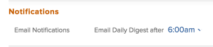

# 修改您自己的電子郵件通知

<!-- Audited: 1/2024 -->

您的Adobe [!DNL Workfront] 管理員可設定在Workfront中發生事件時，使用者會收到哪些電子郵件通知（如所述） [[!UICONTROL 設定事件] 系統內每個人的通知](../../administration-and-setup/manage-workfront/emails/configure-event-notifications-for-everyone-in-the-system.md))。

您的群組管理員還可以配置為您和中的使用者啟用哪些通知。 [!UICONTROL 主群組]. 若您的 [!UICONTROL 主群組] 是子群組，您會收到針對群組上方最上層群組啟用的通知。

您可以設定要接收哪些通知，以進一步自訂。 您也可以選擇要在事件發生時或在一封每日摘要電子郵件中接收通知。

如需電子郵件通知的詳細資訊，請參閱 [[!DNL Adobe Workfront] 通知](../../workfront-basics/using-notifications/wf-notifications.md).

>[!NOTE]
>
>* 如果您啟用通知型態，然後發現您沒有收到該型態的通知，可能是因為該型態不適用於您的職責。
>* 此 [!DNL Workfront] 管理員或群組管理員無法設定通知 [!DNL Workfront Goals]. 如需關於哪些通知的詳細資訊， [!DNL Workfront] 管理員可以設定，請參閱 [為系統中的每個人設定事件通知](../../administration-and-setup/manage-workfront/emails/configure-event-notifications-for-everyone-in-the-system.md). 有關設定個別通知的資訊 [!DNL Workfront Goals] 繼續閱讀本文。
>

## 存取需求

+++ 展開以檢視本文中功能的存取需求。

您必須具有下列存取權才能執行本文中的步驟：

<table style="table-layout:auto"> 
 <col> 
 </col> 
 <col> 
 </col> 
 <tbody> 
  <tr> 
   <td role="rowheader"><strong>[!DNL Adobe Workfront plan]</strong></td> 
   <td> 
任何
 </td> 
  </tr> 
  <tr> 
   <td role="rowheader"><strong>[!DNL Adobe Workfront] 授權</strong></td> 
   <td>  
新增：
 
   <ul><li>投稿人或以上</li></ul>
   
目前：

   <ul><li>要求或更高</li></ul>
   </td> 
  </tr> 
 </tbody> 
</table>

如需有關此表格的詳細資訊，請參閱 [Workfront檔案中的存取需求](/help/quicksilver/administration-and-setup/add-users/access-levels-and-object-permissions/access-level-requirements-in-documentation.md).

+++

## 檢視並修改您的電子郵件通知設定

{{step1-click-profile-pic}}

1. 按一下 **[!UICONTROL 更多]** 圖示  ，然後按一下「 」 **[!UICONTROL 編輯]**.

1. 在 **[!UICONTROL 編輯人員]** 方塊顯示，前往 **[!UICONTROL 通知]** 區段。

1. 按一下類別可檢視與該類別相關的通知設定。

   

1. 選取或取消選取右側的核取方塊，以指定您想要每天接收或不接收通知、立即接收通知，或兩者都接收。

   您也可以使用類別的核取方塊來啟用或停用該類別中的所有通知。

   >[!NOTE]
   >
   >如果您是專案的團隊成員，即使您不再擁有專案的存取權，您仍會繼續收到該專案的電子郵件通知，直到您從團隊中移除為止。 如需有關從團隊中移除使用者的指示，請參閱 [從專案移除使用者](../../manage-work/projects/manage-projects/remove-users-from-projects.md).

   對於 **[!UICONTROL 通訊]** 類別中，您可以選取僅供即時傳送的個別通知。 若要在每日摘要中傳送通知，您必須選取所有通知。

   如果特定類別的所有電子郵件通知都已啟動，則類別標題中的方塊會顯示為已選取。 如果給定類別中的所有電子郵件通知都已停用，則會取消選取該方塊。 如果啟動了一些通知，而停用了一些通知，則類別核取方塊會顯示為直線。\
   當您修改通知設定時，標籤 **[!UICONTROL 已編輯]** 會為該通知設定顯示，通知您已修改該通知設定。

1. 如果您選取任何要以每日摘要傳送的通知，請在 **[!UICONTROL 通知]** 中的區段 **[!UICONTROL 在以下時間後以電子郵件傳送每日摘要：]** 功能表。

   

   每日摘要包含符合在所選時間之前24小時通知標準的事件。 您會收到每一種通知型別的每日摘要電子郵件。\
   每日摘要可能會在您選取的時間後送達，端視系統中排入傳送佇列的電子郵件數量而定。 列出的時間是您瀏覽器設定中指定的當地時間。

1. （有條件且可選用）在預覽環境中修改電子郵件通知設定時，請啟用 **[!UICONTROL 接收來自此測試環境的電子郵件]** 設定以接收電子郵件。 系統不會從預覽環境自動產生電子郵件。

   

1. 按一下「**[!UICONTROL 儲存變更]**」。
