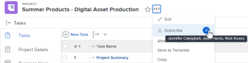

# 訂閱[!DNL Adobe Workfront]中的專案

[!UICONTROL Adobe Workfront]會傳送有關您指派給或擁有之專案的通知。 如果您想追蹤未指派給您但可能影響您工作的專案的通訊，您可以訂閱這些專案。

您也可讓管理員和同儕訂閱您有[!UICONTROL 管理]和[!UICONTROL 共用]許可權之專案的更新狀態，以隨時更新您的工作。

目前，您可以訂閱下列專案：

* 問題
* 任務
* 專案

當您訂閱問題、任務或專案時，當有人發表評論給您時，您會收到應用程式內通知。 根據您啟用的功能，您也可能收到訂閱專案的電子郵件和行動應用程式推播通知。

>[!NOTE]
>
>您訂閱的專案發生任何其他事件時，您不會收到通知。 只有當有人對專案發表評論時，您才會收到通知。

如需使用訂閱的詳細資訊，請參閱[關於使用訂閱](#about-working-with-subscriptions)。

## 存取需求

您必須具有下列存取權才能執行本文中的步驟：

<table style="table-layout:auto"> 
 <col> 
 </col> 
 <col> 
 </col> 
 <tbody> 
  <tr> 
   <td role="rowheader"><strong>[！UICONTROL Adobe Workfront]計畫*</strong></td> 
   <td> 
任何
 </td> 
  </tr> 
  <tr> 
   <td role="rowheader"><strong>[!DNL Adobe Workfront] 授權*</strong></td> 
   <td> 
[！UICONTROL Request]或更高版本
 </td> 
  </tr> 
  <tr> 
   <td role="rowheader"><strong>存取層級設定*</strong></td> 
   <td> 
若您的[!DNL Workfront]管理員已啟用<strong>[！UICONTROL檢視，但檢視的更新已包含在您存取層級的交談]</strong>中，則您無法訂閱[!DNL Workfront]中的專案。
 
注意：如果您還是沒有存取權，請詢問您的[！UICONTROL Workfront]管理員，他們是否對您的存取層級設定其他限制。 如需[！UICONTROL Workfront]管理員如何變更存取層級的詳細資訊，請參閱<a href="../../administration-and-setup/add-users/configure-and-grant-access/create-modify-access-levels.md" class="MCXref xref">建立或修改自訂存取層級</a>。
 </td> 
  </tr> 
  <tr> 
   <td role="rowheader"><strong>物件許可權</strong></td> 
   <td> 
[！UICONTROL檢視]專案、任務或問題（要訂閱的）的存取權或以上許可權
 
[！UICONTROL Manage]專案、任務或問題的[！UICONTROL Share]存取許可權和（訂閱其他）問題的許可權
 </td> 
  </tr> 
 </tbody> 
</table>

若要瞭解您擁有的計畫、授權型別或存取權，請連絡您的[!DNL Workfront]管理員。

## 訂閱專案

所有專案的專案訂閱程式都相同。

例如，若要訂閱問題：

1. 移至您要訂閱的問題。

   >[!TIP]
   >
   >若要訂閱專案，您可以執行下列任一項作業：
   >
   >* 前往您要訂閱的專案，按一下專案名稱右側的&#x200B;**[!UICONTROL 更多]**&#x200B;圖示，然後&#x200B;**[!UICONTROL 訂閱]**。
   >* 前往專案清單或報告並選取專案，按一下清單頂端的&#x200B;**[!UICONTROL 更多]**&#x200B;圖示，然後按一下&#x200B;**[!UICONTROL 訂閱]**。 這僅在專案清單中可用。

1. 按一下&#x200B;**[!UICONTROL 更多]** ，然後按一下&#x200B;**[!UICONTROL 訂閱]**。

   

   鈴鐺上會出現一個核取記號，其旁邊的數目會更新，以將您新增到訂閱使用者的計數中。

   您已訂閱問題。 您已訂閱問題的問題記錄的更新狀態。

   每次有人對此問題發表評論時，您就會收到應用程式內通知。 根據您啟用的功能，您也可能收到電子郵件通知和行動應用程式推播通知。

   若要進一步瞭解訂閱電子郵件，請參閱[修改您自己的電子郵件通知](../../workfront-basics/using-notifications/activate-or-deactivate-your-own-event-notifications.md)。

## 取消訂閱專案

您可以輕鬆地取消訂閱[!DNL Workfront]中的專案。 從[!DNL Workfront]中的專案取消訂閱的程式對於所有專案都是相同的。

例如，若要取消訂閱問題：

1. 前往您要取消訂閱的問題。

   >[!TIP]
   >
   >若要取消訂閱專案，您可以執行下列任一項作業：
   >
   >* 前往您要取消訂閱的專案，按一下專案名稱右側的&#x200B;**[!UICONTROL 更多]**&#x200B;圖示，然後&#x200B;**[!UICONTROL 取消訂閱]**。
   >* 前往專案清單或報告並選取專案，按一下清單頂端的&#x200B;**[!UICONTROL 更多]**&#x200B;圖示，然後按一下&#x200B;**[!UICONTROL 取消訂閱]**。 這僅在專案清單中可用。

1. 按一下&#x200B;**[!UICONTROL 更多]** ，然後按一下&#x200B;**[!UICONTROL 取消訂閱]**。

   

1. 您也可以按一下訂閱電子郵件中的[!UICONTROL 取消訂閱]連結，取消訂閱您訂閱的專案。

   取消訂閱專案後，當有人評論問題時，您將不再收到通知。

   您取消訂閱問題的專案記錄的更新狀態。

## 管理訂閱者

您可以管理哪些人訂閱您具有「管理」和「共用」許可權的專案、任務和問題。

* [為另一個使用者訂閱專案](#subscribe-another-user-to-an-item)
* [取消訂閱其他人的專案](#unsubscribe-another-person-from-an-item)

所有訂閱者都擁有訂閱專案的[!UICONTROL 檢視]許可權。 如果新訂閱者已有該專案的許可權，則其許可權將維持不變。

### 為另一個使用者訂閱專案

1. 移至您想要訂閱其他使用者的專案。

   >[!TIP]
   >
   >若要讓其他使用者訂閱專案，您可以執行下列任一項作業：
   >
   >* 前往您要訂閱其他人的專案，或
   >   
   >* 前往專案清單或報告，然後選取專案。

1. 按一下&#x200B;**[!UICONTROL 更多]** 。
1. 按一下&#x200B;**[!UICONTROL 訂閱]**&#x200B;連結旁的數字泡泡。
1. 在出現的方塊中，開始在&#x200B;**[!UICONTROL 訂閱其他人]**&#x200B;方塊中輸入使用者名稱，然後從顯示的選項中選取使用者。

1. （選用）若要新增更多訂閱者，請重複步驟4。
1. 按一下「**[!UICONTROL 儲存]**」。

訂閱者不會收到訂閱的通知，但訂閱的相關專案會新增到專案的「系統更新」中。

當有人將註解新增至專案的[!UICONTROL 更新]索引標籤時，訂閱者會收到應用程式內通知。 根據您的Workfront管理員所啟用的功能，訂閱者可能也會收到該專案的電子郵件和行動通知。

### 取消訂閱其他人的專案

1. 移至您要取消訂閱其他使用者的專案。

   >[!TIP]
   >
   >若要取消訂閱其他使用者的專案，您可以執行下列任一項作業：
   >
   >* 前往您要取消訂閱其他人的專案，或
   >   
   >* 前往專案清單或報告，然後選取專案。

1. 按一下&#x200B;**[!UICONTROL 更多]** 。
1. 按一下&#x200B;**[!UICONTROL 訂閱]**&#x200B;或&#x200B;**[!UICONTROL 取消訂閱]**&#x200B;連結旁的數字泡泡。
1. 在出現的&#x200B;**[!UICONTROL 訂閱者]**&#x200B;頁面上，按一下您要取消訂閱之使用者名稱旁的「X」。

   或

   開始在&#x200B;**[!UICONTROL 搜尋清單]**&#x200B;中的人員方塊中輸入使用者名稱，然後按一下使用者名稱右側的[X]。

1. 按一下「**[!UICONTROL 儲存]**」。

   使用者不會收到取消訂閱專案的通知，但有關訂閱的專案會新增到專案的系統更新中。

## 接收應用程式內通知

有人在您訂閱的專案上張貼評論後，您會立即收到應用程式內通知。

如需詳細資訊，請參閱[檢視和管理應用程式內通知](../../workfront-basics/using-notifications/view-and-manage-in-app-notifications.md)。

## 接收訂閱電子郵件

根據您的[!UICONTROL Workfront]管理員啟用的功能，每當有人對您訂閱的專案發表評論時，您除了會收到應用程式內通知外，還可能收到訂閱電子郵件。

如需設定或停用電子郵件的詳細資訊，請參閱[為系統中的每個人設定事件通知](../../administration-and-setup/manage-workfront/emails/configure-event-notifications-for-everyone-in-the-system.md)。

>[!NOTE]
>
>即使您關閉訂閱電子郵件，只要有人對您訂閱的專案發表評論，您仍會繼續收到應用程式內通知。

## 列出訂閱專案的使用者

若要檢視誰正在訂閱專案，請執行下列動作：

1. 導覽至您要檢視其訂閱者的專案。

   如果專案有任何訂閱者，則人數會顯示在鈴鐺旁邊。 您可以將滑鼠移至數字上方，顯示訂閱專案的使用者清單。 前25名訂閱者會依字母順序顯示。

   

   您也可以在訂閱專案的報表或檢視上新增[!UICONTROL 訂閱者]欄位作為欄，以檢視訂閱者清單。 如需詳細資訊，請參閱[術語 [!DNL Adobe Workfront] 辭彙表](../../workfront-basics/navigate-workfront/workfront-navigation/workfront-terminology-glossary.md)。

## 關於使用訂閱

處理訂閱時，請考量下列事項：

* [!DNL Workfront]管理員無法控制哪些使用者可以訂閱或無法訂閱。

  擁有任何任務、問題或專案的[!UICONTROL 檢視]或更高許可權的任何人都可以訂閱這些專案。

* 無法為每日摘要電子郵件設定訂閱。
* 如果您訂閱任務、問題或專案，並且您也是受指派人、主要聯絡人或專案所有者，則當有人對您訂閱的專案發表評論時，您只會收到訂閱電子郵件。

  如需當您的其中一個專案產生註解時觸發的電子郵件通知的詳細資訊，請參閱[Adobe Workfront通知](../../workfront-basics/using-notifications/wf-notifications.md)。

* 如果您訂閱專案且發表了評論，則不會收到有關該評論的訂閱電子郵件，除非您在評論中包含您的姓名。
* 如果對專案發表評論的使用者藉由鎖定評論而使評論變為私人，並且您不屬於與該使用者相同的公司，您將不會收到該評論的通知。 如需讓您的公司私密發表評論的詳細資訊，請參閱[更新工作](../../workfront-basics/updating-work-items-and-viewing-updates/update-work.md)中的[新增更新至工作專案](../../workfront-basics/updating-work-items-and-viewing-updates/update-work.md#add)區段。

* 您無法建立訂閱報表。 當有人訂閱或取消訂閱專案時，稽核會記錄在每個專案的更新狀態中。
* 對子物件所做的註解不會觸發父物件的訂閱通知。 如果您訂閱專案，則只會收到對該專案所做評論的通知。 除非您訂閱每個子項，否則您將不會收到與專案相關聯的子項（即任務或問題）的註釋通知。 如需物件關係的詳細資訊，請參閱[瞭解 [!DNL Adobe Workfront]](../../workfront-basics/navigate-workfront/workfront-navigation/understand-objects.md)中的物件中的[相互依存性和物件階層](../../workfront-basics/navigate-workfront/workfront-navigation/understand-objects.md#understanding-interdependency-and-hierarchy-of-objects)區段。
