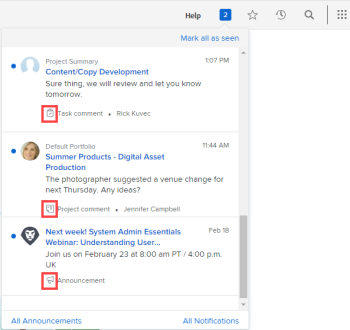

# 檢視及管理應用程式內通知

應用程式內通知可讓您了解兩種資訊：公告通知和工作項目通知。 可從Web應用程式和行動應用程式使用。

有關您可以接收的工作項目和公告通知的清單，請參見 [應用程式內通知概觀](../../workfront-basics/using-notifications/in-app-notifications-overview.md).

>[!NOTE]
>
>* 工作活動的應用程式內通知不會與 [!DNL Workfront]. 如需詳細資訊，請參閱 [[!DNL Adobe Workfront] 通知](../../workfront-basics/using-notifications/wf-notifications.md)
>* 無法自訂應用程式內通知。
>

## 存取需求

您必須具備下列存取權，才能執行本文中的步驟：

<table style="table-layout:auto"> 
 <col> 
 </col> 
 <col> 
 </col> 
 <tbody> 
  <tr> 
   <td role="rowheader"><strong>[!DNL Adobe Workfront] 計劃*</strong></td> 
   <td> 
任何
 </td> 
  </tr> 
  <tr> 
   <td role="rowheader"><strong>[!DNL Adobe Workfront] 授權*</strong></td> 
   <td> 
[!UICONTROL Request]或更高版本
 </td> 
  </tr> 
 </tbody> 
</table>

若要了解您擁有的計畫或授權類型，請連絡您的 [!DNL Workfront] 管理員。

## 檢視通知

右上角的編號圖示 [!DNL Workfront] 顯示您尚未確認的通知數。

>[!NOTE]
>
>您可以檢視Web應用程式和行動應用程式的所有應用程式內通知。 行動應用程式中只會以推播通知的形式傳送其中部分通知。 如需行動應用程式中通知的詳細資訊，請參閱 [[!DNL Adobe Workfront] 針對iOS](../../workfront-basics/mobile-apps/using-the-workfront-mobile-app/workfront-for-ios.md) 或 [[!DNL Adobe Workfront] Android適用](../../workfront-basics/mobile-apps/using-the-workfront-mobile-app/workfront-for-android.md).

1. 按一下編號圖示  在 [!DNL Workfront] 以開啟通知清單。

   您最近未讀的通知會顯示在編號圖示下方，最近的通知會顯示在頂端。

   

   最多80則通知會顯示在可捲動清單中。 若要查看更多資訊，您可以按一下 **[!UICONTROL 所有通知]** 清單底部，最多檢視100則通知。 30天後會自動刪除通知。

   在每個通知的底部， [!UICONTROL 通知類型] 和相應的標識表徵圖顯示。 這些可協助您識別 [!DNL Workfront] 已提及項目，如果您有動作項目，請提醒您：

   * 公告通知會以 [!UICONTROL 公告] 表徵圖。 

   * 所有其他通知都以表徵圖表示，這些表徵圖建議它們關聯的工作項的類型。

      
藍點右側的圖示會顯示下列其中一項：

   * 輸入資訊之人的個人資料像片，通常是 [!DNL Workfront] 你正在研究的對象。
   * 此 [!DNL Workfront] 徽標，如果通知是系統公告。

1. （可選）如果您想要檢視收到通知的日期，請將滑鼠移至通知右上角的日期或時間指標上。

   

1. 按一下您要檢視的通知：

   * 如果您點按的通知是關於工作項目，則關聯 [!DNL Workfront] 物件隨即開啟，顯示 **[!UICONTROL 更新]** 標籤。 您可以 **[!UICONTROL 啟動新的更新區域]** 或 **[!UICONTROL 輸入回覆]**.

      

   * 如果您點按的通知是用於公告 , **[!UICONTROL 公告]** 頁面，列出您的所有公告。 您點按的公告會在左側選取，而訊息會顯示在右側。

      

1. （可選）下載通知訊息中包含的任何附件，或以ZIP檔案的形式下載所有附件。

   

## 確認通知

檢視通知後，您可以確認通知已從 [!UICONTROL 通知] 列出，或讓他們稍後回應。

在 [!UICONTROL 通知] 頁面中，您可以檢視目前和已清除的通知。 您也可以將已清除的通知帶回 [!UICONTROL 通知] 清單。

* [確認通知](#acknowledge-notifications)
* [查看已確認通知](#view-acknowledged-notifications)

### 確認通知

按一下編號圖示以開啟「通知」清單時，不會自動確認您已閱讀所有通知。

要確認通知並從通知清單中清除通知，請執行以下操作：

1. 按一下編號圖示  在 [!DNL Workfront] 以開啟通知清單。
1. 執行下列任一項作業：

   * 按一下通知左上角的藍點。
   * 如果通知是針對工作項目（而非公告），請按一下通知以轉至項目。
   * 如果通知是用於公告，請按一下通知以開啟 **[!UICONTROL 公告]** 頁面。
   * 按一下 **[!UICONTROL 所有通知]** 在通知清單的右下角，以顯示 **[!UICONTROL 通知]** 頁面，然後按一下 **[!UICONTROL 全部標籤為已查看]** 在Workfront的右上角。

### 查看已確認通知

要查看已確認的通知，請執行以下操作：

1. 按一下編號圖示  在 [!DNL Workfront] 以開啟通知清單。
1. 按一下 **[!UICONTROL 所有通知]** 在通知清單的右下角。
1. 在 **[!UICONTROL 通知]** 顯示的頁面，向下捲動以檢視過去的通知。
1. （可選）若要將已確認的通知帶回通知清單，請按一下通知旁的藍色圓圈。

## 刪除公告通知

無法刪除工作項通知。 [!DNL Workfront] 會在30天後刪除所有通知（無論是已讀或未讀）。

不過，您可以刪除公告通知。 您也可以存取您在刪除公告後30天內刪除的公告。 [!DNL Workfront] 不會自動刪除公告。

* [刪除公告](#delete-an-announcement)
* [訪問和恢復最近刪除的公告](#access-and-restore-an-announcement-you-deleted-recently)

### 刪除公告

1. 按一下編號圖示  在 [!DNL Workfront] 以開啟通知清單。
1. 按一下 **[!UICONTROL 公告]** 或 **[!UICONTROL 查看所有公告]**.

1. 在 **[!DNL Announcements]** 顯示的頁面，按一下左側清單中您要刪除的公告，然後按一下 **[!UICONTROL 刪除]** 在頁面的右上角。

### 訪問和恢復最近刪除的公告

您可以存取過去30天內刪除的通知。

1. 按一下編號圖示  在 [!DNL Workfront] 以開啟通知清單。
1. 按一下 **[!UICONTROL 公告]** 或 **[!UICONTROL 查看所有公告]**.

1. 在 **[!UICONTROL 公告]** 頁面，按一下 **[!UICONTROL 已刪除]**.

1. 按一下您要檢視的訊息。
1. （可選）如果要恢復公告，請按一下 **[!UICONTROL 移至收件匣]** 上文及公告正文的權利。
