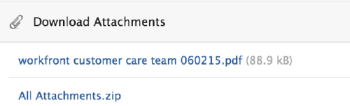

# 檢視及管理應用程式內通知

應用程式內通知可讓您隨時瞭解兩種資訊：宣告通知和工作專案通知。 網頁應用程式和行動應用程式皆可提供。

如需您可以收到的工作專案及宣告通知清單，請參閱[應用程式內通知總覽](../../workfront-basics/using-notifications/in-app-notifications-overview.md)。

>[!NOTE]
>
>* 工作活動的應用程式內通知未繫結至[!DNL Workfront]中的電子郵件通知。 如需詳細資訊，請參閱[[!DNL Adobe Workfront] 通知](../../workfront-basics/using-notifications/wf-notifications.md)
>* 無法自訂應用程式內通知。
>

## 存取需求

+++ 展開以檢視本文中功能的存取需求。 

<table style="table-layout:auto"> 
 <col> 
 </col> 
 <col> 
 </col> 
 <tbody> 
  <tr> 
   <td role="rowheader"><strong>[!DNL Adobe Workfront] 封裝</strong></td> 
   <td> 
任何
 </td> 
  </tr> 
  <tr> 
   <td role="rowheader"><strong>[!DNL Adobe Workfront] 授權</strong></td> 
   <td> 
   
投稿人或以上

   
要求或更高版本
 </td> 
  </tr> 
 </tbody> 
</table>

如需詳細資訊，請參閱Workfront檔案中的[存取需求](/help/quicksilver/administration-and-setup/add-users/access-levels-and-object-permissions/access-level-requirements-in-documentation.md)。

+++

## 檢視通知

[!DNL Workfront]右上角的編號圖示會顯示您尚未確認的通知數目。

>[!NOTE]
>
>您可以從Web應用程式和行動應用程式檢視所有應用程式內通知。 在行動應用程式中，只有部分通知會以推播通知的形式傳送。 如需行動應用程式中通知的詳細資訊，請參閱iOS的[[!DNL Adobe Workfront] ](../../workfront-basics/mobile-apps/using-the-workfront-mobile-app/workfront-for-ios.md)或Android的[[!DNL Adobe Workfront] ](../../workfront-basics/mobile-apps/using-the-workfront-mobile-app/workfront-for-android.md)。

1. 按一下通知圖示[!DNL Workfront]以開啟您的通知清單。

   您最近的未讀通知會顯示在編號圖示下方，最新的未讀通知會顯示在頂端。

   

   數字圖示會顯示一個可捲動清單，其中包含最多80個通知。 若要檢視更多資訊，您可以按一下清單底部的&#x200B;**[!UICONTROL 所有通知]**，以檢視最多500個通知。 通知會在30天後自動刪除。

   每個通知底部都會顯示[!UICONTROL 通知型別]和對應的識別圖示。 這些功能可協助您識別提及的[!DNL Workfront]專案所發生的情況，並在您有行動專案時提醒您：

   * 宣告通知以[!UICONTROL 宣告]圖示表示。 

   * 所有其他通知會以圖示表示，這些圖示會建議它們關聯的工作專案型別。

     
藍點右側的圖示會顯示下列其中一項：

   * 輸入資訊之人員的設定檔像片，通常是有關您正在處理的[!DNL Workfront]物件的更新。
   * [!DNL Workfront]標誌（如果通知是系統宣告）。

1. （選擇性）如果您想要檢視收到通知的日期，請將滑鼠移至通知右上角的日期或時間指示器上。

   上

1. 按一下您要檢視的通知：

   * 如果按一下通知是關於工作專案，則會開啟相關的[!DNL Workfront]物件，在&#x200B;**[!UICONTROL 更新]**&#x200B;標籤上顯示完整訊息。 您可以&#x200B;**[!UICONTROL 開始新的更新區域]**&#x200B;或&#x200B;**[!UICONTROL 輸入回覆]**。

     

   * 如果您按的通知是針對公告，則會顯示&#x200B;**[!UICONTROL 公告]**&#x200B;頁面，列出您的所有公告。 您點按的宣告即會選取在左側，而訊息則會顯示在右側。

     

1. （選擇性）下載通知訊息中包含的任何附件，或將所有附件下載為ZIP檔。

   

## 認可通知

檢視通知之後，您可以確認通知，以便從[!UICONTROL 通知]清單中將其清除，或讓通知稍後回應。

在[!UICONTROL 通知]頁面上，您可以檢視目前和已清除的通知。 您也可以將已清除的通知帶回[!UICONTROL 通知]清單。

* [認可通知](#acknowledge-notifications)
* [檢視已確認的通知](#view-acknowledged-notifications)

### 認可通知

按一下編號圖示以開啟通知清單並不會自動確認您已讀取所有通知。

若要確認通知，並從「通知」清單中將其清除，請執行下列步驟：

1. 按一下通知圖示[!DNL Workfront]以開啟您的通知清單。
1. 執行下列其中一項：

   * 按一下通知左上角的藍色圓點。
   * 如果通知是針對工作專案（而不是宣告），請按一下通知以移至專案。
   * 如果通知是針對宣告，請按一下通知以開啟&#x200B;**[!UICONTROL 宣告]**&#x200B;頁面。
   * 按一下通知清單右下角的&#x200B;**[!UICONTROL 所有通知]**&#x200B;以顯示&#x200B;**[!UICONTROL 通知]**&#x200B;頁面，然後按一下Workfront右上角的&#x200B;**[!UICONTROL 全部標籤為已讀]**。

### 檢視已確認的通知

若要檢視您已確認的通知，請執行下列步驟：

1. 按一下通知圖示[!DNL Workfront]以開啟您的通知清單。
1. 按一下通知清單右下角的&#x200B;**[!UICONTROL 所有通知]**。
1. 在出現的&#x200B;**[!UICONTROL 通知]**&#x200B;頁面上，向下捲動以檢視您過去的通知。
1. （選擇性）若要將已確認的通知帶回您的通知清單，請按一下通知旁邊的藍色圓圈。

## 刪除宣告通知

您無法刪除工作專案通知。 [!DNL Workfront]會在30天後刪除所有通知（無論通知已讀取或未讀取）。

不過，您可以刪除宣告通知。 您也可以存取刪除後30天內已刪除的宣告。 [!DNL Workfront]不會自動刪除宣告。

* [刪除佈告](#delete-an-announcement)
* [存取並還原您最近刪除的宣告](#access-and-restore-an-announcement-you-deleted-recently)

### 刪除佈告

1. 按一下通知圖示[!DNL Workfront]以開啟您的通知清單。
1. 按一下&#x200B;**[!UICONTROL 公告]**&#x200B;或&#x200B;**[!UICONTROL 檢視所有公告]**。

1. 在出現的&#x200B;**[!DNL Announcements]**&#x200B;頁面上，按一下左側清單中您要刪除的宣告，然後按一下頁面右上角的&#x200B;**[!UICONTROL 刪除]**。

### 存取並還原您最近刪除的宣告

您可以存取過去30天內已刪除的通知。

1. 按一下通知圖示[!DNL Workfront]以開啟您的通知清單。
1. 按一下&#x200B;**[!UICONTROL 公告]**&#x200B;或&#x200B;**[!UICONTROL 檢視所有公告]**。

1. 在顯示的&#x200B;**[!UICONTROL 公告]**&#x200B;頁面中，按一下&#x200B;**[!UICONTROL 已刪除]**。

1. 按一下您要檢視的訊息。
1. （選擇性）如果要還原宣告，請按一下宣告本文右上方的&#x200B;**[!UICONTROL 移至收件匣]**。
