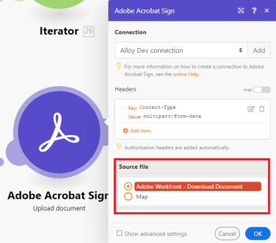

# [!DNL Adobe Acrobat Sign] 模組

使用 [!DNL Adobe Acrobat Sign] 模組，您可以啟動 [!DNL Adobe Workfront Fusion] 情境是根據您 [!DNL Adobe Acrobat Sign] 帳戶、建立、讀取或更新協定和其他記錄、使用您設定的標準搜索記錄，以及上傳文檔。

## 存取需求

您必須具備下列存取權才能使用本文中的功能：

<table style="table-layout:auto"> 
 <col> 
 <col> 
 <tbody> 
  <tr> 
   <td role="rowheader">[!DNL Adobe Workfront] 計劃*</td>
  <td> 
[!UICONTROL Pro]或更高版本
 </td>
  </tr> 
  <tr data-mc-conditions=""> 
   <td role="rowheader">[!DNL Adobe Workfront] 授權*</td>
   <td> 
[!UICONTROL計畫]、[!UICONTROL工作]
 </td> 
  </tr> 
  <tr> 
   <td role="rowheader">[!DNL Adobe Workfront Fusion] 許可**</td> 
   <td> 
[!UICONTROL [!DNL Workfront Fusion] （工作自動化和整合） 
  </td>  
  </tr> 
  <tr> 
   <td role="rowheader">產品</td> 
   <td>貴組織必須購買 [!DNL Adobe Workfront Fusion] 和 [!DNL Adobe Workfront] 以使用本文所述的功能。</td> 
  </tr> 
 </tbody> 
</table>

若要了解您擁有的計畫、授權類型或存取權，請聯絡您的 [!DNL Workfront] 管理員。

如需 [!DNL Adobe Workfront Fusion] 許可證，請參閱 [[!DNL Adobe Workfront Fusion] 授權](../../workfront-fusion/get-started/license-automation-vs-integration.md).

## [!DNL Adobe Acrobat Sign] 連接器使用建議

此 [!DNL Adobe Sign ]app使eSignature業務流程在 [!DNL Fusion] 更簡單，更強大。

新使用者 [!DNL Adobe Sign] 應密切注意更新協定的一些限制因素。 協定一經開始通常不會變更。 建議新使用者 [!DNL Adobe Sign] 重點是使用協定建立模組建立新協定。 這將使 [!DNL Fusion] 自動化更輕鬆，使用 [!DNL Adobe Sign].

[!DNL Adobe Sign] 協定需要一個領域來配合。 執行此操作有一些選項，但最簡單、最常見的是上傳暫時文檔，然後將該文檔映射到您的協定。

## [!DNL Adobe Acrobat Sign] 模組及其欄位

設定時 [!DNL Adobe Acrobat Sign] 模組， [!DNL Workfront Fusion] 顯示下列欄位。 此外， [!DNL Adobe Acrobat Sign] 視您在應用程式或服務中的存取層級等因素而定，可能會顯示欄位。 模組中的粗體標題表示必填欄位。

如果您在欄位或函式上方看到對應按鈕，則可使用它來設定該欄位的變數和函式。 如需詳細資訊，請參閱 [將資訊從一個模組對應到 [!DNL Adobe Workfront Fusion]](../../workfront-fusion/mapping/map-information-between-modules.md).

* [觸發器](#triggers)
* [動作](#actions)
* [搜尋](#searches)

### 觸發器

<!--
* [Watch for agreements](#watch-for-agreements) 
* [Watch for events](#watch-for-events)
-->

+++ **[!UICONTROL 留意協定]**

此觸發模組會在建立或更新合約時啟動案例。

<table style="table-layout:auto"> 
 <col> 
 <col> 
 <tbody> 
  <tr> 
   <td role="rowheader">[!UICONTROL連接]</td> 
<td>有關連接 [!DNL Adobe Acrobat Sign] 帳戶 [!DNL Workfront Fusion]，請參閱 <a href="../../workfront-fusion/connections/connect-to-fusion-general.md" class="MCXref xref">建立連線至 [!DNL Adobe Workfront Fusion]  — 基本指示</a></td>  </tr> 
  <tr> 
   <td role="rowheader">[!UICONTROL篩選器]</td> 
   <td>選擇您要監視新記錄、更新記錄還是兩者。</td> 
  </tr> 
  <tr> 
   <td role="rowheader">[!UICONTROL記錄類型] </td> 
   <td>選擇要記錄監視的記錄類型。</td> 
  </tr> 
  <tr> 
   <td role="rowheader">[!UICONTROL查找文本]</td> 
   <td> 
輸入要搜索的詞。 模組會傳回記錄，這些記錄會將這些詞語納入為欄位值。
 
如需搜尋中欄位的詳細資訊，請參閱 [!DNL Adobe Acrobat Sign]，請參閱 <a href="https://helpx.adobe.com/sign/using/adobesign-search-users-agreements.html#HowSearchWorks">Adobe Sign搜尋 — 運作方式</a>.
 </td> 
  </tr> 
  <tr> 
   <td role="rowheader">[!UICONTROL返回協定的最大數量]</td> 
   <td> 
輸入或映射您希望模組在每個方案執行週期中返回的最大記錄數。
 </td> 
  </tr> 
 </tbody> 
</table>

+++

+++ **[!UICONTROL 留意事件]**

此觸發模組會在您選取的事件發生時啟動案例。

<table style="table-layout:auto"> 
 <col> 
 <col> 
 <tbody> 
  <tr> 
   <td role="rowheader">[!UICONTROL Webhook]</td> 
   <td>選取您要使用的網頁連結，或按一下 <b>[!UICONTROL添加]</b> 並填寫下列欄位。</td> 
  </tr> 
  <tr> 
   <td role="rowheader">[!UICONTROL Webhook名稱]</td> 
   <td> 
輸入Webhook的名稱
 </td> 
  </tr> 
  <tr> 
   <td role="rowheader">[!UICONTROL連接]</td> 
   <td> 
有關連接 [!DNL Adobe Acrobat Sign] 帳戶 [!DNL Workfront Fusion]，請參閱 <a href="../../workfront-fusion/connections/connect-to-fusion-general.md" class="MCXref xref">建立連線至 [!DNL Adobe Workfront Fusion]  — 基本指示</a>
 </td> 
  </tr> 
  <tr> 
   <td role="rowheader">[!UICONTROL作用域]</td> 
   <td> 
    <ul> 
     <li> 
[!UICONTROL帳戶]
 </li> 
     <li> 
[!UICONTROL組]
 </li> 
     <li> 
[!UICONTROL用戶]
 </li> 
     <li> 
[!UICONTROL資源]
 
如果選擇[!UICONTROL資源]，請輸入資源ID和資源類型。
 </li> 
    </ul> </td> 
  </tr> 
  <tr> 
   <td role="rowheader">[!UICONTROL資源級別]</td> 
   <td> 
選取您要監看的資源類型。
 
    <ul> 
     <li> 
[!UICONTROL協定]
 </li> 
     <li> 
[!UICONTROL Widget]
 </li> 
     <li> 
[!UICONTROL巨型符號]
 </li> 
     <li> 
[!UICONTROL庫文檔]
 </li> 
    </ul> </td> 
  </tr> 
  <tr> 
   <td role="rowheader">[!UICONTROL Webhook訂閱事件]</td> 
   <td>選取 [!DNL Adobe Sign] 您希望模組監看的事件。</td> 
  </tr> 
  <tr> 
   <td role="rowheader">[!UICONTROL應用程式顯示名稱]</td> 
   <td>建立Webhook時所用應用程式的顯示名稱。</td> 
  </tr> 
  <tr> 
   <td role="rowheader">[!UICONTROL應用程式名稱]</td> 
   <td>建立Webhook時所用應用程式的顯示名稱。</td> 
  </tr> 
  <tr> 
   <td role="rowheader">[!UICONTROL問題通知電子郵件]</td> 
   <td> 
此設定僅適用於管理員帳戶
 
對於要向發送問題通知電子郵件的每個電子郵件地址，按一下 <b>[!UICONTROL添加]</b> 並輸入電子郵件地址。
 </td> 
  </tr> 
  <tr> 
   <td role="rowheader">[!UICONTROL協定條件參數]</td> 
   <td>如果要添加任何條件參數，請選擇 <b>[!UICONTROL是]</b> 在要添加參數的記錄類型上，然後選擇 <b>[!UICONTROL是]</b> 在您要啟用的任何參數上。</td> 
  </tr> 
 </tbody> 
</table>

+++

### 動作

<!--
* [Create a record](#create-a-record) 
* [Create an agreement](#create-an-agreement) 
* [Create related records](#create-related-records) 
* [Custom API Call](#custom-api-call) 
* [List records](#list-records) 
* [Read a record](#read-a-record) 
* [Read related records](#read-related-records) 
* [Update a record](#update-a-record) 
* [Update related record](#update-related-record) 
* [Upload document](#upload-document)
-->

+++ **[!UICONTROL 建立記錄]**

此動作模組會建立所選類型的新記錄。

<table style="table-layout:auto"> 
 <col> 
 <col> 
 <tbody> 
  <tr> 
   <td role="rowheader">[!UICONTROL連接]</td> 
   <td>有關連接 [!DNL Adobe Acrobat Sign] 帳戶 [!DNL Workfront Fusion]，請參閱 <a href="../../workfront-fusion/connections/connect-to-fusion-general.md" class="MCXref xref">建立連線至 [!DNL Adobe Workfront Fusion]  — 基本指示</a></td> 
  </tr> 
  <tr> 
   <td role="rowheader">[!UICONTROL標題]</td> 
   <td>以標準JSON物件的形式新增請求的標題。例如， <code>{"Content-type":"application/json"}</code></td> 
  </tr> 
  <tr> 
   <td role="rowheader">[!UICONTROL記錄類型]</td> 
   <td> 
選擇要建立的記錄類型。
 
    <ul> 
     <li> 
<b>[!UICONTROL組]</b> 
 </li> 
     <li> 
<b>[!UICONTROL庫文檔]</b> 
 </li> 
     <li> 
<b>[!UICONTROL用戶]</b> 
 </li> 
     <li> 
<b>[!UICONTROL Web表單]([!UICONTROL Widget])</b> 
 </li> 
    </ul> </td> 
  </tr> 
  <tr> 
   <td role="rowheader">[!UICONTROL組資訊]</td> 
   <td> 
輸入或映射組的[!UICONTROL名稱]和[!UICONTROL ID]，並指明此組是否為帳戶的預設組。
 </td> 
  </tr> 
  <tr> 
   <td role="rowheader">[!UICONTROL庫文檔資訊]</td> 
   <td> 
填寫下列欄位：
 
    <ul> 
     <li> 
<b>[！要發送的檔案]</b> 
 
對於要添加的每個檔案，按一下 <b>[!UICONTROL添加項]</b> 並填寫欄位。
 
      <ul> 
       <li><b>[!UICONTROL暫時文檔ID]</b> 
輸入暫時文檔的ID
 </li> 
       <li> 
<b>[!UICONTROL URL檔案傳輸]</b> 
 
填寫下列欄位：
 
        <ul> 
         <li> 
<b>[!UICONTROL Mime-Type]</b> 
 
輸入原始檔案的mime類型。 多用途Internet郵件擴展(MIME)類型是標籤，允許軟體標識在Internet上共用的不同類型的資料。 Web伺服器和瀏覽器使用MIME類型來判斷應對檔案執行什麼操作。 例如，MIME類型的檔案 <code>text/html</code> 在瀏覽器中的處理方式與MIME類型的檔案不同 <code>image/jpeg</code>.
 </li> 
         <li> 
<b>[!UICONTROL名稱]</b> 
 
輸入檔案的名稱。
 </li> 
         <li> 
<b>[!UICONTROL URL]</b> 
 
輸入要傳送的檔案URL。
 </li> 
        </ul> </li> 
       <li> 
<b>[!UICONTROL Notarize]</b> 
 
選擇是否需要公證此文檔。
 </li> 
      </ul> </li> 
     <li> 
<b>[!UICONTROL庫模板名]</b> 
 
輸入或映射庫模板的名稱
 </li> 
     <li> 
<b>[!UICONTROL共用模式]</b> 
 
指定誰應該有權訪問庫文檔。
 </li> 
     <li> 
<b>[!UICONTROL庫文檔狀態]</b> 
 
選擇文檔處於創作狀態還是活動狀態。
 </li> 
     <li> 
<b>[!UICONTROL庫模板類型]</b> 
 
針對您要使用的每個程式庫範本類型，按一下 <b>[!UICONTROL添加項]</b> 並選取範本類型。
 </li> 
     <li> 
<b>[!UICONTROL上次事件日期]</b> 
 
輸入在庫文檔上發生事件的最後日期。
 
如需支援的日期和時間格式清單，請參閱 <a href="../../workfront-fusion/mapping/type-coercion.md" class="MCXref xref">中的強制類型 [!DNL Adobe Workfront Fusion]</a>.
 </li> 
     <li> 
<b>[!UICONTROL庫文檔狀態]</b> 
 
選擇庫文檔的狀態。
 </li> 
    </ul> </td> 
  </tr> 
  <tr> 
   <td role="rowheader">[!UICONTROL用戶資訊]</td> 
   <td> 
填寫下列欄位：
 
    <ul> 
     <li> 
<b>[!UICONTROL電子郵件]</b> 
 
輸入使用者的電子郵件地址。
 </li> 
     <li> 
<b>[!UICONTROL是帳戶管理員]</b> 
 
如果建立的使用者是帳戶管理員，請核取此選項。
 </li> 
     <li> 
<b>[!UICONTROL用戶ID]</b> 
 
輸入使用者的唯一ID
 </li> 
     <li> 
<b>[!UICONTROL帳戶ID]</b> 
 
輸入 [!DNL Adobe Acrobat Sign] 與此用戶關聯的帳戶。
 </li> 
     <li> 
<b>[!UICONTROL名]</b> 
 
輸入使用者的名字。
 </li> 
     <li> 
<b>[!UICONTROL姓氏]</b> 
 
輸入使用者的姓氏
 </li> 
     <li> 
<b>[!UICONTROL公司]</b> 
 
輸入使用者公司的名稱。
 </li> 
     <li> 
<b>[!UICONTROL縮寫]</b> 
 
輸入用戶的縮寫。
 </li> 
     <li> 
<b>[!UICONTROL地區]</b> 
 
輸入用戶的地區。 這會決定UI的語言。 
 </li> 
     <li> 
<b>[!UICONTROL電話]</b> 
 
輸入用戶的電話號碼
 </li> 
     <li> 
<b>主要群組ID</b> 
 
輸入新用戶所在的組。 若未輸入任何項目，系統會將使用者新增至帳戶的預設群組。
 </li> 
     <li> 
<b>[!UICONTROL職稱]</b> 
 
輸入用戶的職稱。
 </li> 
    </ul> </td> 
  </tr> 
  <tr> 
   <td role="rowheader">[!UICONTROL Web表單資訊]</td> 
   <td> 
填寫下列欄位
 
    <ul> 
     <li> 
<b>[!UICONTROL檔案資訊]</b> 
 
對於要添加到Web表單的每個檔案，按一下「添加」並填寫以下欄位：
 
      <ul> 
       <li> 
[!UICONTROL檔案類型]
 
[!UICONTROL文檔]
 </li> 
       <li> 
[!UICONTROL暫時文檔]
 </li> 
       <li> 
[!UICONTROL URL檔案資訊]
 </li> 
      </ul> </li> 
     <li> 
<b>[!UICONTROL Web表單名]</b> 
 
輸入Web表單的名稱。 此名稱用於識別電子郵件和網站等位置的網路表單。
 </li> 
     <li> 
<b>[!UICONTROL Web表單狀態]</b> 
 
選取應建立新Web表單的狀態。
 </li> 
     <li> 
<b>[!UICONTROL Web表單參與者集資訊]</b> 
 
      <ul> 
       <li> 
<b>[!UICONTROL成員資訊]</b> 
 
對於要添加到參與者集的每個成員，按一下 <b>[!UICONTROL添加項]</b>. 
 
        <ul> 
         <li> 
<b>[!UICONTROL電子郵件]</b> 
 
將此選項留空。
 </li> 
         <li> 
<b>[!UICONTROL安全選項]</b> 
 
如果要添加用於驗證此用戶的安全選項，請選擇 <b>[!UICONTROL是]</b>，然後選取安全性選項，並填寫其需要的任何欄位。
 </li> 
        </ul> </li> 
       <li> 
<b>[!UICONTROL角色]</b> 
 
選擇角色。 此參與者集的所有成員均共用角色。
 </li> 
      </ul> </li> 
     <li> 
<b>[!UICONTROL Web表單其他參與者集資訊]</b> 
 
      <ul> 
       <li> 
<b>[!UICONTROL成員資訊]</b> 
 
對於要添加到參與者集的每個成員，按一下 <b>[!UICONTROL添加項]</b>.
 
        <ul> 
         <li> 
<b>[!UICONTROL電子郵件]</b> 
 
將此選項留空。
 </li> 
         <li> 
<b>[!UICONTROL安全選項]</b> 
 
如果要添加用於驗證此用戶的安全選項，請選擇 <b>[!UICONTROL是]</b>，然後選取安全性選項，並填寫其需要的任何欄位。
 </li> 
        </ul> </li> 
       <li> 
<b>[!UICONTROL角色]</b> 
 </li> 
       <li> 
<b>[!UICONTROL Web表單參與者ID] </b> 
 
輸入Web表單參與者的ID。
 </li> 
       <li> 
<b>[!UICONTROL順序]</b> 
 
指定此參與者集與Web表單交互的時間順序。 例如，訂單值為1的參與者組必須先到達，而下一步必須到達2，以此類推。 訂單編號必須以一開頭，且序列中沒有間隙。 
 </li> 
       <li> 
<b>[!UICONTROL提供程式參與者集資訊]</b> 
 
如果參與者未知，請輸入提供者是否必須為參與者提供詳細資訊，並輸入包含您為未知參與者要求的詳細資訊的消息。
 </li> 
      </ul> </li> 
     <li> 
<b>[!UICONTROL驗證失敗資訊]</b> 
 
如果要為用戶提供失敗或錯誤頁，請選擇 <b>[!UICONTROL是]</b>，然後填寫下列欄位：
 
      <ul> 
       <li> 
<b>[!UICONTROL URL]</b> 
 
輸入錯誤頁的URL
 </li> 
       <li> 
<b>[!UICONTROL碎片整理]</b> 
 
如果您希望錯誤頁面顯示在Web表單內，請啟用此選項
 </li> 
       <li> 
<b>[!UICONTROL延遲]</b> 
 
在將使用者重新導向至錯誤頁面之前，輸入延遲（以秒為單位）。
 </li> 
      </ul> </li> 
     <li> 
<b>[!UICONTROL CC資訊]</b> 
 
在簽署Web表單的最終協定時，請按一下， <b>[!UICONTROL添加項]</b> 並輸入電子郵件地址。
 </li> 
     <li> 
<b>[!UICONTROL完成資訊]</b> 
 
如果您想要為使用者提供成功頁面，請選取 <b>[!UICONTROL是]</b>，然後填寫下列欄位：
 
      <ul> 
       <li> 
<b>[!UICONTROL URL]</b> 
 
輸入成功頁面的URL
 </li> 
       <li> 
<b>[!UICONTROL碎片整理]</b> 
 
如果您希望成功頁面顯示在Web表單內，請啟用此選項
 </li> 
       <li> 
<b>[!UICONTROL延遲]</b> 
 
輸入在將使用者重新導向至成功頁面之前的延遲（以秒為單位）。
 </li> 
      </ul> </li> 
     <li> 
<b>[!UICONTROL組ID]</b> 
 
輸入Web表單所屬組的ID。 如果未輸入任何內容，則Web表單屬於帳戶使用者的主要群組。
 </li> 
     <li> 
<b>[!UICONTROL上次事件日期]</b> 
 
輸入Web表單上上次事件發生的日期。 使用格式 <code>yyyy-MM-dd'T'HH:mm:ssZ</code>.
 </li> 
     <li> 
<b>[!UICONTROL地區]</b> 
 
輸入用戶的地區。 這會決定UI的語言。 
 </li> 
     <li> 
<b>[!UICONTROL安全選項]n</b> 
 
輸入用於保護文檔的密碼。 您必須將此密碼單獨傳達給任何相關方。
 </li> 
     <li> 
<b>[!UICONTROL保險儲存資訊]</b> 
 
如果帳戶已設定為文檔保險儲存，並且為每個協定啟用的選項，則可以啟用此選項以保存此協定。
 </li> 
    </ul> </td> 
  </tr> 
 </tbody> 
</table>

+++

+++ **[!UICONTROL 建立協定]**

此動作模組會建立協定、將其送出以供簽署，並傳回協定ID。

>[!NOTE]
>
>建議您上傳檔案以簽署為暫時檔案，然後將其對應至 [!UICONTROL 要發送的檔案] 欄位 [!UICONTROL 建立協定] 模組。 如需範例，請參閱本文中的「上傳檔案」。

<table style="table-layout:auto"> 
 <col> 
 <col> 
 <tbody> 
  <tr> 
   <td role="rowheader">[!UICONTROL連接]</td> 
<td>有關連接 [!DNL Adobe Acrobat Sign] 帳戶 [!DNL Workfront Fusion]，請參閱 <a href="../../workfront-fusion/connections/connect-to-fusion-general.md" class="MCXref xref">建立連線至 [!DNL Adobe Workfront Fusion]  — 基本指示</a></td>  </tr> 
  <tr> 
   <td role="rowheader">[!UICONTROL標題]</td> 
   <td>以標準JSON物件的形式新增請求的標題。例如， <code>{"Content-type":"application/json"}</code></td> 
  </tr> 
  <tr> 
   <td role="rowheader">[！要發送的檔案]</td> 
   <td> 
對於要包括在協定中的每個項目，按一下 <b>[!UICONTROL添加項]</b> 並填寫下列欄位：
 
    <ul> 
     <li> 
<b>[!UICONTROL檔案類型]</b> 
 
      <ul> 
       <li> 
<b>[!UICONTROL文檔]</b> 
 
填寫下列欄位：
 
        <ul> 
         <li> 
<b>[!UICONTROL建立日期]</b> 
 
輸入或映射以格式建立文檔的日期 <code>yyyy-MM-dd'T'HH:mm:ssZ</code>. 例如， <code>2016-02-25T18:46:19Z</code> 代表UTC時間。
 </li> 
         <li> 
<b>[!UICONTROL ID]</b> 
 
輸入或映射文檔的ID。
 </li> 
         <li> 
<b>[!UICONTROL標籤]</b> 
 
輸入或映射檔案的唯一標籤。 在自訂工作流程中，這會將檔案對應至工作流程定義中的對應檔案元素。 在建立自訂工作流程協定時，必須指定此項。
 </li> 
         <li> 
<b>[!UICONTROL頁數]</b> 
 
輸入或映射文檔中的頁數。
 </li> 
         <li> 
<b>[!UICONTROL Mime-Type]</b> 
 
輸入或映射原始檔案的mime類型。 多用途Internet郵件擴展(MIME)類型是標籤，允許軟體標識在Internet上共用的不同類型的資料。 Web伺服器和瀏覽器使用MIME類型來判斷應對檔案執行什麼操作。 例如，MIME類型的檔案 <code>text/html</code> 在瀏覽器中的處理方式與MIME類型的檔案不同 <code>image/jpeg</code>.
 </li> 
         <li> 
<b>[!UICONTROL名稱]</b> 
 
輸入或映射文檔的名稱。 
 </li> 
        </ul> </li> 
       <li> 
<b>[!UICONTROL庫文檔ID]</b> 
 
輸入庫文檔的ID
 </li> 
       <li> 
<b>[!UICONTROL暫時文檔ID]</b> 
 
輸入暫時文檔的ID
 </li> 
       <li> 
<b>[!UICONTROL URL檔案傳輸]</b> 
 
填寫下列欄位：
 
        <ul> 
         <li> 
<b>[!UICONTROL Mime-Type]</b> 
 
輸入原始檔案的mime類型。 多用途Internet郵件擴展(MIME)類型是標籤，允許軟體標識在Internet上共用的不同類型的資料。 Web伺服器和瀏覽器使用MIME類型來判斷應對檔案執行什麼操作。 例如，MIME類型的檔案 <code>text/html</code> 在瀏覽器中的處理方式與MIME類型的檔案不同 <code>image/jpeg</code>.
 </li> 
         <li> 
<b>[!UICONTROL名稱]</b> 
 
輸入檔案的名稱。
 </li> 
         <li> 
<b>[!UICONTROL URL]</b> 
 
輸入要傳送的檔案URL。
 </li> 
        </ul> </li> 
      </ul> </li> 
     <li> 
<b>[!UICONTROL標籤]</b> 
 
輸入檔案的標籤。
 </li> 
     <li> 
<b>[!UICONTROL Notarize]</b> 
 
啟用此選項以指出檔案必須經過公證。
 </li> 
    </ul> </td> 
  </tr> 
  <tr> 
   <td role="rowheader">[!UICONTROL協定名稱]</td> 
   <td>輸入新協定的名稱。 此名稱用於識別電子郵件和網站等位置的合約。</td> 
  </tr> 
  <tr> 
   <td role="rowheader">[!UICONTROL參與者集資訊]</td> 
   <td> 
對於要添加的每個參與者集，按一下 <b>[!UICONTROL添加項]</b> 並填寫下列欄位。
 
    <ul> 
     <li> 
<b>[!UICONTROL成員]</b> 
 
對於要添加到參與者集的每個人，按一下 <b>[!UICONTROL添加項]</b> 並輸入人員的電子郵件地址。
 </li> 
     <li> 
<b>[!UICONTROL順序]</b> 
 
指定此參與者集應在何時簽署協定的順序。 例如，訂單值為1的參與者組必須先簽名， 2必須下次簽名，以此類推。 訂單編號必須以一開頭，且序列中沒有間隙。 
 </li> 
     <li> 
<b>[!UICONTROL角色]</b> 
 
為此參與者集選擇角色。 集合中的所有參與者都會獲得此角色。
 </li> 
     <li> 
<b>[!UICONTROL ID]</b> 
 
輸入或映射此參與者集的ID。
 </li> 
     <li> 
<b>[!UICONTROL標籤]</b> 
 
輸入或映射參與者集的唯一標籤。 對於自訂工作流程，參與率集中指定的標籤應將其對應至自訂工作流程中的參與率步驟。
 </li> 
     <li> 
<b>[!UICONTROL名稱]</b> 
 
輸入參與者集的名稱。 此名稱在協定中必須是唯一的。
 </li> 
     <li> 
<b>[!UICONTROL專用消息]</b> 
 
輸入或映射此參與者集的消息。 集合中的所有參與者都會收到此消息。
 </li> 
     <li> 
<b>[!UICONTROL可見頁面]</b> 
 
如果為此協定啟用了有限的文檔可見性，請指定對此參與者集可見的檔案。 
 </li> 
    </ul> </td> 
  </tr> 
  <tr> 
   <td role="rowheader">[!UICONTROL簽名類型]</td> 
   <td> 
選擇協定需要的簽名類型。
 
    <ul> 
     <li> 
<b>[!UICONTROL電子簽名]</b> 
 
協定必須以電子方式簽署。
 </li> 
     <li> 
<b>[!UICONTROL已寫入]</b> 
 
必須手工簽署協定，且必須掃描並上傳已簽署的協定。
 </li> 
    </ul> </td> 
  </tr> 
  <tr> 
   <td role="rowheader">[!UICONTROL狀態]</td> 
   <td> 
選擇此協定的狀態。
 
    <ul> 
     <li> 
<b>[!UICONTROL編寫]</b> 
 
您仍可以編輯欄位或將欄位新增至此協定。
 </li> 
     <li> 
<b>[!UICONTROL草稿]</b> 
 
您可以先逐步建立此合約，再將其送出。
 </li> 
     <li> 
<b>[!UICONTROL正在處理]</b> 
 
此協定將立即發送。
 </li> 
    </ul> </td> 
  </tr> 
  <tr> 
   <td role="rowheader">[!UICONTROL CCs]</td> 
   <td> 
您可以將此協定傳送給不需要簽署的利害關係方，例如利害關係人。 他們會在簽署程式開始時收到電子郵件，而在收到最終簽名時收到另一封。 他們還會收到一份PDF協定副本。 
 
對於要對此協定進行CC的每個人，按一下 <b>[!UICONTROL添加項]</b> 並填寫下列欄位：
 
    <ul> 
     <li> 
<b>[!UICONTROL電子郵件]</b> 
 
輸入或映射要在協定上抄送的電子郵件地址。
 </li> 
     <li> 
<b>[!UICONTROL標籤]</b> 
 
輸入或映射此電子郵件地址的標籤，如工作流程說明所示
 </li> 
     <li> 
<b>[!UICONTROL可見頁面]</b> 
 </li> 
     <li> 
如果為此協定啟用了有限的文檔可見性，請指定對此參與者集可見的檔案。 
 </li> 
    </ul> </td> 
  </tr> 
  <tr> 
   <td role="rowheader">[!UICONTROL電子郵件選項]</td> 
   <td> 
對於每種類型的電子郵件，選擇是將該類型的電子郵件發送給所有參與者還是無。
 
    <ul> 
     <li> 
<b>[!UICONTROL完成電子郵件]</b> 
 
當此協定完成、取消、過期或拒絕時，發送電子郵件。
 </li> 
     <li> 
<b>[!UICONTROL飛行中電子郵件]</b> 
 
委派或取代此協定時，會傳送電子郵件。
 </li> 
     <li> 
<b>[!UICONTROL協定啟動電子郵件]</b> 
 
建立此協定或請求對其執行操作時發送電子郵件。
 </li> 
    </ul> </td> 
  </tr> 
  <tr> 
   <td role="rowheader">[!UICONTROL外部ID]</td> 
   <td> 
輸入或映射此協定的ID。 可以在建立協定時指定該協定，並使用它在以後的模組或查詢中查找協定。
 
注意：所有參與者皆可透過API看到外部ID值，因此不應使用該值來包含敏感代號。
 </td> 
  </tr> 
  <tr> 
   <td role="rowheader">[!UICONTROL合併欄位資訊]</td> 
   <td> 
對於要為放置預設值的協定中的每個欄位，按一下 <b>[!UICONTROL添加項]</b> 並輸入預設值和欄位名稱。
 
可編輯欄位的值將呈現給簽署者對於唯讀欄位，提供的值在簽署程式期間將無法編輯。
 </td> 
  </tr> 
  <tr> 
   <td role="rowheader">[!UICONTROL公證資訊]</td> 
   <td> 
填寫下列欄位：
 
    <ul> 
     <li> 
<b>[!UICONTROL約會]</b> 
 
輸入或映射要公證此協定的委任的建議時間和日期。
 </li> 
     <li> 
<b>[!UICONTROL注]</b> 
 
輸入或映射要包括有關公證會話的任何附註。
 </li> 
     <li> 
<b>[!UICONTROL付款]</b> 
 
選擇公證員是由簽名者還是協定的發件人支付。
 </li> 
     <li> 
<b>[!UICONTROL公證類型]</b> 
 
選擇公證員的類型
 
      <ul> 
       <li> 
[!UICONTROL提供商公證員]
 
公證員由公證員提供。
 </li> 
       <li> 
[!UICONTROL邊公證員]
 
公證員由客戶提供。
 </li> 
      </ul> </li> 
    </ul> </td> 
  </tr> 
  <tr> 
   <td role="rowheader">[!UICONTROL貼文簽號選項]</td> 
   <td> 
選擇是否希望簽署者在簽署協定後被導向至成功頁面。 如果您選取 <b>[!UICONTROL是]</b>，填入下列欄位：
 
    <ul> 
     <li> 
<b>[!UICONTROL重定向延遲]</b> 
 
輸入或映射表示簽署者重新導向至成功頁面之前秒數的數字。 如果此值大於0，使用者會先看到標準 [!DNL Adobe Sign] 成功訊息，之後則會將延遲重新導向至您的成功頁面。
 </li> 
     <li> 
<b>[!UICONTROL重新導向URL]</b> 
 
輸入或對應可公開存取的URL，在成功完成簽署程式後，會將使用者傳送至該URL。
 </li> 
    </ul> </td> 
  </tr> 
  <tr> 
   <td role="rowheader">[!UICONTROL安全選項]</td> 
   <td> 
輸入或映射將用於保護PDF文檔的輔助密碼。 
 
重要： [!DNL Adobe Sign] 不會共用此密碼，因此您必須將密碼單獨傳送給任何相關方。
 </td> 
  </tr> 
  <tr> 
   <td role="rowheader">[!UICONTROL保險儲存資訊]</td> 
   <td>如果帳戶已設定為文檔保險儲存，並且為每個協定啟用的選項，則可以啟用此選項以保存此協定。</td> 
  </tr> 
 </tbody> 
</table>

+++

+++ **[!UICONTROL 建立相關記錄]**

此動作模組會建立連結至您選取之模組的記錄。

<table style="table-layout:auto"> 
 <col> 
 <col> 
 <tbody> 
  <tr> 
   <td role="rowheader">[!UICONTROL連接]</td> 
   <td> 
有關連接 [!DNL Adobe Acrobat Sign] 帳戶 [!DNL Workfront Fusion]，請參閱 <a href="../../workfront-fusion/connections/connect-to-fusion-general.md" class="MCXref xref">建立連線至 [!DNL Adobe Workfront Fusion]  — 基本指示</a>
 </td> 
  </tr> 
  <tr> 
   <td role="rowheader">[!UICONTROL標題]</td> 
   <td> 
以標準JSON物件的形式新增請求的標題。
 
例如， <code>{"Content-type":"application/json"}</code>
 
[!DNL Workfront Fusion] 自動添加授權標頭。
 </td> 
  </tr> 
  <tr> 
   <td role="rowheader">[!UICONTROL記錄類型]</td> 
   <td>選擇要與建立的記錄關聯的原始記錄的記錄類型。</td> 
  </tr> 
  <tr> 
   <td role="rowheader">[!UICONTROL協定]/[!UICONTROL庫文檔]/[!UICONTROL用戶]/[!UICONTROL Widget ID]</td> 
   <td>輸入或映射要與建立的記錄關聯的對象的ID。</td> 
  </tr> 
  <tr> 
   <td role="rowheader">[!UICONTROL協定相關欄位]</td> 
   <td> 
選取您要建立的相關欄位類型
 
    <ul> 
     <li> 
<b>[!UICONTROL表單欄位]</b> 
 
輸入包含要建立欄位的模板的模板ID
 </li> 
     <li> 
<b>[!UICONTROL提醒]</b> 
 
填寫下列欄位：
 
      <ul> 
       <li> 
<b>[!UICONTROL收件人參與者ID]</b> 
 
對於要接收提醒的每個參與者，按一下[!UICONTROL添加項]，然後輸入參與者的ID。
 </li> 
       <li> 
<b>[!UICONTROL狀態]</b> 
 
對於新記錄，狀態必須為[!UICONTROL活動]。
 </li> 
       <li> 
<b>[!UICONTROL首次提醒延遲]</b> 
 
在發送第一個提醒之前，以小時輸入延遲。 允許的最小值為1小時，最大值不能超過協定建立時間和協定到期時間的差值（以小時為單位）。 如果未設定此延遲，則第一個提醒將基於頻率。
 </li> 
       <li> 
<b>[!UICONTROL提醒頻率]</b> 
 
設定您要傳送提醒的頻率。 如果未提供頻率，將只發送一次提醒。
 </li> 
       <li> 
<b>[!UICONTROL上次發送日期]</b> 
 
此欄位由系統設定。
 </li> 
       <li> 
<b>[!UICONTROL下次發送日期]</b> 
 
此欄位必須空白或設為[!UICONTROL ONCE]。
 </li> 
       <li> 
<b>[!UICONTROL注]</b> 
 
輸入要隨提醒一起包含的附註。 這有助於告訴參與者為何需要他們的參與。
 </li> 
       <li> 
<b>[!UICONTROL開始提醒計數器來自]</b> 
 
選擇是否根據何時建立了可用協定來發送提醒。
 </li> 
      </ul> </li> 
     <li> 
<b>[!UICONTROL簽署者身份報告]</b> 
 
輸入用於保護PDF文檔的密碼。
 </li> 
     <li> 
<b>[!UICONTROL視圖]</b> 
 
輸入下列欄位
 
      <ul> 
       <li> 
<b>[!UICONTROL名稱]</b> 
 
選取要建立的檢視名稱。
 </li> 
       <li> 
<b>[!UICONTROL自動登錄用戶]</b> 
 
選擇 <b>[!UICONTROL是]</b> 自動將使用者登入傳回的URL。
 </li> 
       <li> 
<b>[!UICONTROL幀父項]</b> 
 
輸入或映射可能生成返回URL的父域URL的逗號分隔清單。 若保留為空白，則 [!DNL Adobe Acrobat Sign] 無法在iframe中檢視頁面。
 </li> 
       <li> 
<b>[!UICONTROL地區]</b> 
 
輸入要在中建立視圖的語言。 
 </li> 
       <li> 
<b>[!UICONTROL無chrome標幟]</b> 
 
選擇 <b>[!UICONTROL是]</b> 顯示嵌入的頁面，而不帶導航頁首或頁尾。
 </li> 
       <li> 
<b>[!UICONTROL可以編輯檔案]</b> 
 
選擇 <b>[!UICONTROL是]</b> 如果要通過添加或刪除檔案來編輯檔案上載部分。 這不是訪問控制機制。 預設值為[!UICONTROL是]。
 </li> 
       <li> 
<b>[!UICONTROL庫文檔]</b> 
 
選擇 <b>[!UICONTROL是]</b> 如果希望庫文檔連結可見。 預設值為[!UICONTROL是]。
 </li> 
       <li> 
<b>[!UICONTROL本地檔案]</b> 
 
選擇 <b>[!UICONTROL是]</b> 如果您希望顯示本機檔案上傳按鈕。 預設值為[!UICONTROL是]。
 </li> 
       <li> 
<b>[!UICONTROL Web連接器]</b> 
 
選擇 <b>[!UICONTROL是]</b> 如果希望從web源附加文檔的連結顯示。 預設值為Yes。
 </li> 
       <li> 
<b>[！已選擇UICONTROL預覽]</b> 
 
選擇 <b>[!UICONTROL是]</b> 將「撰寫」頁面設定為「編寫」模式。
 </li> 
      </ul> </li> 
     <li> 
<b>[!UICONTROL成員共用]</b> 
 
對於要與共用協定的每個成員，按一下 <b>[!UICONTROL添加項]</b> 並輸入成員的電子郵件地址和給該成員的消息。
 </li> 
     <li> 
[!UICONTROL委派參與者集]
 
      <ul> 
       <li> 
<b>[!UICONTROL參與者集ID]</b> 
 
輸入參與者集的ID
 </li> 
       <li> 
<b>[!UICONTROL成員資訊]</b> 
 
對於要添加的每個成員，按一下[!UICONTROL添加項]並輸入該成員的電子郵件地址和電話資訊。
 </li> 
       <li> 
<b>[!UICONTROL專用消息]</b> 
 
輸入訊息。 參與者集的所有成員都會收到此消息。
 </li> 
      </ul> </li> 
    </ul> </td> 
  </tr> 
  <tr> 
   <td role="rowheader">[!UICONTROL庫視圖資訊]</td> 
   <td> 
填寫下列欄位：
 
    <ul> 
     <li> 
<b>[!UICONTROL名稱]</b> 
 
輸入程式庫範本的名稱。 此名稱用於電子郵件和網站。
 </li> 
     <li> 
<b>[!UICONTROL自動登錄用戶]</b> 
 
選擇 <b>[!UICONTROL是]</b> 自動將使用者登入傳回的URL。
 </li> 
     <li> 
<b>[!UICONTROL幀父級]</b> 
 
輸入或映射可能生成返回URL的父域URL的逗號分隔清單。 若保留為空白，則 [!DNL Adobe Acrobat Sign] 無法在iframe中檢視頁面。
 </li> 
     <li> 
<b>[!UICONTROL地區]</b> 
 
輸入要在中建立視圖的語言。 
 </li> 
     <li> 
<b>[!UICONTROL無chrome標幟]</b> 
 
選擇 <b>[!UICONTROL是]</b> 顯示嵌入的頁面，而不帶導航頁首或頁尾。
 </li> 
     <li> 
<b>[!UICONTROL發送視圖配置]</b> 
 
選擇 <b>[!UICONTROL是]</b> 如果要配置[!UICONTROL發送]視圖，請填寫以下欄位。
 
      <ul> 
       <li> 
<b>[!UICONTROL協定名稱]</b> 
 
在撰寫頁面上輸入或映射庫文檔的協定名稱。
 </li> 
       <li> 
<b>[!UICONTROL可以編輯檔案]</b> 
 
選擇 <b>[!UICONTROL是]</b> 如果要通過添加或刪除檔案來編輯檔案上載部分。 這不是訪問控制機制。 預設值為[!UICONTROL是]。
 </li> 
       <li> 
<b>[!UICONTROL本地檔案]</b> 
 
選擇 <b>[!UICONTROL是]</b> 如果希望庫文檔連結可見。 預設值為[!UICONTROL是]。
 </li> 
       <li> 
<b>[!UICONTROL Web連接器]</b> 
 
選擇 <b>[!UICONTROL是]</b> 如果希望從web源附加文檔的連結顯示。 預設值為[!UICONTROL是]。
 </li> 
       <li> 
<b>已選取預覽</b> 
 
選擇 <b>[!UICONTROL是]</b> 將「撰寫」頁面設定為「編寫」模式。
 </li> 
      </ul> 
 
 </li> 
    </ul> </td> 
  </tr> 
  <tr> 
   <td role="rowheader">[!UICONTROL用戶視圖資訊]</td> 
   <td> 
填寫下列欄位
 
    <ul> 
     <li> 
<b>[!UICONTROL名稱]</b> 
 
選擇所請求用戶視圖的名稱。
 </li> 
     <li> 
<b>[!UICONTROL自動登錄用戶]</b> 
 
選擇 <b>[!UICONTROL是]</b> 以自動登入使用者。 選擇 <b>[!UICONTROL否]</b> 需要憑證。 預設值為[!UICONTROL No]。
 </li> 
     <li> 
<b>[!UICONTROL幀父級]</b> 
 
輸入或映射可能生成返回URL的父域URL的逗號分隔清單。 若保留為空白，則 [!DNL Adobe Acrobat Sign] 無法在iframe中檢視頁面。
 </li> 
     <li> 
<b>無鉻黃標幟</b> 
 
選擇 <b>[!UICONTROL是]</b> 顯示嵌入的頁面，而不帶導航頁首或頁尾。
 </li> 
    </ul> </td> 
  </tr> 
  <tr> 
   <td role="rowheader">[!UICONTROL Widget相關欄位]</td> 
   <td> 
選擇要建立的相關記錄。
 
    <ul> 
     <li> 
[!UICONTROL視圖]
 
填寫下列欄位。
 
      <ul> 
       <li> 
<b>[!UICONTROL名稱]</b> 
 
選擇請求的Web表單視圖的名稱
 </li> 
       <li> 
<b>[!UICONTROL自動登錄用戶]</b> 
 
選擇 <b>[!UICONTROL是]</b> 以自動登入使用者。 選擇 <b>[!UICONTROL否]</b> 需要憑證。 預設值為[!UICONTROL No]。
 </li> 
       <li> 
<b>[!UICONTROL幀父級]</b> 
 
輸入或映射可能生成返回URL的父域URL的逗號分隔清單。 若保留為空白，則 [!DNL Adobe Acrobat Sign] 無法在iframe中檢視頁面。
 </li> 
       <li> 
<b>[!UICONTROL地區]</b> 
 
輸入要在中建立視圖的語言。 
 </li> 
       <li> 
<b>[!UICONTROL無chrome標幟]</b> 
 
選擇 <b>[!UICONTROL是]</b> 顯示嵌入的頁面，而不帶導航頁首或頁尾。
 </li> 
       <li> 
[!UICONTROL Personalized簽名視圖配置]
 
如果要配置個性化簽名視圖，請選擇 <b>[!UICONTROL是]</b> 並填寫下列欄位：
 
        <ul> 
         <li> 
<b>[!UICONTROL電子郵件]</b> 
 
輸入接收新建Web表單的人的電子郵件地址
 </li> 
         <li> 
<b>[!UICONTROL注釋]</b> 
 
輸入說明API調用方如何建立簽名者身份的注釋。 此資訊會顯示在 [!DNL Adobe Acrobat Sign] 稽核軌跡。
 </li> 
         <li> 
<b>[!UICONTROL過期]</b> 
 
輸入此Web表單個人化的到期日。 
 
如需支援的日期和時間格式清單，請參閱 <a href="../../workfront-fusion/mapping/type-coercion.md" class="MCXref xref" data-mc-variable-override="">中的強制類型 [!DNL Adobe Workfront Fusion]</a>.
 </li> 
         <li> 
<b>[!UICONTROL可重複使用]</b> 
 
選擇 <b>[!UICONTROL是]</b> 如果您希望預期的簽署者能夠多次簽署表單。
 </li> 
        </ul> </li> 
      </ul> </li> 
     <li> 
<b>[!UICONTROL成員共用]</b> 
 
對於要與共用協定的每個成員，按一下 <b>[!UICONTROL添加項]</b> 並輸入成員的電子郵件地址和給該成員的消息。
 </li> 
    </ul> </td> 
  </tr> 
 </tbody> 
</table>

+++

+++ **[!UICONTROL 自訂API呼叫]**
此模組可讓您執行自訂API呼叫。

<table style="table-layout:auto"> 
 <col> 
 <col> 
 <tbody> 
  <tr> 
   <td role="rowheader">[!UICONTROL連接]</td> 
   <td> 
有關連接 [!DNL Adobe Acrobat Sign] 帳戶 [!DNL Workfront Fusion]，請參閱 <a href="../../workfront-fusion/connections/connect-to-fusion-general.md" class="MCXref xref">建立連線至 [!DNL Adobe Workfront Fusion]  — 基本指示</a>
 </td> 
  </tr> 
  <tr> 
   <td role="rowheader"> 
[!UICONTROL URL]
 </td> 
   <td> 
輸入相對於的路徑 <code>https://api.[region].adobesign.com/api/rest/v6/</code>
 
注意：如需可用端點的清單，請參閱 [!DNL Adobe Sign] API參考。
 </td> 
  </tr> 
  <tr> 
   <td role="rowheader"> 
[!UICONTROL方法]
 </td> 
   <td> 
選取設定API呼叫所需的HTTP要求方法。 如需詳細資訊，請參閱 <a href="../../workfront-fusion/modules/http-request-methods.md" class="MCXref xref" data-mc-variable-override="">中的HTTP要求方法 [!DNL Adobe Workfront Fusion]</a>.
 </td> 
  </tr> 
  <tr> 
   <td role="rowheader">[!UICONTROL標題]</td> 
   <td> 
以標準JSON物件的形式新增請求的標題。
 
例如， <code>{"Content-type":"application/json"}</code>
 
[!DNL Workfront Fusion] 自動添加授權標頭。
 </td> 
  </tr> 
  <tr> 
   <td role="rowheader">[!UICONTROL查詢字串] </td> 
   <td> 
輸入請求查詢字串。
 </td> 
  </tr> 
  <tr> 
   <td role="rowheader">[!UICONTROL正文]</td> 
   <td> 
以標準JSON物件的形式新增API呼叫的內文內容。
 
備註:  
使用條件陳述式時，例如 <code>if</code> 在JSON中，將引號放在條件陳述式之外。
 
     
Example: </b>"> 
      
  
 
     
 
 </td> 
  </tr> 
  <tr> 
   <td role="rowheader">[!UICONTROL上載臨時文檔]</td> 
   <td> 
如果要上載臨時文檔，請輸入要上載的文檔的源檔案。
 
從上一個模組中選擇源檔案，或映射源檔案的名稱和資料。
 </td> 
  </tr> 
 </tbody> 
</table>

+++

+++ **[!UICONTROL 清單記錄]**

此動作模組會列出帳戶可存取之所選類型的所有記錄。

<table style="table-layout:auto"> 
 <col> 
 <col> 
 <tbody> 
  <tr> 
   <td role="rowheader">[!UICONTROL連接]</td> 
   <td> 
有關連接 [!DNL Adobe Acrobat Sign] 帳戶 [!DNL Workfront Fusion]，請參閱 <a href="../../workfront-fusion/connections/connect-to-fusion-general.md" class="MCXref xref">建立連線至 [!DNL Adobe Workfront Fusion]  — 基本指示</a>
 </td> 
  </tr> 
  <tr> 
   <td role="rowheader">[!UICONTROL標題]</td> 
   <td> 
以標準JSON物件的形式新增請求的標題。
 
例如， <code>{"Content-type":"application/json"}</code>
 
[!DNL Workfront Fusion] 自動添加授權標頭。
 </td> 
  </tr> 
  <tr> 
   <td role="rowheader">[!UICONTROL記錄類型]</td> 
   <td>選擇要為其檢索相關記錄的記錄類型。</td> 
  </tr> 
  <tr> 
   <td role="rowheader">[!UICONTROL地區]</td> 
   <td> 
輸入用戶的地區。 這會決定UI的語言。 
 </td> 
  </tr> 
  <tr> 
   <td role="rowheader">[!UICONTROL外部ID]</td> 
   <td>輸入或對應外部ID(在 [!DNL Adobe Acrobat Sign])，以取得您要傳回的合約。</td> 
  </tr> 
  <tr> 
   <td role="rowheader">[!UICONTROL組ID]</td> 
   <td>輸入與要列出的記錄關聯的組的ID。</td> 
  </tr> 
  <tr> 
   <td role="rowheader">[!UICONTROL顯示隱藏（記錄）]</td> 
   <td>如果要在結果中包含隱藏的記錄，請啟用此選項。</td> 
  </tr> 
  <tr> 
   <td role="rowheader">[!UICONTROL游標] / [!UICONTROL開始索引]</td> 
   <td> 
輸入模組應傳回的第一個記錄數。 
 
注意：此欄位與分頁的[!UICONTROL返回記錄數上限]欄位結合。 例如，如果[!UICONTROL返回的事件數上限]為100，而[!UICONTROL開始索引]為101，則模組會傳回記錄101-200，或是結果的第二頁。
 </td> 
  </tr> 
  <tr> 
   <td role="rowheader">[!UICONTROL返回記錄的最大數量]</td> 
   <td> 
輸入或映射在每個方案執行週期中希望模組執行[action]的記錄數上限。
 
注意：此欄位與用於分頁的[!UICONTROL游標]或[!UICONTROL開始索引]欄位組合。 例如，如果[!UICONTROL返回的事件數上限]為100，而[!UICONTROL開始索引]為101，則模組會傳回記錄101-200，或是結果的第二頁。
 </td> 
  </tr> 
  <tr> 
   <td role="rowheader">[!UICONTROL父域URL]</td> 
   <td> 
輸入或映射可能生成返回URL的父域URL的逗號分隔清單。 若保留為空白，則 [!DNL Adobe Acrobat Sign] 無法在iframe中檢視頁面。
 </td> 
  </tr> 
 </tbody> 
</table>

+++

+++ **[!UICONTROL 讀取記錄]**

此動作模組會從單一記錄中擷取資訊。

<table style="table-layout:auto"> 
 <col> 
 <col> 
 <tbody> 
  <tr> 
   <td role="rowheader">[!UICONTROL連接]</td> 
   <td> 
有關連接 [!DNL Adobe Acrobat Sign] 帳戶 [!DNL Workfront Fusion]，請參閱 <a href="../../workfront-fusion/connections/connect-to-fusion-general.md" class="MCXref xref">建立連線至 [!DNL Adobe Workfront Fusion]  — 基本指示</a>
 </td> 
  </tr> 
  <tr> 
   <td role="rowheader">[!UICONTROL標題]</td> 
   <td> 
以標準JSON物件的形式新增請求的標題。
 
例如， <code>{"Content-type":"application/json"}</code>
 
[!DNL Workfront Fusion] 自動添加授權標頭。
 </td> 
  </tr> 
  <tr> 
   <td role="rowheader">[!UICONTROL記錄類型]</td> 
   <td>選擇要為其檢索相關記錄的記錄類型。</td> 
  </tr> 
  <tr> 
   <td role="rowheader">[!UICONTROL記錄ID]</td> 
   <td>輸入或映射要檢索的記錄ID。</td> 
  </tr> 
 </tbody> 
</table>

+++

+++ **[!UICONTROL 讀取相關記錄]**

閱讀與單一記錄相關的其他資訊。

<table style="table-layout:auto"> 
 <col> 
 <col> 
 <tbody> 
  <tr> 
   <td role="rowheader">[!UICONTROL連接]</td> 
   <td> 
有關連接 [!DNL Adobe Acrobat Sign] 帳戶 [!DNL Workfront Fusion]，請參閱 <a href="../../workfront-fusion/connections/connect-to-fusion-general.md" class="MCXref xref">建立連線至 [!DNL Adobe Workfront Fusion]  — 基本指示</a>
 </td> 
  </tr> 
  <tr> 
   <td role="rowheader">[!UICONTROL標題]</td> 
   <td> 
以標準JSON物件的形式新增請求的標題。
 
例如， <code>{"Content-type":"application/json"}</code>
 
[!DNL Workfront Fusion] 自動添加授權標頭。
 </td> 
  </tr> 
  <tr> 
   <td role="rowheader">[!UICONTROL記錄類型]</td> 
   <td>選擇要為其檢索相關記錄的記錄類型。</td> 
  </tr> 
  <tr> 
   <td role="rowheader">[!UICONTROL記錄ID](示例：[!UICONTROL帳戶ID])</td> 
   <td>輸入或映射要為檢索相關記錄的記錄的ID。</td> 
  </tr> 
  <tr> 
   <td role="rowheader">[!UICONTROL其他欄位]</td> 
   <td>根據記錄類型和相關欄位在特定欄位中輸入資訊。</td> 
  </tr> 
 </tbody> 
</table>

+++

+++ **[!UICONTROL 更新記錄]**

此動作模組會更新 [!DNL Adobe Acrobat Sign].

>[!IMPORTANT]
>
>* 作為最佳做法，如果您預期協定將發生重大變化，我們建議建立新協定，而不是更新現有協定。
>* 部分更新包含必要欄位。 設定更新時，請務必填寫所有必要欄位。 必填欄位以粗體顯示 [!DNL Workfront Fusion] 模組。
>

<table style="table-layout:auto"> 
 <col> 
 <col> 
 <tbody> 
  <tr> 
   <td role="rowheader">[!UICONTROL連接]</td> 
   <td> 
有關連接 [!DNL Adobe Acrobat Sign] 帳戶 [!DNL Workfront Fusion]，請參閱 <a href="../../workfront-fusion/connections/connect-to-fusion-general.md" class="MCXref xref">建立連線至 [!DNL Adobe Workfront Fusion]  — 基本指示</a>
 </td> 
  </tr> 
  <tr> 
   <td role="rowheader">[!UICONTROL標題]</td> 
   <td> 
以標準JSON物件的形式新增請求的標題。
 
例如， <code>{"Content-type":"application/json"}</code>
 
[!DNL Workfront Fusion] 自動添加授權標頭。
 </td> 
  </tr> 
  <tr> 
   <td role="rowheader">[!UICONTROL記錄ID] </td> 
   <td>輸入或映射要更新的記錄ID。</td> 
  </tr> 
  <tr> 
   <td role="rowheader">[!UICONTROL記錄類型]</td> 
   <td>選擇要更新的記錄類型。</td> 
  </tr> 
  <tr> 
   <td role="rowheader">[!UICONTROL其他欄位]</td> 
   <td> 
根據記錄類型和相關欄位在特定欄位中輸入資訊。
 
    <ul> 
     <li> 
<b>[!UICONTROL協定]</b> 
 
作為最佳做法，如果您預期協定將發生重大變化，我們建議建立新協定，而不是更新現有協定。
 </li> 
     <li> 
<b>[!UICONTROL庫文檔]</b> 
 
選取您要更新的欄位，然後填寫選取的欄位：
 
      <ul> 
       <li> 
<b>[!UICONTROL狀態]</b> 
 
為庫文檔選擇新狀態。
 </li> 
       <li> 
<b>[!UICONTROL名稱]</b> 
 
輸入或映射庫模板的名稱
 </li> 
       <li> 
<b>[!UICONTROL共用模式]</b> 
 
指定誰應該有權訪問庫文檔。
 </li> 
       <li> 
<b>[!UICONTROL庫模板類型]</b> 
 
針對您要使用的每個程式庫範本類型，按一下 <b>[!UICONTROL添加項]</b> 並選取範本類型。
 </li> 
      </ul> </li> 
     <li> 
<b>[!UICONTROL用戶]</b> 
 
選取您要更新的欄位，然後填寫選取的欄位：
 
      <ul> 
       <li> 
<b>[!UICONTROL名]</b> 
 
輸入使用者的名字。
 </li> 
       <li> 
<b>[!UICONTROL姓氏]</b> 
 
輸入使用者的姓氏
 </li> 
       <li> 
<b>[!UICONTROL公司]</b> 
 
輸入使用者公司的名稱。
 </li> 
       <li> 
<b>[!UICONTROL電話]</b> 
 
輸入用戶的電話號碼
 </li> 
       <li> 
<b>[!UICONTROL主組ID]</b> 
 
輸入新用戶所在的組。 若未輸入任何項目，系統會將使用者新增至帳戶的預設群組。
 </li> 
       <li> 
<b>[!UICONTROL職稱]</b> 
 
輸入用戶的職稱。
 </li> 
      </ul> </li> 
     <li> 
<b>[!UICONTROL Web表單]（[!UICONTROL介面工具集]）</b> 
 
根據記錄類型和相關欄位在特定欄位中輸入資訊。
 </li> 
    </ul> </td> 
  </tr> 
 </tbody> 
</table>

+++

+++ **[!UICONTROL 更新相關記錄]**

此動作模組會更新與特定物件相關的記錄。

>[!IMPORTANT]
>
>* 作為最佳做法，如果您預期協定將發生重大變化，我們建議建立新協定，而不是更新現有協定。
>* 部分更新包含必要欄位。 設定更新時，請務必填寫所有必要欄位。 必填欄位以粗體顯示 [!DNL Workfront Fusion] 模組。
>

<table style="table-layout:auto"> 
 <col> 
 <col> 
 <tbody> 
  <tr> 
   <td role="rowheader">[!UICONTROL連接]</td> 
   <td> 
有關連接 [!DNL Adobe Acrobat Sign] 帳戶 [!DNL Workfront Fusion]，請參閱 <a href="../../workfront-fusion/connections/connect-to-fusion-general.md" class="MCXref xref">建立連線至 [!DNL Adobe Workfront Fusion]  — 基本指示</a>
 </td> 
  </tr> 
  <tr> 
   <td role="rowheader">[!UICONTROL標題]</td> 
   <td> 
以標準JSON物件的形式新增請求的標題。
 
例如， <code>{"Content-type":"application/json"}</code>
 
[!DNL Workfront Fusion] 自動添加授權標頭。
 </td> 
  </tr> 
  <tr> 
   <td role="rowheader">[!UICONTROL記錄類型]</td> 
   <td>選擇與相關欄位關聯的記錄的記錄類型。</td> 
  </tr> 
  <tr> 
   <td role="rowheader">[!UICONTROL協定]/[!UICONTROL庫文檔]/[!UICONTROL用戶]/[!UICONTROL Widget ID]</td> 
   <td>輸入或映射要與建立的記錄關聯的對象的ID。</td> 
  </tr> 
  <tr> 
   <td role="rowheader">[!UICONTROL其他欄位]</td> 
   <td> 
根據記錄類型和相關欄位在特定欄位中輸入資訊。
 
    <ul> 
     <li> 
<b>[!UICONTROL協定]</b> 
 
作為最佳做法，如果您預期協定將發生重大變化，我們建議建立新協定，而不是更新現有協定。
 </li> 
     <li> 
<b>[!UICONTROL庫文檔]</b> 
 
選取您要更新的欄位，然後填寫選取的欄位：
 
      <ul> 
       <li> 
<b>[!UICONTROL狀態]</b> 
 
為庫文檔選擇新狀態。
 </li> 
       <li> 
<b>[!UICONTROL注]</b> 
 
輸入或映射注釋的文本。
 </li> 
       <li> 
<b>[!UICONTROL可見性]</b> 
 
選擇是顯示還是指定庫文檔。
 </li> 
      </ul> </li> 
     <li> 
<b>[!UICONTROL用戶]</b> 
 
選取您要更新的欄位，然後填寫選取的欄位：
 
      <ul> 
       <li> 
<b>[!UICONTROL組資訊清單]</b> 
 
填寫下列欄位
 
        <ul> 
         <li> 
<b>[!UICONTROL狀態]</b> 
 
為用戶選擇新狀態。
 </li> 
         <li> 
<b>[!UICONTROL ID]</b> 
 
輸入組的唯一ID
 </li> 
         <li> 
<b>[!UICONTROL是組管理員]</b> 
 
選擇 <b>[!UICONTROL是]</b> 使此用戶成為組管理員。
 </li> 
         <li> 
<b>是主組</b> 
 
選擇 <b>[!UICONTROL是]</b> 將此組更新為用戶的主組。
 </li> 
         <li> 
<b>[!UICONTROL建立日期]</b> 
 
輸入建立組的日期。
 
如需支援的日期和時間格式清單，請參閱 <a href="../../workfront-fusion/mapping/type-coercion.md" class="MCXref xref" data-mc-variable-override="">在[!UICONTROL Adobe Workfront Fusion]中鍵入強制</a>.
 </li> 
         <li> 
<b>[!UICONTROL名稱]</b> 
 
輸入或映射組的名稱。
 </li> 
         <li> 
<b>[!UICONTROL庫文檔建立可見]</b> 
 
這些設定決定使用者是否可以建立程式庫檔案
 
          <ul> 
           <li> 
[!UICONTROL值]
 
允許
 </li> 
           <li> 
[!UICONTROL繼承]
 
從組或帳戶繼承組設定
 </li> 
          </ul> </li> 
         <li> 
<b>[!UICONTROL發送限制為工作流]</b> 
 
這些設定決定使用者是否只能使用工作流程建立合約。
 
          <ul> 
           <li> 
[!UICONTROL值]
 
允許
 </li> 
           <li> 
[!UICONTROL繼承]
 
從組或帳戶繼承組設定
 </li> 
          </ul> </li> 
         <li> 
<b>[!UICONTROL用戶可以發送]</b> 
 
          <ul> 
           <li> 
[!UICONTROL值]
 
允許
 </li> 
           <li> 
[!UICONTROL繼承]
 
從組或帳戶繼承組設定
 </li> 
          </ul> </li> 
        </ul> </li> 
      </ul> 
      <ul> 
       <li> 
<b>[!UICONTROL狀態]</b> 
 
選取使用者的新狀態，並輸入有關您為何要啟用或停用該使用者的註解。
 </li> 
       <li> 
<b>[!UICONTROL地區]</b> 
 
輸入用戶的地區。 這會決定UI的語言。 
 </li> 
      </ul> </li> 
     <li> 
<b>[!UICONTROL Web表單]（[!UICONTROL介面工具集]）</b> 
 
根據記錄類型和相關欄位在特定欄位中輸入資訊。
 </li> 
    </ul> </td> 
  </tr> 
 </tbody> 
</table>

+++

+++ **[!UICONTROL 上傳檔案]**

上傳暫時性檔案。 臨時文檔在上載後7天內可用。

>[!NOTE]
>
>建議您上傳檔案以作為暫時檔案簽署，然後將其對應至「建立協定」模組中的「要傳送的檔案」欄位。

<table style="table-layout:auto"> 
 <col> 
 <col> 
 <tbody> 
  <tr> 
   <td role="rowheader">[!UICONTROL連接]</td> 
   <td> 
有關連接 [!DNL Adobe Acrobat Sign] 帳戶 [!DNL Workfront Fusion]，請參閱 <a href="../../workfront-fusion/connections/connect-to-fusion-general.md" class="MCXref xref">建立連線至 [!DNL Adobe Workfront Fusion]  — 基本指示</a>
 </td> 
  </tr> 
  <tr> 
   <td role="rowheader">[!UICONTROL標題]</td> 
   <td> 
以標準JSON物件的形式新增請求的標題。
 
例如， <code>{"Content-type":"application/json"}</code>
 
[!DNL Workfront Fusion] 自動添加授權標頭。
 </td> 
  </tr> 
  <tr> 
   <td role="rowheader">[!UICONTROL記錄ID]</td> 
   <td>輸入或映射要更新的記錄ID</td> 
  </tr> 
  <tr> 
   <td role="rowheader">[!UICONTROL MIME類型]</td> 
   <td>輸入原始檔案的mime類型。 多用途Internet郵件擴展(MIME)類型是標籤，允許軟體標識在Internet上共用的不同類型的資料。 Web伺服器和瀏覽器使用MIME類型來判斷應對檔案執行什麼操作。 例如，MIME類型的檔案 <code>text/html</code> 在瀏覽器中的處理方式與MIME類型的檔案不同 <code>image/jpeg</code>.</td> 
  </tr> 
 </tbody> 
</table>

**範例：** 在此工作流程中，要簽署的檔案(先前從Workfront下載)會上傳為暫時檔案。

此 [!UICONTROL 上傳檔案] 模組會將檔案 [!DNL Adobe Acrobat Sign] 可在後續模組中參考的ID。 建立合約時，上傳檔案的ID會包含在 [!UICONTROL 要發送的檔案] 欄位。

+++

### 搜尋

+++ **[!UICONTROL 搜索協定]**

此搜尋模組會根據您提供的條件來搜尋協定。

<table style="table-layout:auto"> 
 <col> 
 <col> 
 <tbody> 
  <tr> 
   <td role="rowheader">[!UICONTROL連接]</td> 
   <td> 
有關連接 [!DNL Adobe Acrobat Sign] 帳戶 [!DNL Workfront Fusion]，請參閱 <a href="../../workfront-fusion/connections/connect-to-fusion-general.md" class="MCXref xref">建立連線至 [!DNL Adobe Workfront Fusion]  — 基本指示</a>
 </td> 
  </tr> 
  <tr> 
   <td role="rowheader">[!UICONTROL標題]</td> 
   <td> 
以標準JSON物件的形式新增請求的標題。
 
例如， <code>{"Content-type":"application/json"}</code>
 </td> 
  </tr> 
  <tr> 
   <td role="rowheader">[!UICONTROL文本篩選器]</td> 
   <td> 
搜尋協定中繼資料中的文字。 
 
    <ul> 
     <li> 
<b>[!UICONTROL查找文本]</b> 
 
輸入要在協定元資料中查找的文本。 每個字都被視為單獨的文本項。 
 </li> 
     <li> 
<b>[!UICONTROL在中查找文本]</b> 
 
選取您要在中尋找文字的中繼資料欄位。 如果您未選取任何項目，模組會搜尋所有中繼資料。
 </li> 
    </ul> 
模組會傳回任何協定，其中包含任何選定欄位中輸入的任何文本。 範例：輸入"spring campaign"並選擇「標題」和「附註」選項，將返回在「標題」或「附註」中具有"Spring"或"Campaign"的任何協定。
 
如需搜尋中欄位的詳細資訊，請參閱 [!DNL Adobe Acrobat Sign]，請參閱 <a href="https://helpx.adobe.com/sign/using/adobesign-search-users-agreements.html#HowSearchWorks">[!DNL Adobe Sign] 搜尋 — 運作方式</a>.
 </td> 
  </tr> 
  <tr> 
   <td role="rowheader">[!UICONTROL建立日期]</td> 
   <td>選擇日期。 模組只會傳回建立日期符合此條件的記錄。</td> 
  </tr> 
  <tr> 
   <td role="rowheader">[!UICONTROL到期日]</td> 
   <td>選擇日期。 模組只會傳回到期日符合此條件的記錄。</td> 
  </tr> 
  <tr> 
   <td role="rowheader"> 
[!UICONTROL修改日期]
 </td> 
   <td>選擇日期。 模組只返回修改日期與此條件匹配的記錄。</td> 
  </tr> 
  <tr> 
   <td role="rowheader">[!UICONTROL外部ID]</td> 
   <td> 
 外部ID是寄件者指派給合約的ID，可採用任何形式，但通常為「&lt;groupid&gt;:&lt;id&gt;」。
 
針對您要新增的每個外部ID，按一下 <b>[!UICONTROL添加]</b> 並輸入或映射外部ID。
 </td> 
  </tr> 
  <tr> 
   <td role="rowheader">[!UICONTROL組ID]</td> 
   <td> 
群組ID是建立群組時指派的識別碼。
 
針對您要新增的每個外部ID，按一下 <b>[!UICONTROL添加]</b> 並輸入或映射外部ID。
 </td> 
  </tr> 
  <tr> 
   <td role="rowheader">[!UICONTROL資產ID]</td> 
   <td> 
這是指派給特定協定的ID。 
 
針對您要新增的每個外部ID，按一下 <b>[!UICONTROL添加]</b> 並輸入或映射外部ID。
 </td> 
  </tr> 
  <tr> 
   <td role="rowheader">[!UICONTROL父ID]</td> 
   <td> 
這是指派給協定父對象的ID。 
 
針對您要新增的每個外部ID，按一下 <b>[!UICONTROL添加]</b> 並輸入或映射外部ID。
 </td> 
  </tr> 
  <tr> 
   <td role="rowheader">[!UICONTROL參與者電子郵件]</td> 
   <td> 
參與者的電子郵件地址。 
 
針對您要新增的每個外部ID，按一下 <b>[!UICONTROL添加]</b> 並輸入或映射外部ID。
 </td> 
  </tr> 
  <tr> 
   <td role="rowheader">[!UICONTROL角色]</td> 
   <td>選擇希望返回結果包含的角色。</td> 
  </tr> 
  <tr> 
   <td role="rowheader">[!UICONTROL排序依據]</td> 
   <td>如果希望模組對結果排序，請選擇要按結果排序的欄位。</td> 
  </tr> 
  <tr> 
   <td role="rowheader">[!UICONTROL排序順序]r</td> 
   <td>如果要讓模組對結果排序，請選取要遞增排序還是遞減排序。</td> 
  </tr> 
  <tr> 
   <td role="rowheader">[!UICONTROL狀態]</td> 
   <td>選擇希望返回結果包含的狀態。</td> 
  </tr> 
  <tr> 
   <td role="rowheader">[!UICONTROL類型]</td> 
   <td>選擇希望返回結果包含的協定類型。</td> 
  </tr> 
  <tr> 
   <td role="rowheader">[!UICONTROL子類型]</td> 
   <td>選擇希望返回結果包含的協定子類型。 只有程式庫範本協定會提供子類型。</td> 
  </tr> 
  <tr> 
   <td role="rowheader">[!UICONTROL用戶ID]</td> 
   <td> 
與協定共用的用戶的用戶ID。
 
針對您要新增的每個使用者ID，按一下 <b>[!UICONTROL添加]</b> 並輸入或映射用戶ID。
 </td> 
  </tr> 
  <tr> 
   <td role="rowheader">[!UICONTROL可見性]</td> 
   <td>選擇要將返回結果包含的可見性級別。</td> 
  </tr> 
  <tr> 
   <td role="rowheader">[!UICONTROL開始索引]</td> 
   <td> 
輸入要返回的第一個結果的位置。 將此項目與[!UICONTROL最大返回結果]合併，以分頁結果
 
範例：如果一次傳回100個結果，請輸入100以傳回結果100-200。
 </td> 
  </tr> 
  <tr> 
   <td role="rowheader">[!UICONTROL返回結果的最大數]</td> 
   <td> 
輸入或映射在每個方案執行週期中希望模組執行[action]的記錄數上限。
 </td> 
  </tr> 
 </tbody> 
</table>

+++
