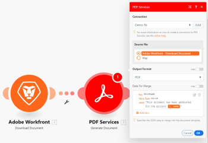

# [!DNL Adobe PDF Services]

使用 [!DNL Adobe Workfront Fusion] [!DNL Adobe PDF Services]，您可以從PDF檔案擷取資料，或從您提供的資料產生新的PDF檔案。 此外，您可以將各種檔案類型轉換為PDF，或將PDF轉換為其他檔案類型。 PDF服務還允許您組合、壓縮或讀取PDF檔案的元資料，以及控制檔案的密碼保護。

如果您需要建立案例的相關指示，請參閱 [在中建立案例 [!DNL Adobe Workfront Fusion]](../../workfront-fusion/scenarios/create-a-scenario.md).

如需模組的相關資訊，請參閱 [中的模組 [!DNL Adobe Workfront Fusion]](../../workfront-fusion/modules/modules.md).

如需用於PDF服務的API相關資訊，請參閱 [Adobe檔案產生API](https://www.adobe.io/apis/documentcloud/dcsdk/doc-generation.html).

## 使用時的考量事項 [!DNL Adobe PDF Services]

* [您不需要 [!DNL Adobe] 帳戶](#you-do-not-need-an-adobe-account)
* [[!DNL Workfront Fusion] 不會儲存您的檔案](#workfront-fusion-does-not-store-your-files)

### 您不需要 [!DNL Adobe] 帳戶

因為 [!DNL Workfront Fusion] 是 [!DNL Adobe] 產品套裝，您不需要個別 [!DNL Adobe] 帳戶來使用這些工具。 每個工具存取 [!DNL Adobe] PDF功能，而不使用連線。

雖然 [!DNL Workfront Fusion] 不需要 [!DNL Adobe] 帳戶才能使用PDF服務，模組確實需要連線。 此連接中不涉及任何憑據，並且您只提供連接本身的名稱。

### [!DNL Workfront Fusion] 不會儲存您的檔案

此 [!DNL Adobe PDF Services] 可以讀取、轉換或修改您的檔案，但 [!DNL Adobe] no [!DNL Workfront Fusion] 儲存您的檔案或資料。 這表示：

* 您可以保持對檔案的控制，包括其安全性
* 您不需要 [!UICONTROL Adobe] 儲存或雲端儲存帳戶，以使用PDF服務。

## 存取需求

您必須具備下列存取權才能使用本文中的功能：

<table style="table-layout:auto"> 
 <col> 
 <col> 
 <tbody> 
  <tr> 
   <td role="rowheader">[!DNL Adobe Workfront] 計劃*</td>
  <td> 
[!UICONTROL Pro]或更高版本
 </td>
  </tr> 
  <tr data-mc-conditions=""> 
   <td role="rowheader">[!DNL Adobe Workfront] 授權*</td>
   <td> 
[!UICONTROL計畫]、[!UICONTROL工作]
 </td> 
  </tr> 
  <tr> 
   <td role="rowheader">[!DNL Adobe Workfront Fusion] 許可**</td> 
   <td> 
[!UICONTROL [!DNL Workfront Fusion] （工作自動化和整合） 
 </td> 
  </tr> 
  <tr> 
   <td role="rowheader">產品</td> 
   <td>貴組織必須購買 [!DNL Adobe Workfront Fusion] 和 [!DNL Adobe Workfront] 以使用本文所述的功能。</td> 
  </tr> 
 </tbody> 
</table>

若要了解您擁有的計畫、授權類型或存取權，請聯絡您的 [!DNL Workfront] 管理員。

如需 [!DNL Adobe Workfront Fusion] 許可證，請參閱 [[!DNL Adobe Workfront Fusion] 授權](../../workfront-fusion/get-started/license-automation-vs-integration.md).

## [!DNL Adobe PDF Services] 模組及其欄位

設定時 [!DNL PDF Services], [!DNL Workfront Fusion] 顯示下列欄位。 除了這些欄位，還可能會根據應用程式或服務中的存取層級等因素顯示其他欄位。 模組中的粗體標題表示必填欄位。

如果您在欄位或函式上方看到對應按鈕，則可使用它來設定該欄位的變數和函式。 如需詳細資訊，請參閱 [將資訊從一個模組對應到 [!DNL Adobe Workfront Fusion]](../../workfront-fusion/mapping/map-information-between-modules.md).

* [[!UICONTROL 生成文檔]](#generate-document)
* [[!UICONTROL 擷取文字/表格]](#extract-text--table)
* [[!UICONTROL 合併PDF檔案]](#combine-pdf-files)
* [[!UICONTROL 壓縮PDF檔案]](#compress-pdf-files)
* [[!UICONTROL 將文檔轉換為PDF檔案]](#convert-document-to-pdf-file)
* [[!UICONTROL 將HTML轉換為PDF檔案]](#convert-html-to-pdf-file)
* [[!UICONTROL 將影像轉換為PDF檔案]](#convert-image-to-pdf-file)
* [[!UICONTROL 將PDF轉換為文檔]](#convert-pdf-to-document)
* [[!UICONTROL 將PDF轉換為影像]](#convert-pdf-to-image)
* [[!UICONTROL 線性化PDF檔案]](#linearize-a-pdf-file)
* [[!UICONTROL PDF檔案的OCR]](#ocr-for-pdf-file)
* [[!UICONTROL PDF頁面操作]](#pdf-page-manipulation)
* [[!UICONTROL PDF檔案屬性]](#pdf-file-properties)
* [[!UICONTROL ProtectPDF檔案]](#protect-pdf-file)
* [[!UICONTROL 移除PDF檔案的保護]](#remove-protection-of-a-pdf-file)

### [!UICONTROL 生成文檔]

此 [!UICONTROL 生成文檔] 模組是建立包含您選取資料之PDF的強大方式。 您可以使用 [!DNL Microsoft Word] 範本，或以JSON格式提供資料。

如需 [!UICONTROL [!DNL Adobe PDF Services] 生成文檔] 功能，請參閱 [檔案產生概觀](https://www.adobe.io/apis/documentcloud/dcsdk/docs.html) 在 [!DNL Adobe Document Services] 檔案。

* [使用 [!UICONTROL 生成文檔] 具有 [!DNL Microsoft Word] 範本](#use-the-generate-document-module-with-a-microsoft-word-template)
* [使用 [!UICONTROL 生成文檔] 具有JSON的模組](#use-the-generate-document-module-with-json)

#### 使用 [!UICONTROL 生成文檔] 具有 [!DNL Microsoft Word] 範本

<!--
>[!NOTE]
>
>For a discussion of Microsoft Word templates, see [Microsoft Word Template modules](../../workfront-fusion/apps-and-their-modules/microsoft-word-templates-modules.md). 
>
>You do not need to use Microsoft Word template modules to use a Microsoft Word template with the PDF Services Generate document module.
-->

若要使用 [!UICONTROL 生成文檔] 具有 [!UICONTROL Microsoft Word] 範本，您必須先建立範本。 如需指示，請在 [!DNL Microsoft Office] 檔案。

填入 [!UICONTROL 生成文檔] 模組欄位如下：

<table style="table-layout:auto"> 
 <col> 
 <col> 
 <tbody> 
  <tr> 
   <td role="rowheader">[!UICONTROL連接]</td> 
   <td> 
選擇要用於此模組的連接。
 
您不需要 [!DNL Adobe] 帳戶來建立PDF服務連線。 如需詳細資訊，請參閱 <a href="#you-do-not-need-an-adobe-account" class="MCXref xref">您不需要 [!DNL Adobe] 帳戶</a> 這篇文章。
 </td> 
  </tr> 
  <tr> 
   <td role="rowheader">[!UICONTROL源檔案]</td> 
   <td> 
從上一個模組中選擇源檔案，或映射源檔案的名稱和資料。
 
此源檔案是 [!DNL Microsoft Word ]模組用來產生新PDF的範本。
 
建議您在 [!DNL Workfront] 針對 [!DNL Microsoft Word] 用於的模板 [!DNL Workfront Fusion]. 然後，您就可以使用 [!DNL Workfront] &gt; [!UICONTROL下載文檔]模組，將適當的模板提取到您的方案中。
 </td> 
  </tr> 
  <tr> 
   <td role="rowheader">[!UICONTROL輸出格式]</td> 
   <td> 
選擇生成文檔的格式。
 
    <ul> 
     <li> 
PDF
 </li> 
     <li> 
DOCX
 </li> 
    </ul> </td> 
  </tr> 
  <tr> 
   <td role="rowheader">[！用於合併的UICONTROL資料]</td> 
   <td> 
針對您範本中要以文字取代的每個值標籤，填入下列內容：
 
    <ul> 
     <li> 
[!UICONTROL密鑰]
 
輸入鍵。 在範本中，索引鍵是值標籤中顯示的文字。 例如，如果您想在值標籤中放置文字 <code>&#123;&#123;name&#125;&#125;</code>，輸入 <code>name </code>在鍵欄位中。
 </li> 
     <li> 
值類型
 
選取值欄位中的資料是值、物件或物件陣列。
 </li> 
     <li> 
[!UICONTROL值]
 
輸入或映射要在生成的文檔中顯示的文本，以取代值標籤。
 </li> 
    </ul> 
  
 </td> 
  </tr> 
 </tbody> 
</table>

#### 使用 [!UICONTROL 生成文檔] 具有JSON的模組

若要使用 [!UICONTROL 生成文檔] 模組（含JSON），請依照下列方式填入欄位：

<table style="table-layout:auto"> 
 <col> 
 <col> 
 <tbody> 
  <tr> 
   <td role="rowheader">[!UICONTROL連接]</td> 
   <td> 
選擇要用於此模組的連接。
 
您不需要 [!DNL Adobe] 帳戶來建立PDF服務連線。 如需詳細資訊，請參閱 <a href="#you-do-not-need-an-adobe-account" class="MCXref xref">您不需要 [!DNL Adobe] 帳戶</a> 這篇文章。
 </td> 
  </tr> 
  <tr> 
   <td role="rowheader">[!UICONTROL源檔案]</td> 
   <td> 
從上一個模組中選擇源檔案，或映射源檔案的名稱和資料。
 </td> 
  </tr> 
  <tr> 
   <td role="rowheader">[!UICONTROL輸出格式]</td> 
   <td> 
選擇生成文檔的格式。
 
    <ul> 
     <li> 
PDF
 </li> 
     <li> 
DOCX
 </li> 
    </ul> </td> 
  </tr> 
  <tr> 
   <td role="rowheader">[！用於合併的UICONTROL資料]</td> 
   <td> 
若要在此模組中使用JSON，您必須在此欄位上啟用對應。
 
輸入或對應JSON以從中產生檔案。 
 
您可以直接在此欄位中輸入JSON，或從JSON模組對應JSON輸出。
 </td> 
  </tr> 
 </tbody> 
</table>

### [!UICONTROL 擷取文字/表格]

此動作模組可讓您從PDF檔案中擷取資料。 模組會輸出個別的文字元素，例如段落或表格單一儲存格中的文字。

<table style="table-layout:auto"> 
 <col> 
 <col> 
 <tbody> 
  <tr> 
   <td role="rowheader">[!UICONTROL連接]</td> 
   <td> 
選擇要用於此模組的連接。
 
您不需要 [!DNL Adobe] 帳戶來建立PDF服務連線。 如需詳細資訊，請參閱 <a href="#you-do-not-need-an-adobe-account" class="MCXref xref">您不需要 [!DNL Adobe] 帳戶</a> 這篇文章。
 </td> 
  </tr> 
  <tr> 
   <td role="rowheader">[!UICONTROL源檔案]</td> 
   <td>從上一個模組中選擇源檔案，或映射源檔案的名稱和資料。</td> 
  </tr> 
  <tr> 
   <td role="rowheader">[!UICONTROL應擷取為JSON的元素]</td> 
   <td> 
    <ul> 
     <li> 
[!UICONTROL文本]
 </li> 
     <li> 
[!UICONTROL表]
 </li> 
    </ul> </td> 
  </tr> 
  <tr> 
   <td role="rowheader">[!UICONTROL提取邊界框？]</td> 
   <td>啟用此選項可擷取關於文字邊界方框的資料。</td> 
  </tr> 
  <tr> 
   <td role="rowheader">[!UICONTROL是否包含輸出的樣式資訊？]</td> 
   <td>啟用此選項可將樣式資訊新增至輸出JSON。</td> 
  </tr> 
 </tbody> 
</table>

### [!UICONTROL 合併PDF檔案]

此動作模組會擷取多個PDF檔案，並將它們結合為單一PDF檔案。 例如，此模組可結合 [!UICONTROL Workfront] 項目完成後整合為單一PDF。

<table style="table-layout:auto"> 
 <col> 
 <col> 
 <tbody> 
  <tr> 
   <td role="rowheader">[!UICONTROL連接]</td> 
   <td> 
選擇要用於此模組的連接。
 
您不需要 [!DNL Adobe] 帳戶來建立PDF服務連線。 如需詳細資訊，請參閱 <a href="#you-do-not-need-an-adobe-account" class="MCXref xref">您不需要 [!DNL Adobe] 帳戶</a> 這篇文章。
 </td> 
  </tr> 
  <tr> 
   <td role="rowheader">[!UICONTROL文檔]</td> 
   <td> 
您可以使用聚合器模組來收集要合併到PDF中的文檔，或者可以手動添加文檔。 
 
建議使用[!UICONTROL陣列聚合器]模組來聚合來自前一個模組的輸出。 通過使用聚合器，您不需要知道要合併的檔案的名稱、位置或數字。 因此，使用聚合器比手動輸入要合併的文檔更加靈活和可擴展。
 
要將[!UICONTROL合併PDF]檔案模組與聚合器一起使用，必須在[!UICONTROL文檔]欄位上啟用映射。 
 
在此示例中， [!UICONTROL讀取相關記錄]模組標識與項目關聯的文檔，而[!UICONTROL下載文檔]模組下載每個文檔。 所有PDF都會匯總至陣列，並傳遞至[!UICONTROL合併PDF]檔案模組。
 
  
 
您也可以手動輸入文檔。
 
對於要包含在組合PDF中的每個文檔：
 
    <ol> 
     <li value="1"> 
按一下[!UICONTROL添加文檔]
 </li> 
     <li value="2"> 
在[!UICONTROL源檔案]欄位中，選擇輸出要包含的文檔的模組，或映射源檔案的名稱和資料。 
 </li> 
     <li value="3"> 
（可選）如果只想從源檔案中包括某些頁面，請針對要添加的每個頁面範圍按一下 <strong>[!UICONTROL添加項]</strong> 在「 [!UICONTROL頁面]」欄位中，輸入要包含的頁面範圍的第一頁和最後一頁，然後按一下 <strong>[!UICONTROL添加]</strong>. 您可以從單個文檔中包含多個頁面範圍。
 </li> 
     <li value="4"> 
按一下 <strong>[!UICONTROL添加]</strong>. 
 </li> 
    </ol> </td> 
  </tr> 
 </tbody> 
</table>

### [!UICONTROL 壓縮PDF檔案]

此動作模組會取用PDF檔案並加以壓縮。 這對於節省頻寬或記憶體非常有用。

<table style="table-layout:auto"> 
 <col> 
 </col> 
 <col> 
 </col> 
 <tbody> 
  <tr> 
   <td role="rowheader">[!UICONTROL連接]</td> 
   <td> 
選擇要用於此模組的連接。
 
您不需要 [!DNL Adobe] 帳戶來建立PDF服務連線。 如需詳細資訊，請參閱 <a href="#you-do-not-need-an-adobe-account" class="MCXref xref">您不需要 [!DNL Adobe] 帳戶</a> 這篇文章。
 </td> 
  </tr> 
  <tr> 
   <td role="rowheader">[!UICONTROL源檔案]</td> 
   <td> 
從上一個模組中選擇源檔案，或映射源檔案的名稱和資料。
 
源檔案必須為PDF格式。 
 </td> 
  </tr> 
  <tr> 
   <td role="rowheader">[!UICONTROL壓縮級別]</td> 
   <td>選擇要使用的壓縮級別。</td> 
  </tr> 
 </tbody> 
</table>

### [!UICONTROL 將文檔轉換為PDF檔案]

此工具將文檔轉換為PDF檔案。 源檔案必須是以下文檔格式之一：

* 檔案
* XLS
* PPT
* TXT
* RTF

<table style="table-layout:auto"> 
 <col> 
 </col> 
 <col> 
 </col> 
 <tbody> 
  <tr> 
   <td role="rowheader">[!UICONTROL連接]</td> 
   <td> 
選擇要用於此模組的連接。
 
您不需要 [!DNL Adobe] 帳戶來建立PDF服務連線。 如需詳細資訊，請參閱 <a href="#you-do-not-need-an-adobe-account" class="MCXref xref">您不需要 [!DNL Adobe] 帳戶</a> 這篇文章。
 </td> 
  </tr> 
  <tr> 
   <td role="rowheader">[!UICONTROL源檔案]</td> 
   <td> 
從上一個模組中選擇源檔案，或映射源檔案的名稱和資料。
 
源檔案必須採用以下格式之一：
 
    <ul> 
     <li> 
檔案
 </li> 
     <li> 
XLS
 </li> 
     <li> 
PPT
 </li> 
     <li> 
TXT
 </li> 
     <li> 
RTF
 </li> 
    </ul> </td> 
  </tr> 
  <tr> 
   <td role="rowheader">[!UICONTROL語言]</td> 
   <td> 
選擇源文檔的預設語言。 如果源檔案中未包含字型，則允許模組選擇相應的字型。
 
從下列語言中選擇：
 
    <ul> 
     <li> 
en-US（預設）:英語（美利堅合眾國）
 </li> 
     <li> 
ca-ES:加泰羅尼亞語（西班牙）
 </li> 
     <li> 
cs-CZ:捷克文（捷克共和國）
 </li> 
     <li> 
da-DK:丹麥文（丹麥）
 </li> 
     <li> 
DE:德文（德國）
 </li> 
     <li> 
en-AE:英語（阿拉伯聯合大公國）
 </li> 
     <li> 
en-GB:英語（英國）
 </li> 
     <li> 
en-IL:英語（以色列）
 </li> 
     <li> 
美國：英語（美利堅合眾國）
 </li> 
     <li> 
es-ES:西班牙文（西班牙）
 </li> 
     <li> 
es-MX:西班牙文（墨西哥）
 </li> 
     <li> 
eu-ES:巴斯克語（西班牙）
 </li> 
     <li> 
fi-FI:芬蘭文（芬蘭）
 </li> 
     <li> 
fr-CA:法語（加拿大）
 </li> 
     <li> 
fr-FR:法語（法國）
 </li> 
     <li> 
fr-MA:法語（摩洛哥）
 </li> 
     <li> 
hr-HR:克羅埃西亞語（克羅埃西亞）
 </li> 
     <li> 
胡胡：匈牙利文（匈牙利）
 </li> 
     <li> 
it-IT:義大利文（義大利）
 </li> 
     <li> 
ja-JP:日文（日本）
 </li> 
     <li> 
kr-KR:韓文（韓國）
 </li> 
     <li> 
nb-NO:挪威博克馬爾語（挪威）
 </li> 
     <li> 
nl-NL:荷蘭文（荷蘭）
 </li> 
     <li> 
pl-PL:波蘭文（波蘭）
 </li> 
     <li> 
pt-BR:葡萄牙語（巴西）
 </li> 
     <li> 
pt-PT:葡萄牙語（葡萄牙）
 </li> 
     <li> 
ro-RO:羅馬尼亞文（羅馬尼亞）
 </li> 
     <li> 
ru-RU:俄文（俄羅斯）
 </li> 
     <li> 
sk-SK:斯洛伐克文（斯洛伐克）
 </li> 
     <li> 
sl-SI:斯洛維尼亞（斯洛維尼亞）
 </li> 
     <li> 
sv-SE:瑞典文（瑞典）
 </li> 
     <li> 
tr-TR:土耳其語（土耳其）
 </li> 
     <li> 
uk-UA:烏克蘭文（烏克蘭）
 </li> 
     <li> 
zh-CN:中文（中國大陸）
 </li> 
     <li> 
zh-TW:中文（台灣）
 </li> 
    </ul> </td> 
  </tr> 
 </tbody> 
</table>

### [!UICONTROL 將HTML轉換為PDF檔案]

此工具會將HTML檔案轉換為PDF檔案。

<table style="table-layout:auto"> 
 <col> 
 </col> 
 <col> 
 </col> 
 <tbody> 
  <tr> 
   <td role="rowheader">[!UICONTROL連接]</td> 
   <td> 
選擇要用於此模組的連接。
 
您不需要 [!DNL Adobe] 帳戶來建立PDF服務連線。 如需詳細資訊，請參閱 <a href="#you-do-not-need-an-adobe-account" class="MCXref xref">您不需要 [!DNL Adobe] 帳戶</a> 這篇文章。
 </td> 
  </tr> 
  <tr> 
   <td role="rowheader">[!UICONTROL源檔案]</td> 
   <td> 
從上一個模組中選擇源檔案，或映射源檔案的名稱和資料。
 
重要：來源檔案必須是HTML或ZIP格式。 
 </td> 
  </tr> 
  <tr> 
   <td role="rowheader">[!UICONTROL JSON]</td> 
   <td> 
如果您的HTML參考JavaScript變數，您可以在此處納入這些變數。 
 
針對每個變數，按一下 <strong>[!UICONTROL添加項]</strong> 並納入變數的索引鍵和值。
 
備註:   
     <ul> 
      <li> 
從ZIP檔案建立PDF時，來源宣傳品必須包含指令碼元素，例如： <code> &lt;script src='./json.js' type='text/javascript'&gt;&lt;/script&gt;</code> 
 </li> 
      <li> 
從URL建立PDF時，此JSON物件的內容會在轉譯頁面之前插入瀏覽器VM。 
 </li> 
     </ul> 
 </td> 
  </tr> 
  <tr> 
   <td role="rowheader">[!UICONTROL包含頁首和頁尾]</td> 
   <td> 
啟用此選項可建立PDF文檔的頁眉和頁腳。
 
    <ul> 
     <li> 
標題包括日期和文檔標題。
 </li> 
     <li> 
頁尾包括檔案名和頁碼。
 </li> 
    </ul> </td> 
  </tr> 
  <tr> 
   <td role="rowheader">[!UICONTROL頁寬]</td> 
   <td>輸入紙張的寬度（英吋）。 模組使用此資訊將已建立的PDF檔案中的頁面格式化。</td> 
  </tr> 
  <tr> 
   <td role="rowheader">[!UICONTROL頁面高度]</td> 
   <td>輸入紙張的高度（英吋）。 模組使用此資訊將已建立的PDF檔案中的頁面格式化。</td> 
  </tr> 
 </tbody> 
</table>

### [!UICONTROL 將影像轉換為PDF檔案]

此工具會將影像轉換為PDF檔案。

<table style="table-layout:auto"> 
 <col> 
 </col> 
 <col> 
 </col> 
 <tbody> 
  <tr> 
   <td role="rowheader">[!UICONTROL連接]</td> 
   <td> 
選擇要用於此模組的連接。
 
您不需要 [!DNL Adobe] 帳戶來建立PDF服務連線。 如需詳細資訊，請參閱 <a href="#you-do-not-need-an-adobe-account" class="MCXref xref">您不需要 [!DNL Adobe] 帳戶</a> 這篇文章。
 </td> 
  </tr> 
  <tr> 
   <td role="rowheader">[!UICONTROL源檔案]</td> 
   <td> 
從上一個模組中選擇源檔案，或映射源檔案的名稱和影像檔案。
 </td> 
  </tr> 
 </tbody> 
</table>

### [!UICONTROL 將PDF轉換為文檔]

此工具將PDF檔案轉換為文檔。 您可以為輸出檔案選擇以下格式之一。

* 檔案
* DOCX
* PPTX
* XLSX
* RTF

<table style="table-layout:auto"> 
 <col> 
 </col> 
 <col> 
 </col> 
 <tbody> 
  <tr> 
   <td role="rowheader">[!UICONTROL連接]</td> 
   <td> 
選擇要用於此模組的連接。
 
您不需要 [!DNL Adobe] 帳戶來建立PDF服務連線。 如需詳細資訊，請參閱 <a href="#you-do-not-need-an-adobe-account" class="MCXref xref">您不需要 [!DNL Adobe] 帳戶</a> 這篇文章。
 </td> 
  </tr> 
  <tr> 
   <td role="rowheader">[!UICONTROL源檔案]</td> 
   <td> 
從上一個模組中選擇源檔案，或映射源檔案的名稱和資料。
 
源檔案必須為PDF格式。 
 </td> 
  </tr> 
  <tr> 
   <td role="rowheader">[!UICONTROL輸出檔案格式]</td> 
   <td> 
選取要將檔案輸出為的格式：
 
    <ul> 
     <li> 
檔案
 </li> 
     <li> 
DOCX
 </li> 
     <li> 
PPTX
 </li> 
     <li> 
XLSX
 </li> 
     <li> 
RTF
 </li> 
    </ul> </td> 
  </tr> 
 </tbody> 
</table>

### [!UICONTROL 將PDF轉換為影像]

此工具會將PDF轉換為PNG或JPEG格式的影像，然後輸出為ZIP。 PDF會轉換為每頁一個影像，每個影像的結尾都是頁碼。 然後影像檔案會合併為ZIP檔案。

例如，名為&quot;TestFile&quot;的檔案包含8個頁，將生成8個映像，名為&quot;TestFile_1&quot;到&quot;TestFile_8&quot;。 模組的輸出是包含8個影像的ZIP檔案。

<table style="table-layout:auto"> 
 <col> 
 </col> 
 <col> 
 </col> 
 <tbody> 
  <tr> 
   <td role="rowheader">[!UICONTROL連接]</td> 
   <td> 
選擇要用於此模組的連接。
 
您不需要 [!DNL Adobe] 帳戶來建立PDF服務連線。 如需詳細資訊，請參閱 <a href="#you-do-not-need-an-adobe-account" class="MCXref xref">您不需要 [!DNL Adobe] 帳戶</a> 這篇文章。
 </td> 
  </tr> 
  <tr> 
   <td role="rowheader">[!UICONTROL源檔案]</td> 
   <td> 
從上一個模組中選擇源檔案，或映射源檔案的名稱和資料。
 
源檔案必須為PDF格式。 
 </td> 
  </tr> 
  <tr> 
   <td role="rowheader">[!UICONTROL輸出檔案格式]</td> 
   <td> 
選取要將檔案輸出為的格式：
 
    <ul> 
     <li>PNG</li> 
     <li>JPEG</li> 
    </ul> </td> 
  </tr> 
 </tbody> 
</table>

### [!UICONTROL 線性化PDF檔案]

此工具將PDF文檔線性化，以建立Web優化PDF文檔。 線性化的PDF文檔可以逐頁查看，而無需下載整個文檔。

<table style="table-layout:auto"> 
 <col> 
 </col> 
 <col> 
 </col> 
 <tbody> 
  <tr> 
   <td role="rowheader">[!UICONTROL連接]</td> 
   <td> 
選擇要用於此模組的連接。
 
您不需要 [!DNL Adobe] 帳戶來建立PDF服務連線。 如需詳細資訊，請參閱 <a href="#you-do-not-need-an-adobe-account" class="MCXref xref">您不需要 [!DNL Adobe] 帳戶</a> 這篇文章。
 </td> 
  </tr> 
  <tr> 
   <td role="rowheader">[!UICONTROL源檔案]</td> 
   <td> 
從上一個模組中選擇源檔案，或映射源檔案的名稱和資料。
 </td> 
  </tr> 
 </tbody> 
</table>

### [!UICONTROL PDF檔案的OCR]

此工具對檔案執行光學字元識別(OCR)並生成PDF。

<table style="table-layout:auto"> 
 <col> 
 </col> 
 <col> 
 </col> 
 <tbody> 
  <tr> 
   <td role="rowheader">[!UICONTROL連接]</td> 
   <td> 
選擇要用於此模組的連接。
 
您不需要 [!DNL Adobe] 帳戶來建立PDF服務連線。 如需詳細資訊，請參閱 <a href="#you-do-not-need-an-adobe-account" class="MCXref xref">您不需要 [!DNL Adobe] 帳戶</a> 這篇文章。
 </td> 
  </tr> 
  <tr> 
   <td role="rowheader">[!UICONTROL源檔案]</td> 
   <td> 
從上一個模組中選擇源檔案，或映射源檔案的名稱和資料。
 </td> 
  </tr> 
  <tr> 
   <td role="rowheader">[!UICONTROL OCR類型]</td> 
   <td> 
    <ul> 
     <li> 
[!UICONTROL已修改原始影像]類型確保文本可搜索和可選，但在清除過程中（例如，將其描述）修改原始影像，然後將隱藏的文本層放在其上。 此類型會移除不想要的成品，且在某些情況下可能會產生更易讀的檔案。 
 </li> 
     <li> 
[!UICONTROL未更改的原始影像]類型還覆蓋原始影像上的可搜索文本層，但在此情況下，原始影像未更改。 此類型對原始影像產生最大保真度。
 </li> 
    </ul> </td> 
  </tr> 
  <tr> 
   <td role="rowheader">[!UICONTROL語言]</td> 
   <td>選擇此文檔的語言。</td> 
  </tr> 
 </tbody> 
</table>

### [!UICONTROL PDF頁面操作]

此模組可讓您選擇性地旋轉或刪除PDF檔案中的頁面。 例如，您可以將直向檢視變更為橫向檢視，或從PDF檔案中移除特定頁面。

<table style="table-layout:auto"> 
 <col> 
 </col> 
 <col> 
 </col> 
 <tbody> 
  <tr> 
   <td role="rowheader">[!UICONTROL連接]</td> 
   <td> 
選擇要用於此模組的連接。
 
您不需要 [!DNL Adobe] 帳戶來建立PDF服務連線。 如需詳細資訊，請參閱 <a href="#you-do-not-need-an-adobe-account" class="MCXref xref">您不需要 [!DNL Adobe] 帳戶</a> 這篇文章。
 </td> 
  </tr> 
  <tr> 
   <td role="rowheader">[!UICONTROL源檔案]</td> 
   <td> 
從上一個模組中選擇源檔案，或映射源檔案的名稱和資料。
 </td> 
  </tr> 
  <tr> 
   <td role="rowheader">[!UICONTROL操作]</td> 
   <td> 
選取您要對檔案執行的動作。
 
    <ul> 
     <li> 
<b>[!UICONTROL刪除]</b> 
 
選擇此選項可從文檔中刪除頁面。
 </li> 
     <li> 
<b>[!UICONTROL旋轉]</b> 
 
選擇此選項可旋轉頁面，然後輸入要相對於其起始方向旋轉文檔頁面的角度（順時針角度）。
 
若要從直向旋轉為橫向或反之旋轉，請將頁面旋轉90或270度。
 
如果頁面上下顛倒，請將其旋轉180度。
 </li> 
    </ul> </td> 
  </tr> 
  <tr> 
   <td role="rowheader">[!UICONTROL頁]</td> 
   <td> 
針對您要刪除的每個頁面範圍，按一下 <strong>[!UICONTROL添加]</strong> 然後輸入頁面範圍的第一頁和最後一頁。 
 
備註:   
     <ul> 
      <li> 
您可以使用負數從文檔的結尾進行計數。 文檔的最後一頁是–1，第二頁到最後一頁是–2，以此類推。
 </li> 
      <li> 
若要刪除單一頁面，請設定與範圍開始和結束相同的頁碼。
 </li> 
     </ul> 
 </td> 
  </tr> 
  <tr> 
   <td role="rowheader">[!UICONTROL限制]</td> 
   <td> 
輸入或映射在每個方案執行週期中希望模組使用的最大記錄數。
 </td> 
  </tr> 
 </tbody> 
</table>

### [!UICONTROL PDF檔案屬性]

此工具會擷取檔案的基本資訊，例如：

* 頁數
* PDF版本
* 檔案是否已加密
* 檔案是否已線化
* 檔案是否包含內嵌檔案

<table style="table-layout:auto"> 
 <col> 
 </col> 
 <col> 
 </col> 
 <tbody> 
  <tr> 
   <td role="rowheader">[!UICONTROL連接]</td> 
   <td> 
選擇要用於此模組的連接。
 
您不需要 [!DNL Adobe] 帳戶來建立PDF服務連線。 如需詳細資訊，請參閱 <a href="#you-do-not-need-an-adobe-account" class="MCXref xref">您不需要 [!DNL Adobe] 帳戶</a> 這篇文章。
 </td> 
  </tr> 
  <tr> 
   <td role="rowheader">[!UICONTROL源檔案]</td> 
   <td> 
從上一個模組中選擇源檔案，或映射源檔案的名稱和資料。
 </td> 
  </tr> 
 </tbody> 
</table>

### [!UICONTROL ProtectPDF檔案]

此工具使用用戶或所有者密碼保護PDF文檔。 它還對某些功能設定限制，如打印、編輯和複製PDF文檔。 選擇要加密的內容類型和加密算法。

<table style="table-layout:auto"> 
 <col> 
 </col> 
 <col> 
 </col> 
 <tbody> 
  <tr> 
   <td role="rowheader">[!UICONTROL連接]</td> 
   <td> 
選擇要用於此模組的連接。
 
您不需要 [!DNL Adobe] 帳戶來建立PDF服務連線。 如需詳細資訊，請參閱 <a href="#you-do-not-need-an-adobe-account" class="MCXref xref">您不需要 [!DNL Adobe] 帳戶</a> 這篇文章。
 </td> 
  </tr> 
  <tr> 
   <td role="rowheader">[!UICONTROL源檔案]</td> 
   <td> 
從上一個模組中選擇源檔案，或映射源檔案的名稱和資料。
 
源檔案必須為PDF格式。 
 </td> 
  </tr> 
  <tr> 
   <td role="rowheader">[!UICONTROL密碼保護類型]</td> 
   <td> 
啟用此選項可使用密碼加密輸入PDF文檔。 如果啟用此選項，必須指定並輸入以下任一項或兩項的值： 
 
    <ul> 
     <li> 
[!UICONTROL userPassword]
 </li> 
     <li> 
[!UICONTROL ownerPassword] 
 </li> 
    </ul> 
每個密碼的長度最多可為128個字元。
 </td> 
  </tr> 
  <tr> 
   <td role="rowheader">[!UICONTROL加密算法]</td> 
   <td> 
選擇加密算法。 
 
    <ul> 
     <li> 
[!UICONTROL AES-128加密]
 
密碼僅支援LATIN-I字元。 
 </li> 
     <li> 
[!UICONTROL AES-256加密]
 
密碼支援Unicode字元集
 </li> 
    </ul> </td> 
  </tr> 
  <tr> 
   <td role="rowheader">[!UICONTROL要加密的內容]</td> 
   <td> 
選取要加密的內容類型。
 
    <ul> 
     <li> 
[!UICONTROL全部內容]
 </li> 
     <li> 
[!UICONTROL除元資料外的所有內容]
 </li> 
     <li> 
[!UICONTROL僅嵌入資料] 
 </li> 
    </ul> 
選擇「[!UICONTROL僅嵌入資料]」會使任何提供的訪問權限失效。
 </td> 
  </tr> 
  <tr> 
   <td role="rowheader">[!UICONTROL權限]</td> 
   <td> 
選取您要包含的任何權限，以允許列印、編輯或複製內容。
 
只有在[!UICONTROL密碼保護類型]欄位中設定了[!UICONTROL ownerPassword]時，才使用權限設定。
 </td> 
  </tr> 
 </tbody> 
</table>

### [!UICONTROL 移除PDF檔案的保護]

此工具從PDF文檔中刪除了安全（密碼保護）。

<table style="table-layout:auto"> 
 <col> 
 </col> 
 <col> 
 </col> 
 <tbody> 
  <tr data-mc-conditions=""> 
   <td role="rowheader">[!UICONTROL連接]</td> 
   <td> 
選擇要用於此模組的連接。
 
您不需要 [!DNL Adobe] 帳戶來建立PDF服務連線。 如需詳細資訊，請參閱 <a href="#you-do-not-need-an-adobe-account" class="MCXref xref">您不需要 [!DNL Adobe] 帳戶</a> 這篇文章。
 </td> 
  </tr> 
  <tr> 
   <td role="rowheader">[!UICONTROL源檔案]</td> 
   <td> 
從上一個模組中選擇源檔案，或映射源檔案的名稱和資料。
 
源檔案必須為PDF格式。
 </td> 
  </tr> 
  <tr> 
   <td role="rowheader">[!UICONTROL密碼]</td> 
   <td>輸入當前保護檔案的密碼。</td> 
  </tr> 
 </tbody> 
</table>
