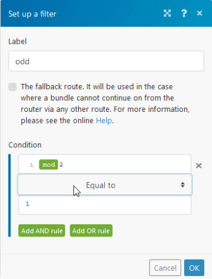

# [!UICONTROL 工具]

>[!IMPORTANT]
>
>Adobe Workfront Fusion檔案已移至新位置。
>
>本文資訊可在以下文章中找到：
>
>* [工具](https://experienceleague.adobe.com/docs/workfront-fusion/using/references/apps-and-their-modules/tools-and-transformers/tools-modules.html)
>
>請更新任何書籤。
>
>本文已不再更新，將於不久將來移除。

[!DNL Adobe Workfront Fusion Tools]區段包含數個可增強您的情境的實用模組。

[!UICONTROL 工具]模組可從應用程式清單或熒幕底部的[!UICONTROL 工具]圖示取得。

## 存取需求

您必須具有下列存取權才能使用本文中的功能：

<table style="table-layout:auto"> 
 <col> 
 <col> 
 <tbody> 
  <tr> 
   <td role="rowheader">[!DNL Adobe Workfront] 計畫*</td>
  <td> 
[！UICONTROL Pro]或更高版本
 </td>
  </tr> 
  <tr data-mc-conditions=""> 
   <td role="rowheader">[!DNL Adobe Workfront] 授權*</td>
   <td> 
[！UICONTROL計畫]，[！UICONTROL工作]
 </td> 
  </tr> 
  <tr> 
   <td role="rowheader">[!DNL Adobe Workfront Fusion] 授權**</td> 
   <td>
   
目前授權需求：無[!DNL Workfront Fusion]授權需求。

   
或

   
舊版授權需求：[！UICONTROL [!DNL Workfront Fusion] for Work Automation and Integration] 

   </td> 
  </tr> 
  <tr> 
   <td role="rowheader">產品</td> 
   <td>
   
目前產品需求：如果您有[！UICONTROL Select]或[！UICONTROL Prime] [!DNL Adobe Workfront]計畫，貴組織必須購買[!DNL Adobe Workfront Fusion]及[!DNL Adobe Workfront]，才能使用本文所述的功能。 [!DNL Workfront Fusion]包含在[！UICONTROL Ultimate] [!DNL Workfront]計畫中。

   
或

   
舊版產品需求：您的組織必須購買[!DNL Adobe Workfront Fusion]及[!DNL Adobe Workfront]，才能使用本文所述的功能。

   </td> 
  </tr>
 </tbody> 
</table>

若要瞭解您擁有的計畫、授權型別或存取權，請連絡您的[!DNL Workfront]管理員。

如需[!DNL Adobe Workfront Fusion]授權的相關資訊，請參閱[[!DNL Adobe Workfront Fusion] 授權](../../workfront-fusion/get-started/license-automation-vs-integration.md)。

## [!UICONTROL 工具]及其欄位

* [觸發程序](#triggers)
* [動作](#actions)
* [彙總](#aggregators)
* [轉換器](#transformers)

### 觸發程序

#### [!UICONTROL 基本觸發器]

此模組可讓您建立自訂觸發器，並定義其輸入組合。

例如，您可以將此模組用於排程傳送至指定電子郵件地址的連絡人或任何其他清單（例如[!UICONTROL 電子郵件] >[!UICONTROL 傳送電子郵件]，或[!DNL Gmail] >[!UICONTROL 傳送電子郵件]模組），或作為您想要隨時觸發的簡單提醒。

<table style="table-layout:auto"> 
 <col> 
 <col> 
 <tbody> 
  <tr> 
   <td role="rowheader">[！UICONTROL組合]</td> 
   <td> 
新增陣列專案以建立自訂組合。 陣列由名稱 — 值配對組成。
 </td> 
  </tr> 
 </tbody> 
</table>

### 動作

* [[!UICONTROL 取得多個變數]](#get-multiple-variables)
* [[!UICONTROL 取得變數]](#get-variable)
* [[!UICONTROL 遞增函式]](#increment-function)
* [[!UICONTROL 設定多個變數]](#set-multiple-variables)
* [[!UICONTROL 設定變數]](#set-variable)
* [[!UICONTROL 睡眠]](#sleep)

#### [!UICONTROL 取得多個變數]

此模組會擷取先前由[!UICONTROL 設定變數]或[!UICONTROL 設定多個變數]模組建立的值。

此模組可讀取在情境中任何位置設定的變數，即使變數設定在與[!UICONTROL 取得多個變數]模組所在不同的路由中。 唯一的要求是[!UICONTROL 工具] > [!UICONTROL 設定變數]或[!UICONTROL 工具] > [!UICONTROL 設定多個變數]模組在[!UICONTROL 工具] > [!UICONTROL 取得多個變數]模組之前執行。 如需模組執行順序的詳細資訊，請參閱 [!DNL Adobe Workfront Fusion]](../../workfront-fusion/modules/router-module.md)中的[路由器模組。

<table style="table-layout:auto">
    <tr>
        <td>[！UICONTROL變數]</td>
        <td>新增您想要模組取得的變數。</td>
    </tr>
    <tr>
        <td>[！UICONTROL變數名稱]</td>
        <td>針對您新增的每個變數，對應您要取得之變數的名稱。</td>
    </tr>
</table>

>[!INFO]
>
>**範例：**&#x200B;下列是[!UICONTROL Set]/[!UICONTROL Get （多個） Variable(s)]模組的可能用法：
>
>* 儲存計算值以供稍後使用，即使是在不同的路由中。 當值用於多個模組且計算值的公式過於複雜時，這個用法很有用。
>* 對公式進行偵錯。 如果模組中使用的公式似乎未提供正確的結果，請複製該公式並將其貼到您在相關模組之前插入的[!UICONTROL 設定變數]模組中。 在[!UICONTROL 設定變數]模組之後中斷模組連線，並執行情境。 驗證[!UICONTROL 設定變數]模組的輸出，調整或簡化公式，再次執行案例，並持續執行，直到問題解決為止。

#### [!UICONTROL 取得變數]

此模組會擷取先前由[!UICONTROL 設定變數]或[!UICONTROL 設定多個變數]模組建立的值。

此模組可讀取在情境中任何位置設定的變數，即使變數設定在與[!UICONTROL Get變數]模組所在不同的路由中。 唯一的要求是[!UICONTROL 工具] > [!UICONTROL 設定變數]或[!UICONTROL 工具] > [!UICONTROL 設定多個變數]模組在[!UICONTROL 工具] > [!UICONTROL 取得變數]模組之前執行。 如需模組執行順序的詳細資訊，請參閱 [!DNL Adobe Workfront Fusion]](../../workfront-fusion/modules/router-module.md)中的[路由器模組。

<table style="table-layout:auto"> 
 <col> 
 <col> 
 <tbody> 
  <tr> 
   <td role="rowheader">[！UICONTROL變數名稱]</td> 
   <td> 
對應您希望模組取得的變數名稱。
 </td> 
  </tr> 
 </tbody> 
</table>

#### [!UICONTROL 遞增函式]

此模組會傳回每個模組作業後以1為單位遞增的值。

<table style="table-layout:auto"> 
 <col> 
 <col> 
 <tbody> 
  <tr> 
   <td role="rowheader">[！UICONTROL重設值]</td> 
   <td> 
選取您想要模組增加值的時機。 
 
    <ul> 
     <li>[！UICONTROL After One Cycle]</li> 
     <li>[！UICONTROL在一個案例執行後]</li> 
     <li>[！UICONTROL從不]</li> 
    </ul> </td> 
  </tr> 
 </tbody> 
</table>

>[!INFO]
>
>**範例：**
>
>此模組的用途之一，是實作任務、銷售機會、電子郵件等的「循環配置資源」指派給群組中的使用者。 演演算法會以某種合理的順序從群組選擇受指派人，通常會從清單的頂端移至底端。 當演演算法到達清單結尾時，它會將下一個指派指派給位於清單頂端的使用者，並繼續進行清單下方的指派。
>
>下列案例會在每個奇數位案例執行後向第一個收件者傳送電子郵件，並在每個偶數位案例執行後向第二個收件者傳送電子郵件。
>
>
>
>1. 若要建立此情境：
>1. 將模組的&#x200B;**[!UICONTROL 重設值]**&#x200B;欄位設為[永不]。
>1. 設定奇數的路由。 使用等於`1`的模數數學函式設定此路由的篩選器：
>
>   
>
>  **附註**：別忘了將[!UICONTROL 等於]運運算元從預設的[!UICONTROL 文字]運運算元變更為[!UICONTROL 數值]運運算元。
>
>1. 使用等於`0`的模數數學函式設定偶數值的路徑：
>
>增量函式會在每次案例執行時新增一次。 篩選器會檢查增量並根據其值採取行動，確保電子郵件平均散發。

#### [!UICONTROL 設定多個變數]

此模組會建立可由路由中其他模組對應的變數。 此變數也可以對應到情境中任何路由的[!UICONTROL 取得變數]或[!UICONTROL 取得多個變數]模組。

<table style="table-layout:auto"> 
 <col> 
 <col> 
 <tbody> 
  <tr> 
   <td>[！UICONTROL變數]</td> 
   <td>新增您想要模組設定的變數。</td> 
  </tr> 
  <tr> 
   <td>[！UICONTROL變數名稱] </td> 
   <td>針對每個變數，輸入變數名稱。 在其他模組中對應變數時，會顯示此名稱。 </td> 
  </tr> 
  <tr> 
   <td>[！UICONTROL變數值] </td> 
   <td>針對每個變數，輸入變數的值。 </td> 
  </tr> 
  <tr> 
   <td>[！UICONTROL變數存留期] </td> 
   <td> 
選取您想要變數維持有效期（保持相同值）的時間。
 
    <ul> 
     <li><strong>[！UICONTROL One cycle]</strong>：變數對一個週期有效。 在收到一個案例執行中的多個Webhook時很有用（更多Webhook =更多週期）。 </li> 
     <li><strong>[！UICONTROL One execution]</strong>：變數對一個案例執行有效。 一個執行可以包含一個或多個週期。</li> 
    </ul> </td> 
  </tr> 
 </tbody> 
</table>

#### [!UICONTROL 設定變數]

此模組會建立變數，該變數可由路由中的其他模組進行對應。 此變數也可以對應到情境中任何路由的[!UICONTROL 取得變數]或[!UICONTROL 取得多個變數]模組。

<table style="table-layout:auto"> 
 <col> 
 <col> 
 <tbody> 
  <tr> 
   <td>[！UICONTROL變數名稱] </td> 
   <td>輸入變數名稱。 在其他模組中對應變數時，會顯示此名稱。 </td> 
  </tr> 
  <tr> 
   <td>[！UICONTROL變數存留期] </td> 
   <td> 
選取您想要變數維持有效期（保持相同值）的時間。
 
    <ul> 
     <li><strong>[！UICONTROL One cycle]</strong>：變數對一個週期有效。 在收到一個案例執行中的多個Webhook時很有用（更多Webhook =更多週期）。 </li> 
     <li><strong>[！UICONTROL One execution]</strong>：變數對一個案例執行有效。 一個執行可以包含一個或多個週期。</li> 
    </ul> </td> 
  </tr> 
  <tr> 
   <td>[！UICONTROL變數值] </td> 
   <td>輸入或對應變數的值。 </td> 
  </tr> 
 </tbody> 
</table>

#### [!UICONTROL 睡眠]

此模組可讓您將情境流程延遲最多300秒（5分鐘）。

例如，如果您想要降低[!DNL target]服務伺服器負載，或想在傳送大量簡訊或電子郵件時模擬人的行為，此函式就十分實用。

<table style="table-layout:auto"> 
 <col> 
 <col> 
 <tbody> 
  <tr> 
   <td> 
[！UICONTROL延遲]
 </td> 
   <td> 
輸入案例將暫停的秒數。
 </td> 
  </tr> 
 </tbody> 
</table>

>[!TIP]
>
>如果您想要將流量暫停更長的一段時間，我們建議將您的案例分割為兩個案例：
>
>* 第一個案例會包含暫停前的零件。
>* 第二個案例會包含其後的零件。
>
>第一個案例最終會將所有必要資訊連同目前的時間戳記一起儲存在資料存放區中。 第二種情況會定期檢查資料存放區，找出時間戳記早於預期延遲的記錄、擷取記錄、完成資料的處理，並從資料存放區移除記錄。
>
>如需資料存放區的詳細資訊，請參閱 [!DNL Adobe Workfront Fusion]](../../workfront-fusion/modules/data-stores.md)中的[資料存放區。
>
>如需特定資料存放區模組的詳細資訊，請參閱[[!UICONTROL 資料存放區]模組](../../workfront-fusion/apps-and-their-modules/data-store-modules.md)。

### 彙總

* [[!UICONTROL 數值彙總]](#numeric-aggregator)
* [[!UICONTROL 資料表彙總]](#table-aggregator)
* [[!UICONTROL 文字彙總]](#text-aggregator)

#### [!UICONTROL 數值彙總]

此模組可讓您擷取數值，然後套用其中一個選取的函式(SUM、AVG、COUNT、MAX、MIN)，並將結果傳回一個套件組合。

<table style="table-layout:auto"> 
 <col> 
 <col> 
 <tbody> 
  <tr> 
   <td> 
[！UICONTROL Source模組]
 </td> 
   <td> 
選取您要從中彙總欄位的模組。
 </td> 
  </tr> 
  <tr> 
   <td> 
[！UICONTROL彙總函式]
 </td> 
   <td> 
選取您要用來彙總值的函式。
 </td> 
  </tr> 
  <tr> 
   <td> 
[！UICONTROL Group by]
 </td> 
   <td> 
定義要將彙總輸出分組依據的運算式。 此運算式可包含一或多個對應專案。 接著，會使用此運算式的值，將彙總資料分隔成群組。 每個群組會輸出一個獨立的組合，內含索引鍵（運算式）和值（彙總值）。 您可以在後續模組中使用該索引鍵作為篩選條件。
 </td> 
  </tr> 
  <tr> 
   <td>[！UICONTROL在空白彙總後停止處理]</td> 
   <td>啟用此選項可在沒有結果時停止情境。</td> 
  </tr> 
  <tr> 
   <td> 
[！UICONTROL值]
 </td> 
   <td> 
輸入或對應您要彙總的值。
 </td> 
  </tr> 
 </tbody> 
</table>

#### [!UICONTROL 資料表彙總]

此模組會使用指定的欄和列分隔符號（可讓您建立表格），將所接收組合之所選欄位的值合併為單一組合。

<table style="table-layout:auto"> 
 <col> 
 <col> 
 <tbody> 
  <tr> 
   <td> 
[！UICONTROL Source模組]
 </td> 
   <td> 
選取您要從中彙總欄位的模組。
 </td> 
  </tr> 
  <tr> 
   <td>[！UICONTROL彙總欄位]</td> 
   <td> 
 從上面選取的模組中選取包含要彙總至一個組合中的值的欄位。
 </td> 
  </tr> 
  <tr> 
   <td> 
[！UICONTROL欄分隔符號]
 </td> 
   <td> 
選取或輸入將分隔結果束中欄位值欄的分隔符號型別。 如果您選取[！UICONTROL其他]，請在分隔符號欄位中輸入要用來分隔值的字元。
 </td> 
  </tr> 
  <tr> 
   <td> 
[！UICONTROL列分隔符號]
 </td> 
   <td> 
選取或輸入將分隔結果束中欄位值列的分隔符號型別。 如果您選取[！UICONTROL其他]，請在分隔符號欄位中輸入要用來分隔值的字元。
 </td> 
  </tr> 
  <tr> 
   <td> 
[！UICONTROL Group by]
 </td> 
   <td> 
定義要將彙總輸出分組依據的運算式。 此運算式可包含一或多個對應專案。 接著，彙總的資料會使用此運算式的值分隔成群組。 每個群組會輸出一個獨立的組合，內含索引鍵（運算式）和值（彙總值）。 您可以在後續模組中使用該索引鍵作為篩選條件。
 </td> 
  </tr> 
  <tr> 
   <td>[！UICONTROL在空白彙總後停止處理]</td> 
   <td>選取此選項可在沒有結果時停止情境。</td> 
  </tr> 
 </tbody> 
</table>

#### [!UICONTROL 文字彙總]

此模組將來自所接收套裝的選定欄位的值合併至單一套裝。

<table style="table-layout:auto"> 
 <col> 
 <col> 
 <tbody> 
  <tr> 
   <td> 
[！UICONTROL Source模組]
 </td> 
   <td> 
選取您要從中彙總欄位的模組。
 </td> 
  </tr> 
  <tr> 
   <td> 
[！UICONTROL列分隔符號]
 </td> 
   <td> 
選取或輸入將分隔結果束中欄位值列的分隔符號型別。 如果您選取[！UICONTROL其他]，請在分隔符號欄位中輸入要用來分隔值的字元。
 </td> 
  </tr> 
  <tr> 
   <td> 
[！UICONTROL Group by]
 </td> 
   <td> 
定義包含一或多個對應專案的運算式。 彙總資料會以相同運算式的值分隔在「群組」底下。 每個群組都會輸出為個別的組合，其中包含含運算式和彙總文字的索引鍵。 如此一來，您便可將索引鍵用作後續模組中的篩選條件。
 </td> 
  </tr> 
  <tr> 
   <td>[！UICONTROL Text]</td> 
   <td> 
 輸入或對應您要模組彙總的文字。
 </td> 
  </tr> 
  <tr> 
   <td>[！UICONTROL在空白彙總後停止處理]</td> 
   <td>選取此選項可在沒有結果時停止情境。</td> 
  </tr> 
 </tbody> 
</table>

>[!INFO]
>
>**範例：**&#x200B;您可以使用文字彙總將更多值（例如客戶名稱或附註）插入單一套件組合中，並傳送包含電子郵件內文或電子郵件主旨中所有值的電子郵件。

### 轉換器

* [[!UICONTROL 撰寫字串]](#compose-a-string)
* [[!UICONTROL 轉換文字的編碼]](#convert-the-encoding-of-the-text)
* [[!UICONTROL 開關]](#switch)

#### [!UICONTROL 撰寫字串]

將任何值轉換為字串資料型別（文字）。 例如，當對應（如二進位資料）時，可讓對應更容易。

<table style="table-layout:auto"> 
 <col> 
 <col> 
 <tbody> 
  <tr> 
   <td role="rowheader">[！UICONTROL Text]</td> 
   <td> 
輸入或對應您要轉換成文字的資料。
 </td> 
  </tr> 
 </tbody> 
</table>

#### [!UICONTROL 轉換文字的編碼]

將輸入的輸入文字（或二進位資料）轉換為選取的編碼。

<table style="table-layout:auto"> 
 <col> 
 <col> 
 <tbody> 
  <tr> 
   <td> 
[！UICONTROL輸入資料]
 </td> 
   <td> 
輸入或對應您要轉換的內容。
 </td> 
  </tr> 
  <tr> 
   <td>[！UICONTROL Input data codepage]</td> 
   <td> 
選取輸入資料的編碼型別。 
 </td> 
  </tr> 
  <tr> 
   <td> 
[！UICONTROL Output data codepage]
 </td> 
   <td> 
選取目標（輸出）資料的編碼型別。
 </td> 
  </tr> 
 </tbody> 
</table>

#### [!UICONTROL 開關]

檢查輸入值，找出與提供的值清單相符的專案。 根據結果傳回輸出。

<table style="table-layout:auto"> 
 <col> 
 <col> 
 <tbody> 
  <tr> 
   <td> 
[！UICONTROL輸入]
 </td> 
   <td> 
輸入您要計算的運算式。
 </td> 
  </tr> 
  <tr> 
   <td>[！UICONTROL使用規則運算式來比對]</td> 
   <td> 
啟用此選項以使用規則運算式。 模組會根據規則運算式來判斷案例，而非完全相符。
 
    
 
     
規則運算式是一系列字元，其中每個字元都是具有特殊意義的中繼字元，或是具有常值含義的規則字元。 這些字元和中繼字元會識別可用來搜尋文字的模式。 例如，如果您想要搜尋名稱，可以設定規則運算式來搜尋由兩個以大寫字母開頭的連續字片語成的模式。 規則運算式是搜尋和處理文字的強大工具。
 
     
有關規則運算式的討論不在本文的討論範圍內。 我們建議使用下列資源：
 
     <ul> 
      <li>如需完整的中繼字元清單，請參閱MDN網頁檔案中的<a href="https://developer.mozilla.org/en-US/docs/Web/JavaScript/Guide/Regular_Expressions">規則運算式</a>。</li> 
      <li>如需有關如何建立規則運算式的教學課程，我們建議<a href="https://regexone.com/">RegexOne</a>。</li> 
      <li>若要嘗試規則運算式，我們建議使用<a href="https://regex101.com/">規則運算式101</a>網站。 在左側面板中選取ECMAScript (JavaScript) FLAVOR 。</li> 
     </ul> 
    
 </td> 
  </tr> 
  <tr> 
   <td>[！UICONTROL大小寫] </td> 
   <td> 
如果輸入包含在[！UICONTROL模式]欄位中輸入的值，則會傳回在[！UICONTROL輸出]欄位中輸入的值。
 
如果輸入與您在[！UICONTROL模式]欄位中設定的任何值不符，則會出現以下情況之一：
 
    <ul> 
     <li>傳回[！UICONTROL Else]欄位的值</li> 
     <li>如果[！UICONTROL Else]欄位中沒有值，則不會傳回任何輸出。</li> 
    </ul> </td> 
  </tr> 
  <tr> 
   <td> 
[！UICONTROL Else]
 </td> 
   <td> 
輸入當不符合案例欄位中設定的條件時傳回的值。 
 </td> 
  </tr> 
 </tbody> 
</table>
