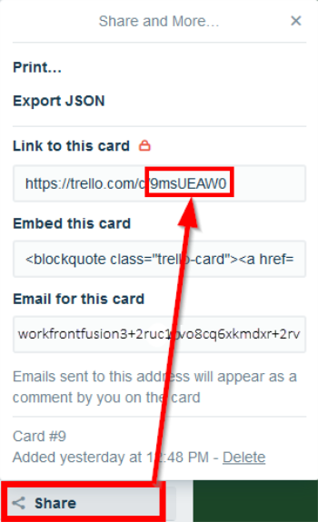

# [!UICONTROL 格子] 模組

在 [!DNL Adobe Workfront Fusion] 情境下，您可以自動化使用下列專案的工作流程： [!UICONTROL 格子]，以及將其連線到多個協力廠商應用程式和服務。

如果您需要建立案例的說明，請參閱 [在中建立情境 [!DNL Adobe Workfront Fusion]](../../workfront-fusion/scenarios/create-a-scenario.md).

如需模組的相關資訊，請參閱 [中的模組 [!DNL Adobe Workfront Fusion]](../../workfront-fusion/modules/modules.md).

## 存取需求

您必須具有下列存取權才能使用本文中的功能：

<table style="table-layout:auto"> 
 <col> 
 <col> 
 <tbody> 
  <tr> 
   <td role="rowheader">[!DNL Adobe Workfront] 計劃*</td>
  <td> 
[！UICONTROL Pro]或更高版本
 </td>
  </tr> 
  <tr data-mc-conditions=""> 
   <td role="rowheader">[!DNL Adobe Workfront] 授權*</td>
   <td> 
[！UICONTROL計畫]，[！UICONTROL工作]
 </td> 
  </tr> 
  <tr> 
   <td role="rowheader">[!DNL Adobe Workfront Fusion] 授權**</td> 
   <td>
   
目前授權需求：否 [!DNL Workfront Fusion] 授權需求。

   
或

   
舊版授權需求： [！UICONTROL [!DNL Workfront Fusion] 適用於工作自動化與整合] 

   </td> 
  </tr> 
  <tr> 
   <td role="rowheader">產品</td> 
   <td>
   
目前產品需求：如果您有[！UICONTROL Select]或[！UICONTROL Prime] [!DNL Adobe Workfront] 計畫，您的組織必須購買 [!DNL Adobe Workfront Fusion] 以及 [!DNL Adobe Workfront] 以使用本文所述功能。 [!DNL Workfront Fusion] 包含在[！UICONTROL Ultimate]中 [!DNL Workfront] 計畫。

   
或

   
舊版產品需求：貴組織必須購買 [!DNL Adobe Workfront Fusion] 以及 [!DNL Adobe Workfront] 以使用本文所述功能。

   </td> 
  </tr> 
 </tbody> 
</table>

若要瞭解您擁有哪些計畫、授權型別或存取權，請聯絡您的 [!DNL Workfront] 管理員。

有關以下專案的資訊： [!DNL Adobe Workfront Fusion] 授權，請參閱 [[!DNL Adobe Workfront Fusion] 授權](../../workfront-fusion/get-started/license-automation-vs-integration.md).

## 必要條件

使用 [!DNL Trello] 模組，您必須擁有 [!UICONTROL 格子] 帳戶。

## Connect [!UICONTROL 格子] 至 [!DNL Workfront Fusion]

如需有關連線您的電腦的指示， [!UICONTROL 格子] 帳戶至 [!DNL Workfront Fusion]，請參閱 [建立與的連線 [!DNL Adobe Workfront Fusion]  — 基本指示](../../workfront-fusion/connections/connect-to-fusion-general.md)

## [!UICONTROL 格子] 模組及其欄位

當您設定 [!UICONTROL 格子] 模組， [!DNL Workfront Fusion] 顯示下列欄位。 除了這些以外， [!UICONTROL 格子] 視您在應用程式或服務中的存取層級等因素而定，可能會顯示欄位。 模組中的粗體標題表示必填欄位。

如果您在欄位或函式上方看到對應按鈕，則可以使用它來設定該欄位的變數和函式。 如需詳細資訊，請參閱 [將資訊從一個模組對應至中的另一個模組 [!DNL Adobe Workfront Fusion]](../../workfront-fusion/mapping/map-information-between-modules.md).

* [展示板](#boards)
* [清單](#lists)
* [卡片](#cards)
* [成員](#members)
* [檢查清單](#checklists)
* [標籤](#labels)
* [評論](#comments)

### 展示板

+++ **[!UICONTROL 觀看面板]**

此觸發模組在新增展示板時開始一個情境。

<table style="table-layout:auto"> 
 <col> 
 <col> 
 <tbody> 
  <tr> 
   <td role="rowheader">[！UICONTROL連線] </td> 
   <td> 
如需有關將您的[！UICONTROL Trello]帳戶連線至的說明 [!DNL Workfront Fusion]，請參閱 <a href="../../workfront-fusion/connections/connect-to-fusion-general.md" class="MCXref xref" data-mc-variable-override="">建立與的連線 [!DNL Adobe Workfront Fusion]  — 基本指示</a>
 </td> 
  </tr> 
  <tr> 
   <td role="rowheader">[！UICONTROL限制] </td> 
   <td> 
主機板數目上限 [!DNL Workfront Fusion] 會在一個執行週期內傳回。
 </td> 
  </tr> 
 </tbody> 
</table>

+++

+++ **[!UICONTROL 建立展示板]**

此動作模組會使用選取的設定建立新展示板。

<table style="table-layout:auto"> 
 <col> 
 <col> 
 <tbody> 
  <tr> 
   <td role="rowheader">[！UICONTROL連線] </td> 
   <td> 
如需有關將您的[！UICONTROL Trello]帳戶連線至的說明 [!DNL Workfront Fusion]，請參閱 <a href="../../workfront-fusion/connections/connect-to-fusion-general.md" class="MCXref xref" data-mc-variable-override="">建立與的連線 [!DNL Adobe Workfront Fusion]  — 基本指示</a>
 </td> 
  </tr> 
  <tr> 
   <td role="rowheader">[！UICONTROL名稱] </td> 
   <td> 
輸入或對映新展示板的名稱。
 </td> 
  </tr> 
  <tr> 
   <td role="rowheader">[！UICONTROL說明]</td> 
   <td> 
視需要輸入或對應展示板說明。
 </td> 
  </tr> 
  <tr> 
   <td role="rowheader"> 
[！UICONTROL組織ID]
 </td> 
   <td> 
輸入或對映組織的ID。 組織ID可使用其他模組來擷取，例如觀看活動模組。
 
  
 </td> 
  </tr> 
  <tr> 
   <td role="rowheader"> 
[！UICONTROL許可權層級]
 </td> 
   <td> 
每個許可權層級中，看板都有不同的投票和註解規則。 例如：如果您的展示板是[！UICONTROL Private]，而您將投票和註解規則設為[！UICONTROL All]，則會收到錯誤。 
 
每個許可權層級的投票和註解僅限於下列群組：
 
    <ul> 
     <li><strong>[！UICONTROL Private]</strong>： —&gt;成員、成員和觀察者</li> 
     <li><strong>[！UICONTROL For Organization]</strong>： —&gt;成員、成員和觀察者、組織成員</li> 
     <li><strong>[！UICONTROL公用]</strong>： —&gt;成員、成員和觀察者、組織成員、全部</li> 
    </ul> </td> 
  </tr> 
  <tr> 
   <td role="rowheader"> 
[！UICONTROL Voting]
 </td> 
   <td> 
選取一個選項，以指定可在此展示板上投票的人。 如需許可權層級的投票限制，請參閱[！UICONTROL許可權層級]欄位。
 </td> 
  </tr> 
  <tr> 
   <td role="rowheader"> 
[！UICONTROL註解]
 </td> 
   <td> 
選取一個選項，以指定可以對此展示板的卡片進行註解的人。 如需評論許可權層級的限制，請參閱[！UICONTROL許可權層級]欄位。
 </td> 
  </tr> 
  <tr> 
   <td role="rowheader"> 
[！UICONTROL邀請]
 </td> 
   <td> 
選取可以邀請其他人加入此討論區的人員。
 </td> 
  </tr> 
  <tr> 
   <td role="rowheader"> 
[！UICONTROL自我聯結]
 </td> 
   <td> 
選取團隊成員可以自己加入討論區，還是必須邀請他們。
 </td> 
  </tr> 
  <tr> 
   <td role="rowheader"> 
[！UICONTROL預設標籤]
 </td> 
   <td> 
選取是否使用新展示板的預設標籤集。
 </td> 
  </tr> 
  <tr> 
   <td role="rowheader"> 
[！UICONTROL預設清單]
 </td> 
   <td> 
選擇是否將預設清單集新增到展示板（[！UICONTROL待辦事項]、[！UICONTROL正在辦事項]、[！UICONTROL已完成]）。
 </td> 
  </tr> 
  <tr> 
   <td role="rowheader"> 
[！UICONTROL主機板來源ID]
 </td> 
   <td> 
選取或對應您要複製到新展示板中的展示板ID。
 </td> 
  </tr> 
  <tr> 
   <td role="rowheader"> 
[！UICONTROL卡蓋]
 </td> 
   <td> 
選取 <strong>[！UICONTROL是]</strong> 如果您想要啟用主機板的卡蓋。
 </td> 
  </tr> 
  <tr> 
   <td role="rowheader"> 
[！UICONTROL背景]
 </td> 
   <td> 
選取背景或自訂背景的顏色。
 
注意：自訂背景僅適用於[！UICONTROL Trello Gold and Business Class]訂閱者。
 </td> 
  </tr> 
  <tr> 
   <td role="rowheader"> 
[！UICONTROL卡老化]
 </td> 
   <td> 
在兩種卡片老化模式之間選取。 
 
    <ul> 
     <li><strong>[！UICONTROL一般]</strong>：卡片隨著年齡增長而逐漸變透明。 </li> 
     <li><strong>[！UICONTROL海盜]</strong>：卡片隨著年齡增長，會像舊版海盜地圖一樣撕裂、黃色和裂開。</li> 
    </ul> </td> 
  </tr> 
 </tbody> 
</table>

+++

+++ **[!UICONTROL 編輯展示板]**

此動作模組會編輯現有展示板的設定。

<table style="table-layout:auto"> 
 <col> 
 <col> 
 <tbody> 
  <tr> 
   <td role="rowheader">[！UICONTROL連線] </td> 
   <td> 
如需有關將您的[！UICONTROL Trello]帳戶連線至的說明 [!DNL Workfront Fusion]，請參閱 <a href="../../workfront-fusion/connections/connect-to-fusion-general.md" class="MCXref xref" data-mc-variable-override="">建立與的連線 [!DNL Adobe Workfront Fusion]  — 基本指示</a>
 </td> 
  </tr> 
  <tr> 
   <td role="rowheader"> 
[！UICONTROL展示板ID]
 </td> 
   <td> 
輸入或對應您要模組建立之展示板的唯一[！UICONTROL Trello] ID。 您可以使用其他模組（例如「看板」模組）來擷取看板ID
 
  
 </td> 
  </tr> 
  <tr> 
   <td role="rowheader">[！UICONTROL新名稱]</td> 
   <td> 
 輸入或對映展示板的新名稱。
 </td> 
  </tr> 
  <tr> 
   <td role="rowheader">[！UICONTROL新說明]</td> 
   <td> 
 視需要輸入或對映新的展示板說明。
 </td> 
  </tr> 
  <tr> 
   <td role="rowheader"> 
[！UICONTROL組織ID]
 </td> 
   <td> 
輸入或對應您要模組編輯之展示板的唯一[！UICONTROL Trello] ID。 您可以使用其他模組來擷取主機板ID，例如 [!DNL Watch Activities] 模組。
 
  
 </td> 
  </tr> 
  <tr> 
   <td role="rowheader">[！UICONTROL訂閱] </td> 
   <td> 
選取一個選項，以指定代理使用者是否已訂閱展示板。
 </td> 
  </tr> 
  <tr> 
   <td role="rowheader"> 
[！UICONTROL許可權層級]
 </td> 
   <td> 
每個許可權層級中，看板都有不同的投票和註解規則。 例如：如果您的展示板是[！UICONTROL Private]，而您將投票和註解規則設為[！UICONTROL All]，則會收到錯誤。 
 
每個許可權層級的投票和註解僅限於下列群組：
 
    <ul> 
     <li><strong>[！UICONTROL Private]</strong>： —&gt;成員、成員和觀察者</li> 
     <li><strong>[！UICONTROL For Organization]</strong>： —&gt;成員、成員和觀察者、組織成員</li> 
     <li><strong>[！UICONTROL公用]</strong>： —&gt;成員、成員和觀察者、組織成員、全部</li> 
    </ul> </td> 
  </tr> 
  <tr> 
   <td role="rowheader"> 
[！UICONTROL Voting]
 </td> 
   <td> 
選取一個選項，以指定可在此展示板上投票的人。 如需許可權層級的投票限制，請參閱[！UICONTROL許可權層級]欄位。
 </td> 
  </tr> 
  <tr> 
   <td role="rowheader"> 
[！UICONTROL註解]
 </td> 
   <td> 
選取一個選項，以指定可以對此展示板的卡片進行註解的人。 如需評論許可權層級的限制，請參閱[！UICONTROL許可權層級]欄位。
 </td> 
  </tr> 
  <tr> 
   <td role="rowheader">[！UICONTROL邀請] </td> 
   <td> 
選取可以邀請人員加入此討論區的人員。
 </td> 
  </tr> 
  <tr> 
   <td role="rowheader">[！UICONTROL自我聯結]</td> 
   <td> 
 選取團隊成員可以自己加入討論區，還是必須邀請他們。
 </td> 
  </tr> 
  <tr> 
   <td role="rowheader">[！UICONTROL卡蓋]</td> 
   <td> 
 選取此主機板上是否應顯示卡片蓋。
 </td> 
  </tr> 
  <tr> 
   <td role="rowheader">[！UICONTROL背景] </td> 
   <td> 
選取背景或自訂背景的顏色。
 
注意：自訂背景僅適用於[！UICONTROL Trello Gold and Business Class]訂閱者。
 </td> 
  </tr> 
  <tr> 
   <td role="rowheader">[！UICONTROL背景ID]</td> 
   <td> 
 如果您已在[！UICONTROL Background]欄位中選取使用自訂背景，請輸入或對應您要使用的背景ID。
 </td> 
  </tr> 
  <tr> 
   <td role="rowheader"> 
[！UICONTROL卡老化]
 </td> 
   <td> 
在兩種卡片老化模式之間選取。 
 
    <ul> 
     <li><strong>[！UICONTROL一般]</strong>：卡片隨著年齡增長而逐漸變透明。 </li> 
     <li><strong>[！UICONTROL海盜]</strong>：卡片隨著年齡增長，會像舊版海盜地圖一樣撕裂、黃色和裂開。</li> 
    </ul> </td> 
  </tr> 
  <tr> 
   <td role="rowheader">[！UICONTROL日曆摘要已啟用]</td> 
   <td> 
 選取是否啟用行事曆摘要。
 </td> 
  </tr> 
  <tr> 
   <td role="rowheader">[！UICONTROL &lt;color&gt; 標簽名稱]</td> 
   <td> 
 為所要的顏色標籤指派名稱。
 </td> 
  </tr> 
  <tr> 
   <td role="rowheader">[！UICONTROL封存] </td> 
   <td> 
選取一個選項以指示是否要封存（關閉）展示板。 
 </td> 
  </tr> 
 </tbody> 
</table>

+++

+++ **[!UICONTROL 取得展示板]**

此動作模組會擷取展示板的詳細資料。

<table style="table-layout:auto"> 
 <col> 
 <col> 
 <tbody> 
  <tr> 
   <td role="rowheader">[！UICONTROL連線] </td> 
   <td> 
如需有關將您的[！UICONTROL Trello]帳戶連線至的說明 [!DNL Workfront Fusion]，請參閱 <a href="../../workfront-fusion/connections/connect-to-fusion-general.md" class="MCXref xref" data-mc-variable-override="">建立與的連線 [!DNL Adobe Workfront Fusion]  — 基本指示</a>
 </td> 
  </tr> 
  <tr> 
   <td role="rowheader"> 
[！UICONTROL展示板ID]
 </td> 
   <td> 
輸入或對應您要擷取相關資訊之展示板的ID。
 </td> 
  </tr> 
 </tbody> 
</table>

+++

+++ **[!DNL Search for Boards]**

此搜尋模組會擷取您指定之主機板的相關資訊。

<table style="table-layout:auto"> 
 <col> 
 <col> 
 <tbody> 
  <tr> 
   <td role="rowheader">[！UICONTROL連線] </td> 
   <td> 
如需有關將您的[！UICONTROL Trello]帳戶連線至的說明 [!DNL Workfront Fusion]，請參閱 <a href="../../workfront-fusion/connections/connect-to-fusion-general.md" class="MCXref xref" data-mc-variable-override="">建立與的連線 [!DNL Adobe Workfront Fusion]  — 基本指示</a>
 </td> 
  </tr> 
  <tr> 
   <td role="rowheader">[！UICONTROL查詢] </td> 
   <td> 
輸入或對應您要取得相關資訊之展示板的名稱（或名稱的一部分）。
 </td> 
  </tr> 
  <tr> 
   <td role="rowheader">[！UICONTROL傳回展示板的最大數量]</td> 
   <td> 
 輸入展示板的最大數量 [!DNL Workfront Fusion] 會在一個執行週期內傳回。 此值必須小於或等於1000。
  </td> 
  </tr> 
  <tr> 
   <td role="rowheader"> 
[！UICONTROL部分] 
 </td> 
   <td> 
依預設，此模組會搜尋成員內容，以尋找與查詢中每個字詞完全相符的內容。 啟用[！UICONTROL Partial]時，模組會尋找以查詢中任何字詞開頭的內容。
 
 例如，如果您使用「開發」一詞來尋找標題為「我的開發狀態報告」的展示板，依預設，您需要搜尋整個單詞。 如果您已啟用[！UICONTROL Partial]，則可以搜尋「dev」而非「velopment」。
 </td> 
  </tr> 
  <tr> 
   <td role="rowheader">[！UICONTROL展示板] </td> 
   <td> 
輸入「我的」，或對應以逗號分隔的展示板ID清單。
 </td> 
  </tr> 
 </tbody> 
</table>

+++

+++ **[!UICONTROL 封存或取消封存展示板]**

此動作模組會關閉或重新開啟您指定的展示板。

<table style="table-layout:auto"> 
 <col> 
 <col> 
 <tbody> 
  <tr> 
   <td role="rowheader">[！UICONTROL連線] </td> 
   <td> 
如需有關將您的[！UICONTROL Trello]帳戶連線至的說明 [!DNL Workfront Fusion]，請參閱 <a href="../../workfront-fusion/connections/connect-to-fusion-general.md" class="MCXref xref" data-mc-variable-override="">建立與的連線 [!DNL Adobe Workfront Fusion]  — 基本指示</a>
 </td> 
  </tr> 
  <tr> 
   <td role="rowheader">[！UICONTROL展示板ID]</td> 
   <td> 
 輸入或對應您要關閉或重新開啟之展示板的ID。
 </td> 
  </tr> 
  <tr> 
   <td role="rowheader">[！UICONTROL封存或取消封存]</td> 
   <td> 
 選取您要關閉（封存）或重新開啟（取消封存）展示板。
 </td> 
  </tr> 
 </tbody> 
</table>

+++

+++ **[!UICONTROL 指派成員給討論區]**

此動作模組會將成員指派給您指定的展示板。

<table style="table-layout:auto"> 
 <col> 
 <col> 
 <tbody> 
  <tr> 
   <td role="rowheader">[！UICONTROL連線] </td> 
   <td> 
如需有關將您的[！UICONTROL Trello]帳戶連線至的說明 [!DNL Workfront Fusion]，請參閱 <a href="../../workfront-fusion/connections/connect-to-fusion-general.md" class="MCXref xref" data-mc-variable-override="">建立與的連線 [!DNL Adobe Workfront Fusion]  — 基本指示</a>
 </td> 
  </tr> 
  <tr> 
   <td role="rowheader">[！UICONTROL展示板ID]</td> 
   <td> 
 選取您要新增成員的展示板。
 </td> 
  </tr> 
  <tr> 
   <td role="rowheader">[！UICONTROL電子郵件地址]</td> 
   <td> 
 輸入或對應您要新增至討論區的成員電子郵件地址。
 </td> 
  </tr> 
  <tr> 
   <td role="rowheader"> 
[！UICONTROL成員型別]
 </td> 
   <td> 
選取要新增至展示板的成員型別。
 
    <ul> 
     <li><strong>[！UICONTROL管理員]</strong>：主機板管理員可以在主機板上執行任何主機板動作。</li> 
     <li><strong>[！UICONTROL標準]</strong>：一般成員只是討論區的成員。</li> 
     <li><strong>[！UICONTROL觀察者]</strong>：觀察者是指對展示板具有唯讀存取許可權的成員。  觀察者僅適用於具有[！UICONTROL Trello Business Class]的團隊。</li> 
    </ul> </td> 
  </tr> 
  <tr> 
   <td role="rowheader">[！UICONTROL全名]</td> 
   <td> 
 輸入要新增至展示板的使用者全名。
 </td> 
  </tr> 
 </tbody> 
</table>

+++

+++ **[!UICONTROL 從展示板取消指派成員]**

此動作模組會從展示板移除成員。

<table style="table-layout:auto"> 
 <col> 
 <col> 
 <tbody> 
  <tr> 
   <td role="rowheader">[！UICONTROL連線] </td> 
   <td> 
如需有關將您的[！UICONTROL Trello]帳戶連線至的說明 [!DNL Workfront Fusion]，請參閱 <a href="../../workfront-fusion/connections/connect-to-fusion-general.md" class="MCXref xref" data-mc-variable-override="">建立與的連線 [!DNL Adobe Workfront Fusion]  — 基本指示</a>
 </td> 
  </tr> 
  <tr> 
   <td role="rowheader">[！UICONTROL展示板ID]</td> 
   <td> 
 輸入（對應或選取）您要從中移除使用者的展示板識別碼。
 </td> 
  </tr> 
  <tr> 
   <td role="rowheader">[！UICONTROL成員] </td> 
   <td> 
選取要從展示板移除的成員。
 </td> 
  </tr> 
 </tbody> 
</table>

+++

### 清單

+++ **[!UICONTROL 觀看卡片移至清單]**

當卡片移至特定清單時，此觸發模組就會啟動。

<table style="table-layout:auto"> 
 <col> 
 <col> 
 <tbody> 
  <tr> 
   <td role="rowheader">[！UICONTROL連線] </td> 
   <td> 
如需有關將您的[！UICONTROL Trello]帳戶連線至的說明 [!DNL Workfront Fusion]，請參閱 <a href="../../workfront-fusion/connections/connect-to-fusion-general.md" class="MCXref xref" data-mc-variable-override="">建立與的連線 [!DNL Adobe Workfront Fusion]  — 基本指示</a>
 </td> 
  </tr> 
  <tr> 
   <td role="rowheader">[！UICONTROL Board]</td> 
   <td>選取包含您要觀看卡片清單的展示板。</td> 
  </tr> 
  <tr> 
   <td role="rowheader">[！UICONTROL清單]</td> 
   <td>選取您要觀看卡片的清單。</td> 
  </tr> 
  <tr> 
   <td role="rowheader">[！UICONTROL限制] </td> 
   <td> 
卡片數量上限 [!DNL Workfront Fusion] 會在一個執行週期內傳回。
  </td> 
  </tr> 
 </tbody> 
</table>

+++

+++ **[!UICONTROL 建立清單]**

此動作模組會在您指定的展示板上建立清單。

<table style="table-layout:auto"> 
 <col> 
 <col> 
 <tbody> 
  <tr> 
   <td role="rowheader">[！UICONTROL連線] </td> 
   <td> 
如需有關將您的[！UICONTROL Trello]帳戶連線至的說明 [!DNL Workfront Fusion]，請參閱 <a href="../../workfront-fusion/connections/connect-to-fusion-general.md" class="MCXref xref" data-mc-variable-override="">建立與的連線 [!DNL Adobe Workfront Fusion]  — 基本指示</a>
 </td> 
  </tr> 
  <tr> 
   <td role="rowheader">[！UICONTROL展示板ID]</td> 
   <td> 
 輸入或對應您要建立清單之展示板的ID。
 </td> 
  </tr> 
  <tr> 
   <td role="rowheader">[！UICONTROL名稱] </td> 
   <td> 
輸入或對應新清單的名稱。
 </td> 
  </tr> 
  <tr> 
   <td role="rowheader">[！UICONTROL位置] </td> 
   <td> 
選取您要將清單新增至頂端或附加至卡片底部。
 </td> 
  </tr> 
  <tr> 
   <td role="rowheader">[！UICONTROL複製清單]</td> 
   <td> 
 選取要如何輸入要複製的清單ID。
 
    <ul> 
     <li> 
<strong>手動輸入</strong> 
 
在 <strong>[！UICONTROL清單ID]</strong> 欄位，輸入或對應您要複製的清單ID。 
 </li> 
     <li> 
<strong>選取</strong> 
 
選取包含要複製清單的展示板，然後選取清單。
 </li> 
    </ul> </td> 
  </tr> 
 </tbody> 
</table>

+++

+++ **[!UICONTROL 編輯清單]**

此動作模組會編輯現有清單。

<table style="table-layout:auto"> 
 <col> 
 <col> 
 <tbody> 
  <tr> 
   <td role="rowheader">[！UICONTROL連線] </td> 
   <td> 
如需有關將您的[！UICONTROL Trello]帳戶連線至的說明 [!DNL Workfront Fusion]，請參閱 <a href="../../workfront-fusion/connections/connect-to-fusion-general.md" class="MCXref xref" data-mc-variable-override="">建立與的連線 [!DNL Adobe Workfront Fusion]  — 基本指示</a>
 </td> 
  </tr> 
  <tr> 
   <td role="rowheader">[！UICONTROL清單ID]</td> 
   <td> 
 輸入或對應您要更新的清單ID。
 </td> 
  </tr> 
  <tr> 
   <td role="rowheader">[！UICONTROL名稱] </td> 
   <td> 
輸入或對映清單的新名稱。
 </td> 
  </tr> 
  <tr> 
   <td role="rowheader">[！UICONTROL展示板ID]</td> 
   <td> 
 對應或選取您要移動清單的展示板。
 </td> 
  </tr> 
  <tr> 
   <td role="rowheader">[！UICONTROL位置] </td> 
   <td> 
選取您要將清單新增至頂端或附加至卡片底部。
 </td> 
  </tr> 
  <tr> 
   <td role="rowheader">[！UICONTROL已訂閱]</td> 
   <td> 
如果您想要將作用中成員訂閱至清單，請啟用此選項。
 </td> 
  </tr> 
 </tbody> 
</table>

+++

+++ **[!UICONTROL 取得清單]**

此動作模組會擷取特定清單的詳細資訊。

<table style="table-layout:auto"> 
 <col> 
 <col> 
 <tbody> 
  <tr> 
   <td role="rowheader">[！UICONTROL連線] </td> 
   <td> 
如需有關將您的[！UICONTROL Trello]帳戶連線至的說明 [!DNL Workfront Fusion]，請參閱 <a href="../../workfront-fusion/connections/connect-to-fusion-general.md" class="MCXref xref" data-mc-variable-override="">建立與的連線 [!DNL Adobe Workfront Fusion]  — 基本指示</a>
 </td> 
  </tr> 
  <tr> 
   <td role="rowheader"> 
[！UICONTROL清單ID]
 </td> 
   <td> 
輸入或對應您要擷取相關資訊之清單的ID。
 </td> 
  </tr> 
 </tbody> 
</table>

+++

### 卡片

+++ **[!UICONTROL 觀看卡片]**

此觸發模組在新增卡片時啟動。

<table style="table-layout:auto"> 
 <col> 
 <col> 
 <tbody> 
  <tr> 
   <td role="rowheader">[！UICONTROL連線] </td> 
   <td> 
如需有關將您的[！UICONTROL Trello]帳戶連線至的說明 [!DNL Workfront Fusion]，請參閱 <a href="../../workfront-fusion/connections/connect-to-fusion-general.md" class="MCXref xref" data-mc-variable-override="">建立與的連線 [!DNL Adobe Workfront Fusion]  — 基本指示</a>
 </td> 
  </tr> 
  <tr> 
   <td role="rowheader">[！UICONTROL Watched物件]</td> 
   <td> 
選取您要觀看卡片的位置。
 
    <ul> 
     <li><strong>[！UICONTROL所有卡片]</strong> </li> 
     <li> 
<strong>特定主機板上的卡片</strong> 
 
選取您要觀看卡片的展示板
 </li> 
     <li> 
<strong>特定清單上的[！UICONTROL卡片]</strong> 
 
選取包含您要觀看卡片清單的展示板，然後選取清單。
 </li> 
    </ul> </td> 
  </tr> 
  <tr> 
   <td role="rowheader">[！UICONTROL限制] </td> 
   <td> 
卡片數量上限 [!DNL Workfront Fusion] 會在一個執行週期內傳回。
 </td> 
  </tr> 
 </tbody> 
</table>

+++

+++ **[!UICONTROL 建立卡片]**

此動作模組會在選取的清單中建立卡片。

<table style="table-layout:auto"> 
 <col> 
 <col> 
 <tbody> 
  <tr> 
   <td role="rowheader">[！UICONTROL連線] </td> 
   <td> 
如需有關將您的[！UICONTROL Trello]帳戶連線至的說明 [!DNL Workfront Fusion]，請參閱 <a href="../../workfront-fusion/connections/connect-to-fusion-general.md" class="MCXref xref" data-mc-variable-override="">建立與的連線 [!DNL Adobe Workfront Fusion]  — 基本指示</a>
 </td> 
  </tr> 
  <tr> 
   <td role="rowheader">[！UICONTROL輸入清單ID]</td> 
   <td> 
 選取要如何輸入您要新增卡片之清單的ID。
 
    <ul> 
     <li> 
<strong>[！UICONTROL手動輸入]</strong> 
 
在 <strong>[！UICONTROL清單ID]</strong> 欄位，輸入或對應您要新增卡片之清單的ID。 
 </li> 
     <li> 
<strong>[！UICONTROL選取]</strong> 
 
選取包含要複製清單的展示板，然後選取清單。
 </li> 
    </ul> </td> 
  </tr> 
  <tr> 
   <td role="rowheader">[！UICONTROL標籤] </td> 
   <td> 
針對您要新增至卡片的每個標籤，輸入標籤的ID。 例如，可以使用[！UICONTROL Retrieve Labels]模組擷取ID。
 </td> 
  </tr> 
  <tr> 
   <td role="rowheader">[！UICONTROL成員]</td> 
   <td>針對您想要新增至卡片的每個成員，輸入成員的ID。 </td> 
  </tr> 
  <tr> 
   <td role="rowheader">[！UICONTROL名稱] </td> 
   <td> 
輸入新卡片的名稱。
 </td> 
  </tr> 
  <tr> 
   <td role="rowheader"> 
[！UICONTROL說明]
 </td> 
   <td> 
輸入卡片的說明。
 </td> 
  </tr> 
  <tr> 
   <td role="rowheader">[！UICONTROL位置] </td> 
   <td> 
選取您要將卡片新增到清單頂端，還是要將[！UICONTROL append]卡片新增到清單底部。
 </td> 
  </tr> 
  <tr> 
   <td role="rowheader">[！UICONTROL到期日]</td> 
   <td> 
 輸入卡片的到期日。 如需支援的日期和時間格式清單，請參閱 <a href="../../workfront-fusion/mapping/type-coercion.md" class="MCXref xref">輸入強制 [!DNL Adobe Workfront Fusion]</a>.
 </td> 
  </tr> 
  <tr> 
   <td role="rowheader">[！UICONTROL到期完成]</td> 
   <td> 
 啟用此選項以在到期日標籤卡片完成。
 </td> 
  </tr> 
  <tr> 
   <td role="rowheader">[！UICONTROL檔案URL]</td> 
   <td> 
輸入或對應您要新增為卡片附件的檔案URL。
 </td> 
  </tr> 
  <tr> 
   <td role="rowheader"> 
[！UICONTROL來源檔案]
 </td> 
   <td> 
輸入或對應您要新增為卡片附件的檔案資訊。
 
    <ul> 
     <li>[！UICONTROL檔案名稱]：輸入或對應檔案名稱，包括副檔名。</li> 
     <li> 
     
從先前的模組中選取檔案，或對應檔案名稱和資料
 
     
注意：每個附件有10 MB的檔案上傳限制。 但是，[！UICONTROL Business Class]和[！UICONTROL Trello Gold]成員每個附件的檔案上傳限製為250 MB。
 
     </li> 
    </ul> </td> 
  </tr> 
  <tr> 
   <td role="rowheader">[！UICONTROL複製卡]</td> 
   <td> 
 選取您要如何輸入要複製之卡片的ID。
 
    <ul> 
     <li> 
<strong>[！UICONTROL手動輸入]</strong> 
 
在 <strong>[！UICONTROL卡片ID]</strong> 欄位，輸入或對應您要複製的卡片ID。 
 </li> 
     <li> 
<strong>[！UICONTROL選取]</strong> 
 
選取包含您要複製之卡片的展示板，然後選取包含卡片的清單，再選取卡片。
 </li> 
    </ul> </td> 
  </tr> 
 </tbody> 
</table>

+++

+++ **[!UICONTROL 編輯卡片]**

此動作模組會編輯現有卡片。

<table style="table-layout:auto"> 
 <col> 
 <col> 
 <tbody> 
  <tr> 
   <td role="rowheader">[！UICONTROL連線] </td> 
   <td> 
如需有關將您的[！UICONTROL Trello]帳戶連線至的說明 [!DNL Workfront Fusion]，請參閱 <a href="../../workfront-fusion/connections/connect-to-fusion-general.md" class="MCXref xref" data-mc-variable-override="">建立與的連線 [!DNL Adobe Workfront Fusion]  — 基本指示</a>
 </td> 
  </tr> 
  <tr> 
   <td role="rowheader">[！UICONTROL輸入卡片ID]</td> 
   <td> 
 選取您要如何輸入您要編輯的卡片ID。
 
    <ul> 
     <li> 
<strong>[！UICONTROL手動輸入]</strong> 
 
在 <strong>[！UICONTROL卡片ID]</strong> 欄位，輸入或對應您要編輯的卡片ID。 
 </li> 
     <li> 
<strong>[！UICONTROL選取]</strong> 
 
選取包含您要編輯的卡片的展示板，然後選取包含卡片的清單，再選取卡片。
 </li> 
    </ul> </td> 
  </tr> 
  <tr> 
   <td role="rowheader">[！UICONTROL新名稱]</td> 
   <td> 
輸入或對映卡片的新名稱。
 </td> 
  </tr> 
  <tr> 
   <td role="rowheader"> 
[！UICONTROL新說明]
 </td> 
   <td> 
輸入或對映卡片的新說明。
 </td> 
  </tr> 
  <tr> 
   <td role="rowheader"> 
[！UICONTROL移動卡片]
 </td> 
   <td> 
選取展示板或展示板，並列出您要移動卡片的位置。
 </td> 
  </tr> 
  <tr> 
   <td role="rowheader">[！UICONTROL標籤] </td> 
   <td> 
新增您要新增至卡片的任何標籤ID。 
 </td> 
  </tr> 
  <tr> 
   <td role="rowheader">[！UICONTROL位置] </td> 
   <td> 
選取您要將卡片新增到清單頂端，還是要將[！UICONTROL append]卡片新增到清單底部。
 </td> 
  </tr> 
  <tr> 
   <td role="rowheader">[！UICONTROL到期日]</td> 
   <td> 
 輸入卡片的到期日。 如需支援的日期和時間格式清單，請參閱 <a href="../../workfront-fusion/mapping/type-coercion.md" class="MCXref xref">輸入強制 [!DNL Adobe Workfront Fusion]</a>.
 </td> 
  </tr> 
  <tr> 
   <td role="rowheader">[！UICONTROL到期完成]</td> 
   <td> 
 如果已啟用此選項，卡片會在到期日被標示為完成。
 </td> 
  </tr> 
  <tr> 
   <td role="rowheader">[！UICONTROL成員] </td> 
   <td> 
新增或對應您要新增至卡片的任何成員ID。
 </td> 
  </tr> 
  <tr> 
   <td role="rowheader"> 
[！UICONTROL附件封面識別碼]
 </td> 
   <td> 
輸入或對應您要卡片用作封面的影像附件ID。
 </td> 
  </tr> 
  <tr> 
   <td role="rowheader">[！UICONTROL訂閱] </td> 
   <td> 
選取是否應訂閱會員卡片。
 </td> 
  </tr> 
  <tr> 
   <td role="rowheader">[！UICONTROL封存] </td> 
   <td> 
選取選項以指出是否要封存（關閉）卡片。 
 </td> 
  </tr> 
 </tbody> 
</table>

+++

+++ **[!UICONTROL 取得卡片]**

此動作模組會擷取所選卡片的詳細資料。

<table style="table-layout:auto"> 
 <col> 
 <col> 
 <tbody> 
  <tr> 
   <td role="rowheader">[！UICONTROL連線] </td> 
   <td> 
如需有關將您的[！UICONTROL Trello]帳戶連線至的說明 [!DNL Workfront Fusion]，請參閱 <a href="../../workfront-fusion/connections/connect-to-fusion-general.md" class="MCXref xref" data-mc-variable-override="">建立與的連線 [!DNL Adobe Workfront Fusion]  — 基本指示</a>
 </td> 
  </tr> 
  <tr> 
   <td role="rowheader">[！UICONTROL展示板ID]</td> 
   <td> 
輸入包含您要擷取詳細資訊之卡片的主機板ID。 這可讓您檢視展示板的自訂欄位名稱。
 </td> 
  </tr> 
  <tr> 
   <td role="rowheader">[！UICONTROL輸入卡片ID]</td> 
   <td> 
 選取您要如何輸入要擷取詳細資訊的卡片ID。
 
    <ul> 
     <li> 
<strong>[！UICONTROL手動輸入]</strong> 
 
在 <strong>[！UICONTROL卡片ID]</strong> 欄位中，輸入或對應您要擷取詳細資訊之卡片的ID。 
 </li> 
     <li> 
<strong>[！UICONTROL選取]</strong> 
 
選取包含您要擷取詳細資訊之卡片的展示板，然後選取包含卡片的清單，然後選取卡片。
 </li> 
    </ul> </td> 
  </tr> 
 </tbody> 
</table>

+++

+++ **[!UICONTROL 搜尋卡片]**

此動作模組會傳回符合搜尋查詢的卡片。

<table style="table-layout:auto"> 
 <col> 
 <col> 
 <tbody> 
  <tr> 
   <td role="rowheader">[！UICONTROL連線] </td> 
   <td> 
如需有關將您的[！UICONTROL Trello]帳戶連線至的說明 [!DNL Workfront Fusion]，請參閱 <a href="../../workfront-fusion/connections/connect-to-fusion-general.md" class="MCXref xref" data-mc-variable-override="">建立與的連線 [!DNL Adobe Workfront Fusion]  — 基本指示</a>
 </td> 
  </tr> 
  <tr> 
   <td role="rowheader">[！UICONTROL Board] </td> 
   <td> 
選取您要搜尋的面板。 如果未選取面板，則會搜尋所有面板。
 </td> 
  </tr> 
  <tr> 
   <td role="rowheader"> 
[！UICONTROL查詢]
 </td> 
   <td> 
輸入搜尋查詢。 您可以使用下列搜尋運運算元來縮小搜尋範圍：
 
    <ul> 
     <li><code><strong>-operator</strong></code> 
您可以將「 — 」新增到任何運運算元以進行負數搜尋，例如 <code>[!UICONTROL -has:members]</code> 以搜尋未指派任何成員的卡片。
 </li> 
     <li><code><strong>@name</strong></code> 
傳回指派給成員的卡片。 您也可以使用 <code>member:</code>. 使用 <code>@me</code> 以僅包含您的卡片。
 </li> 
     <li><code><strong>#label</strong></code> 
傳回已標籤的卡片。 您也可以使用 <code>label:</code>. 例如， <code>label:"FIX IT"</code> 將傳回標籤為「FIX IT」的卡片。
 </li> 
     <li><code><strong>board:id</strong></code> 
傳回特定展示板中的卡片。 例如， <code>board:Trello</code> 會傳回展示板名稱中有[！UICONTROL Trello]的展示板上的卡片。
 </li> 
     <li><code><strong>list:name</strong></code> 
傳回清單中名為「name」的卡片。
 </li> 
     <li><code><strong>has:attachments</strong></code> 
傳回含附件的卡片。 此 <code>has</code>：運運算元也可以與其他屬性搭配使用，例如 <code>has:description</code>， <code>has:cover</code>， <code>has:members</code>，或 <code>has:stickers</code>.
 </li> 
     <li><code><strong>due:day</strong></code> 
傳回24小時內到期的卡片。 此 <code>due:</code> 運運算元也可以搭配其他時間範圍使用，例如 <code>due:week</code>， <code>due:month</code>，或 <code>due:overdue</code>. 您也可以搜尋特定的日期範圍。 例如，新增 <code>due:14</code> 搜尋包含未來14天到期的卡片。
 </li> 
     <li><code><strong>created:day</strong></code> 
傳回過去24小時內建立的卡片。 此<code> created:</code> 運運算元也可以搭配其他時間範圍使用，例如 <code>created:week</code> 或 <code>created:month</code>. 您也可以搜尋特定的日期範圍。 例如，新增 <code>created:14</code> 至搜尋，則包含過去14天內建立的資訊卡。
 </li> 
     <li><code><strong>edited:day</strong></code> 
傳回過去24小時內編輯的卡片。 此 <code>edited:</code> 運運算元也可以搭配其他時間範圍使用，例如 <code>edited:week</code> 或 <code>edited:month</code>. 您也可以搜尋特定的日期範圍。 例如，新增 <code>edited:21</code> 至搜尋包含過去21天編輯的卡片。
 </li> 
     <li><code><strong>description:</strong>, <strong>checklist:</strong>, <strong>comment:</strong>, and <strong>name:</strong></code> 
傳回符合卡片說明、檢查清單、註解或名稱文字的卡片。 例如，評論：「FIX IT」將在評論中傳回帶有「FIX IT」的卡片。
 </li> 
     <li><code><strong>is:open</strong> and <strong>is:archived</strong></code> 
傳回已開啟或封存的卡片。 如果未指定，則[！UICONTROL Trello]會傳回這兩種型別。
 </li> 
     <li><code><strong>is:starred</strong> </code> 
僅包含星級主機板上的卡片。
 </li> 
    </ul> </td> 
  </tr> 
  <tr> 
   <td role="rowheader">[！UICONTROL傳回卡片的最大數量]</td> 
   <td> 
 卡片數量上限 [!DNL Workfront Fusion] 會在一個執行週期內傳回。 此值必須小於或等於1000。
 </td> 
  </tr> 
  <tr> 
   <td role="rowheader">[！UICONTROL部分] </td> 
   <td> 
依預設，此模組會搜尋成員內容，以尋找與查詢中每個字詞完全相符的內容。 啟用[！UICONTROL Partial]時，模組會尋找以查詢中任何字詞開頭的內容。
 
 例如，如果您使用「開發」一詞來尋找標題為「我的開發狀態報告」的展示板，依預設，您需要搜尋整個單詞。 如果您已啟用[！UICONTROL Partial]，則可以搜尋「dev」而非「velopment」。
 </td> 
  </tr> 
  <tr> 
   <td role="rowheader">[！UICONTROL卡片] </td> 
   <td> 
新增您要特別搜尋的任何卡片。
 </td> 
  </tr> 
 </tbody> 
</table>

+++

+++ **[!UICONTROL 封存或取消封存卡片]**

此動作模組會封存卡片或將卡片傳回展示板。

<table style="table-layout:auto"> 
 <col> 
 <col> 
 <tbody> 
  <tr> 
   <td role="rowheader">[！UICONTROL連線] </td> 
   <td> 
如需有關將您的[！UICONTROL Trello]帳戶連線至的說明 [!DNL Workfront Fusion]，請參閱 <a href="../../workfront-fusion/connections/connect-to-fusion-general.md" class="MCXref xref" data-mc-variable-override="">建立與的連線 [!DNL Adobe Workfront Fusion]  — 基本指示</a>
 </td> 
  </tr> 
  <tr> 
   <td role="rowheader">[！UICONTROL卡片ID]</td> 
   <td> 
 輸入或對應您要封存或傳回展示板的卡片ID。
 </td> 
  </tr> 
  <tr> 
   <td role="rowheader">[！UICONTROL封存或取消封存]</td> 
   <td> 
 選取您要關閉卡片（封存）還是將其傳回展示板（取消封存）。
 </td> 
  </tr> 
 </tbody> 
</table>

+++

+++ **[!UICONTROL 新增附件]**

此動作模組會將附件新增至選取的卡片。

<table style="table-layout:auto"> 
 <col> 
 <col> 
 <tbody> 
  <tr> 
   <td role="rowheader">[！UICONTROL連線] </td> 
   <td> 
如需有關將您的[！UICONTROL Trello]帳戶連線至的說明 [!DNL Workfront Fusion]，請參閱 <a href="../../workfront-fusion/connections/connect-to-fusion-general.md" class="MCXref xref" data-mc-variable-override="">建立與的連線 [!DNL Adobe Workfront Fusion]  — 基本指示</a>
 </td> 
  </tr> 
  <tr> 
   <td role="rowheader">[！UICONTROL輸入卡片ID]</td> 
   <td> 
 選取您要如何輸入要擷取詳細資訊的卡片ID。
 
    <ul> 
     <li> 
<strong>手動輸入</strong> 
 
在 <strong>[！UICONTROL卡片ID]</strong> 欄位中，輸入或對應您要擷取詳細資訊之卡片的ID。 
 </li> 
     <li> 
<strong>[！UICONTROL選取]</strong> 
 
選取包含您要擷取詳細資訊之卡片的展示板，然後選取包含卡片的清單，然後選取卡片。
 </li> 
    </ul> </td> 
  </tr> 
  <tr> 
   <td role="rowheader"> 
[！UICONTROL附件型別]
 </td> 
   <td> 
選取您要直接上傳檔案，或提供檔案的URL。
 
    <ul> 
     <li> 
<strong>[！UICONTROL檔案]</strong> 
 
從先前的模組中選取來源檔案，或對應來源檔案的名稱和資料。
 </li> 
     <li> 
<strong>[！UICONTROL URL]</strong> 
 
輸入檔案的URL，並提供附件的名稱。
 </li> 
    </ul> </td> 
  </tr> 
 </tbody> 
</table>

+++

### 成員

+++ **[!UICONTROL 指派成員給討論區]**

請參閱「[!UICONTROL 指派成員給討論區]「，在 [展示板](#boards).

+++

+++ **[!UICONTROL 從展示板取消指派成員]**

請參閱「[!UICONTROL 從展示板取消指派成員]「，在 [展示板](#boards).

+++

+++ **[!UICONTROL 新增成員至卡片]**

此動作模組會將指定的成員新增至指定的卡片。

<table style="table-layout:auto"> 
 <col> 
 <col> 
 <tbody> 
  <tr> 
   <td role="rowheader">[！UICONTROL連線] </td> 
   <td> 
如需有關將您的[！UICONTROL Trello]帳戶連線至的說明 [!DNL Workfront Fusion]，請參閱 <a href="../../workfront-fusion/connections/connect-to-fusion-general.md" class="MCXref xref" data-mc-variable-override="">建立與的連線 [!DNL Adobe Workfront Fusion]  — 基本指示</a>
 </td> 
  </tr> 
  <tr> 
   <td role="rowheader"> 
[！UICONTROL輸入卡片ID和成員ID]
 </td> 
   <td> 
選擇您要如何輸入卡片ID和成員ID。
 
    <ul> 
     <li> 
<strong>[！UICONTROL手動輸入]</strong> 
 
輸入或對應 <strong>[！UICONTROL卡片ID]</strong> 和 <strong>[！UICONTROL成員ID]</strong>.
 </li> 
     <li> 
<strong>[！UICONTROL選取]</strong> 
 
選取包含您要新增成員的卡片的展示板，然後選取包含卡片的清單、卡片本身以及您要新增至卡片的成員。
 </li> 
    </ul> </td> 
  </tr> 
 </tbody> 
</table>

+++

+++ **[!UICONTROL 搜尋成員]**

此動作模組會擷取以下資訊： [!UICONTROL 格子] 成員。

<table style="table-layout:auto"> 
 <col> 
 <col> 
 <tbody> 
  <tr> 
   <td role="rowheader">[！UICONTROL連線] </td> 
   <td> 
如需有關將您的[！UICONTROL Trello]帳戶連線至的說明 [!DNL Workfront Fusion]，請參閱 <a href="../../workfront-fusion/connections/connect-to-fusion-general.md" class="MCXref xref" data-mc-variable-override="">建立與的連線 [!DNL Adobe Workfront Fusion]  — 基本指示</a>
 </td> 
  </tr> 
  <tr> 
   <td role="rowheader">[！UICONTROL查詢] </td> 
   <td> 
輸入您要尋找之使用者的全名或使用者名稱。
 </td> 
  </tr> 
  <tr> 
   <td role="rowheader">[！UICONTROL部分] </td> 
   <td> 
依預設，此模組會搜尋成員內容，以尋找與查詢中每個字詞完全相符的內容。 啟用[！UICONTROL Partial]時，模組會尋找以查詢中任何字詞開頭的內容。
 
 例如，如果您使用「開發」一詞來尋找標題為「我的開發狀態報告」的展示板，依預設，您需要搜尋整個單詞。 如果您已啟用[！UICONTROL Partial]，則可以搜尋「dev」而非「velopment」。
 </td> 
  </tr> 
  <tr> 
   <td role="rowheader">[！UICONTROL傳回成員的最大數目]</td> 
   <td> 
 成員數目上限 [!DNL Workfront Fusion] 會在一個執行週期內傳回。
 </td> 
  </tr> 
 </tbody> 
</table>

+++

### 檢查清單

+++ **[!UICONTROL 建立檢查清單]**

此動作模組會在選取的卡片上建立檢查清單。

<table style="table-layout:auto"> 
 <col> 
 <col> 
 <tbody> 
  <tr> 
   <td role="rowheader">[！UICONTROL連線] </td> 
   <td> 
如需有關將您的[！UICONTROL Trello]帳戶連線至的說明 [!DNL Workfront Fusion]，請參閱 <a href="../../workfront-fusion/connections/connect-to-fusion-general.md" class="MCXref xref" data-mc-variable-override="">建立與的連線 [!DNL Adobe Workfront Fusion]  — 基本指示</a>
 </td> 
  </tr> 
  <tr> 
   <td role="rowheader">[！UICONTROL輸入卡片ID]</td> 
   <td> 
 選取您要如何輸入要新增檢查清單的卡片ID。
 
    <ul> 
     <li> 
<strong>[！UICONTROL手動輸入]</strong> 
 
在 <strong>[！UICONTROL卡片ID]</strong> 欄位，輸入或對應您要新增檢查清單的卡片ID。 
 </li> 
     <li> 
<strong>[！UICONTROL選取]</strong> 
 
選取包含您要新增檢查清單之卡片的主機板，然後選取包含卡片的清單，然後選取卡片。
 </li> 
    </ul> </td> 
  </tr> 
  <tr> 
   <td role="rowheader">[！UICONTROL名稱] </td> 
   <td> 
輸入或對映檢查清單的名稱。
 </td> 
  </tr> 
  <tr> 
   <td role="rowheader">[！UICONTROL位置] </td> 
   <td> 
選擇您要將檢查清單新增到卡片頂端，還是要將[！UICONTROL]檢查清單附加至卡片底部。
 </td> 
  </tr> 
  <tr> 
   <td role="rowheader"> 
[！UICONTROL輸入檢查清單ID]
 </td> 
   <td> 
輸入或對應您要複製到新清單中的來源檢查清單ID。
 </td> 
  </tr> 
 </tbody> 
</table>

+++

+++ **[!UICONTROL 建立檢查清單專案]**

此動作模組會將專案新增至特定檢查清單。

<table style="table-layout:auto"> 
 <col> 
 <col> 
 <tbody> 
  <tr> 
   <td role="rowheader">[！UICONTROL連線] </td> 
   <td> 
如需有關將您的[！UICONTROL Trello]帳戶連線至的說明 [!DNL Workfront Fusion]，請參閱 <a href="../../workfront-fusion/connections/connect-to-fusion-general.md" class="MCXref xref" data-mc-variable-override="">建立與的連線 [!DNL Adobe Workfront Fusion]  — 基本指示</a>
 </td> 
  </tr> 
  <tr> 
   <td role="rowheader">[！UICONTROL輸入檢查清單ID]</td> 
   <td> 
 選取要如何輸入要新增專案的檢查清單ID。
 
    <ul> 
     <li> 
<strong>[！UICONTROL手動輸入]</strong> 
 
在 <strong>[！UICONTROL檢查清單ID]</strong> 欄位，輸入或對應您要新增檢查清單的卡片ID。 
 </li> 
     <li> 
<strong>[！UICONTROL選取]</strong> 
 
選取包含您要新增檢查清單之卡片的展示板，然後選取包含卡片的清單，再選取卡片，然後選取檢查清單。
 </li> 
    </ul> </td> 
  </tr> 
  <tr> 
   <td role="rowheader"> 
[！UICONTROL專案名稱]
 </td> 
   <td> 
輸入或對應新專案的名稱。
 </td> 
  </tr> 
  <tr> 
   <td role="rowheader"> 
[！UICONTROL位置]
 </td> 
   <td> 
選取您要將專案新增至檢查清單頂端，還是要將[！UICONTROL append]新增至檢查清單底部。
 </td> 
  </tr> 
  <tr> 
   <td role="rowheader"> 
[！UICONTROL已核取]
 </td> 
   <td> 
如果您要將專案新增為已核取的專案，請啟用此選項。
 </td> 
  </tr> 
 </tbody> 
</table>

+++

+++ **[!UICONTROL 編輯檢查清單專案]**

此動作模組會編輯現有的檢查清單。

<table style="table-layout:auto"> 
 <col> 
 <col> 
 <tbody> 
  <tr> 
   <td role="rowheader">[！UICONTROL連線] </td> 
   <td> 
如需有關將您的[！UICONTROL Trello]帳戶連線至的說明 [!DNL Workfront Fusion]，請參閱 <a href="../../workfront-fusion/connections/connect-to-fusion-general.md" class="MCXref xref" data-mc-variable-override="">建立與的連線 [!DNL Adobe Workfront Fusion]  — 基本指示</a>
 </td> 
  </tr> 
  <tr> 
   <td role="rowheader">[！UICONTROL輸入卡片ID與檢查清單專案ID]</td> 
   <td> 
 選取您要如何輸入您要編輯專案的卡片ID與檢查清單。
 
    <ul> 
     <li> 
<strong>[！UICONTROL手動輸入]</strong> 
 
在 <strong>[！UICONTROL檢查清單ID]</strong> 欄位，輸入或對應您要新增檢查清單的卡片ID。
 
在 <strong>[！UICONTROL檢查清單專案ID]</strong> 欄位，輸入或對映檢查清單的ID。
 </li> 
     <li> 
<strong>[！UICONTROL選取]</strong> 
 
選取包含您要新增檢查清單之卡片的展示板，然後選取包含卡片的清單，再選取卡片，然後選取檢查清單。
 </li> 
    </ul> </td> 
  </tr> 
  <tr> 
   <td role="rowheader">[！UICONTROL檢查清單ID]</td> 
   <td>選取或對應您要移動檢查清單專案的檢查清單。</td> 
  </tr> 
  <tr> 
   <td role="rowheader"> 
[！UICONTROL專案名稱]
 </td> 
   <td> 
輸入或對應新專案的名稱。
 </td> 
  </tr> 
  <tr> 
   <td role="rowheader"> 
[！UICONTROL位置]
 </td> 
   <td> 
選取您要將專案新增至檢查清單頂端或附加至檢查清單底部。
 </td> 
  </tr> 
  <tr> 
   <td role="rowheader"> 
[！UICONTROL狀態]
 </td> 
   <td> 
選取檢查清單專案是完整或不完整。
 </td> 
  </tr> 
 </tbody> 
</table>

+++

### 標籤

+++ **[!UICONTROL 新增標籤至卡片]**

此動作模組會將標籤新增至選取的卡片。

<table style="table-layout:auto"> 
 <col> 
 <col> 
 <tbody> 
  <tr> 
   <td role="rowheader">[！UICONTROL連線] </td> 
   <td> 
如需有關將您的[！UICONTROL Trello]帳戶連線至的說明 [!DNL Workfront Fusion]，請參閱 <a href="../../workfront-fusion/connections/connect-to-fusion-general.md" class="MCXref xref" data-mc-variable-override="">建立與的連線 [!DNL Adobe Workfront Fusion]  — 基本指示</a>
 </td> 
  </tr> 
  <tr> 
   <td role="rowheader">[！UICONTROL輸入卡片ID]</td> 
   <td> 
 選取您要如何輸入要新增檢查清單的卡片ID。
 
    <ul> 
     <li> 
<strong>[！UICONTROL手動輸入]</strong> 
 
在 <strong>[！UICONTROL卡片ID]</strong> 欄位，輸入或對應您要新增檢查清單的卡片ID。 在<strong>[！UICONTROL標籤ID]</strong> 欄位，輸入或對應您要新增之標籤的ID。 
 </li> 
     <li> 
<strong>[！UICONTROL選取]</strong> 
 
選取包含您要新增檢查清單之卡片的主機板，然後選取包含卡片的清單，然後選取卡片。 
 
選取您要新增至卡片的標籤。
 </li> 
    </ul> </td> 
  </tr> 
 </tbody> 
</table>

+++

### 評論

+++ **[!UICONTROL 觀看評論]**

當指定位置中有新註解時擷取註解詳細資料。

<table style="table-layout:auto"> 
 <col> 
 <col> 
 <tbody> 
  <tr> 
   <td role="rowheader">[！UICONTROL連線] </td> 
   <td> 
如需有關將您的[！UICONTROL Trello]帳戶連線至的說明 [!DNL Workfront Fusion]，請參閱 <a href="../../workfront-fusion/connections/connect-to-fusion-general.md" class="MCXref xref" data-mc-variable-override="">建立與的連線 [!DNL Adobe Workfront Fusion]  — 基本指示</a>
 </td> 
  </tr> 
  <tr> 
   <td role="rowheader">[！UICONTROL Watched物件]</td> 
   <td> 
選取您要觀看註解的位置。
 
    <ul> 
     <li><strong>到處都是[！UICONTROL所有卡片]</strong> </li> 
     <li> 
<strong>[！UICONTROL Board]</strong> 
 
選取您要觀看註解的展示板
 </li> 
     <li> 
<strong>[！UICONTROL清單]</strong> 
 
選取包含您要觀看註解清單的展示板，然後選取清單。
 </li> 
     <li><strong>[！UICONTROL卡]</strong> </li> 
     <li>選取包含您要觀看其註解之卡片的展示板，然後選取包含該卡片的清單，再選取該卡片。</li> 
    </ul> </td> 
  </tr> 
  <tr> 
   <td role="rowheader">[！UICONTROL限制] </td> 
   <td> 
評論數量上限 [!DNL Workfront Fusion] 會在一個執行週期內傳回。
 </td> 
  </tr> 
 </tbody> 
</table>

+++

+++ **[!UICONTROL 在卡片中建立註解]**

此動作模組會將註解新增至選取的卡片。

<table style="table-layout:auto"> 
 <col> 
 <col> 
 <tbody> 
  <tr> 
   <td role="rowheader">[！UICONTROL連線] </td> 
   <td> 
如需有關將您的[！UICONTROL Trello]帳戶連線至的說明 [!DNL Workfront Fusion]，請參閱 <a href="../../workfront-fusion/connections/connect-to-fusion-general.md" class="MCXref xref" data-mc-variable-override="">建立與的連線 [!DNL Adobe Workfront Fusion]  — 基本指示</a>
 </td> 
  </tr> 
  <tr> 
   <td role="rowheader">[！UICONTROL輸入卡片ID]</td> 
   <td> 
 選取您要如何輸入要在其中新增註解的卡片ID。
 
    <ul> 
     <li> 
<strong>[！UICONTROL手動輸入]</strong> 
 
在 <strong>[！UICONTROL卡片ID]</strong> 欄位，輸入或對應您要新增註解的卡片ID。 
 </li> 
     <li> 
<strong>[！UICONTROL選取]</strong> 
 
選取包含您要新增註解之卡片的展示板，然後選取包含卡片的清單，然後選取卡片。
 </li> 
    </ul> </td> 
  </tr> 
  <tr> 
   <td role="rowheader">[！UICONTROL註解] </td> 
   <td> 
輸入您要新增至所選卡片的註解。
 </td> 
  </tr> 
 </tbody> 
</table>

+++

+++ **[!UICONTROL 在卡片中列出註解]**

<table style="table-layout:auto"> 
 <col> 
 <col> 
 <tbody> 
  <tr> 
   <td role="rowheader">[！UICONTROL連線] </td> 
   <td> 
如需有關將您的[！UICONTROL Trello]帳戶連線至的說明 [!DNL Workfront Fusion]，請參閱 <a href="../../workfront-fusion/connections/connect-to-fusion-general.md" class="MCXref xref" data-mc-variable-override="">建立與的連線 [!DNL Adobe Workfront Fusion]  — 基本指示</a>
 </td> 
  </tr> 
  <tr> 
   <td role="rowheader">[！UICONTROL輸入卡片ID]</td> 
   <td> 
 選取您要如何輸入要在其中新增註解的卡片ID。
 
    <ul> 
     <li> 
<strong>[！UICONTROL手動輸入]</strong> 
 
在 <strong>[！UICONTROL卡片ID]</strong> 欄位，輸入或對應您要新增註解的卡片ID。 
 </li> 
     <li> 
<strong>[！UICONTROL選取]</strong> 
 
選取包含您要新增註解之卡片的展示板，然後選取包含卡片的清單，然後選取卡片。
 </li> 
    </ul> </td> 
  </tr> 
  <tr> 
   <td role="rowheader">[！UICONTROL傳回評論的最大數量]</td> 
   <td> 
 輸入評論數量上限 [!DNL Workfront Fusion] 會在一個執行週期內傳回。
 </td> 
  </tr> 
  <tr> 
   <td role="rowheader">[！UICONTROL始自] </td> 
   <td> 
設定建立註解的期間的開始日期。 如需支援的日期和時間格式清單，請參閱 <a href="../../workfront-fusion/mapping/type-coercion.md" class="MCXref xref">輸入強制 [!DNL Adobe Workfront Fusion]</a>.
 </td> 
  </tr> 
  <tr> 
   <td role="rowheader">[！UICONTROL Before] </td> 
   <td> 
設定建立註解的期間的結束日期。 如需支援的日期和時間格式清單，請參閱 <a href="../../workfront-fusion/mapping/type-coercion.md" class="MCXref xref">輸入強制 [!DNL Adobe Workfront Fusion]</a>.
 </td> 
  </tr> 
 </tbody> 
</table>

+++

## [!UICONTROL 格子] 物件ID

* [如何在中尋找卡片的ID或短連結 [!DNL Trello]](#how-to-find-the-id-or-the-shortlink-of-a-card-in-trello)
* [如何在中尋找其他物件的ID [!DNL Trello]](#how-to-find-ids-of-other-objects-in-trello)

### 如何在中尋找卡片的ID或短連結 [!DNL Trello]

如果您想要編輯資訊卡或建立新註解，您必須知道資訊卡的ID或其短連結。 您可以從 [!UICONTROL 新卡片] 觸發器。 您也可以開啟卡片，然後按一下 [!UICONTROL 共用] 按鈕。 短連結可在以下網址找到： [!UICONTROL 連結至此卡片] 方塊，在URL結尾之後 `https://trello.com/c/`.

### 如何在中尋找其他物件的ID [!DNL Trello]

展示板、清單和註解ID只能使用觸發器取得。 此 [!DNL trello.com] 網站未顯示這些ID。
