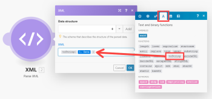

# XML

此 [!UICONTROL XML] 應用程式可讓您透過 [!UICONTROL XML] > [!UICONTROL 分析XML] 模組並將其轉換為套件，讓資料可供其他模組使用。 您也可以透過 [!UICONTROL XML] > [!UICONTROL 建立XML] 模組

## 存取需求

您必須具備下列存取權才能使用本文中的功能：

<table style="table-layout:auto"> 
 <col> 
 <col> 
 <tbody> 
  <tr> 
   <td role="rowheader">[!DNL Adobe Workfront] 計劃*</td>
  <td> <p>[!UICONTROL Pro]或更高版本</p> </td>
  </tr> 
  <tr data-mc-conditions=""> 
   <td role="rowheader">[!DNL Adobe Workfront] 授權*</td>
   <td> <p>[!UICONTROL計畫]、[!UICONTROL工作]</p> </td> 
  </tr> 
  <tr> 
   <td role="rowheader">[!DNL Adobe Workfront Fusion] 許可**</td> 
   <td> <p>[!UICONTROL [!DNL Workfront Fusion] （工作自動化和整合） </p>  </td>  
  </tr> 
  <tr> 
   <td role="rowheader">產品</td> 
   <td>貴組織必須購買 [!DNL Adobe Workfront Fusion] 和 [!DNL Adobe Workfront] 以使用本文所述的功能。</td> 
  </tr> 
 </tbody> 
</table>

若要了解您擁有的計畫、授權類型或存取權，請聯絡您的 [!DNL Workfront] 管理員。

如需 [!DNL Adobe Workfront Fusion] 許可證，請參閱 [[!DNL Adobe Workfront Fusion] 授權](../../workfront-fusion/get-started/license-automation-vs-integration.md).

## [!UICONTROL 分析XML]

此 [!UICONTROL XML] > [!UICONTROL 分析XML] 模組解析XML格式文本，並輸出包含從XML中提取的所有資訊的單個包。

<table style="table-layout:auto"> 
 <col> 
 <col> 
 <tbody> 
  <tr> 
   <td role="rowheader"> <p>[!UICONTROL資料結構]</p> </td> 
   <td> <p>資料結構描述了XML的結構，以使映射面板中的模組的輸出可用於以下模組。</p> <p>如果您有要剖析的XML範例，則可使用它來產生資料結構：</p> 
    <ol> 
     <li value="1">按一下 <strong>[!UICONTROL添加]</strong> 按鈕。</li> 
     <li value="2">按一下 <strong>[!UICONTROL生成器]</strong> 按鈕。</li> 
     <li value="3">複製XML範例並貼入 <strong>[!UICONTROL示例資料]</strong> 欄位。</li> 
     <li value="4">按一下 <strong>[!UICONTROL保存]</strong>.</li> 
     <li value="5">驗證已成功生成資料結構。</li> 
     <li value="6"> <p>按一下 <strong>[!UICONTROL保存]</strong> 按鈕以儲存資料結構。</p> <p>您可以略過步驟2-5以提供空的資料結構。 如果資料結構為空，則在模組至少執行一次之前，模組的輸出在映射面板中不可用。</p> </li> 
    </ol> <p>如需詳細資訊，請參閱 <a href="../../workfront-fusion/modules/data-structures.md" class="MCXref xref">中的資料結構 [!DNL Adobe Workfront Fusion]</a>.</p> </td> 
  </tr> 
  <tr> 
   <td role="rowheader">[!UICONTROL將數字保留為文本]</td> 
   <td>啟用此選項可確保數字保持為文字（字串）值。 否則，數字會轉換為數字值。</td> 
  </tr> 
  <tr> 
   <td role="rowheader"> <p>[!UICONTROL XML]</p> </td> 
   <td> <p>輸入或映射要分析的XML格式文本。</p> <p>如果使用公式，請確保其結果值類型是（或可自動強制）[!UICONTROL Text]資料類型。 </p> <p>  </p> <p>如果結果值類型為[!UICONTROL Buffer]（二進位資料），則使用 <code>toString()</code> 函式將其轉換為「文字」資料類型。 如需詳細資訊，請參閱 <a href="../../workfront-fusion/mapping/type-coercion.md" class="MCXref xref">中的強制類型 [!DNL Adobe Workfront Fusion]</a> 和 <a href="../../workfront-fusion/mapping/item-data-types.md" class="MCXref xref">[!UICONTROL Adobe Workfront Fusion]中的項目資料類型</a>.</p> </td> 
  </tr> 
 </tbody> 
</table>

>[!INFO]
>
>**範例：** 若要從URL下載XML檔案並剖析其內容：
>
>1. 建立新藍本。
>1. 插入 [!UICONTROL HTTP] > [!UICONTROL 取得檔案] 模組
>1. 開啟模組的設定，並依下列方式進行設定：

>
>   **URL**:XML檔案的URL(例如 `https://siftrss.com/f/rqLy05ayMBJ`)
>
>   
>
>1. 按一下 **[!UICONTROL 確定]**&#x200B;以儲存並關閉模組的設定。
1. 新增 [!UICONTROL XML] > [!UICONTROL 分析XML] 模組，在 [!UICONTROL HTTP] > [!UICONTROL 取得檔案] 模組，並依下列方式進行設定：
<table style="table-layout:auto"> 
&gt;    <col> 
&gt;    <col> 
&gt;    <tbody> 
&gt;     <tr> 
&gt;      <td role="rowheader">[!UICONTROL資料結構]</td> 
&gt;      <td> 
&gt;       <ol> 
&gt;        <li value="1">按一下 <strong>[!UICONTROL添加]</strong> 按鈕。</li> 
&gt;        <li value="2">按一下 <strong>[!UICONTROL生成器]</strong> 按鈕。</li> 
&gt;        <li value="3">在網頁瀏覽器中，開啟新的標籤或視窗。</li> 
&gt;        <li value="4">將您在第三個步驟中使用的URL放入網址列，然後擷取XML檔案。</li> 
&gt;        <li value="5">選擇所有XML文本，並將其複製到剪貼簿中。</li> 
&gt;        <li value="6">關閉標籤或視窗，然後返回您的藍本。</li> 
&gt;        <li value="7">將複製的XML文字貼入範例資料欄位。</li> 
&gt;        <li value="8">按一下 <strong>[!UICONTROL保存]</strong>.</li> 
&gt;        <li value="9">驗證已成功生成資料結構。</li> 
&gt;        <li value="10">按一下 <strong>[!UICONTROL保存]</strong> 以儲存資料結構。</li> 
&gt;       </ol> <p>您可以略過步驟2到9以提供空白的資料結構。 如果資料結構為空，則在模組至少執行一次之前，模組的輸出在映射面板中不可用。</p> </td> 
&gt;     </tr> 
&gt;     <tr> 
&gt;      <td role="rowheader">[!UICONTROL XML]</td> 
&gt;      <td> <p>對應 <code>Data </code>項，該項來自[!UICONTROL HTTP] &gt; [!UICONTROL獲取檔案]模組的輸出到欄位中。 使用 <code>toString()</code> 函式將其值從[!UICONTROL緩衝]（二進位資料）類型轉換為[!UICONTROL文本]資料類型。</p> <p>您可以將公式的程式碼複製並貼到欄位中： <code>&#123;&#123;toString(1.data)&#125;&#125;</code></p> <p>如需緩衝和文字資料類型的詳細資訊，請參閱 <a href="../../workfront-fusion/mapping/item-data-types.md" class="MCXref xref">Adobe Workfront Fusion中的項目資料類型</a>.</p> <p>  </p> </td> 
&gt;     </tr> 
&gt;    </tbody> 
&gt;   </table>


## [!UICONTROL 解析XML屬性]

依預設， [!UICONTROL XML] > [!UICONTROL 分析XML] 模組將屬性放入特殊集合中 `_attributes` 作為具有這些屬性的節點的子項。 如果節點是文本節點，並且它具有屬性，則添加兩個特殊屬性： `_attributes` 針對屬性和 `_value` ，用於節點的文本內容。

>[!INFO]
**範例：** 此XML:

```
<root attr="1">
<node attr="ABC">Hello, World</node>
</root>
```

會轉換為此套件：


## 建立XML

此 [!UICONTROL XML] > [!UICONTROL 建立XML] 模組將包轉換為XML格式文本。

<table style="table-layout:auto"> 
 <col> 
 <col> 
 <tbody> 
  <tr> 
   <td role="rowheader"> <p>[!UICONTROL資料結構]</p> </td> 
   <td> <p>資料結構描述了生成的XML的結構。 如果您有要建立的XML範例，則可使用它來產生資料結構：</p> 
    <ol> 
     <li value="1">按一下 <strong>[!UICONTROL添加]</strong> 按鈕。</li> 
     <li value="2">按一下 <strong>[!UICONTROL生成器]</strong> 按鈕。</li> 
     <li value="3">將XML範例複製並貼到「範例資料」欄位中。</li> 
     <li value="4">按一下 <strong>[!UICONTROL保存]</strong> 按鈕。</li> 
     <li value="5">驗證已成功生成資料結構。</li> 
     <li value="6">按一下 <strong>[!UICONTROL保存]</strong> 以儲存資料結構。</li> 
    </ol> </td> 
  </tr> 
  <tr> 
   <td role="rowheader">[!UICONTROL根元素名稱]</td> 
   <td>輸入XML的根元素的名稱。 預設值為 <code>root</code>.</td> 
  </tr> 
  <tr> 
   <td role="rowheader">[!UICONTROL Doctype系統ID]</td> 
   <td>輸入要在<code> !DOCTYPE SYSTEM</code> 聲明</td> 
  </tr> 
  <tr> 
   <td role="rowheader">[!UICONTROL Doctype PUBLIC ID]</td> 
   <td>輸入要在<code> !DOCTYPE PUBLIC</code> 聲明</td> 
  </tr> 
  <tr> 
   <td role="rowheader">[!UICONTROL Strip Xml聲明]</td> 
   <td>啟用此選項可刪除XML聲明 <code>&lt;?xml ... ?&gt;</code> 和 <code>&lt;!DOCTYPE ... &gt;</code>並僅保留XML根元素及其內容。</td> 
  </tr> 
 </tbody> 
</table>

>[!INFO]
**範例:**
典型的使用案例是從 [!DNL Google] >電子錶格到XML。
1. 放置 [!DNL Google Sheets] > [!UICONTROL 選取列] 模組來擷取資料。 設定模組以從 [!DNL Google] 試算表。 設&#x200B;定&#x200B;**[!UICONTROL 返回行數上限]** 小數字，但大於1以用於測試（例如，3）。 執行 [!DNL Google Sheets] 模組，請按一下滑鼠右鍵並選取「**[!UICONTROL 僅運行此模組]**.&quot; 驗證模組的輸出。
1. 連接 [!UICONTROL 陣列聚合器] 模組之後 [!DNL Google Sheets] 模組。 在模組的設定中，選取 [!DNL Google Sheets] 模組 **[!UICONTROL 源節點]** 欄位。 暫時保留其他欄位。
1. 連接 [!UICONTROL XML] > [!UICONTROL 建立XML] 模組之後 [!UICONTROL 陣列聚合器] 模組。
   模組的設定需要描述XML輸出結構的資料結構。 按一下 **[!UICONTROL 新增]** 按鈕以開啟資料結構設定。 要建立此資料結構，最簡單的方法是從XML範例中自動產生。
1. 按一下 **[!UICONTROL 產生器]** 按鈕，並將XML範例貼到 [!UICONTROL 範例資料] 欄位：


1. 按一下&#x200B;**[!UICONTROL 儲存]**。資料結構中的「規範」欄位現在包含生成的結構。
1. 將資料結構的名稱變更為更具體的名稱，然後按一下 **[!UICONTROL 儲存]**. 與根陣列屬性對應的欄位會在JSON模組的設定中顯示為可對應欄位。
1. 按一下 **[!UICONTROL 地圖]** 按鈕，並對應 `Array[]` 項目 [!UICONTROL 陣列聚合器] 輸出到它：
1. 按一下 **[!UICONTROL 確定]** 關閉XML模組的設定。
1. 開啟 [!UICONTROL 陣列聚合器] 模組。 變更 **[!UICONTROL 目標結構]** 從自訂到與父XML元素對應的XML模組欄位。映射來自 [!DNL Google Sheets] 模組至適當欄位。
1. 按一下 **[!UICONTROL 確定]** 關閉陣列聚合器模組的設定。
1. 執行案例。

   XML模組會輸出正確的XML檔案。
1. 開啟 [!DNL Google Sheets] 模組和增加 [!UICONTROL 返回行數上限] 大於試算表中處理所有資料的列數。
   產生的XML可儲存至 [!DNL Dropbox]、透過電子郵件以附件的形式傳送、透過FTP上傳至伺服器等。


## 添加XML屬性

如果要向複雜節點（將包含其他節點的節點）添加屬性，則必須以名稱添加集合 `_attributes` 以取得自訂資料結構中的複雜附註。 此集合將映射到節點屬性。 如果要向文本節點添加屬性(例如： `<node attr="1">abc</node>`)，您必須新增集合 `_attributes` 屬性和文本屬性 `_value` 用於自訂資料結構中此節點的節點值。

```
{
   "name": "node",
   "type": "collection",
   "spec": [
      {
         "name": "_attributes",
         "type": "collection"
         "spec": [
            {
               "name": "attr1",
               "type": "text"
            }
         ]
      },
      {
         "name": "_value",
         "type": "text"
      }
   ]
}
```

## 疑難排解：無法映射來自 [!UICONTROL 分析XML] 模組

請確定資料結構已正確定義。 或者，您可以使用空資料結構並至少執行模組一次以處理XML輸入。
