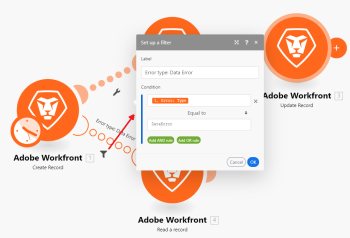

# [!DNL Adobe Workfront Fusion]中的進階錯誤處理

>[!IMPORTANT]
>
>Adobe Workfront Fusion檔案已移至新位置。
>
>本文資訊可在以下文章中找到：
>
>* [新增篩選和巢狀至錯誤處理路由](https://experienceleague.adobe.com/docs/workfront-fusion/using/create-scenarios/configure-error-handling/advanced-error-handling.html)
>
>請更新任何書籤。
>
>本文已不再更新，將於不久將來移除。

進階的錯誤處理技術包括篩選和巢狀。

## 存取需求

您必須具有下列存取權才能使用本文中的功能：

<table style="table-layout:auto">
 <col> 
 <col> 
 <tbody> 
  <tr> 
   <td role="rowheader">[!DNL Adobe Workfront] 計畫*</td> 
   <td> 
[！UICONTROL Pro]或更高版本
 </td> 
  </tr> 
  <tr data-mc-conditions=""> 
   <td role="rowheader">[!DNL Adobe Workfront] 授權*</td> 
   <td> 
[！UICONTROL計畫]，[！UICONTROL工作]
 </td> 
  </tr> 
  <tr> 
   <td role="rowheader">[！UICONTROL Adobe Workfront Fusion]授權**</td> 
   <td>
   
目前授權需求：無[!DNL Workfront Fusion]授權需求。

   
或

   
舊版授權需求：[！UICONTROL [!DNL Workfront Fusion] for Work Automation and Integration] 

   </td> 
  </tr> 
  <tr> 
   <td role="rowheader">產品</td> 
   <td>
   
目前產品需求：如果您有[！UICONTROL Select]或[！UICONTROL Prime] [!DNL Adobe Workfront]計畫，您的組織必須購買[!DNL Adobe Workfront Fusion]及[!DNL Adobe Workfront]，才能使用本文所述的功能。 [!DNL Workfront Fusion]包含在[！UICONTROL Ultimate] [!DNL Workfront]計畫中。

   
或

   
舊版產品需求：您的組織必須購買[!DNL Adobe Workfront Fusion]及[!DNL Adobe Workfront]，才能使用本文所述的功能。

   </td> 
  </tr> 
 </tbody> 
</table>

若要瞭解您擁有的計畫、授權型別或存取權，請連絡您的[!DNL Workfront]管理員。

如需[!DNL Adobe Workfront Fusion]授權的相關資訊，請參閱[[!DNL Adobe Workfront Fusion] 授權](../../workfront-fusion/get-started/license-automation-vs-integration.md)。

## 正在篩選

錯誤處理常式路由中可能會進行兩種篩選。

* [新增篩選器至錯誤處理常式路由](#adding-a-filter-to-the-error-handler-route)
* [將路由器後面接著篩選器新增至錯誤處理常式路由](#adding-a-router-followed-by-filters-to-the-error-handler)

### 新增篩選器至錯誤處理常式路由

您可以使用篩選器來控制錯誤處理常式路由處理哪些錯誤。 這可讓您僅處理特定型別的錯誤。 如果錯誤未通過篩選器，則會將其視為沒有為給定模組定義錯誤處理常式路由。

>[!INFO]
>
>**範例：**
>
>

### 正在新增[!UICONTROL 路由器]，接著新增篩選器至錯誤處理常式

>[!INFO]
>
>
>
>在此範例中，錯誤發生在[!UICONTROL 建立資料夾]模組(A)，它具有一般路由和錯誤處理常式路由。 後者之後是路由器，其中一條路由具有定義特定錯誤型別（發生資料錯誤）的篩選器，而另一條路由是所有其他錯誤的預設路由。 第一個路由以[!UICONTROL Resume]指示詞結束，該指示詞包含從模組A恢復之情境的替代值（[!UICONTROL 建立資料夾]），而第二個路由以[!UICONTROL Rollback]指示詞結束，該指示詞會立即停止情境執行。

請參閱 [!DNL Adobe Workfront Fusion]](../../workfront-fusion/errors/error-processing.md)中的[錯誤處理，以取得有關各種錯誤型別以及[!DNL Workfront Fusion]如何處理和評估這些型別的進一步資訊。

### 範例情境

您可以設定此範例情境，以瞭解這些篩選器如何處理錯誤。

使用現有的[!DNL Dropbox]資料夾上傳檔案，而非建立新檔案

如果您在[!DNL Dropbox]上使用[!UICONTROL 建立資料夾]模組，而且已存在相同名稱的資料夾，則模組會擲回資料錯誤，如下所示：

完整情境：

1. [!UICONTROL 工具] > [!UICONTROL 設定變數]模組包含資料夾名稱
1. [!UICONTROL HTTP] >[!UICONTROL 取得檔案]模組會擷取需要上傳至資料夾的檔案
1. 如果資料夾已經存在與模組中所對應資料夾同名的資料夾，則[!UICONTROL Dropbox] >[!UICONTROL 建立資料夾]模組會擲回錯誤
1. 錯誤處理常式路由（透明泡泡）包含用於篩選錯誤的路由器
1. 第一個路由適用於我們已知的、名為「資料錯誤」的指定錯誤型別：

   1. 如果發生資料錯誤，且錯誤詳細資料通過篩選器，則[!UICONTROL Dropbox] >[!UICONTROL 列出資料夾模組中的所有檔案/子資料夾]會列出[!DNL Dropbox]中的所有資料夾
   1. 後續的篩選符合資料夾名稱
   1. [!UICONTROL Resume]指示詞指定現有資料夾的資料夾識別碼和資料夾路徑，而案例執行從[!UICONTROL Dropbox] >[!UICONTROL 建立資料夾]模組繼續，但這次不是嘗試建立新資料夾，而是使用[!UICONTROL Resume]指示詞的值移至下一個模組並上傳現有資料夾中的檔案

1. 第二個路由適用於所有其他錯誤，並以[!UICONTROL Rollback]指示詞結束，這會立即停止該案例

以下是第5個陳述式的詳細說明：

若要在後續模組（[!UICONTROL 上傳檔案]，如下）中使用現有的資料夾，您必須新增錯誤處理常式路由至模組，並擷取資料夾路徑，以對應至下列的[!UICONTROL Resume]指示詞模組：

第一個路由上的篩選器設定為只處理當具有相同名稱的資料夾已存在時出現的特定錯誤（資料錯誤）：

[!UICONTROL Dropbox] >[!UICONTROL 列出資料夾]模組中的所有檔案，已設定為傳回目標資料夾中的所有資料夾。 下列篩選條件只會傳遞我們最初嘗試建立的篩選（資料夾名稱儲存在33中）。 資料夾名稱專案)：

最後，[!UICONTROL Resume]指示詞會提供資料夾路徑作為失敗模組的輸出。 請注意，資料夾識別碼已保留空白，因為&#39;[!UICONTROL 上傳檔案]&#39;模組不需要此識別碼：

## 巢狀

無論模組位於何處，都可以在所有模組（路由器除外）上建立和實施錯誤處理常式路由。 因此，可以為已經屬於為其他模組建立的現有錯誤處理常式路由一部分的模組建立錯誤處理常式路由。

以下是巢狀錯誤處理常式路由的範例：

在此案例中，第二個錯誤處理常式路由是巢狀位於第一個錯誤處理常式路由下。 因此，如果[!UICONTROL Dropbox] >[!UICONTROL 建立資料夾模組]發生錯誤，則執行會移至Route 1；如果通過[!UICONTROL 資料錯誤發生]篩選器，則在資料夾模組中未發生[!UICONTROL Dropbox] >[!UICONTROL 列出所有檔案/子資料夾]的錯誤時，下一個模組會先執行，接著執行[!UICONTROL Resume]指令模組。

不過，如果此[!DNL Dropbox]模組發生錯誤，則執行會移至錯誤處理常式路由2，並以[!UICONTROL Ignore]指示詞結束。 在此情況下不會執行[!UICONTROL Resume指示詞]模組。

這是篩選和巢狀錯誤處理常式的組合。

