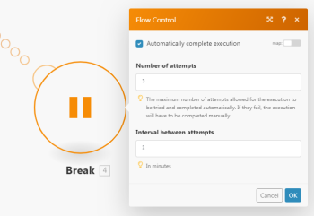

# 錯誤處理指令 [!DNL Adobe Workfront Fusion]

## 存取需求

您必須具備下列存取權才能使用本文中的功能：

<table style="table-layout:auto"> 
 <col> 
 <col> 
 <tbody> 
  <tr> 
   <td role="rowheader">[!DNL Adobe Workfront] 計劃*</td> 
   <td> 
[!DNL Pro] 或更高
 </td> 
  </tr> 
  <tr data-mc-conditions=""> 
   <td role="rowheader">[!DNL Adobe Workfront] 授權*</td> 
   <td> 
[!UICONTROL計畫]、[!UICONTROL工作]
 </td> 
  </tr> 
  <tr> 
   <td role="rowheader">[!UICONTROL Adobe Workfront Fusion]授權**</td> 
   <td> 
[!UICONTROL [!DNL Workfront Fusion] （工作自動化和整合） 
  </td> 
  </tr> 
  <tr> 
   <td role="rowheader">產品</td> 
   <td>貴組織必須購買 [!DNL Adobe Workfront Fusion] 和 [!DNL Adobe Workfront] 以使用本文所述的功能。</td> 
  </tr> 
 </tbody> 
</table>

若要了解您擁有的計畫、授權類型或存取權，請聯絡您的 [!DNL Workfront] 管理員。

如需 [!DNL Adobe Workfront Fusion] 許可證，請參閱 [[!DNL Adobe Workfront Fusion] 授權](../../workfront-fusion/get-started/license-automation-vs-integration.md).

## 錯誤處理指令

<table style="table-layout:auto">
 <col> 
 <col> 
 <tbody> 
  <tr> 
   <td role="rowheader"> 
回復
 
  
 </td> 
   <td> 
方案執行會立即停止，且 <a href="../../workfront-fusion/scenarios/scenario-execution-cycles-phases.md#rollback" class="MCXref xref">回復</a> 在所有模組上啟動階段，以嘗試將所有模組恢復到其初始狀態。 不會處理後續模組。
 
除非有一些錯誤類型，否則在「方案」設定下指定的連續錯誤數後，方案會停用。 如需詳細資訊，請參閱 <a href="../../workfront-fusion/scenarios/scenario-settings-panel.md#number" class="MCXref xref">連續錯誤數</a>.
 
方案執行狀態被標籤為「錯誤」。
 
注意：如果未將錯誤處理程式路由附加到模組，則此為預設行為，並且 <a href="../../workfront-fusion/scenarios/scenario-settings-panel.md#allow" class="MCXref xref">[!UICONTROL允許儲存不完整的執行]</a> 未勾選「[!UICONTROL方案設定]」下的設定。
 </td> 
  </tr> 
  <tr> 
   <td role="rowheader"> 
認可
 
  
 </td> 
   <td> 
方案執行立即停止，並且所有模組上都啟動了提交階段。 不會處理後續模組。
 
忽略所有未處理的套件組合。
 
方案執行狀態會標示為「成功」。 有關提交階段的資訊，請參見 <a href="../../workfront-fusion/scenarios/scenario-execution-cycles-phases.md#commit" class="MCXref xref">提交</a> 在文章中 <a href="../../workfront-fusion/scenarios/scenario-execution-cycles-phases.md" class="MCXref xref">Adobe Workfront Fusion中的情境執行、週期和階段</a>.
 </td> 
  </tr> 
  <tr> 
   <td role="rowheader"> 
繼續
 
  
 </td> 
   <td> 
指定替換輸出，並提供給遇到錯誤的模組。
 
處理後續模組。
 
方案執行狀態會標示為「成功」。
 </td> 
  </tr> 
  <tr> 
   <td role="rowheader"> 
忽略
 
  
 </td> 
   <td> 
系統會忽略錯誤，且不會處理後續模組。
 
如果有未處理的套件組合，則方案執行會正常繼續。
 
方案執行狀態會標示為「成功」。
 </td> 
  </tr> 
  <tr> 
   <td role="rowheader"> 
插播
 
  
 </td> 
   <td> 
方案執行的狀態儲存在未完成執行的佇列中，可以手動解決錯誤。 如需詳細資訊，請參閱 <a href="../../workfront-fusion/scenarios/view-and-resolve-incomplete-executions.md" class="MCXref xref">檢視並解決Adobe Workfront Fusion中的不完整執行</a>. 
 
不過，也有一些例外。 如需詳細資訊，請參閱 <a href="../../workfront-fusion/scenarios/scenario-settings-panel.md#allow" class="MCXref xref">允許儲存不完整的執行</a> 在文章中 <a href="../../workfront-fusion/scenarios/scenario-settings-panel.md" class="MCXref xref">Adobe Workfront Fusion中的案例設定面板</a>.
 
不會處理後續模組。
 
如果有未處理的套件組合，則方案執行會正常繼續。
 
停用[!UICONTROL自動完成執行]選項時，方案執行狀態會標示為「警告」。
 
請參閱 <a href="#break" class="MCXref xref">[!UICONTROL中斷]</a> 以取得更多資訊。
 </td> 
  </tr> 
  <tr> 
   <td role="rowheader"> 
重試
 
  
 </td> 
   <td> 
在某些情況下，如果故障原因可能會隨著時間而傳遞，重新執行失敗模組幾次可能會很有幫助。
 
Workfront Fusion目前不提供Retry指令，但可採用數種解決方法來模擬其功能。 如需詳細資訊，請參閱 <a href="../../workfront-fusion/errors/retry.md" class="MCXref xref">在Adobe Workfront Fusion中重試錯誤處理</a>.
 </td> 
  </tr> 
 </tbody> 
</table>

>[!NOTE]
>
>當前，錯誤處理指令不能用在錯誤處理路由的範圍之外， [!DNL Workfront Fusion] 目前不提供可讓您輕鬆有條件地產生（擲回）錯誤的「擲回」模組，但可採用因應措施來模擬其功能。 如需詳細資訊，請參閱 [錯誤處理程式路由](../../workfront-fusion/errors/error-handling.md#error) 在文章中 [Adobe Workfront Fusion中的錯誤處理](../../workfront-fusion/errors/error-handling.md). 另請參閱 [擲回因應措施](../../workfront-fusion/errors/throw.md#workarou) 在文章中 [在Adobe Workfront Fusion中擲回錯誤處理](../../workfront-fusion/errors/throw.md).

## 插播 {#break}

當錯誤由 [!DNL Break] 指令，則會在 [在中檢視並解決未完成的執行 [!DNL Adobe Workfront Fusion]](../../workfront-fusion/scenarios/view-and-resolve-incomplete-executions.md) 資料夾，儲存情境執行的狀態以及來自先前模組的資料。 對於導致錯誤的每個資料組合，會建立單獨的記錄。

該記錄引用錯誤源所在的模組，並包含關於該模組作為輸入接收哪些資料的資訊。 如需詳細資訊，請參閱 [檢視並解決Adobe Workfront Fusion中的不完整執行](../../workfront-fusion/scenarios/view-and-resolve-incomplete-executions.md).

在此，您可以手動解決錯誤，方法是更新案例（如有需要）並執行一次。

另一方面，若要啟用 [!UICONTROL 自動完成執行] 選項，可在指定的分鐘數後重新執行方案，將其配置為自動處理未完成的執行。

啟用此選項後，當發生錯誤時，會擷取未完成的執行(在 [!UICONTROL 兩次嘗試之間的間隔] 欄位)，並使用原始輸入資料執行。 這將重複執行，直到模組執行完成，且未發生錯誤，或直到達到指定的嘗試次數為止。

>[!NOTE]
>
>如果初始重試嘗試失敗，則重試之間的間隔會以指數方式增加，每次嘗試都是如此。

開啟「自動完成執行」時，情境執行會標示為「成功」，因為中斷錯誤處理常式的自動重試會自動處理問題。 在此情況下，使用者不會收到有關失敗執行的電子郵件。

關閉「自動完成執行」時，執行會標示為「警告」。

但是，在「不完整執行」下儲存的執行有一些例外，並且有一些錯誤類型，則無法自動重試方案執行。 如需詳細資訊，請參閱 [允許儲存不完整的執行](../../workfront-fusion/scenarios/scenario-settings-panel.md#allow) 在文章中 [Adobe Workfront Fusion中的案例設定面板](../../workfront-fusion/scenarios/scenario-settings-panel.md).

如需詳細資訊，請參閱 [Adobe Workfront Fusion中的進階錯誤處理](../../workfront-fusion/errors/advanced-error-handling.md).
