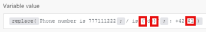

# 中的字串函式 [!DNL Adobe Workfront Fusion]

## 存取需求

您必須具備下列存取權才能使用本文中的功能：

<table style="table-layout:auto">
 <col> 
 <col> 
 <tbody> 
  <tr> 
   <td role="rowheader">[!DNL Adobe Workfront] 計劃*</td> 
   <td> 
[!DNL Pro] 或更高
 </td> 
  </tr> 
  <tr data-mc-conditions=""> 
   <td role="rowheader">[!DNL Adobe Workfront] 授權*</td> 
   <td> 
[!UICONTROL計畫]、[!UICONTROL工作]
 </td> 
  </tr> 
  <tr> 
   <td role="rowheader">[!UICONTROL Adobe Workfront Fusion]授權**</td> 
   <td> 
[!UICONTROL [!DNL Workfront Fusion] （工作自動化和整合） 

[!UICONTROL [!DNL Workfront Fusion] （工作自動化）
  </td> 
  </tr> 
  <tr> 
   <td role="rowheader">產品</td> 
   <td>貴組織必須購買 [!DNL Adobe Workfront Fusion] 和 [!DNL Adobe Workfront] 以使用本文所述的功能。</td> 
  </tr> 
 </tbody> 
</table>

若要了解您擁有的計畫、授權類型或存取權，請聯絡您的 [!DNL Workfront] 管理員。

如需 [!DNL Adobe Workfront Fusion] 許可證，請參閱 [[!DNL Adobe Workfront Fusion] 授權](../../workfront-fusion/get-started/license-automation-vs-integration.md).

## [!UICONTROL ascii（文本） [移除變異符號])]

從文本字串中刪除所有非ASCII字元。

>[!INFO]
>
>**範例:**
>
>* `ascii(` `Wěošrčkřfžrýoáníté` `)`
   >
   >   傳回： [!DNL Workfront]
>
>* `ascii(` `ěščřž` `;` `true` `)`
   >
   >   傳回： [!UICONTROL 埃斯克爾茨]

## [!UICONTROL base64（文本）]

將文字轉換為base64。

>[!INFO]
>
>**範例:**
>
>`base64( workfront )`
>
>傳回：d29ya2Zyb250==

## [!UICONTROL 大寫（文本）]

將文本字串中的第一個字元轉換為大寫。

>[!INFO]
>
>**範例:**
>
>`capitalize( workfront )`
>
>傳回： [!DNL Workfront]

## 包含（文本）搜尋字串)

驗證文本是否包含搜索字串。

>[!INFO]
>
>**範例:**
>
>* `contains( Hello World ; Hello )`
   >
   >   傳回： [!UICONTROL true]
>
>* `contains( Hello World ; Bye )`
   >
   >   傳回： [!UICONTROL false]

## [!UICONTROL decodeURL(text)]

將URL中的特殊字元解碼為文字。

>[!INFO]
>
>**範例:**
>`decodeURL( Automate%20your%20workflow )`
>
>傳回： [!UICONTROL 自動化您的工作流程]

## [!UICONTROL encodeURL（文字）]

將某些文字中的特殊字元編碼為有效的URL位址。

## [!UICONTROL escapeHTML(text)]

使文字中的所有HTML標籤逸出。

>[!INFO]
>
>**範例:**
>
>`escapeHTML( <b>Hello</b> )`
>
> 傳回： `&lt;b&gt;Hello&lt;/b&gt;`

## [!UICONTROL escapeMarkdown(text)]

以文字逸出所有Markdown標籤。

>[!INFO]
>
>**範例:**
>
>`escapeMarkdown( # Header )`
>
>傳回： `&#35; Header`

## [!DNL indexOf (string; value; [start])]

傳回字串中指定值首次出現的位置。 如果搜索的值不存在，則此方法將返回「–1」。 開始值指示應在字串中的哪個位置開始搜索。

>[!INFO]
>
>**範例:**
>
>* `indexOf( Workfront ; o )`
   >
   >   傳回：1
>
>* `indexOf( Workfront ; x )`
   >
   >   傳回：-1
>
>* `indexOf( Workfront ; o ; 3 )`
   >
   >   傳回：6

## [!UICONTROL 長度（文字或緩衝）]

傳回文字字串長度（字元數）或二進位緩衝區長度（位元組的緩衝區大小）。

>[!INFO]
>
>**範例:**
>
>`length( hello )`
>
>傳回：5

## [!UICONTROL 下（文字）]

將文本字串中的所有字母字元轉換為小寫。

>[!INFO]
>
>**範例:**
>
>`lower( Hello )`
>
>傳回：你好

## [!UICONTROL md5（文字）]

計算字串的md5雜湊。

>[!INFO]
>
>**範例:**
>
>`md5( Workfront )`
>
>傳回： `1448bbbeaa7a9b8091d426999f1f666b`

## [!UICONTROL 取代（文字；搜尋字串）;替換字串)]

以新字串取代搜尋字串。

>[!INFO]
>
>**範例:**
>
>`replace( Hello World ; Hello ; Hi )`
>
>傳回： [!UICONTROL Hi World]

規則運算式(括在 `/.../`)可作為包含標幟的組合的搜尋字串(例如 `g`, `i`, `m`)附加：

>[!INFO]
>
>**範例:**
>
>
>
>所有這些數字X X X X都被X取代

取代字串可包含下列特殊取代模式：

* `$&` 插入匹配的子字串。
* `$n` 其中n是小於100的正整數，插入第n個帶有括弧的子比對字串。 這是1個索引。

>[!INFO]
>
>**範例:**
>
>
>
>傳回：電話號碼 `+420777111222`
>>
>傳回：電話號碼： `+420777111222`

>[!CAUTION]
請勿使用命名的捕獲組，例如 `/ is (?<number>\d+)/` 在取代字串引數中。 這麼做會導致錯誤。

如需規則運算式的詳細資訊，請參閱 [文字剖析器](../../workfront-fusion/apps-and-their-modules/text-parser.md).

## [!UICONTROL sha1（文本） [編碼]; [key])]

計算字串的sha1雜湊。 如果指定了鍵引數，則會傳回sha1 HMAC雜湊。 支援的編碼：&quot;hex&quot;（預設值）、&quot;base64&quot;或&quot;latin1&quot;。

>[!INFO]
**範例:**
`sha1( workfront )`
傳回：b2b30b8ae1f9e5b40fbb0696eaabdbfd8d0c087f

## [!UICONTROL sha256(文本； [編碼]; [key])]

計算字串的sha256雜湊。 如果指定金鑰引數，則會傳回sha256 HMAC雜湊。 支援的編碼：&quot;hex&quot;（預設值）、&quot;base64&quot;或&quot;latin1&quot;。>

>[!INFO]
**範例:**
`sha256( workfront )`
傳回：ed3d7397eec7b94453035b67ba4468c883ee3bedeb57137f7371f2e0cf5e2bbc

## [!UICONTROL sha512(文本； [輸出編碼]; [key]; [密鑰編碼])]

計算字串的sha512雜湊。 如果指定金鑰引數，則會傳回sha512 HMAC雜湊。

支援的編碼：

* &quot;[!UICONTROL 十六進位]&quot;（預設）
* &quot;[!UICONTROL base64]&quot;
* &quot;[!UICONTROL latin1]&quot;

支援的金鑰編碼：

* &quot;[!UICONTROL 文字]&quot;（預設）
* &quot;[!UICONTROL 十六進位]&quot;
* &quot;[!UICONTROL base64]&quot;或&quot;[!UICONTROL 二進位]&quot;

使用「[!UICONTROL 二進位]&quot;密鑰編碼，密鑰必須是緩衝區，而不是字串。

>[!INFO]
**範例:**
`sha512(workfront)`
傳回：789ae41b9456357e4f27c6a09956a767abb8d80b206003fdd1e94dbc687cd119b85e1e19db58bb44b234493af35fd431639c0345aadf7ec26e9f4a7fb19

## [!UICONTROL 拆分（文本）分隔符號]

將字串分隔為子字串，將字串分割為字串陣列。

>[!INFO]
**範例:**
`split( John, George, Paul ; , )`

## [!UICONTROL startcase（文本）]

將每個單詞的首字母大寫，並將其他所有字母的小寫都小寫。

>[!INFO]
**範例：**
`startcase( hello WORLD )`
傳回： [!UICONTROL 《你好世界》]

## [!UICONTROL stripHTML(text)]

從文字中移除所有HTML標籤。

>[!INFO]
**範例:**
`stripHTML( <b>Hello</b> )`
傳回：Hello

## [!UICONTROL 子字串（文本）開始；結束)]

傳回「開始」位置和「結束」位置之間的文字字串的一部分。

>[!INFO]
**範例:**
* `substring( Hello ; 0 ; 3)`

   傳回：赫爾
* `substring( Hello ; 1 ; 3 )`

   傳回：el

## [!UICONTROL toBinary(value)]

將任何值轉換為二進位資料。

您也可以將編碼指定為第二個引數，以將從十六進位或base64的二進位轉換套用至二進位資料。

>[!INFO]
**範例:**
* `toBinary( Workfront )`

   傳回：57 6f 72 6b 66 72 6f 6e 74
* `toBinary( V29ya2Zyb250 ; base64 )`

   傳回：57 6f 72 6b 66 72 6f 6e 74

## [!UICONTROL toString(value)]

將任何值轉換為字串。

## [!UICONTROL 修剪（文字）]

移除文字開頭或結尾的空格字元。

## [!UICONTROL upper（文本）]

將文本字串中的所有字母字元轉換為大寫。

>[!INFO]
**範例:**
`upper( Hello )`
傳回： [!UICONTROL HELLO]
