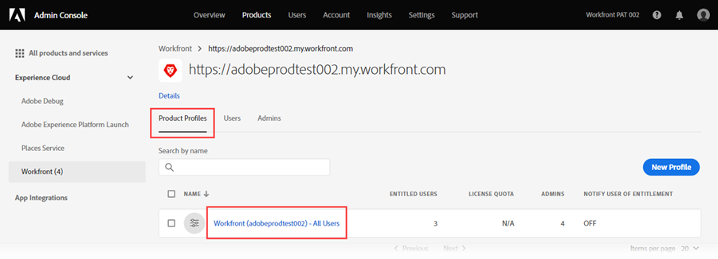

# 新增使用者至 [!DNL Adobe Workfront Fusion] 通過 [!DNL Adobe Admin Console]

>[!IMPORTANT]
>
>本頁所述的程式僅適用於已上架至 [!DNL Adobe Admin Console].
>
>如果您的組織尚未上線至 [!DNL Adobe Admin Console]，請參閱 [將使用者新增至 [!DNL Adobe Workfront Fusion]](../organizations/add-user-to-an-organization.md).
>
>如需根據貴組織是否已上線至 [!DNL Adobe Admin Console]，請參閱 [平台管理差異([!DNL Adobe Workfront Fusion]/[!DNL Adobe Business Platform])](../fusion-in-admin-console/fusion-adobe-admin-console.md).

您可以將使用者新增至 [!DNL Adobe Admin Console] 並將其指派給 [!DNL Adobe Workfront Fusion]，或在 [!DNL Adobe Admin Console] to [!DNL Workfront Fusion].

對於描述 [!DNL Workfront Fusion] 在 [!DNL Adobe Admin Console]，包括如何新增使用者，請參閱 [[!DNL Fusion] 在Adobe IMS上](https://video.tv.adobe.com/v/3412464/){target=_blank}.

## 存取需求

您必須具備下列存取權才能使用本文中的功能：

<table style="table-layout:auto"> 
 <col> 
 <col> 
 <tbody> 
  <tr> 
   <td role="rowheader">[!DNL Adobe Workfront] 計劃*</td> 
   <td> 
[!UICONTROL Pro]或更高版本
 </td> 
  </tr> 
  <tr data-mc-conditions=""> 
   <td role="rowheader">[!DNL Adobe Workfront] 授權*</td> 
   <td> 
[!UICONTROL計畫]、[!UICONTROL工作]
 </td> 
  </tr> 
  <tr> 
   <td role="rowheader">[!DNL Adobe Workfront Fusion] 許可**</td> 
   <td> 
[!UICONTROL Workfront Fusion for Work Automation and Integration] 
 
[!UICONTROL Workfront Fusion for Work Automation] 
  </td> 
  </tr> 
  <tr> 
   <td role="rowheader">產品</td> 
   <td>貴組織必須購買 [!DNL Adobe Workfront Fusion] 和 [!DNL Adobe Workfront] 以使用本文所述的功能。</td> 
  </tr>
   <tr> 
   <td role="rowheader">[!DNL Adobe] 管理員權限</td> 
   <td>您必須是 [!DNL Adobe] 產品。</td> 
  </tr>
  </tbody> 
</table>

&#42;若要了解您擁有的計畫、授權類型或存取權，請聯絡您的 [!DNL Workfront] 管理員。

&#42;&#42;如需 [!DNL Adobe Workfront Fusion] 許可證，請參閱 [[!DNL Adobe Workfront Fusion] 授權](../../workfront-fusion/get-started/license-automation-vs-integration.md)

## 必要條件

使用 [!DNL Admin Console] for [!DNL Workfront]，您應會收到電子郵件，邀請您前往主控台。

1. 如果您是新手 [!DNL Adobe] 您收到一封電子郵件，告訴您現在擁有管理權限 [!DNL Adobe] 軟體和服務，按一下電子郵件中的按鈕以建立 [!DNL Adobe] 帳戶並開啟 [!DNL Admin Console].

   或

   如果您已有Adobe帳戶，請前往 [[!DNL Adobe Admin Console] 頁面](https://adminconsole.adobe.com/).

## 新增使用者至 [!DNL Adobe Admin Console] 和 [!DNL Workfront Fusion]

1. 從 [[!DNL Adobe Admin Console] 頁面](https://adminconsole.adobe.com/)，請選取 **[!UICONTROL 產品]** ，然後選取 **[!DNL Workfront Fusion]** 產品方塊。

   

1. 在顯示的清單中，選取您要新增使用者的組織。

   

1. 在顯示的清單中， **[!UICONTROL 產品設定檔]** 頁簽，按一下 [!DNL Workfront Fusion] [!UICONTROL 產品設定檔] 連結。

   

   >[!IMPORTANT]
   >
   > 請勿對 [!UICONTROL 產品設定檔] 本身。

1. 使用 **[!UICONTROL 使用者]** 頁簽，按一下 **[!UICONTROL 添加用戶]**.

1. 在 **[!UICONTROL 新增使用者至此產品設定檔]** 框中，輸入要添加的用戶的電子郵件地址或名稱，然後在顯示的清單中選擇該用戶。

1. 按一下&#x200B;**[!UICONTROL 儲存]**。

   使用者是在 [!DNL Workfront Fusion].

   <!--
    >[!IMPORTANT]
    >
    > Do not make any changes to the Product Profile itself.
    -->

1. （選用）繼續 [在 [!DNL Workfront Fusion]](#change-a-users-access-level-in-workfront-fusion)

## 在Workfront Fusion中變更使用者的存取層級

### 將使用者角色變更為管理員

必須為使用者提供管理員角色，請在 [!DNL Adobe Admin Console].

1. 在 [!DNL Workfront Fusion] [!UICONTROL 產品設定檔] 頁面，選取 **[!UICONTROL 管理員]** 標籤。

1. 按一下 **[!UICONTROL 新增管理員]**.

1. 在 **[!UICONTROL 新增產品設定檔管理員]** 框中，輸入要添加的用戶的電子郵件地址或名稱，然後在顯示的清單中選擇該用戶。

1. 按一下&#x200B;**[!UICONTROL 儲存]**。

   此使用者現在是 [!DNL Workfront Fusion].

### 將使用者角色變更為 [!UICONTROL 會員], [!UICONTROL 會計]，或 [!UICONTROL 應用程式開發人員].

[!UICONTROL 會員], [!UICONTROL 會計]，和 [!UICONTROL 應用程式開發人員] 角色在內部處理 [!DNL Workfront Fusion].

如需指示，請參閱 [查看或編輯用戶角色](../organizations/manage-fusion-users.md#view-or-edit-user-roles) 在文章中 [管理 [!DNL Adobe Workfront Fusion] 您組織中的使用者](../organizations/manage-fusion-users.md)

## 在 [!DNL Adobe Admin Console] to [!DNL Workfront Fusion]

1. 如文章的「編輯使用者詳細資訊」一節所述，開始編輯使用者 [個別管理使用者](https://helpx.adobe.com/enterprise/using/manage-users-individually.html) 在 [!DNL Adobe Admin Console] 檔案。

1. 新增 **[!DNL Adobe Workfront Fusion]** 指派給使用者的產品。
