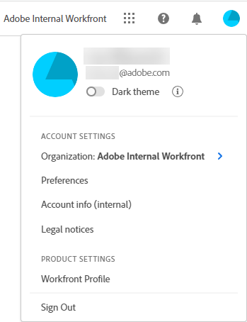

# [!DNL Workfront Fusion]的[!DNL Adobe Unified Experience]

>[!IMPORTANT]
>
>Adobe Workfront Fusion檔案已移至新位置。
>
>本文資訊可在以下文章中找到：
>
>* [變更設定檔設定](https://experienceleague.adobe.com/docs/workfront-fusion/using/get-started-with-fusion/navigate-workfront-fusion/change-profile-settings.html)
>* [設定團隊通知選項](https://experienceleague.adobe.com/docs/workfront-fusion/using/set-up-and-manage-fusion/set-up-and-manage-orgs-and-teams/set-up-orgs-teams-and-users/set-team-notification-options.html)
>
>請更新任何書籤。
>
>本文已不再更新，將於不久將來移除。

透過[!DNL Adobe Experience Cloud]存取[!DNL Workfront Fusion]可讓您以順暢、統一的體驗管理所有[!DNL Adobe]應用程式。 單一身分管理可為您提供一個登入位置，不需要多個URL或登入ID。

如需說明[!DNL Adobe Experience Cloud]中[!DNL Fusion]中導覽的影片，請參閱：

 [!DNL Unified Shell]](https://video.tv.adobe.com/v/3412392/){target=_blank}上的[[!DNL Fusion] 

## 存取需求

您必須具有下列存取權才能執行本文中的步驟：

<table style="table-layout:auto"> 
 <col> 
 <col> 
 <tbody> 
  <tr> 
   <td role="rowheader">[!DNL Adobe Workfront] 計畫*</td> 
   <td> 
[！UICONTROL Pro]或更高版本
 </td> 
  </tr> 
  <tr data-mc-conditions=""> 
   <td role="rowheader">[!DNL Adobe Workfront] 授權*</td> 
   <td> 
[！UICONTROL計畫]，[！UICONTROL工作]
 </td> 
  </tr> 
  <tr> 
   <td role="rowheader">[!DNL Adobe Workfront Fusion] 授權**</td> 
   <td>
   
任何
 
  </tr> 
  <tr> 
   <td role="rowheader">產品</td> 
   <td>
   
目前產品需求：如果您有[！UICONTROL Select]或[！UICONTROL Prime] [!DNL Adobe Workfront]計畫，您的組織必須購買[!DNL Adobe Workfront Fusion]及[!DNL Adobe Workfront]，才能使用本文所述的功能。 [!DNL Workfront Fusion]包含在[！UICONTROL Ultimate] [!DNL Workfront]計畫中。

   
或

   
舊版產品需求：您的組織必須購買[!DNL Adobe Workfront Fusion]及[!DNL Adobe Workfront]，才能使用本文所述的功能。

   </td> 
  </tr> 
 </tbody> 
</table>
*若要瞭解您擁有的計畫、授權型別或存取權，請連絡您的[!DNL Workfront Fusion]管理員。

## 先決條件

貴組織的Workfront Fusion執行個體必須上線到[!DNL Adobe Business Platform] / [!DNL Adobe Admin Console]。

## 登入[!DNL Adobe Experience Cloud]

1. 開啟瀏覽器視窗並移至<https://experience.adobe.com>。
1. 在[登入]畫面中，輸入您的電子郵件地址，然後按一下[繼續]。****

   ![登入[!DNL Adobe Experience Cloud]](assets/aec-login-page.png)

## 存取[!DNL Workfront Fusion]

登入[!DNL Adobe Experience Cloud]後，按一下頂端導覽區中的組織切換器，即可檢視您有權存取的所有[!DNL Workfront Fusion]組織和環境。 選取您要使用的[!DNL Workfront Fusion]組織或環境。

![檢視[!DNL Workfront Fusion]組織和環境](assets/aec-view-all-orgs.png)

>[!NOTE]
>
>第一次登入[!DNL Adobe Experience Cloud]時，組織會預設為字母清單中的第一個組織。 下次登入時，組織會預設為您上次造訪的組織。

[!DNL Workfront Fusion]會出現在您有權存取的[!DNL Adobe Experience Cloud]產品清單中。 您可以在[!DNL Experience Cloud]首頁上的快速存取功能表中選擇[!DNL Workfront Fusion]，或使用產品切換器隨時變更應用程式。

![選取[!DNL Workfront Fusion]以存取應用程式](assets/aec-product-switcher.png)

## 導覽[!DNL Workfront Fusion]

使用[!DNL Adobe]導覽列左側的[!UICONTROL 主功能表]圖示來開啟[!UICONTROL 組織]和[!UICONTROL 團隊]功能表。 如果您是[!DNL Workfront Fusion]管理員，您的[!UICONTROL 管理]功能表也會顯示在這裡。

若要切換團隊，請按一下頁面頂端的團隊名稱，然後選取團隊。 團隊選擇器只會出現在團隊的特定頁面上，例如案例產生器或[!UICONTROL 連線]頁面。

若要切換組織，請按一下畫面右上方的組織名稱，然後選取組織。

## 存取您的設定檔和偏好設定

您可以按一下頂端導覽區域中的個人資料圖片，存取個人資料和偏好設定選項。

此功能表可讓您：

* 選擇[!DNL Adobe Experience Cloud]的&#x200B;**[!UICONTROL 深色佈景主題]**&#x200B;格式。
* 設定[!DNL Adobe Experience Cloud]的&#x200B;**[!UICONTROL 偏好設定]**，包括主要和次要語言偏好設定。
* 存取您的&#x200B;**[!UICONTROL [!DNL Workfront Fusion]設定檔]**。 進入設定檔後，按一下&#x200B;**[!UICONTROL 更多]**&#x200B;功能表並選取&#x200B;**[!UICONTROL 編輯]**。 如需設定檔的詳細資訊，請參閱[設定我的設定](/help/quicksilver/workfront-basics/manage-your-account-and-profile/configuring-your-user-profile/configure-my-settings.md)。
* **[!UICONTROL 登出]** Adobe Experience Cloud。

## 存取您的通知

您可以在Unified Shell的「通知」區域找到您的通知和公告。

若要檢視您的通知，請按一下畫面右上角附近的通知圖示。 通知圖示上的紅點表示您有未讀的通知或公告。

如需在Adobe Experience Cloud中設定通知的指示，請參閱Adobe檔案中的[通知設定](https://experienceleague.adobe.com/docs/experience-manager-cloud-service/content/implementing/using-cloud-manager/notifications.html#:~:text=You%20can%20customize%20how%20you,how%20you%20receive%20your%20notifications.)。

設定時，請注意下列事項：

* **警示**&#x200B;參考停滯情況。
* **內容**&#x200B;的更新參考案例執行中的錯誤和警告。

