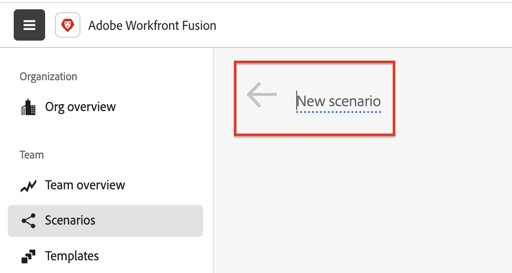
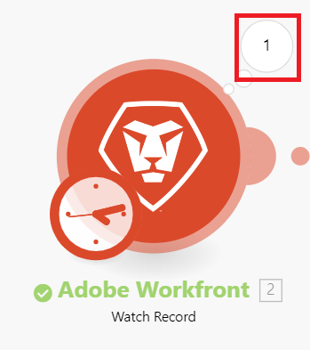
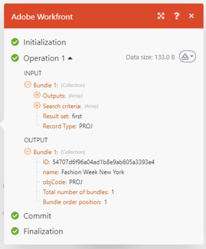

# 在[!DNL Adobe Workfront Fusion]中建立練習自動化情境

自動化案例可自動化Workfront程式，包括資料操縱和轉換。 本文會帶您進行建立情境的過程，該情境會搜尋專案，然後傳回與該專案相關聯的所有任務。

<!-- not sure why these are here?
For instructions on building an integration scenario that connects separate apps, see [Create a practice integration scenario in Adobe Workfront Fusion](../../workfront-fusion/get-started/create-a-practice-scenario.md).

For more information on functionality available with each Workfront Fusion license, see [Adobe Workfront Fusion licenses](../../workfront-fusion/get-started/license-automation-vs-integration.md).

-->

## 存取需求

+++ 展開以檢視本文中功能的存取需求。

您必須具有下列存取權才能使用本文中的功能：

<table style="table-layout:auto"> 
  <tbody>  
    <tr>  
      <td>Adobe Workfront計畫</td>  
      <td>任何</td>  
    </tr>  
    <tr>  
      <td>Adobe Workfront授權</td>  
      <td>
        新增： Standard 
        或 
        目前：工作或以上
      </td>  
    </tr>  
    <tr>  
      <td>Adobe Workfront Fusion授權</td>  
      <td> 
        目前：無Workfront Fusion授權需求。 
        或 
        舊版：任何
      </td>  
    </tr>  
    <tr>  
      <td>產品</td>  
      <td> 
        新增：選取或Prime Workfront計畫：您的組織必須購買Adobe Workfront Fusion。 
        Ultimate Workfront計畫：包含Workfront Fusion。 
        或 
        目前：您的組織必須購買Adobe Workfront Fusion。
      </td>  
    </tr> 
  </tbody>  
</table>

如需有關此表格的詳細資訊，請參閱Workfront檔案中的[存取需求](/help/quicksilver/administration-and-setup/add-users/access-levels-and-object-permissions/access-level-requirements-in-documentation.md)。

如需[!DNL Adobe Workfront Fusion]授權的相關資訊，請參閱[[!DNL Adobe Workfront Fusion] 授權](../../workfront-fusion/get-started/license-automation-vs-integration.md)。

+++

## 建立自動化實務案例

[!DNL Adobe Workfront Fusion]可自動處理重複性的工作，協助您專注重要工作。 它會建立案例，自動跨各種應用程式和服務管理您的資料。

每個案例都包含模組，可指導如何在應用程式內處理資料，或在不同的應用程式和服務之間傳輸資料。 例如，您可以在Fusion中建立情境，以自動尋找[!DNL Workfront]專案並列出其任務。 這樣，Fusion就可以處理例行工作，為您節省時間和精力。

此實務案例會帶您進行建立案例的程式，該案例會搜尋[!DNL Workfront]專案並傳回專案中的任務。

### 開始之前

建立專案，其中包含Workfront中您可在本練習中使用的任務。 除了將任務新增到專案外，您不需要執行任何其他設定。

如需有關在Workfront中建立專案的資訊，請參閱xxx。

### 1.建立情境並為其命名

1. 登入您的[!DNL Workfront Fusion]帳戶。
1. 按一下左側面板中的&#x200B;**[!UICONTROL 情境]** 。

   >[!NOTE]
   >
   >如果您沒有看到左側導覽面板或其圖示，請按一下功能表圖示。

1. 在「[!UICONTROL **資料夾**]」面板中，按一下「**[!UICONTROL 新增資料夾]**」圖示，然後為您的第一個資料夾輸入「實務案例」之類的名稱。

1. 開啟資料夾，然後按一下頁面右上角的&#x200B;**[!UICONTROL 建立新案例]**。

1. 在本練習中，請選取&#x200B;**[!DNL Adobe Workfront]**&#x200B;應用程式，然後按一下底部附近的&#x200B;**搜尋**。

1. 選取左上角的&#x200B;**[!UICONTROL 新案例]**&#x200B;預留位置名稱，然後輸入名稱，例如「實務案例1」。

   

1. 繼續[連線下列第一個模組](#2-connect-the-first-module)。

### 2.連線第一個模組

現在，您需要建立與您的[!DNL Workfront]帳戶的已驗證連線。 您新增至情境的每個模組都必須有與其應用程式的連線。

1. 在&#x200B;**[!DNL Workfront]**&#x200B;方塊的&#x200B;**[!UICONTROL 連線]**&#x200B;下，按一下&#x200B;**[!UICONTROL 新增]**，然後輸入連線的名稱，例如「Olivia的Workfront帳戶」，然後按一下&#x200B;**[!UICONTROL 繼續]**。
1. 在顯示的視窗中驗證連線。

   驗證連線的程式可能會因應用程式而異。 下列處理程式特定於[!DNL Workfront]，但該處理程式與許多應用程式類似：

   1. 輸入您的[!DNL Workfront]網域，然後按一下[繼續]。****
   1. 登入[!DNL Workfront]。
   1. 檢查[!DNL Workfront Fusion]要求的存取權，然後按一下&#x200B;**[!UICONTROL 允許存取]**。

   如果您需要協助，請參閱[連線總覽](../../workfront-fusion/connections/about-connecting-wf-fusion-to-app-or-service.md)。

### 3.設定第一個模組

將[!DNL Workfront Fusion]連線至您的[!DNL Workfront]帳戶後，您可以指定您有權存取的[!DNL Workfront]專案，以及您希望第一個模組處理的資料。

1. 在[!UICONTROL 記錄型別]方塊中，選取&#x200B;**[!UICONTROL 專案]**。 這會將模組設定為僅搜尋專案。

   >[!TIP]
   >
   >如果您開始輸入&quot;[!UICONTROL 專案]&quot;，可以在清單中找到&#x200B;**[!UICONTROL 專案]**。

1. 在&#x200B;**[!UICONTROL 結果集]**&#x200B;方塊中，選取&#x200B;**[!UICONTROL 第一個相符記錄]**。 這會將模組設定為只傳回它認為符合條件的第一個記錄。 在此範例中，我們只需要傳回一個記錄。
1. 在&#x200B;**[!UICONTROL 搜尋條件]**&#x200B;區域中，我們將設定篩選器以傳回特定專案：

   | 欄位 | 動作 |
   |--------|-------------|
   | 搜尋條件欄位 | 選取您要搜尋值的欄位。 在此範例中，選取&#x200B;**[!UICONTROL 名稱]**。 |
   | 搜尋條件 | 在第一個下拉式功能表中，選取&#x200B;**[!UICONTROL 名稱]**。 |
   | 基本運運算元 | 在第二個下拉式清單中，選取[!UICONTROL 包含（不區分大小寫）]。 如此一來，模組便可尋找名稱中包含您所選字詞的專案，即使您並未輸入完整名稱或輸入大小寫不正確（例如全部大寫）的名稱亦然。 |
   | 文字方塊 | 輸入您知道在搜尋專案名稱中的字詞或片語。 |

+++ 展開以檢視熒幕上的範例。
   
+++

1. 在&#x200B;**[!UICONTROL 輸出]**&#x200B;清單中，選取您要模組輸出的欄位。 在此範例中，請選取&#x200B;**[!UICONTROL ID]**&#x200B;和&#x200B;**[!UICONTROL Name]**&#x200B;欄位。

   >[!TIP]
   >
   >您可以使用&#x200B;**Cmd+F** （[!DNL Mac]個作業系統）或&#x200B;**Ctrl-F** （[!DNL Windows]個作業系統）來快速尋找欄位。

1. 按一下&#x200B;**[!UICONTROL 確定]**。

   >[!NOTE]
   >
   >由於這不是觸發程式模組，因此您不會選擇從何處啟動。 使用觸發程式模組時，您現在可以選擇從何處開始執行。
   >
   >
   >如需詳細資訊，請參閱[選擇觸發程式模組在 [!DNL Adobe Workfront Fusion]](../../workfront-fusion/modules/choose-where-trigger-module-starts.md)中的開始位置。

1. 以滑鼠右鍵按一下模組，按一下&#x200B;**[!UICONTROL 重新命名]**，然後輸入描述您希望模組執行之作業的名稱（例如「搜尋專案」），然後按一下&#x200B;**[!UICONTROL 確定]**。

   名稱會出現在模組正下方。 在其下方，[!DNL Workfront Fusion]包含模組所執行之動作型別的簡短說明。

   

1. 繼續[新增並設定第二個模組](#add-and-configure-the-second-module)。

### 4.新增並設定第二個模組

1. 按一下模組右側的部分圓圈以&#x200B;**[!UICONTROL 新增另一個模組]**。
1. 從應用程式清單中選取[!DNL Workfront]，然後選擇搜尋模組&#x200B;**[!UICONTROL 讀取相關記錄]**。
1. 在&#x200B;**[!UICONTROL 連線]**&#x200B;方塊中，選取您為前一個模組建立的連線。 您必須確定此模組使用與先前模組相同的連線。
1. 按一下&#x200B;**[!UICONTROL 記錄型別]**，然後選取&#x200B;**[!UICONTROL 專案]**，因為我們要讀取與專案相關的記錄。

   >[!TIP]
   >
   >如果您開始輸入「專案」，可以在清單中找到&#x200B;**[!UICONTROL 專案]**。

1. 按一下&#x200B;**[!UICONTROL 父記錄識別碼]**&#x200B;欄位。 此欄位需要您想要傳回任務之專案的Workfront ID。

   按一下欄位會開啟變數清單，您可以在&#x200B;**[!UICONTROL 父記錄ID]**&#x200B;欄位中使用這些變數來識別Workfront中的專案。

   

1. 按一下變數&#x200B;**[!UICONTROL ID]**，將其新增至&#x200B;**[!UICONTROL 父記錄識別碼]**&#x200B;欄位。 這可讓從第一個模組傳回的ID用來作為您要在第二個模組處理的專案識別碼，以確保傳回的任務將屬於該專案。
1. 在&#x200B;**[!UICONTROL 集合]**&#x200B;欄位中，選取&#x200B;**[!UICONTROL 任務]**。 這表示模組將傳回與所選專案相關的任務。
1. 在&#x200B;**[!UICONTROL 輸出]**&#x200B;欄位中，選取&#x200B;**[!UICONTROL 識別碼]**&#x200B;和&#x200B;**[!UICONTROL 名稱]**。
1. 按一下&#x200B;**[!UICONTROL 確定]**

   現在您有工作情境了。

1. 為第二個模組命名，例如「傳回與專案關聯的任務」，然後繼續[測試案例](#test-the-scenario)。

## 測試情境

在啟動情境之前，請務必執行情境至少一次，並檢視結果，以測試情境。 這有助於您瞭解資料如何流經此情境並找出任何錯誤。

我們選擇傳回1個專案，以及與專案關聯的任務。 如果您執行情境，應該就會發生這種情況。

1. 按一下案例編輯器左下角的&#x200B;**[!UICONTROL 執行一次]**。
1. 情境執行完畢後，按一下第一個模組上方的泡泡。

   

   在出現的方塊中，您可以檢視模組所處理資料束的相關資訊，包括從模組傳回的專案中提取的實際資料。

   

1. 按一下第二個模組上方的執行檢查器泡泡圖，以檢視資訊的輸入和輸出，這是專案中包含的工作集合。

   

   您可在下列文章中進一步瞭解如何閱讀案例執行資訊：

   * 如需一般資訊，請參閱 [!DNL Adobe Workfront Fusion]](../../workfront-fusion/scenarios/scenario-execution-flow.md)中的[案例執行流程。
   * 如需已處理組合的相關資訊，請參閱[案例執行、週期以及 [!DNL Adobe Workfront Fusion]](../../workfront-fusion/scenarios/scenario-execution-cycles-phases.md)中的階段。

1. 在[!DNL Workfront Fusion]中，按一下左下角附近的&#x200B;**[!UICONTROL 儲存]** ，以儲存您的情境進度。

   >[!IMPORTANT]
   >
   >隨時儲存並測試情境。

>[!TIP]
>
>我們建議您選擇加入每個模組相關附註的作法，但此作法相當實用。
>
>1. 以滑鼠右鍵按一下[!DNL Workfront]模組，然後按一下&#x200B;**[!UICONTROL 新增附註]**。
>1. 在顯示的附註中，輸入模組的概觀。
>
>    您可以為一個模組新增多個附註。
>
>1. 關閉&#x200B;**[!UICONTROL 附註]**&#x200B;區域。
>
>     將附註新增至情境後，情境編輯器底部的&#x200B;**[!UICONTROL 附註]**&#x200B;圖示上會顯示橘色點。
>
>1. 按一下&#x200B;**[!UICONTROL 附註]**&#x200B;圖示以檢視您的附註。
>

## 啟動情境

此範例案例沒有觸發程式模組。 如果這是您用於真實資料的情境，它會從觸發模組開始，而您的最後一件事是啟動它。 啟用案例後，預設會每15分鐘執行一次。 您可以定義何時以及多久執行一次來變更此專案。

如需啟用案例的詳細資訊，請參閱[在[!UICONTROL Adobe Workfront Fusion]](../../workfront-fusion/scenarios/activate-or-inactivate-scenario.md)中啟用或停用案例。

如需排程的相關資訊，請參閱[在[!UICONTROL Adobe Workfront Fusion]](../../workfront-fusion/scenarios/schedule-a-scenario.md)中排程情境。
