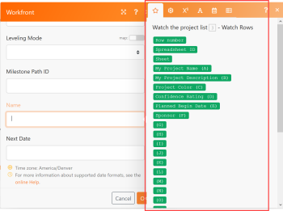

# 在Adobe Workfront Fusion中建立實務整合情境

本文會說明如何使用Adobe Workfront Fusion建立整合案例。 整合案例將不同的應用程式連線在一起，讓您的資料可流經不同的應用程式。

若要建立整合情境，您的組織必須有 [!DNL Workfront Fusion for Work Automation and Integration] 授權。

如需建立僅限Workfront的自動化情境的相關指示，請參閱 [在Adobe Workfront Fusion中建立實務自動化案例](../../workfront-fusion/get-started/create-a-practice-automation-scenario.md)

如需Workfront Fusion授權的詳細資訊，請參閱 [Adobe Workfront Fusion授權](../../workfront-fusion/get-started/license-automation-vs-integration.md).

>[!NOTE]
>
>您的組織不得允許存取Google工作表。 如果是這種情況，您將無法設定此整合，但此處顯示的資訊可用於作為整合案例如何運作的一般範例。

## 存取需求

您必須具有下列存取權才能使用本文中的功能：

<table style="table-layout:auto"> 
 <col> 
 <col> 
 <tbody> 
  <tr> 
    <td role="rowheader">[!DNL Adobe Workfront] 計畫*</td> 
   <td> 
[!DNL Pro] 或更高
 </td> 
  </tr> 
  <tr data-mc-conditions=""> 
   <td role="rowheader">[!DNL Adobe Workfront] 授權*</td> 
   <td> 
[！UICONTROL計畫]，[！UICONTROL工作]
 </td> 
  </tr> 
  <tr> 
   <td role="rowheader">[！UICONTROL Adobe Workfront Fusion]授權**</td> 
   <td>
   
目前授權需求：否 [!DNL Workfront Fusion] 授權需求。

   
或

   
舊版授權需求： [！UICONTROL [!DNL Workfront Fusion] 適用於工作自動化與整合] 

   </td> 
  </tr> 
  <tr> 
   <td role="rowheader">產品</td> 
   <td>
   
目前產品需求：如果您有[！UICONTROL Select]或[！UICONTROL Prime] [!DNL Adobe Workfront] 計畫，您的組織必須購買 [!DNL Adobe Workfront Fusion] 以及 [!DNL Adobe Workfront] 以使用本文所述的功能。 [!DNL Workfront Fusion] 包含在[！UICONTROL Ultimate]中 [!DNL Workfront] 計畫。

   
或

   
舊版產品需求：貴組織必須購買 [!DNL Adobe Workfront Fusion] 以及 [!DNL Adobe Workfront] 以使用本文所述的功能。

   </td> 
  </tr> 
 </tbody> 
</table>

若要瞭解您擁有的計畫、授權型別或存取權，請聯絡您的 [!DNL Workfront] 管理員。

有關的資訊 [!DNL Adobe Workfront Fusion] 授權，請參閱 [[!DNL Adobe Workfront Fusion] 授權](../../workfront-fusion/get-started/license-automation-vs-integration.md).

## 建立實務情境

的作用 [!DNL Adobe Workfront Fusion] 是自動化您的流程，以便您可以專注於新任務，而不是一而再、再而三地重複相同的任務。 其運作方式是連結應用程式和服務內外的動作，以建立自動傳輸和轉換資料的情境。 您建立的案例會監視應用程式或服務中的資料，並處理該資料以提供您想要的結果。

案例由一系列模組組成，這些模組會指出應如何在應用程式內轉換資料，或在應用程式和Web服務之間傳輸資料。

說明如何建立情境並在您學習使用時強化最佳實務 [!DNL Workfront Fusion]，本文會逐步引導您完成此程式。 我們將建立一個情境，此情境會在中建立新記錄 [!DNL Workfront] 對中的每一列 [!DNL Google Sheets] 試算表。

>[!TIP]
>
>如果您的試算表列出需要在中使用專案的專案，這種案例會很有用 [!DNL Workfront]. 此情境可以「監視」試算表以尋找新列，並在中新增專案 [!DNL Workfront] 每一張。

建立情境包含數個主要工作：

## 選擇應用程式並命名情境

1. 下載此專案 [試算表](https://cdn.experience.workfront.com/Documentation/Workfront+Fusion/Fusion+Practice+Scenario+Sample+Sheet.xlsx)，然後將其上傳至您的 [!DNL Google Drive] 以便在本練習中使用。

   或

   建立或尋找您自己的簡單 [!DNL Google Sheets] 與此類似的試算表：

   

1. 登入您的 [!DNL Workfront Fusion] 帳戶。
1. 按一下 **[!UICONTROL 情境]**  在左側面板中。

   >[!NOTE]
   >
   >如果您看不到左側導覽面板或其圖示，請按一下「功能表」  圖示。

   在灰色 [!UICONTROL 資料夾] 在顯示的面板中，您可以將情境組織到資料夾中。

   在右邊主要區域的頂端，您可以檢視 **[!UICONTROL 全部]** 您已建置的情境，您的 **[!UICONTROL 作用中案例]** 和 **[!UICONTROL 非使用中案例]**、和 **[!UICONTROL 概念]**，這些案例之前需要更多處理 [!DNL Workfront Fusion] 可將它們分類為作用中或非作用中。

<!--
   
-->

1. 在 [!UICONTROL 資料夾] 面板，按一下 **[!UICONTROL 新增資料夾]** 圖示 ，然後為第一個資料夾輸入名稱，如「Practice scenarios」。

1. 開啟資料夾，然後按一下 **[!UICONTROL 建立新情境]** 在頁面的右上角。

   顯示的登入頁面可讓您預先載入您要在要建立的情境中使用的任何應用程式。

1. 在本練習中，請搜尋並選取 **[!UICONTROL Google工作表]** 應用程式。
1. 按一下 **[!UICONTROL 繼續]** 位於右上角。

   情境編輯器隨即顯示，其中心包含一個空白模組， [!DNL Google Sheets] 已預先載入的應用程式，以及底部工具列中的某些選項。

<!--
   
-->

當您開始建立新情境時，最好從建立其名稱開始。

1. 選取 **[!UICONTROL 新情境]** 左上角的預留位置名稱，然後輸入名稱，例如「Practice scenario 1」。
1. 繼續使用 [新增並設定第一個模組](#add-and-configure-the-first-module) 底下。

## 新增並設定第一個模組

帶有問號的空白模組代表您需要新增的觸發程式模組。 此模組將在每次執行時啟動情境。 空白模組上的時鐘圖示表示是排程模組。

此模組將包含您想要案例觀看的資料。

1. 按一下空白模組，以選擇要從中選取模組的應用程式。

   您先前預先載入的應用程式會顯示在空白模組旁。 您可以使用 [!UICONTROL 搜尋] 方塊。

   

1. 按一下 **[!DNL Google Sheets]**.

   清單會變更為全部顯示 [!DNL Google Sheets] 可作為觸發模組的模組。

1. 按一下觸發程式模組 **[!UICONTROL 留意記錄]**.

   現在您需要建立與您的Google帳戶的已驗證連線。 您新增至情境的每個模組都必須有與其應用程式的連線。

1. 在 **[!DNL Google Sheets]** 方塊，下 **[!UICONTROL 連線]**，按一下 **[!UICONTROL 新增]**，然後輸入連線的名稱，例如「Olivia的Google帳戶」，然後按一下 **[!UICONTROL 繼續]**.
1. 在顯示的視窗中驗證連線。

   驗證連線的程式可能會因應用程式而異。 您可能需要登入應用程式。 您通常需要按一下 **[!UICONTROL 允許]** 按鈕。 如果您需要協助，請參閱 [連線總覽](../../workfront-fusion/connections/about-connecting-wf-fusion-to-app-or-service.md).

## 設定第一個模組

連線之後 [!DNL Workfront Fusion] 至您的 [!DNL Google Sheets] 帳戶，您可以指定 [!DNL Google Sheets] 您可以存取的試算表，以及您希望第一個模組處理的資料。

1. 按一下 **[!UICONTROL 試算表]** 方塊，然後選取 **[!UICONTROL Workfront Fusion實務案例] #1** 試算表於顯示的清單中。

   此試算表包含2個工作表（標籤），因此我們需要指定包含所需資料的工作表：

1. 在 **[!UICONTROL 工作表]** 下拉式清單，選取 **[!UICONTROL 專案]**.

   我們的試算表含有標題，我們希望模組能使用這些標題來識別我們要處理的資料：

   

1. 離開 **[!UICONTROL 是]** 已選取用於 **[!UICONTROL 表格包含標題]**.

1. 在 **[!UICONTROL 有標題的列]** 方塊中，您可以指定要包含的列範圍，但我們將保留此練習的預設值A1：Z1。
1. 在 **[!UICONTROL 限制]** 方塊，鍵入1。

   如此一來，每次執行案例時，模組僅會處理試算表中的1列。 當您建立案例時，這有助於簡化測試執行。

1. 按一下 **[!UICONTROL 確定]**.

   此 **[!UICONTROL 選擇開始位置]** 方塊會提示您指定試算表中您希望模組開始處理的位置。

1. 按一下 **[!UICONTROL 手動選擇]**，在出現的清單中選取頂端選項，然後按一下 **[!UICONTROL 確定]**.
1. 以滑鼠右鍵按一下模組，然後按一下 **[!UICONTROL 重新命名]**，然後輸入名稱並描述您希望模組執行的動作（例如「觀看專案清單」），然後按一下 **[!UICONTROL 確定]**.

   名稱會出現在模組正下方。 在底下， [!DNL Workfront Fusion] 包含模組所執行動作型別的簡短說明。

   

1. 繼續使用 [新增並設定第二個模組](#add-and-configure-the-second-module).

## 新增並設定第二個模組

1. 按一下模組右側的部分圓圈，以 **[!UICONTROL 新增另一個模組]**.

   此第二個模組必須是 [!DNL Workfront] 模組，但並未預先載入 [!DNL Workfront] 應用程式。

1. 若要尋找 [!DNL Workfront] 應用程式，開始輸入»[!DNL Workfront]」並在應用程式出現時按一下。
1. 在清單中 [!DNL Workfront] 模組，按一下 **[!UICONTROL 建立記錄]**.

1. 就像您之前使用Google工作表應用程式時一樣，按一下 **[!UICONTROL 新增]** 在 [!DNL Workfront] 方塊，以在Workfront Fusion和Workfront之間新增連線。

   現在開始指定如何處理試算表中的資料。

1. 按一下 **[!UICONTROL 記錄型別]**，然後選取 **[!UICONTROL 專案]** 因為我們要在中建立專案 [!DNL Workfront] 使用試算表中的列。

   >[!TIP]
   >
   >您可以找到 **[!UICONTROL 專案]** 在清單中(如果您開始輸入&quot;[!UICONTROL 專案].」

   方塊會展開並顯示所有可用的 [!DNL Workfront] 專案欄位，您可以在此處放置第一個模組找到的資訊。

   我們將使用 **[!UICONTROL 名稱]** 欄位：我們希望此模組能為每個專案命名 [!DNL Workfront] 使用對應檔案中的文字 [!UICONTROL Google工作表] 列。

1. 尋找並按一下 **[!UICONTROL 名稱]** 欄位。

   >[!TIP]
   >
   >您可以使用 **Cmd+F** ([!DNL Mac] 作業系統)或 **Ctrl-F**([!DNL Windows] OS)以快速找到欄位。

   這樣會開啟您可在下列專案中使用的變數清單： **[!UICONTROL 名稱]** 欄位以定義在Workfront中建立的每個專案名稱。

   

   請注意，清單頂端附近的變數與試算表中的欄標題對應。

   

   

1. 按一下變數 **[!UICONTROL 我的專案名稱(A)]** 將其新增至 **[!UICONTROL 名稱]** 欄位。

   您剛剛針對此情境對應了您的第一段資料。

   讓我們從試算表將另一段資料對應至 [!DNL Workfront]：每個專案的開始日期。

1. 尋找並按一下 **[!UICONTROL 計劃開始日期]** 欄位，然後按一下 **[!UICONTROL 計劃開始日期(E)]** 變數，以從試算表中的該欄提取資料。

1. 按一下 **[!UICONTROL 確定]**.

   現在您有工作情境了。

1. 為第二個模組命名，例如「建立Workfront專案」，然後繼續 [測試情境](#test-the-scenario).

## 測試情境

在啟動情境之前，請務必執行情境至少一次，並檢視結果，以測試情境。 這有助於您瞭解資料如何流經此情境並找出任何錯誤。

我們選擇處理試算表中的1列，以便在Workfront中建立專案。 如果您執行情境，應該就會發生這種情況。

1. 按一下 **[!UICONTROL 執行一次]** 位於情境編輯器的左下角。
1. 情境執行完畢後，按一下上方的 [!DNL Google Sheets] 模組。

   

   在出現的方塊中，您可以檢視模組所處理資料組合的相關資訊，包括從試算表為您開始使用的列提取的實際資料。

   

1. 按一下上方的執行檢測器泡泡 [!DNL Workfront] 用於檢視資訊輸入和輸出的模組，這是現在於中建立的專案的ID [!DNL Workfront]

   

   您可在下列文章中進一步瞭解如何閱讀案例執行資訊：

   * 如需一般資訊，請參閱 [中的案例執行流程 [!DNL Adobe Workfront Fusion]](../../workfront-fusion/scenarios/scenario-execution-flow.md).
   * 如需已處理套裝的詳細資訊，請參閱 [中的案例執行、週期和階段 [!DNL Adobe Workfront Fusion]](../../workfront-fusion/scenarios/scenario-execution-cycles-phases.md).

1. 前往 [!DNL Workfront] 並搜尋「soho downtown loft」，檢視情境建立的專案。 這是試算表中的最後一列。
1. 在 [!DNL Workfront Fusion]，按一下 **[!UICONTROL 儲存]**  靠近左下角，儲存情境的進度。

   >[!IMPORTANT]
   >
   >隨時儲存並測試情境。

## 完成情境並再次測試

我們仍需要設定情境，以便為試算表中的所有其他列建立專案。

1. 按一下 **[!UICONTROL 觀看列]** 您為Google Sheets建立的模組。
1. 變更 **[!UICONTROL 限制]** 至100。

   在試算表中指定大於已知列數的數字，可確保案例擷取所有列數。

1. 用滑鼠右鍵按一下 **[!UICONTROL 觀看列]** 模組，按一下 **[!UICONTROL 選擇開始位置]**，按一下 **[!UICONTROL 全部]**，然後按一下 **[!UICONTROL 確定]**.

1. 按一下 **[!UICONTROL 執行一次]** 並觀察執行檢查器泡泡中發生的情況。

   此 [!DNL Google] 工作表 **[!UICONTROL 觀看列]** 模組會執行一次，以讀取所有列。 接著Workfront **[!UICONTROL 建立記錄]** 模組會執行20次，為試算表中剩餘的20列各建立一個專案。

1. 按一下以下專案的「執行檢測器」泡泡 [!DNL Workfront] 模組，以檢視所有20個作業，然後按一下其中一個作業，以檢視有關已建立專案的資訊。
1. 按一下 **[!UICONTROL 儲存]**  左下角附近。
1. 前往 [!DNL Workfront] 以檢視情境建立的專案。

>[!TIP]
>
>我們建議您選擇加入每個模組相關附註的作法，但此作法相當實用。
>
>1. 用滑鼠右鍵按一下 [!DNL Workfront] 模組，然後按一下 **[!UICONTROL 新增附註]**.
>1. 在顯示的附註中，輸入模組的概觀。
>
>    這很有幫助，因為您不需要持續開啟模組來檢視其功能。 您可以輸入類似於「建立專案，其名稱、計劃開始日期以及從試算表對映的優先順序」的內容。
>
>    對於 [!UICONTROL Google工作表] 模組，您可以輸入「觀看新增新列/專案的專案清單」之類的文字。
>
>    您可以為一個模組新增多個附註。
>
>1. 關閉 **[!UICONTROL 附註]** 區域。
>
>    將附註新增至情境後， **[!UICONTROL 附註]** 圖示  位於案例編輯器底部。
>
>1. 按一下 **[!UICONTROL 附註]** 圖示  以檢視您的附註。
>

## 啟動情境

如果這是您用於真實資料的情境，您的最後一件事就是啟動它。 啟用案例後，預設會每15分鐘執行一次。 您可以定義何時以及多久執行一次來變更此專案。

如需啟用案例的詳細資訊，請參閱 [在Adobe Workfront Fusion中啟用或停用案例](../../workfront-fusion/scenarios/activate-or-inactivate-scenario.md).

如需排程的相關資訊，請參閱 [在Adobe Workfront Fusion中排程情境](../../workfront-fusion/scenarios/schedule-a-scenario.md).
