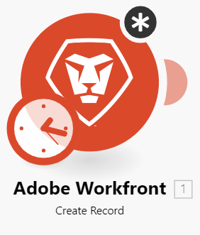

# 在中建立情境 [!DNL Adobe Workfront Fusion]

下列工作說明如何建立 [!DNL Adobe Workfront Fusion] 情境。

如需逐步引導您建立自動化情境的練習練習，請參閱 [在中建立練習自動化情境 [!DNL Adobe Workfront Fusion]](../../workfront-fusion/get-started/create-a-practice-automation-scenario.md).

如需逐步引導您使用我們提供的資料建立整合情境的練習練習，請參閱 [在Adobe Workfront Fusion中建立實務整合情境](../../workfront-fusion/get-started/create-a-practice-scenario.md).

>[!NOTE]
>
>若要從範本建立情境，請參閱 [建立情境，使用 [!DNL Adobe Workfront Fusion] 範本](../../workfront-fusion/scenarios/templates/create-scenarios-with-fusion-templates.md).

## 存取需求

您必須具有下列存取權才能使用本文中的功能：

<table style="table-layout:auto"> 
 <col> 
 <col> 
 <tbody> 
  <tr> 
    <td role="rowheader">[!DNL Adobe Workfront] 計劃*</td> 
   <td> 
[!DNL Pro] 或更高
 </td> 
  </tr> 
  <tr data-mc-conditions=""> 
   <td role="rowheader">[!DNL Adobe Workfront] 授權*</td> 
   <td> 
[！UICONTROL計畫]，[！UICONTROL工作]
 </td> 
  </tr> 
  <tr> 
   <td role="rowheader">[！UICONTROL Adobe Workfront Fusion]授權**</td> 
   <td> 
[！UICONTROL [!DNL Workfront Fusion] 適用於工作自動化與整合] 

[！UICONTROL [!DNL Workfront Fusion] 工作自動化專用]

[！UICONTROL [!DNL Workfront Fusion] 工作自動化專用]
    </td> 
  </tr> 
  <tr> 
   <td role="rowheader">產品</td> 
   <td>
   
目前產品需求：如果您有[！UICONTROL Select]或[！UICONTROL Prime] [!DNL Adobe Workfront] 計畫，您的組織必須購買 [!DNL Adobe Workfront Fusion] 以及 [!DNL Adobe Workfront] 以使用本文所述功能。 [!DNL Workfront Fusion] 包含在[！UICONTROL Ultimate]中 [!DNL Workfront] 計畫。

   
或

   
舊版產品需求：貴組織必須購買 [!DNL Adobe Workfront Fusion] 以及 [!DNL Adobe Workfront] 以使用本文所述功能。

   </td> 
  </tr> 
 </tbody> 
</table>

若要瞭解您擁有哪些計畫、授權型別或存取權，請聯絡您的 [!DNL Workfront] 管理員。

有關以下專案的資訊： [!DNL Adobe Workfront Fusion] 授權，請參閱 [[!DNL Adobe Workfront Fusion] 授權](../../workfront-fusion/get-started/license-automation-vs-integration.md).

## 開始建立情境

1. 按一下 **[!UICONTROL 情境]**  在左側面板中。

1. 按一下 **[!UICONTROL 建立新情境]** 在頁面的右上角。
1. 在出現的畫面（情境編輯器）中，如果您要建立新情境，請按一下 **[!UICONTROL 新情境]** 並輸入情境的名稱。
1. 繼續到 [在情境中新增模組](#add-a-module-in-a-scenario).

## 在情境中新增模組

1. 若要將第一個模組新增至情境，請按一下問號圖示。 

   或

   若要將其他模組新增至情境，請按一下您希望其遵循的模組右側的控點。

1. 在顯示的方塊中，尋找並按一下您要開始使用的應用程式或服務。

   任何先前選取的應用程式都會顯示在方塊中，以方便存取，以及 **[!UICONTROL 我的最愛]** 區段。

   如果您按一下 **[!UICONTROL 新增另一個模組]**，顯示的模組取決於您新增模組的情境中的哪個位置。 有些模組只能放在其他模組之間，其他模組則只能放在情境的開頭處。

   >[!TIP]
   >
   >最常見的兩種模組型別為動作和觸發器。 如需詳細資訊，請參閱 [模組型別](../../workfront-fusion/modules/module-types.md).

1. 在顯示的模組清單中，按一下您要新增至情境的第一個模組。

   顯示的模組取決於您要在情境中新增模組的位置。 有些模組只能放在其他模組之間，其他模組則只能放在情境的開頭處。

   最常見的兩種模組型別為動作和觸發器。 如需詳細資訊，請參閱 [模組型別](../../workfront-fusion/modules/module-types.md).

1. 繼續到 [將模組的應用程式或Web服務連線至 [!DNL Workfront Fusion]](#connect-the-modules-app-or-web-service-to-workfront-fusion).

## 將模組的應用程式或Web服務連線至 [!DNL Workfront Fusion] {#connect-the-modules-app-or-web-service-to-workfront-fusion}

連線到應用程式的Workfront Fusion模組(例如 [!DNL Workfront]， [!DNL Salesforce]，或 [!DNL Jira)] 特色為 [!UICONTROL 連線] 欄位。 您可以在此處指定您希望此模組用來連線至應用程式的連線。 您可以從下拉式選單中選取現有連線，或建立新連線。

當您為案例中的應用程式選取或建立連線時，該應用程式的其他模組會自動使用相同的連線，除非您在設定較新的模組時選取了不同的連線。

如需詳細資訊，請參閱 [關於連線 [!DNL Adobe Workfront Fusion] 至應用程式或服務](../../workfront-fusion/connections/about-connecting-wf-fusion-to-app-or-service.md).

若要在內部建立連線 [!DNL Workfront Fusion] 模組：

1. 按一下 **[!UICONTROL 新增]** 以開啟 **[!UICONTROL 建立連線]** 方塊。
1. （選用）變更預設值 **[!UICONTROL 連線名稱]**.
1. （條件式）如果應用程式需要進階連線設定，例如ID、金鑰或 [!UICONTROL 密碼]，請輸入該資訊。

   您可能需要按一下 **[!UICONTROL 顯示進階設定]** 以顯示可輸入此類資訊的欄位。

1. 按一下 **[!UICONTROL 繼續]**.
1. 在顯示的登入視窗中，輸入您的認證以登入應用程式（如果尚未這麼做）。
1. （有條件）若為 **[!UICONTROL 允許]** 按鈕顯示，檢查聯結器將能夠採取的動作，然後按一下按鈕以連線應用程式 [!DNL Workfront Fusion].
1. 繼續到 [設定模組](#configure-the-module).

## 設定模組

1. 在「連線」欄位下方的欄位中，設定模組的設定，然後按一下 **[!UICONTROL 確定]**.

   

   每個模組的這些設定都不同。 粗體標題表示必要的設定。

   >[!TIP]
   >
   >當您處理情境時，可以隨時按一下模組以顯示此設定方塊。
   >
   >
   >如果您在模組中看到黑色圓圈，表示您尚未完成其設定。 按一下模組以開啟，然後繼續設定。
   >
   >
   >

1. 如果您要在情境中新增第一個模組，請選取一個選項，以指出每次執行情境時，希望情境從何處開始。

   

1. 重複區段中的步驟 [在情境中新增模組](#add-a-module-in-a-scenario) 和 [設定模組](#configure-the-module) 將其他模組新增至情境。

1. （可選）複製並貼上模組或模組群組。

   如需詳細資訊，請參閱 [複製Adobe Workfront Fusion中的模組或情境](../../workfront-fusion/scenarios/copy-modules-or-scenarios.md).

1. 繼續到 [設定並搭配您的情境使用](#configure-and-work-with-your-scenario).

## 設定並搭配您的情境使用

1. 執行下列任一項作業來設定您的情境：

   <table style="table-layout:auto"> 
    <col> 
    <col> 
    <tbody> 
     <tr> 
      <td role="rowheader">指定案例執行的時間和頻率</td> 
      <td> 
按一下時鐘圖示。 
 
  
 
如需詳細資訊，請參閱 <a href="../../workfront-fusion/scenarios/schedule-a-scenario.md" class="MCXref xref">排程情境於 [!DNL Adobe Workfront Fusion]</a>.
 </td> 
     </tr> 
     <tr> 
      <td role="rowheader">設定路由</td> 
      <td> 
按一下扳手圖示  ，並使用下列任一選項。 如需詳細資訊，請參閱 <a href="../../workfront-fusion/scenarios/add-a-filter-to-a-scenario.md" class="MCXref xref">將篩選器新增至中的情境 [!DNL Adobe Workfront Fusion]</a>.
 
       <ul> 
        <li><strong>[！UICONTROL設定篩選器]</strong>：控制情景中特定時間點使用的套件組合。</li> 
        <li><strong>[！UICONTROL取消連結]</strong>：移除路由。</li> 
        <li><strong>[！UICONTROL新增路由器]</strong>：在模組之間新增路由器。 </li> 
        <li><strong>[！UICONTROL新增模組]</strong>：在模組之間新增模組。</li> 
        <li><strong>[！UICONTROL新增附註]</strong>：新增註記至路由。</li> 
       </ul> </td> 
     </tr> 
     <tr> 
      <td role="rowheader">設定情境設定</td> 
      <td>按一下[！UICONTROL案例設定]圖示。  這些設定主要供進階使用者使用。 如需詳細資訊，請參閱 <a href="../../workfront-fusion/scenarios/scenario-settings-panel.md" class="MCXref xref">中的案例設定面板 [!DNL Adobe Workfront Fusion]</a>.</td> 
     </tr> 
     <tr> 
      <td role="rowheader">設定流量控制設定</td> 
      <td> 
按一下[！UICONTROL流量控制]圖示。  您可以將工作設定為重複指定次數、將陣列轉換為一系列組合，以及將多個組合合併為一個單一組合。 如需詳細資訊，請參閱 <a href="../../workfront-fusion/apps-and-their-modules/flow-control.md" class="MCXref xref">中的流量控制 [!DNL Adobe Workfront Fusion]</a>.
 </td> 
     </tr> 
     <tr> 
      <td role="rowheader">使用進階工具增強情境</td> 
      <td>按一下 [!DNL Tools] 圖示。  您可以建立觸發器、動作、彙總器和轉換器。 如需詳細資訊，請參閱 <a href="../../workfront-fusion/apps-and-their-modules/tools-modules.md" class="MCXref xref">工具</a>.</td> 
     </tr> 
     <tr> 
      <td role="rowheader">使用者文字剖析工具</td> 
      <td>按一下 [!DNL Text parser] 圖示 . 您可以從HTML程式碼擷取元素、尋找和擷取符合搜尋模式的字串元素、搜尋和取代文字，以及從網站「刮擦」資料。 如需詳細資訊，請參閱 <a href="../../workfront-fusion/apps-and-their-modules/tools-modules.md" class="MCXref xref">工具</a>.</td> 
     </tr> 
    </tbody> 
   </table>

1. 執行下列任一項作業以搭配您的情境使用：

   <table style="table-layout:auto"> 
    <col> 
    <col> 
    <tbody> 
     <tr> 
      <td role="rowheader">檢視案例執行時發生的事件記錄</td> 
      <td> 
按一下[！UICONTROL Exit editing]箭頭  在情境編輯器中檢視「情境詳細資料」頁面。 記錄顯示在視窗底部或右下角。 它包含有關每個階段的資訊，以及在執行情境期間遇到的任何錯誤。
 
若要返回使用中的情境 [!DNL scenario editor]，按一下「案例詳細資訊」頁面上的任何位置。
 
如需「案例」詳細資訊頁面的詳細資訊，請參閱 <a href="../../workfront-fusion/scenarios/scenario-detail.md" class="MCXref xref">中的案例詳細資料 [!DNL Adobe Workfront Fusion]</a>.
 </td> 
     </tr> 
     <tr> 
      <td role="rowheader">存取您最常用的應用程式和服務</td> 
      <td> 按一下 <strong>[！UICONTROL我的最愛]</strong> 區段。 當您將應用程式和服務新增到您的情境時，此區段中會自動顯示圖示。 您也可以按一下[！UICONTROL新增]圖示  手動新增應用程式和服務至此區域。</td> 
     </tr> 
     <tr> 
      <td role="rowheader">檢視顯示資料如何流經情境的動畫</td> 
      <td>按一下[！UICONTROL說明流程]圖示 .</td> 
     </tr> 
     <tr> 
      <td role="rowheader">自動對齊模組的版面 </td> 
      <td>按一下[！UICONTROL自動對齊]圖示 .</td> 
     </tr> 
     <tr> 
      <td role="rowheader">輸入或檢視有關情境的附註</td> 
      <td>按一下[！UICONTROL Notes]圖示 .</td> 
     </tr> 
     <tr> 
      <td role="rowheader">移除模組</td> 
      <td>以滑鼠右鍵按一下模組，然後按一下 <strong>[！UICONTROL刪除模組]</strong>.</td> 
     </tr> 
    </tbody> 
   </table>

1. 若要測試執行案例，請按一下 **[!UICONTROL 執行一次]**.

   在啟用情景之前，請務必確認情景可如預期般執行。 一旦啟用，情境將會根據其排程執行。 如果所有專案都未如預期執行，請參閱 [中的錯誤處理 [!DNL Adobe Workfront Fusion]](../../workfront-fusion/errors/error-handling.md).

1. 完成情景編輯後（或在編輯的任何時候），按一下 [!UICONTROL 儲存] 圖示加以檢視 .

如需啟用情境的相關資訊，請參閱 [啟用或停用中的情境 [!DNL Adobe Workfront Fusion]](../../workfront-fusion/scenarios/activate-or-inactivate-scenario.md).

## Workfront Fusion案例鍵盤快速鍵

建立或編輯案例時，您可以使用下列鍵盤快速鍵：

<table style="table-layout:auto"> 
 <col data-mc-conditions=""> 
 <col data-mc-conditions=""> 
 <col data-mc-conditions=""> 
 <thead> 
  <tr> 
   <th> 
動作
 </th> 
   <th>[!DNL Windows]</th> 
   <th> 
[!DNL MacOS]
 </th> 
  </tr> 
 </thead> 
 <tbody> 
  <tr> 
   <td role="rowheader">[！UICONTROL儲存] </td> 
   <td>Ctrl+Shift+S</td> 
   <td>Cmd+Shift+S </td> 
  </tr> 
  <tr> 
   <td role="rowheader">[！UICONTROL執行一次]</td> 
   <td>Ctrl+Shift+Enter</td> 
   <td>Cmd+Shift+Enter </td> 
  </tr> 
 </tbody> 
</table>
