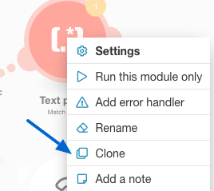

# [!DNL Adobe Workfront Fusion]案例範例：連線電子郵件、[!UICONTROL 文字剖析器]和[!DNL Google Sheets]

此案例可協助您建立所有電子郵件訊息的記錄，並在試算表中標籤這些訊息以供後續動作。 它會使用規則運算式(Regex)作為搜尋模式，擷取試算表中兩個個別表格中的電子郵件內文。 第一個模式會搜尋片語，第二個模式會搜尋相同的片語和電子郵件地址。

## 存取需求

您必須具有下列存取權才能使用本文中的功能：

<table style="table-layout:auto"> 
 <col> 
 <col> 
 <tbody> 
  <tr> 
    <td role="rowheader">[!DNL Adobe Workfront] 計畫*</td> 
   <td> 
[!DNL Pro] 或更高
 </td> 
  </tr> 
  <tr data-mc-conditions=""> 
   <td role="rowheader">[!DNL Adobe Workfront] 授權*</td> 
   <td> 
[！UICONTROL計畫]，[！UICONTROL工作]
 </td> 
  </tr> 
  <tr> 
   <td role="rowheader">[！UICONTROL Adobe Workfront Fusion]授權**</td> 
   <td>
   
目前授權需求：無[!DNL Workfront Fusion]授權需求。

   
或

   
舊版授權需求：[！UICONTROL [!DNL Workfront Fusion] for Work Automation and Integration] 

   </td> 
  </tr> 
  <tr> 
   <td role="rowheader">產品</td> 
   <td>
   
目前產品需求：如果您有[！UICONTROL Select]或[！UICONTROL Prime] [!DNL Adobe Workfront]計畫，您的組織必須購買[!DNL Adobe Workfront Fusion]及[!DNL Adobe Workfront]，才能使用本文所述的功能。 [!DNL Workfront Fusion]包含在[！UICONTROL Ultimate] [!DNL Workfront]計畫中。

   
或

   
舊版產品需求：您的組織必須購買[!DNL Adobe Workfront Fusion]及[!DNL Adobe Workfront]，才能使用本文所述的功能。

   </td> 
  </tr> 
 </tbody> 
</table>

若要瞭解您擁有的計畫、授權型別或存取權，請連絡您的[!DNL Workfront]管理員。

如需[!DNL Adobe Workfront Fusion]授權的相關資訊，請參閱[[!DNL Adobe Workfront Fusion] 授權](../../workfront-fusion/get-started/license-automation-vs-integration.md)。

## 先決條件

本教學課程需要規則運算式的基本知識。 若要瞭解規則運算式，請造訪[https://regexone.com](https://regexone.com/)。

新增並設定第一個模組

1. 搜尋電子郵件並選擇&#x200B;**[!UICONTROL 觀看電子郵件]**&#x200B;作為觸發器。

   >[!NOTE]
   >
   >雖然您可以使用E郵件模組連線[!DNL Google]帳戶，但您也可以使用[!DNL Gmail]模組。

1. 連線[!DNL Google]帳戶或任何其他IMAP電子郵件使用者端（例如[!DNL Outlook]）。
1. 連線之後，選取您要觀看其內送電子郵件的資料夾，例如[!UICONTROL 收件匣]。
1. 在[!UICONTROL 條件]下，選擇&#x200B;**[!UICONTROL 所有電子郵件]** （或縮小範圍以讀取或未讀取電子郵件）。

   您也可以選擇將擷取的電子郵件標示為已讀取或未讀取。

1. 將[!UICONTROL 結果數目上限]設為1。

   

   您可以根據收到的訊息數量來變更此設定。 不過，建議設定低值並更頻繁地執行情境。

1. 按一下底部的&#x200B;**[!UICONTROL [顯示進階設定]**]。

   

1. 依[!UICONTROL 寄件者地址]、[!UICONTROL 主旨]和[!UICONTROL 片語]篩選電子郵件。

   這可讓您只觀看相關的電子郵件。 在此範例中，我們僅新增「主旨」篩選條件，並將其他2個保留為空白。

   >[!NOTE]
   >
   >我們將新增路由器，以使用[!UICONTROL 符合模式]迭代器及規則運算式(Regex)做為搜尋模式，來尋找電子郵件中的片語。 這也讓我們能夠建置多公用程式的情境。

1. 完成設定後，系統會提示您指定開始觀看電子郵件的位置，請按一下&#x200B;**[!DNL From now on]**。

   

1. 繼續[搜尋[!UICONTROL 流量控制]並新增[!UICONTROL 路由器]](#search-for-flow-control-and-add-a-router)

## 搜尋[!UICONTROL 流量控制]並新增[!UICONTROL 路由器]

1. 在任何模組之後新增路由器，將資料分割或複製，再傳送至下一個模組。

   在此處，我們已使用[!UICONTROL 路由器]將電子郵件內文傳送至[!DNL Google Sheet]中的2個個別表格。

   

## 使用[!UICONTROL 文字剖析器]模組

1. 新增[!UICONTROL 符合模式]轉換器以搜尋電子郵件中的片語。

   我們將搜尋所有傳入電子郵件中的片語&quot;[!UICONTROL 文字剖析器模組]&quot;，以擷取符合該片語的內文和寄件者姓名。

   1. 將模式寫入為規則運算式：

      text\sparser\smodule

   1. （選用）使用任何其他的「陣列」選項。

      

      如果文字包含數行，而且您需要搜尋每行中的圖樣，多行會很有用。 在本教學課程中，我們需要搜尋整個電子郵件內文的模式，因此我們將保留未勾選的狀態。

   1. 在[!UICONTROL 文字]欄位中，按一下清單中的屬性&#x200B;**文字內容**。

      

      這是儲存電子郵件內文文字的屬性，我們會在其中搜尋模式。

1. 新增搜尋相同片語和電子郵件地址的其他[!UICONTROL 相符模式]。

   如果您擁有具有多個使用者的客戶帳戶，這會特別有用。 為了節省時間，您可以複製您剛建立的[!UICONTROL 文字剖析器]模組，並將其連結至路由器。

   

1. 編輯模式，如下所示：

   text\sparser\smodule。+\s([\w.-]+@[\w.-]+)

   

   此模式會搜尋片語&quot;[!UICONTROL 文字剖析器模組]&quot;和電子郵件地址(例如john.doe@gmail.com)，並只傳回電子郵件地址。

   >[!NOTE]
   >
   >根據您接受的電子郵件地址規格來撰寫規則運算式很重要，但上述規格可處理大部分的標準電子郵件地址。

   * 如果您只想搜尋電子郵件地址，可以使用下方的規則運算式：

     ([\w.-]+@[\w.-]+)

   * 您也可以使用以下規則運算式搜尋電話號碼：

     ^[+]？\(？(\d{1，3})\)？[\s-]？\(？(\d{3})\)？[\s-]？\d{3}[\s-]？\d{3，4}
上述模式涵蓋寫入電話號碼時最常見的格式。

   若要測試您的模式，我們建議使用[[!DNL https://regex101.com]](https://regex101.com/)搭配[!DNL javascript]做為Flavor。

   其餘的組態會與之前的組態相同。

## 新增[!DNL Google Sheets]模組

針對[!DNL Sheets]，我們需要先建立具有必要標題的試算表。

1. 建立試算表，其中包含您要擷取使用者資料的欄。 （您也可以使用現有的檔案）。

   例如，以寄件者名稱、寄件者電子郵件和電子郵件內容為欄，建立名為「電子郵件資料：支援票證」的票證。 將工作表命名為「包含：文字剖析器模組」。

1. 新增[!UICONTROL Google工作表]模組，並將&#x200B;**[!UICONTROL 新增列]**&#x200B;作為動作。

   

1. 連線您的[!DNL Google]帳戶（如果尚未連線）。 選擇您先前建立的「檔案」，然後選擇您要擷取資料的工作表。

   您的設定應該如下所示：

   

1. 對應相關欄位（欄）中的屬性以完成模組設定。

   

1. 複製您剛建立的模組，並將其連結至第二個[!UICONTROL 文字剖析器]模組。

   1. 移至您的試算表，複製您先前建立的工作表並為其命名。

      例如，將其命名為「contains： text parser module and email」。

   1. 新增另一欄以儲存電子郵件內文包含的電子郵件地址。

      例如，將其命名為「Email Address Shared」。

   1. 按一下複製的[!DNL Google Sheets]模組以設定安裝。
   1. 將工作表變更為您剛建立的新工作表。
   1. 將[!UICONTROL 符合模式]模組($1)的輸出對應到您要儲存電子郵件地址（共用的電子郵件地址）的欄。

      

      

   1. 按一下&#x200B;**[!UICONTROL 確定]**，儲存情境，然後進行測試回合。

      您必須傳送兩封個別的電子郵件至連線的電子郵件地址，如下所示：

      * 包含片語&quot;[!UICONTROL 文字剖析器模組]&quot; （沒有電子郵件地址）

        

      * 包含上述短語和電子郵件地址

        

        如果您的設定沒有錯誤，您會看到第一個工作表擷取所有包含片語「[!UICONTROL 文字剖析器模組]」的電子郵件，而第二個工作表僅擷取包含片語「[!UICONTROL 文字剖析器模組]」和電子郵件地址的電子郵件。 您可以參閱下方的熒幕擷取畫面。

        工作表1：

        

        工作表2：

        

## 資源

* [免費練習](https://regexone.com/)以瞭解規則運算式
* [瞭解使用Regex匹配的電話號碼](https://regexone.com/problem/matching_phone_numbers)
* [瞭解使用Regex的電子郵件比對](https://regexone.com/problem/matching_emails)
* [測試您的規則運算式](https://regex101.com/)
