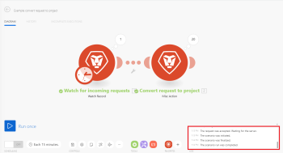

# 中的案例編輯器 [!DNL Adobe Workfront Fusion]

方案編輯器可讓您在視覺化介面中建立和編輯方案。

## 存取需求

您必須具備下列存取權才能使用本文中的功能：

<table style="table-layout:auto"> 
 <col> 
 <col> 
 <tbody> 
  <tr> 
    <td role="rowheader">[!DNL Adobe Workfront] 計劃*</td> 
   <td> 
[!DNL Pro] 或更高
 </td> 
  </tr> 
  <tr data-mc-conditions=""> 
   <td role="rowheader">[!DNL Adobe Workfront] 授權*</td> 
   <td> 
[!UICONTROL計畫]、[!UICONTROL工作]
 </td> 
  </tr> 
  <tr> 
   <td role="rowheader">[!UICONTROL Adobe Workfront Fusion]授權**</td> 
   <td> 
[!UICONTROL [!DNL Workfront Fusion] （工作自動化和整合） 

[!UICONTROL [!DNL Workfront Fusion] （工作自動化）
  </td> 
  </tr> 
  <tr> 
   <td role="rowheader">產品</td> 
   <td>貴組織必須購買 [!DNL Adobe Workfront Fusion] 和 [!DNL Adobe Workfront] 以使用本文所述的功能。</td> 
  </tr> 
 </tbody> 
</table>

若要了解您擁有的計畫、授權類型或存取權，請聯絡您的 [!DNL Workfront] 管理員。

如需 [!DNL Adobe Workfront Fusion] 許可證，請參閱 [[!DNL Adobe Workfront Fusion] 授權](../../workfront-fusion/get-started/license-automation-vs-integration.md).

## 開啟案例編輯器：

1. 按一下 **[!UICONTROL 藍本]**  中。

1. 如果要建立藍本，請按一下 **[!UICONTROL 建立新藍本]** 在頁面的右上角。

   或

   如果要編輯現有藍本，請按一下藍本。

   在顯示的案例編輯器中，您可以執行下表所列的所有動作。 如需詳細資訊，請參閱 [在中建立案例 [!DNL Adobe Workfront Fusion]](../../workfront-fusion/scenarios/create-a-scenario.md).

1. 完成藍本的編輯時（或在編輯時隨時），按一下 [!UICONTROL 儲存] 表徵圖。 

   >[!NOTE]
   >
   >儲存您的案例後，三點功能表底下會提供新版本，以備您日後需要存取時使用。 先前儲存的案例版本僅可供60天使用。

## 可用的方案編輯器動作

方案編輯器中提供下列動作：

<table style="table-layout:auto"> 
<tbody>
  <tr>
     <td role="rowheader">新增第一個模組</td>
     <td> 
按一下問號圖示。 
 
 然後尋找並按一下您要啟動的應用程式或服務。 如果您在步驟2中選取了任何應用程式，則這些應用程式會顯示在此處以方便存取(以及 <strong>[!UICONTROL收藏夾]</strong> 區段)。
 </td>
  </tr>
  <tr>
     <td role="rowheader">新增模組</td>
     <td>將滑鼠指標暫留在模組上，按一下右側的加號圖示，然後在顯示的功能表中按一下您要的模組。</td>
  </tr>  
  <tr>   
     <td role="rowheader">指定執行情境的時間和頻率</td>  
      <td> 
按一下時鐘錶徵圖。 
 
  
 
如需詳細資訊，請參閱 <a href="../../workfront-fusion/scenarios/schedule-a-scenario.md" class="MCXref xref">在中排程藍本 [!DNL Adobe Workfront Fusion]</a>.
 </td>
  </tr>  
  <tr>
     <td role="rowheader">設定路由</td>   
     <td> 
按一下[!UICONTROL扳手]圖示  使用下列任一選項：
    
       <ul>
         <li><strong>[!UICONTROL設定篩選器]</strong>:控制在場景中的特定點使用的套件組合。 如需詳細資訊，請參閱 <a href="../../workfront-fusion/scenarios/add-a-filter-to-a-scenario.md" class="MCXref xref">將篩選器新增至案例，於 [!DNL Adobe Workfront Fusion]</a>.</li>     
         <li><strong>[!UICONTROL取消連結]</strong>:刪除路由。</li>     
         <li><strong>[!UICONTROL添加路由器]</strong>:在模組之間添加路由器。 </li>     
         <li><strong>[!UICONTROL添加模組]</strong>:在模組之間新增模組。</li>     
         <li><strong>[!UICONTROL添加註釋]</strong>:將注釋添加到路由。</li>   
       </ul> 
     </td>  
  </tr>  
  <tr>  
     <td role="rowheader">移除模組</td>   
     <td>以滑鼠右鍵按一下模組，然後按一下 <strong>[!UICONTROL刪除模組]</strong>.</td>  
   </tr>  
   <tr> 
     <td role="rowheader">案例是檢視發生的事件記錄</td>     
     <td> 
       
執行案例。 當情境完成執行時，記錄檔會顯示在[!UICONTROL情節編輯器]的右下角。 
 
  
 
根據情境，日誌可以包含有關每個階段的難度以及在執行方案期間遇到的任何錯誤的資訊。
 
     </td>  
   </tr>  
   <tr>   
     <td role="rowheader">配置方案設定</td>   
     <td>按一下[!UICONTROL方案設定]表徵圖。  這些設定主要針對進階使用者。</td>  
   </tr>  
   <tr>   
     <td role="rowheader">輸入或檢視藍本的相關附註</td>   
     <td>按一下[!UICONTROL Notes]表徵圖。 </td>  
   </tr>  
   <tr> 
     <td role="rowheader">自動對齊模組的佈局 </td>   
     <td>按一下[!UICONTROL自動對齊]表徵圖。 </td>  </tr>  <tr>   <td role="rowheader">檢視動畫，顯示資料如何在情境中流動</td>   <td>按一下[!UICONTROL說明流]表徵圖。 </td>  
   </tr>  
   <tr> 
     <td role="rowheader">將藍本導出到電腦作為藍圖</td>   
     <td>按一下[!UICONTROL更多]菜單 ，然後按一下[!UICONTROL匯出Blueprint]。</td>  
   </tr>  
   <tr>   
     <td role="rowheader">從電腦匯入藍本</td>   
     <td>按一下[!UICONTROL更多]菜單 ，然後按一下[!UICONTROL匯入Blueprint]。</td>  
   </tr>  
   <tr>   
     <td role="rowheader">還原方案的舊版本</td>   
     <td>請參閱文章 <a href="../../workfront-fusion/scenarios/restore-a-scenario-version.md" class="MCXref xref">在中還原方案版本 [!DNL Adobe Workfront Fusion]</a>.</td>  
   </tr>  
   <tr> 
     <td role="rowheader">配置[!UICONTROL流控制]設定</td>   
     <td> 
按一下[!UICONTROL流量控制]表徵圖。  您可以設定任務來重複指定次數、將陣列轉換為一系列捆綁包，然後將多個捆綁包合併為一個捆綁包。 如需詳細資訊，請參閱 <a href="../../workfront-fusion/apps-and-their-modules/flow-control.md" class="MCXref xref">中的流量控制 [!DNL Adobe Workfront Fusion]</a>.
 </td>  
   </tr>  
   <tr> 
     <td role="rowheader">使用進階工具增強案例</td>   
     <td>按一下[!UICONTROL工具]表徵圖。  您可以建立觸發器、動作、匯總器和變壓器。 如需詳細資訊，請參閱 <a href="../../workfront-fusion/apps-and-their-modules/tools-modules.md" class="MCXref xref">工具</a>.</td>  
   </tr>  
   <tr> 
     <td role="rowheader">使用文本解析工具</td>   
     <td>按一下[!UICONTROL文本解析器]表徵圖。  您可以從HTML程式碼中擷取元素、尋找及擷取符合搜尋模式的字串元素、搜尋及取代文字，以及從網站中「消除」資料。 如需詳細資訊，請參閱 <a href="../../workfront-fusion/apps-and-their-modules/tools-modules.md" class="MCXref xref">工具</a>.</td>  
   </tr>  
   <tr> 
     <td role="rowheader">存取您最常使用的應用程式和服務</td>   
     <td> 按一下 <strong>[!UICONTROL收藏夾]</strong> 區段。 當您將應用程式和服務新增至案例時，圖示會自動顯示在此區段中。 您也可以按一下「新增」圖示  手動將應用程式和服務新增至此區域的方式。</td>  
   </tr>  
   <tr> 
     <td role="rowheader">測試 — 執行方案</td>   
     <td>按一下 <strong>[!UICONTROL運行一次]</strong> 在啟動前，先確認藍本如預期般執行。 啟動後，情境將根據其排程執行。 如果一切未如預期般執行，您可以造訪錯誤處理章節，了解如何處理錯誤。</td> 
   </tr> 
</tbody>
</table>
