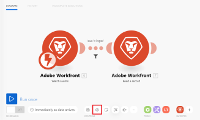

# 中的案例設定面板 [!DNL Adobe Workfront Fusion]

## 存取需求

您必須具有下列存取權才能使用本文中的功能：

<table style="table-layout:auto"> 
 <col> 
 <col> 
 <tbody> 
  <tr> 
    <td role="rowheader">[!DNL Adobe Workfront] 計劃*</td> 
   <td> 
[!DNL Pro] 或更高
 </td> 
  </tr> 
  <tr data-mc-conditions=""> 
   <td role="rowheader">[!DNL Adobe Workfront] 授權*</td> 
   <td> 
[！UICONTROL計畫]，[！UICONTROL工作]
 </td> 
  </tr> 
  <tr> 
   <td role="rowheader">[！UICONTROL Adobe Workfront Fusion]授權**</td> 
   <td>
   
目前授權需求：否 [!DNL Workfront Fusion] 授權需求。

   
或

   
舊版授權需求： [！UICONTROL [!DNL Workfront Fusion] 若為工作自動化與整合]，[！UICONTROL [!DNL Workfront Fusion] 工作自動化專用]

   </td> 
  </tr> 
  <tr> 
   <td role="rowheader">產品</td> 
   <td>
   
目前產品需求：如果您有[！UICONTROL Select]或[！UICONTROL Prime] [!DNL Adobe Workfront] 計畫，您的組織必須購買 [!DNL Adobe Workfront Fusion] 以及 [!DNL Adobe Workfront] 以使用本文所述功能。 [!DNL Workfront Fusion] 包含在[！UICONTROL Ultimate]中 [!DNL Workfront] 計畫。

   
或

   
舊版產品需求：貴組織必須購買 [!DNL Adobe Workfront Fusion] 以及 [!DNL Adobe Workfront] 以使用本文所述功能。

   </td> 
  </tr> 
 </tbody> 
</table>

若要瞭解您擁有哪些計畫、授權型別或存取權，請聯絡您的 [!DNL Workfront] 管理員。

有關以下專案的資訊： [!DNL Adobe Workfront Fusion] 授權，請參閱 [[!DNL Adobe Workfront Fusion] 授權](../../workfront-fusion/get-started/license-automation-vs-integration.md).

## 開啟案例設定

1. 開啟案例編輯器，如中所述 [中的案例編輯器 [!DNL Adobe Workfront Fusion]](../../workfront-fusion/scenarios/scenario-editor.md).
1. 按一下頁面左下角附近的齒輪圖示。

   

   在 [!UICONTROL 案例設定] 面板中，您可以為該案例設定各種進階設定。

## [!UICONTROL 允許儲存未完成的執行]

此選項決定如何進行 [!DNL Adobe Workfront Fusion] 執行情境期間發生錯誤時進行。 啟用此選項後，情境會暫停並移至 [在中檢視和解決未完成的執行 [!DNL Adobe Workfront Fusion]](../../workfront-fusion/scenarios/view-and-resolve-incomplete-executions.md). 這可讓您修正問題，並從情景停止的地方繼續執行。 如果停用此選項，則案例執行會停止並啟動倒回階段。

## [!UICONTROL 循序處理]

此選項決定如何進行 [!DNL Workfront Fusion] 如果發生錯誤且案例的執行移至下列位置則會繼續： [在中檢視和解決未完成的執行 [!DNL Adobe Workfront Fusion]](../../workfront-fusion/scenarios/view-and-resolve-incomplete-executions.md). 如果 [!UICONTROL 循序處理] 選項已啟用，Workfront Fusion會完全停止處理工作序列，直到解決所有未完成的執行為止。 如果 [!UICONTROL 循序處理] 選項已停用，情境會根據其排程繼續執行，伴隨著重複嘗試重新執行未完成的執行。

如需排程的詳細資訊，請參閱 [排程情境於 [!DNL Adobe Workfront Fusion]](../../workfront-fusion/scenarios/schedule-a-scenario.md).

## 資料是機密的

執行情境後，您可以預設顯示情境中模組處理哪些資料的相關資訊。 如果您不想儲存此資訊，請啟用 [!UICONTROL 資料是機密的] 選項。

如需顯示資訊的詳細資訊，請參閱 [案例執行流程 [!DNL Adobe Workfront Fusion]](../../workfront-fusion/scenarios/scenario-execution-flow.md).

>[!IMPORTANT]
>
>如果啟用此選項，可能很難解決執行情境期間可能發生的錯誤。

## 啟用資料遺失

此選項與啟用資料遺失有關，如果 [!DNL Workfront Fusion] 無法將套件組合儲存至的佇列 [在中檢視和解決未完成的執行 [!DNL Adobe Workfront Fusion]](../../workfront-fusion/scenarios/view-and-resolve-incomplete-executions.md) （例如，由於缺少可用空間）。 啟用此選項後，資料會遺失，以防止整體案例執行中斷。 當最高優先順序為連續執行，且傳入的錯誤資料並不很重要時，這個選項非常有用。

除此之外，在執行案例時，模組有時可能會遇到大於最大允許大小的檔案。 在這種情況下， [!DNL Workfront Fusion] 會根據 [!UICONTROL 啟用資料遺失] 選項和警告訊息隨即顯示。

如需檔案大小上限的詳細資訊，請參閱 [關於對應檔案於 [!DNL Adobe Workfront Fusion]](../../workfront-fusion/mapping/about-mapping-files.md).

如需有關警告的詳細資訊，請參閱 [中的處理錯誤 [!DNL Adobe Workfront Fusion]](../../workfront-fusion/errors/error-processing.md).

## [!UICONTROL 自動認可]

此 [!UICONTROL 自動認可] 設定會套用至交易，並定義處理案例的方式。 如果Auto commit選項為on，則每個模組上的認可階段會在完成作業階段後立即開始。 停用「自動認可」選項時，在所有模組執行操作之前（這是預設模式），不會發生認可。

如需交易的詳細資訊，請參閱 [中的案例執行、週期和階段 [!DNL Adobe Workfront Fusion]](../../workfront-fusion/scenarios/scenario-execution-cycles-phases.md).

## 最大週期數

如果您想要避免與協力廠商服務的連線中斷，並確保所有記錄都會在單一案例執行內處理，則設定更多週期會很有用。

* 如果案例以輪詢觸發器開始，設定會定義案例執行期間允許的最大週期數。

  如需輪詢觸發器的詳細資訊，請參閱 [輪詢觸發程式](../../workfront-fusion/modules/module-types.md#polling) 在 [模組型別](../../workfront-fusion/modules/module-types.md).

* 如果案例從立即觸發開始，設定會被忽略，並在單一案例執行期間處理所有擱置的事件，每個週期會有一個事件。

  如需即時觸發器的詳細資訊，請參閱 [即時觸發程式](../../workfront-fusion/modules/module-types.md#instant) 在 [模組型別](../../workfront-fusion/modules/module-types.md).

* 如果案例不是以觸發程式開頭（即時/輪詢），則一律會執行指定的最大週期數。

>[!INFO]
>
>**範例：**  [!DNL Workfront] > [!UICONTROL 觀看記錄] 關注新問題，以及 [!DNL Workfront] >[!UICONTROL 轉換物件] 會將新請求轉換為專案，並指派適當的範本。
>
>
>
>A [!UICONTROL 更多週期] 只有當您排程情境執行時，才會套用設定。 當您使用 [!UICONTROL 執行一次] 按鈕，週期設定將被考慮在內。
>
>### 最大循環數設為1 （預設）
>
>
>
>此 [!UICONTROL 傳回檔案的最大數量] 在 [!UICONTROL Dropbox] >[!UICONTROL 觀看檔案] 模組已設為 `10`.
>
>
>
>如果將100個請求提交至 [!DNL Workfront]，以及 [!UICONTROL 限制] 欄位設為10，則在執行一個案例後會有90個檔案未處理。 接下來10個檔案會在下一個排定的案例執行中處理。
>
>### 最大循環數設定為10
>
>此 [!UICONTROL 傳回檔案的最大數量] 在 [!UICONTROL Dropbox] >[!UICONTROL 觀看檔案] 模組已設為 `10`.
>
>如果新增100個檔案至Dropbox資料夾，且 [!UICONTROL 傳回檔案的最大數量] 選項設為10，則在第一個週期內處理10個檔案，在第二個週期內處理接下來的10個檔案，在第三個週期內處理接下來的10個檔案，依此類推，直到處理完所有檔案為止。
>
>所有檔案都會在1個案例執行內處理。
>
>您可以在「案例」詳細資訊中檢視已執行的週期：
>
>
>
>如需有關本頁面的詳細資訊，請參閱 [中的案例詳細資料 [!DNL Adobe Workfront Fusion]](../../workfront-fusion/scenarios/scenario-detail.md).

## 連續錯誤數

定義停用情境執行前的連續執行嘗試次數上限(不包括 [!UICONTROL 資料錯誤]， [!UICONTROL Duplicatedataerror] 和 [!UICONTROL ConnectionError])。

如需錯誤的詳細資訊，請參閱 [中的處理錯誤 [!DNL Adobe Workfront Fusion]](../../workfront-fusion/errors/error-processing.md).

>[!NOTE]
>
>如果案例以立即觸發器開始，則會忽略設定，並在發生第一個錯誤後立即停用案例。
