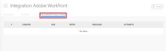
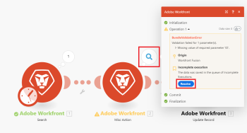

# 檢視並解決[!DNL Adobe Workfront Fusion]中未完成的執行

>[!IMPORTANT]
>
>Adobe Workfront Fusion檔案已移至新位置。
>
>本文資訊可在以下文章中找到：
>
>* [檢視並解決未完成的執行](https://experienceleague.adobe.com/docs/workfront-fusion/using/manage-scenarios/view-and-resolve-incomplete-executions.html)
>
>請更新任何書籤。
>
>本文已不再更新，將於不久將來移除。

[!UICONTROL 未完成的執行]資料夾會儲存由於錯誤而未成功完成的案例執行。 每個儲存的不完整執行都可以手動或自動解析。

>[!NOTE]
>
>預設會停用未完成執行的儲存。 若要啟用它，請在案例進階設定中啟用[!UICONTROL 允許儲存未完成的執行]選項。
>
>如需情境設定的詳細資訊，請參閱[在 [!DNL Adobe Workfront Fusion]](../../workfront-fusion/scenarios/scenario-settings-panel.md)中的情境設定面板。

## 存取需求

您必須具有下列存取權才能使用本文中的功能：

<table style="table-layout:auto">  
 <col> 
 <col> 
 <tbody> 
  <tr> 
    <td role="rowheader">[!DNL Adobe Workfront] 計畫*</td> 
   <td> 
[!DNL Pro] 或更高
 </td> 
  </tr> 
  <tr data-mc-conditions=""> 
   <td role="rowheader">[!DNL Adobe Workfront] 授權*</td> 
   <td> 
[！UICONTROL計畫]，[！UICONTROL工作]
 </td> 
  </tr> 
  <tr> 
   <td role="rowheader">[！UICONTROL Adobe Workfront Fusion]授權**</td> 
  <td>
   
目前授權需求：無[!DNL Workfront Fusion]授權需求。

   
或

   
舊版授權需求： [！UICONTROL [!DNL Workfront Fusion] for Work Automation and Integration]，[！UICONTROL [!DNL Workfront Fusion] for Work Automation]

   </td>  
  </tr> 
  <tr> 
   <td role="rowheader">產品</td> 
   <td>
   
目前產品需求：如果您有[！UICONTROL Select]或[！UICONTROL Prime] [!DNL Adobe Workfront]計畫，您的組織必須購買[!DNL Adobe Workfront Fusion]及[!DNL Adobe Workfront]，才能使用本文所述的功能。 [!DNL Workfront Fusion]包含在[！UICONTROL Ultimate] [!DNL Workfront]計畫中。

   
或

   
舊版產品需求：您的組織必須購買[!DNL Adobe Workfront Fusion]及[!DNL Adobe Workfront]，才能使用本文所述的功能。

   </td> 
  </tr> 
 </tbody> 
</table>

若要瞭解您擁有的計畫、授權型別或存取權，請連絡您的[!DNL Workfront]管理員。

如需[!DNL Adobe Workfront Fusion]授權的相關資訊，請參閱[[!DNL Adobe Workfront Fusion] 授權](../../workfront-fusion/get-started/license-automation-vs-integration.md)。

## 檢視未完成的執行

如果模組在操作期間遇到錯誤，則會將新的未完成執行新增到未完成執行資料夾。 每個未完成的執行都包含情境的藍圖，以及可對應到失敗模組的所有組合。 按一下案例詳細資訊頁面上的[!UICONTROL 未完成執行]索引標籤，即可開啟未完成執行清單。

<!--

-->

如需詳細資訊，請參閱[導致不完整執行的錯誤](#errors-resulting-into-incomplete-executions)。

>[!NOTE]
>
>每個組織未解決的不完整執行資料夾的目前大小限製為500 MB。 如果貴組織超過此限制，您可能會看到下列錯誤：
>
>`"There is NOT ENOUGH SPACE to add a bundle to the IEQ. The reason is: Too many incomplete executions."`
>
>如需詳細資訊，請參閱 [!DNL Adobe Workfront Fusion]](../../workfront-fusion/scenarios/scenario-settings-panel.md)中的[案例設定面板[啟用資料遺失](../../workfront-fusion/scenarios/scenario-settings-panel.md#enable)。

## 解決未完成的執行

儲存新的未完成執行時，您可以依照以下方式解決它：

1. 按一下&#x200B;**[!UICONTROL 未完成的執行]**&#x200B;標籤。
1. 找出您要解析的未完成執行，然後按一下&#x200B;**[!UICONTROL 詳細資料]**。

   如果您想在嘗試解析未完成的執行之前檢視所有模組作業的記錄，可以從[!UICONTROL History]資料夾解析未完成的執行：

1. 按一下「**[!UICONTROL 歷程記錄]**」標籤。
1. 找到案例失敗的執行記錄檔，然後按一下&#x200B;**[!UICONTROL 詳細資料]**。
1. 開啟模組的記錄，其中顯示所有模組的操作。
1. 找出失敗的作業，然後按一下&#x200B;**[!UICONTROL 解決]**：

   

## 與未完成執行相關的選項

[!UICONTROL 情境設定]面板中的下列選項決定是否要儲存不完整的執行，以及如何儲存：

* 允許儲存未完成的執行
* 循序處理
* 啟用資料遺失

如需這些選項的詳細資訊，請參閱[在 [!DNL Adobe Workfront Fusion]](../../workfront-fusion/scenarios/scenario-settings-panel.md)中的案例設定面板。

## 導致不完整執行的錯誤

有幾種型別的錯誤會導致儲存不完整的執行。 這些可能包括：

* 驗證錯誤是由不完整或錯誤的資料所引起，主要是因為遺漏了專案，而該專案預期會成功處理通過模組的所有資料。
* 由於暫時或長期的連線失敗（例如在連線至電子郵件或遠端FTP伺服器期間），導致最終目的地無法使用而發生錯誤。

若是情境中第一個模組發生錯誤，會馬上停止執行，不會儲存任何未完成的執行作業。

如果任何其他模組發生錯誤，且沒有附加錯誤處理常式路由，則會發生下列其中一種情況：

* 如果錯誤型別為`ConnectionError`、`RateLimitError`、`OutOfSpaceError`或`ModuleTimeoutError`，則會儲存包含自動重試的不完整執行記錄。
* 如果錯誤型別為`DataError`、`InvalidConfigurationError`、`InvalidAccessTokenError`、`UnexpectedError`、`MaxFileSizeExceededError`或`MaxResultsExceededError`，則會儲存不完整的執行記錄而不自動重試。
* 如果錯誤類型不是上述任何一項，則執行失敗。
