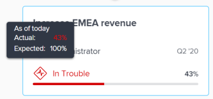

# 導覽Adobe Workfront目標中的「目標對齊」區段

使用「目標對齊」部分，在流程圖中顯示整個組織中目標對齊的整體視圖。 在分層樹中互連的卡上顯示對齊的目標。

如需目標一致性及其達成方式的相關資訊，另請參閱下列文章：

* [Adobe Workfront目標中的目標對齊概觀](../../workfront-goals/goal-alignment/goal-alignment-overview.md)
* [在Adobe Workfront目標中將目標連結起來，以協調目標](../../workfront-goals/goal-alignment/align-goals-by-connecting-them.md)

## 存取需求

<!-- drafted for P&P release: 

You must have the following to perform the activities described in this article:

<table style="table-layout:auto">
 <col>
 </col>
 <col>
 </col>
 <tbody>
  <tr>
   <td role="rowheader">Adobe Workfront plan*</td>
   <td>
   
Current plan: Select or higher

   Or
   
Legacy plan: Pro or higher

   
   </td>
  </tr>
  <tr>
   <td role="rowheader">Adobe Workfront license*</td>
   <td>
   
Current license: Contributor or higher

   Or
   
Legacy license: Request or higher
 
For more information, see <a href="../../administration-and-setup/add-users/access-levels-and-object-permissions/wf-licenses.md" class="MCXref xref">Adobe Workfront licenses overview</a>.
 </td>
  </tr>
  <tr>
   <td role="rowheader">Product</td>
   <td>
   
 Current product requirement: If you have the Select or Prime Adobe Workfront plan, you must also buy an additional Adobe Workfront Goals license.  Workfront Goals are included in the Ultimate Workfront Plan.

   Or
   
Legacy product requirement: You must purchase an additional license for the Adobe Workfront Goals to access functionality described in this article. 
 
For information, see <a href="../../workfront-goals/goal-management/access-needed-for-wf-goals.md" class="MCXref xref">Requirements to use Workfront Goals</a>. 
 </td>
  </tr>
  <tr>
   <td role="rowheader">Access level*</td>
   <td> 
Edit access to Goals
 
<b>NOTE</b>
If you still don't have access, ask your Workfront administrator if they set additional restrictions in your access level. For information on how a Workfront administrator can change your access level, see:

     <ul>
      <li> 
<a href="../../administration-and-setup/add-users/configure-and-grant-access/create-modify-access-levels.md" class="MCXref xref">Create or modify custom access levels</a> 
 </li>
      <li> 
<a href="../../administration-and-setup/add-users/configure-and-grant-access/grant-access-goals.md" class="MCXref xref">Grant access to Adobe Workfront Goals</a> 
 </li>
     </ul> 
 </td>
  </tr>
  <tr data-mc-conditions="">
   <td role="rowheader">Object permissions</td>
   <td>
    

     
View or higher permissions to the goal to view it

     
Manage permissions to the goal to edit it

     
For information about sharing goals, see <a href="../../workfront-goals/workfront-goals-settings/share-a-goal.md" class="MCXref xref">Share a goal in Workfront Goals</a>. 

    
 </td>
  </tr>
 </tbody>
</table>

-->

您必須具備下列條件才能執行本文所述的活動：

<table style="table-layout:auto"> 
 <col> 
 <col> 
 <tbody> 
  <tr> 
   <td role="rowheader">Adobe Workfront計畫*</td> 
   <td> 
Pro或更高版本
 </td> 
  </tr> 
  <tr> 
   <td role="rowheader">AdobeWorkfrontlicense*</td> 
   <td> 
要求或更高版本
 
如需詳細資訊，請參閱 <a href="../../administration-and-setup/add-users/access-levels-and-object-permissions/wf-licenses.md" class="MCXref xref">Adobe Workfront授權概觀</a>.
 </td> 
  </tr> 
  <tr> 
   <td role="rowheader">產品</td> 
   <td> 
您必須購買額外的Adobe Workfront目標授權才能存取本文所述的功能。 
 
如需詳細資訊，請參閱 <a href="../../workfront-goals/goal-management/access-needed-for-wf-goals.md" class="MCXref xref">使用Workfront目標的需求</a>. 
 </td> 
  </tr> 
  <tr> 
   <td role="rowheader">存取層級*</td> 
   <td> 
編輯目標的存取權
 
<b>附註</b>
如果您仍無權存取，請洽詢您的Workfront管理員，他們是否在您的存取層級設定其他限制。 如需Workfront管理員如何變更您的存取層級的詳細資訊，請參閱：
 
     <ul> 
      <li> 
<a href="../../administration-and-setup/add-users/configure-and-grant-access/create-modify-access-levels.md" class="MCXref xref">建立或修改自訂存取層級</a> 
 </li> 
      <li> 
<a href="../../administration-and-setup/add-users/configure-and-grant-access/grant-access-goals.md" class="MCXref xref">授予Adobe Workfront目標的存取權</a> 
 </li> 
     </ul> 
 </td> 
  </tr> 
  <tr data-mc-conditions=""> 
   <td role="rowheader">物件權限</td> 
   <td> 
    
 
     
檢視目標的或更高權限
 
     
如需共用目標的相關資訊，請參閱 <a href="../../workfront-goals/workfront-goals-settings/share-a-goal.md" class="MCXref xref">在Workfront目標中共用目標</a>. 
 
    
 </td> 
  </tr> 
 </tbody> 
</table>

*若要了解您擁有的計畫、授權類型或存取權，請聯絡您的Workfront管理員。

## 必要條件

您必須具備下列條件，才能開始：

* 一種佈局模板，在主菜單中包括目標區域。

## 導覽「目標對齊」區段

1. 按一下 **主菜單** 圖示  在畫面的右上角，然後按一下 **目標**.

   <!-- Add this when Shell is available to all: or (if available), click the **Main Menu** icon  in the upper-left corner)
   -->
1. 按一下 **目標對齊** 中。
1. 使用對齊圖右上角的篩選器，只選取對您而言重要的目標。 如需在Workfront目標中使用篩選器的相關資訊，請參閱 [篩選Adobe Workfront目標中的資訊](../../workfront-goals/goal-management/filter-information-wf-goals.md).

   卡片上的對齊圖表中會顯示符合篩選器的目標。

   目標卡上會顯示下列資訊：

   <table style="table-layout:auto"> 
    <col> 
    <col> 
    <tbody> 
     <tr> 
      <td role="rowheader">時段日期 </td> 
      <td> 
這是目標開啟的期間。 該目標必須在該期間結束日期之前實現。 Workfront目標會根據目標期間的持續時間和目前日期，計算目標的進度。
 </td> 
     </tr> 
     <tr> 
      <td role="rowheader">進度指示器</td> 
      <td>目標的進度指標數。 進度指標可以是目標、結果或活動的一致。 </td> 
     </tr> 
     <tr> 
      <td role="rowheader">所有者名稱</td> 
      <td>指定為目標所有者的用戶、團隊、組或組織的名稱。 </td> 
     </tr> 
     <tr> 
      <td role="rowheader">目標名稱</td> 
      <td>目標的名稱。 </td> 
     </tr> 
     <tr> 
      <td role="rowheader">目標進度列 和進度</td> 
      <td> 
目標進展表明目前已實現了多少目標。 這是根據自目標時段開始以來經過的時間，自動計算所有已對齊目標、結果和活動的平均進度。 如需關於計算目標進度的資訊，請參閱 <a href="../../workfront-goals/goal-management/calculate-goal-progress.md" class="MCXref xref">Adobe Workfront目標中的目標進度和條件概覽</a>. 
 
       
 
        
目標的實際進度（按當前日期）。 以下進度值和顏色指示按時實現目標的可能性： 
 
        <ul> 
         <li>在Target上 （綠色指示器）:目標按時完成，並將按時完成。</li> 
         <li> 風險 （黃色指標）：目標落後，可能無法按時實現。</li> 
         <li> 麻煩 （紅色指示器）:這個目標有可能不按時實現。 </li> 
        </ul> 
       
 </td> 
     </tr> <!--
      <tr data-mc-conditions="QuicksilverOrClassic.Draft mode"> 
       <td role="rowheader">Updated on date </td> 
       <td> 
The date when the goal was last updated
 
(NOTE: drafted because I think this was removed with the alignment chart redesign - 21.1) 
 </td> 
      </tr>
     --> 
     <tr> 
      <td role="rowheader">狀態</td> 
      <td>所有狀態中的目標都會顯示在「目標對齊」區段中。 </td> 
     </tr> 
    </tbody> 
   </table>

   與其他目標一致的目標會在目標卡片下顯示已對齊目標的數量。

   

1. 按一下 **向下箭頭** 表徵圖以進一步展開和查看子目標。

   

   >[!TIP]
   >
   >將兒童目標與兒童目標相一致的目標在各自的卡片下顯示對齊目標的數量。

1. （條件性）如果目前的篩選排除參與對齊的部分目標，則會顯示警告訊息，指出並非所有目標都會顯示。

   

1. 按一下 **顯示** 顯示篩選器目前淘汰的目標。

   注意對齊圖表中的下列變更：

   * 先前透過篩選器消除的連線目標現在會顯示在對齊圖表中。
   * 右上角的篩選器會以黃色列出，表示目前未套用。

      

      篩選器名稱左側會顯示「重新套用」篩選器連結。

1. （選用）按一下 **重新套用篩選** 返回原始結果並顯示目標層次結構。
1. （選用）將滑鼠指標暫留在進度指標上，以了解目標進度應該在當天的哪個位置。

   

   會顯示下列資訊：

   <table style="table-layout:auto"> 
    <col> 
    <col> 
    <tbody> 
     <tr> 
      <td role="rowheader">截至今日</td> 
      <td>進度狀態始終為最新狀態。 </td> 
     </tr> 
     <tr> 
      <td role="rowheader">實際 </td> 
      <td>按當前日期計算的目標實際進度（百分比），考慮到目標的所有進度指標。 目標進度指標是一致的目標、活動和結果。 </td> 
     </tr> 
     <tr> 
      <td role="rowheader">預期</td> 
      <td> 
目標的預期進度（百分比），假設您將按時達成目標。
 </td> 
     </tr> 
    </tbody> 
   </table>

1. 按一下目標卡片以開啟目標頁面。 如需編輯現有目標的相關資訊，請參閱 [編輯Adobe Workfront目標](../../workfront-goals/goal-management/edit-goals.md). 如需更新目標進度的相關資訊，請參閱 [更新Adobe Workfront目標中的目標進度](../../workfront-goals/goal-review-and-workfront-goals-sections/check-in-goals.md).

1. 按一下目前層級目標的向上箭頭，以返回圖表階層中的上一層。

   或

   （選用）按一下 **退出目標階層** 顯示符合目前篩選的所有目標的卡片，而不顯示彼此的連線。

