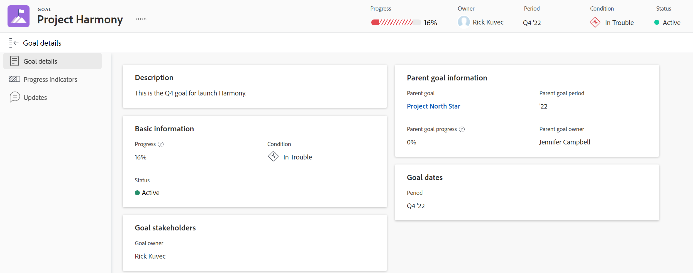

# 在Adobe Workfront目標中存取和開啟目標

本文說明如何在Adobe Workfront中尋找和管理策略目標。

## 存取需求

您必須具備下列專案才能執行本文所述的活動：

<table style="table-layout:auto"> 
 <col> 
 </col> 
 <col> 
 </col> 
 <tbody> 
  <tr> 
   <td role="rowheader">Adobe Workfront計畫*</td> 
   <td> 
   
對於新計畫和授權結構：
  <ul><li>終極計畫 </li></ul>
   

對於目前的計畫與授權結構： 
<ul><li> A Pro或更高版本 </li>
  <li>除了Adobe Workfront授權之外，還有Workfront目標授權。</li></ul>

   </td> 
  </tr> 
  <tr> 
   <td role="rowheader">Adobe Workfront授權*</td> 
   <td> 
   
新授權：投稿人或以上版本

   或
   
目前授權：要求或以上
 
如需詳細資訊，請參閱<a href="../../administration-and-setup/add-users/access-levels-and-object-permissions/wf-licenses.md" class="MCXref xref">Adobe Workfront授權總覽</a>。
 </td> 
  </tr> 
  <tr>
 <td role="rowheader">產品*</td>
 <td>
 
 新產品需求，下列其中一項： 

<ul>
<li>Select或Prime Adobe Workfront計畫以及額外的Adobe Workfront目標授權。</li>
<li>預設包含Workfront目標的Ultimate Workfront計畫。 </li></ul>
 
或

 
目前產品需求： Adobe Workfront Goals的Workfront計畫和額外授權。 
 
如需詳細資訊，請參閱<a href="../../workfront-goals/goal-management/access-needed-for-wf-goals.md" class="MCXref xref">使用Workfront目標的需求</a>。 
 </td>
 </tr>
 <tr>
 <td role="rowheader">存取層級</td>
 <td> 
編輯目標的存取權
 </td>
 </tr>
  <tr> 
   <td role="rowheader">存取層級</td> 
   <td> 
編輯目標的存取權
 </td> 
  </tr> 
  <tr data-mc-conditions=""> 
   <td role="rowheader">物件許可權</td> 
   <td> 
    
 
     
檢視目標或更高許可權以檢視它
 
     
管理目標的許可權以編輯它
 
     
如需共用目標的相關資訊，請參閱<a href="../../workfront-goals/workfront-goals-settings/share-a-goal.md" class="MCXref xref">在Workfront目標中共用目標</a>。 
 
    
 </td> 
  </tr> 
  <tr>
   <td role="rowheader">
版面配置範本
</td>
   <td> 
必須為所有使用者(包括Workfront管理員)指派一個版面配置範本，該範本包含主功能表中的「目標」區域。 
  
</td>
  </tr>
 </tbody> 
</table>

*如需詳細資訊，請參閱Workfront檔案中的[存取需求](/help/quicksilver/administration-and-setup/add-users/access-levels-and-object-permissions/access-level-requirements-in-documentation.md)。

## 存取Workfront目標

1. 按一下右上角的&#x200B;**主要功能表**&#x200B;圖示，然後按一下&#x200B;**目標**。

   <!-- drafted for Shell release: Add this when Shell is available to all: or (if available), click the **Main Menu** icon  in the upper-left corner)
   -->

   目標清單隨即顯示。

   >[!IMPORTANT]
   >
   >   當您擁有Workfront目標的正確存取權時，預設情況下，您可以檢視自己或其他任何人在目標清單中建立的目標。

   <!--   
   (NOTE: This might change when sharing is in place; right now, with sharing in place, they can VIEW all goals in the system but they cannot EDIT the ones others created!)
   -->

1. （選用）按一下目標的名稱以開啟或編輯目標。

   或

   按一下&#x200B;**新目標**&#x200B;以新增目標。

   如需建立目標的相關資訊，請參閱[在Adobe Workfront目標中建立目標](../../workfront-goals/goal-management/create-goals.md)。

## 開啟和管理個別目標

您必須存取個別目標，才能在管理目標時執行下列動作：

* 編輯它
* 新增結果或活動到其中
* 編輯與其關聯的結果和活動
* 啟用它
* 停用它
* 刪除它
* 使其與另一個目標一致
* 將結果或活動轉換為其他目標
* 更新它
<!--
Accessing goals differs depending on what environment you use.

To access an individual goal in the Production environment:

1. Click the **Main Menu** icon  in the upper-right corner of Workfront, then click **Goals** .

     (!--drafted for Shell release: Add this when Shell is available to all: or (if available), click the **Main Menu** icon  in the upper-left corner)
   --)

   The Goal List displays by default. 

1. Click the name of a goal in the list 

   Or

   Click one of the options below in the left panel, then click the name of a goal to access it:

   * Goal Alignment
   * Check-in 
   * Pulse 

   >[!NOTE]
   >
   >Depending on what action you want to perform on the individual goal, you might choose to select different sections every time. For information about the differences between the Workfront Goals sections, see [Overview of the Adobe Workfront Goals sections](../../workfront-goals/goal-review-and-workfront-goals-sections/overview-of-wf-goals-sections.md).

   The Goal Details panel displays on the right. You can update the goal, its results, and activities in the Goal Details panel when you have access to manage it. For information about updating goals using the Goal Details panel, see [Update goals in the Goal details section in Adobe Workfront Goals](../../workfront-goals/goal-management/update-goals-in-goal-details-panel.md).
-->

若要存取個別目標：

1. 按一下Workfront右上角的&#x200B;**主要功能表**&#x200B;圖示，然後按一下&#x200B;**目標** 。
預設會顯示「目標清單」。
   
1. 按一下清單中目標的名稱。
目標的頁面隨即顯示。
   
1. 按一下目標名稱右側的&#x200B;**更多**&#x200B;功能表，以進一步編輯或共用目標。
1. 按一下左側面板中的&#x200B;**目標詳細資料**&#x200B;以編輯目標的相關資訊。 如需詳細資訊，請參閱Adobe Workfront目標](../goal-management/update-goals-in-goal-details-panel.md)中「目標詳細資料」一節的[更新目標。

