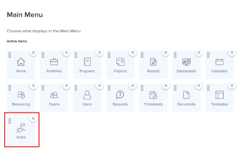

# 使用Workfront目標的需求

<!--Audited P&P only: 04/2025-->

在存取Adobe Workfront目標之前，您的Adobe Workfront管理員必須確認下列所有條件皆已符合：

* 您的組織過去曾購買Adobe Workfront Goals套件。 Adobe Workfront目標不再提供購買。

  如需詳細資訊，請參閱本文章的[取得Workfront目標組織存取權](#obtain-workfront-goals-organization-access)一節。

* 指派正確的Workfront授權型別。 如需指派授權型別和存取層級的資訊，請參閱本文章的[更新授權型別和存取層級設定](#update-license-types-and-access-level-settings)小節。

  >[!NOTE]
  >
  >具有外部授權型別的使用者無法存取Workfront目標。

* 讓您存取存取存取層級中的目標。 如需詳細資訊，請參閱[授與Adobe Workfront目標的存取權](../../administration-and-setup/add-users/configure-and-grant-access/grant-access-goals.md)

  >[!NOTE]
  >
  >依預設，使用者在其存取層級中取得目標的「無存取權」。

* 指派包含主功能表中目標區域的版面配置範本。

  >[!NOTE]
  >
  >必須為所有使用者（包括系統管理員）指派一個版面配置範本，該範本包括主功能表中的「目標」區域。

  如需詳細資訊，請參閱本文章的[將Workfront目標新增至配置範本](#add-workfront-goals-to-a-layout-template)一節。

* 如果您必須修改您未自行建立的目標，則目標建立者必須與您共用目標，並授予您管理目標的許可權。

  如需詳細資訊，請參閱本文中的[與其他使用者共用個別目標](#share-individual-goals-with-other-users)一節。

## 取得Workfront目標組織存取權 {#obtain-workfront-goals-organization-access}

最後納入Workfront目標的Adobe Workfront套件是Adobe Workfront Ultimate。
Workfront目標無法再用於較新套件的購買。
請洽詢您的客戶代表，以查詢Workfront目標。

<!--Old: >
Depending on which Workfront plan your company is currently on, the following scenarios exist: 

* **A new Workfront plan**: You must have an Ultimate Workfront plan. Workfront Goals are included only in this plan. 

* **A current Workfront plan**: Your organization must purchase an additional license, in addition to the Workfront license.

  After your organization purchases the additional license, Workfront enables Workfront Goals for your account. For information about purchasing a license for Workfront Goals contact your Workfront account manager.

For information about Workfront access requirements, see [Access requirements in Workfront documentation](/help/quicksilver/administration-and-setup/add-users/access-levels-and-object-permissions/access-level-requirements-in-documentation.md). -->

## 更新授權型別和存取層級設定  {#update-license-types-and-access-level-settings}

如果您的公司擁有上次購買的Workfront目標存取權，您的Workfront管理員必須授予您下列專案以存取Workfront目標：

1. 下列授權之一：

   * 投稿人或以上
   * 要求或更高版本

<!--Old: 
* **The new access level model**: Your Workfront administrator must grant you one of the following Workfront license types to access Workfront Goals: 

  * Contributor
  * Light
  * Standard

* **The current access level model**: Your Workfront administrator must grant you one of the following Workfront license types to access Workfront Goals:

  * Plan
  * Work 
  * Review
  * Request
-->

1. 下列存取層級：

   * 在存取層級中檢視或更高的目標存取權。

   如需有關存取目標的資訊，請參閱[授與Adobe Workfront目標的存取權](../../administration-and-setup/add-users/configure-and-grant-access/grant-access-goals.md)。

身為Workfront管理員，您可以檢視系統中的目標Workfront授權數量，並瞭解目前啟用的數量。 如需詳細資訊，請參閱[管理您系統中的可用授權](../../administration-and-setup/get-started-wf-administration/manage-available-licenses-in-your-system.md)。

>[!NOTE]
>
>Workfront可讓您指派更多已購買的Workfront Goals授權。 但是，當您指派的授權超過Workfront目標合約所允許的數量時，Workfront客戶經理會聯絡您，告知您已超出合約數量。

## 將Workfront目標新增至版面配置範本 {#add-workfront-goals-to-a-layout-template}

您的Workfront或群組管理員必須指派包含主要功能表中目標區域的版面配置範本，您才能存取Workfront目標。

您的Workfront管理員或群組管理員也可以將以下專案新增到您的版面配置範本，讓您能夠輕鬆存取Workfront目標：

* 釘選索引標籤
* 讓目標區域成為您的登陸頁面

如需有關更新版面配置範本的資訊，請參閱下列文章：

* [建立及管理配置範本](../../administration-and-setup/customize-workfront/use-layout-templates/create-and-manage-layout-templates.md)
* [使用配置範本自訂主功能表](../../administration-and-setup/customize-workfront/use-layout-templates/customize-main-menu.md)
* [使用版面配置範本自訂釘選頁面](../../administration-and-setup/customize-workfront/use-layout-templates/customize-pinned-pages.md)
* [使用版面配置範本自訂登入頁面](../../administration-and-setup/customize-workfront/use-layout-templates/customize-landing-page.md)
* [將使用者指派至版面配置範本](../../administration-and-setup/customize-workfront/use-layout-templates/assign-users-to-layout-template.md)

## 與其他使用者共用個別目標 {#share-individual-goals-with-other-users}

根據預設，所有至少擁有存取層級中目標檢視存取許可權的使用者，都可以在Workfront中檢視所有目標。

任何擁有目標編輯存取許可權的使用者都可以建立目標，且他們會自動獲得對其所建立目標的「管理」存取許可權。 如果他們必須編輯其他使用者的目標，擁有這些目標管理許可權的人必須與他們分享他們未建立的目標。

如需與使用者共用目標及授予他們管理許可權的相關資訊，請參閱[在Workfront目標中共用目標](../../workfront-goals/workfront-goals-settings/share-a-goal.md)。
