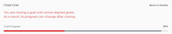

# 在Adobe Workfront目標中關閉並重新開啟目標

當您想要指出下列專案時，可以關閉目標：

* 目標已完成，可能是因為您已完成，或是因為經過了時間週期。
* 您不再處理此專案，也不打算立即處理。

您可以重新開啟已關閉的目標（當這些目標再次變得相關時）。

## 存取需求

您必須具備下列條件：

<table style="table-layout:auto">
<col>
</col>
<col>
</col>
<tbody>
 <tr> 
   <td role="rowheader">Adobe Workfront計畫*</td> 
   <td> 
   
對於新計畫和授權結構：
  <ul><li>終極計畫 </li>
  或
  <li>適用於Prime或選取Adobe Workfront計畫的Adobe Workfront目標的其他授權。 </li></ul> 

對於目前的計畫與授權結構： 
<ul><li> A Pro或更高版本 </li>
  <li>除了Adobe Workfront授權之外，還有Workfront目標授權。</li></ul>

   </td> 
  </tr>
 <tr>
 <tr>
 <td role="rowheader">Adobe Workfront授權*</td>
 <td>
 
新授權：投稿人或以上版本

 或
 
目前授權：要求或以上
 
如需詳細資訊，請參閱<a href="../../administration-and-setup/add-users/access-levels-and-object-permissions/wf-licenses.md" class="MCXref xref">Adobe Workfront授權總覽</a>。
 </td>
 </tr>
 <tr>
 <td role="rowheader">產品*</td>
 <td>
 
 新產品需求，下列其中一項： 

<ul>
<li>Select或Prime Adobe Workfront計畫以及額外的Adobe Workfront目標授權。</li>
<li>預設包含Workfront目標的Ultimate Workfront計畫。 </li></ul>
 
或

 
目前產品需求： Adobe Workfront Goals的Workfront計畫和額外授權。 
 
如需詳細資訊，請參閱<a href="../../workfront-goals/goal-management/access-needed-for-wf-goals.md" class="MCXref xref">使用Workfront目標的需求</a>。 
 </td>
 </tr>
 <td role="rowheader">存取層級</td>
 <td> 
編輯目標的存取權
 </td>
 </tr>
 <tr data-mc-conditions="">
 <td role="rowheader">物件許可權</td>
 <td>
  

  
檢視目標或更高許可權以檢視它

  
管理目標的許可權以編輯它

  
如需共用目標的相關資訊，請參閱<a href="../../workfront-goals/workfront-goals-settings/share-a-goal.md" class="MCXref xref">在Workfront目標中共用目標</a>。 

  
 </td>
 </tr>
<tr>
   <td role="rowheader">
版面配置範本
</td>
   <td> 
必須為所有使用者(包括Workfront管理員)指派一個版面配置範本，該範本包含主功能表中的「目標」區域。 
  
</td>
  </tr>
</tbody>
</table>

*如需詳細資訊，請參閱Workfront檔案中的[存取需求](/help/quicksilver/administration-and-setup/add-users/access-levels-and-object-permissions/access-level-requirements-in-documentation.md)。

## 關閉或重新開啟目標時的注意事項

* 您必須先擁有存取層級中「編輯目標」的存取權，才能關閉和重新開啟目標。 如需授與目標存取權的相關資訊，請參閱[授與Adobe Workfront目標的存取權](../../administration-and-setup/add-users/configure-and-grant-access/grant-access-goals.md)。
* 您只能關閉作用中的目標。 您無法關閉狀態為「草稿」的目標。

  如需目標狀態的詳細資訊，請參閱Adobe Workfront目標中的[目標狀態總覽](../../workfront-goals/goal-management/goal-status-overview.md)。

* 關閉目標會鎖定其進度，並讓您評價您完成目標的成效。

  >[!CAUTION]
  >
  >當關閉具有作用中貢獻目標的目標時，其進度會在關閉後變更，以指出貢獻作用中目標的進度。 如需對齊目標的資訊，請參閱[在Adobe Workfront目標中連線來對齊目標](../../workfront-goals/goal-alignment/align-goals-by-connecting-them.md)。

* 在關閉目標之前更新目標的進度指示器，以確保目標關閉時具有精確的進度值。 如果所有進度指標皆已完成，則目標完成百分比應為100%，且您的目標已完成。 如需有關更新目標的資訊，請參閱[在Adobe Workfront目標中更新目標進度](../../workfront-goals/goal-review-and-workfront-goals-sections/check-in-goals.md)。
* 留下任何最終註解，作為您關閉之目標的更新。 如需關於新增註解至目標的資訊，請參閱[在Adobe Workfront目標中管理目標註解](../../workfront-goals/goal-management/manage-goal-comments.md)。
* 您無法再更新您關閉之目標上的結果和活動進度。
* 如果您想要繼續處理已關閉的目標，可以將其重新開啟。
* 如果尚未達成目標，請考慮將其大部分資訊複製到下一個時段（季或年）。 對於從某個時段到下一個時段都相同的目標或您仍需要在下一個時段中努力實現的目標而言，這是一個絕佳選項。 如需複製目標的相關資訊，請參閱[在Adobe Workfront目標中複製目標](../../workfront-goals/goal-management/copy-goals.md)。 您也可以更新目標上的時段，而不是將其複製到另一個時段。
* 當您重新開啟已關閉的目標時，Workfront會刪除其註解。 如果您必須保留註解，建議您複製已關閉的目標（包含與其相關聯的任何結果），而非重新開啟目標。

## 關閉目標

<!--
Closing goals differs depending on what environment you use. 

### Close goals in the Production environment

1. Click the **Main Menu** icon  > **Goals** in the upper-right corner.

   (!-- Add this when Shell is available to all: or (if available), click the **Main Menu** icon  in the upper-left corner)
   --)

   The Goal List opens. 

1. (Optional) Modify your filters to display only goals that are active.

   For information about filtering information in Workfront Goals, see [Filter information in Adobe Workfront Goals](../../workfront-goals/goal-management/filter-information-wf-goals.md). 

1. Click an active goal.

   The Goal Details panel displays on the right. 

1. (Optional and recommended) Click the **Updates** tab and add an update in the **Comment here** field about the reason you are closing the goal, then click **Post**. 

1. Click the **More icon**  to the right of the goal name, then click **Close** > **Close Goal**.

   This closes the goal and saves the current progress on the goal and its results and activities.

   >[!IMPORTANT]
   >
   >If the goal has contributing goals that are still active, the progress of the goal continues to update based on the progress of the aligned goals.
   >
   >
   >   >
   >

1. (Optional) Modify your filters again to display only closed goals. The goals you closed display on the screen.
-->

1. 按一下右上角的&#x200B;**主要功能表**&#x200B;圖示 > **目標**。

   目標清單隨即開啟。

   <!-- Add this when Shell is available to all: or (if available), click the **Main Menu** icon  in the upper-left corner)
   -->

1. （可選）修改您的篩選器以僅顯示作用中的目標。

   如需在Workfront目標中篩選資訊的詳細資訊，請參閱[在Adobe Workfront目標中篩選資訊](../goal-management/filter-information-wf-goals.md)。
1. 按一下作用中的目標。

   目標頁面隨即開啟。

   
1. 按一下目標名稱右邊的&#x200B;**更多**&#x200B;功能表，然後按一下&#x200B;**關閉**。

   目標會關閉，而您會在畫面的右上角收到確認。

   

1. （選擇性）在確認方塊中，按一下&#x200B;**新增結束備註**&#x200B;以新增關於此目標的註解以及關閉它的原因。
1. 新增結束備註，然後按一下&#x200B;**新增備註**。

   

   註解會顯示在目標頁面的「目標詳細資料」區段的「結束備註」區域。

   >[!NOTE]
   >
   >如果您稍後重新開啟已關閉的目標，Workfront會刪除關閉附註。

## 重新開啟目標

如果您決定已關閉的目標已再次相關，而您需要繼續更新其進度，則可重新開啟已關閉的目標。

<!--
Reopening goals differs depending on what environment you use.

### Reopen goals in the Production environment

1. Click the **Main Menu** icon  > **Goals** in the upper-right corner.

   (!-- Add this when Shell is available to all: or (if available), click the **Main Menu** icon  in the upper-left corner)
   --)

   The Goal List opens. 

1. (Optional) Modify your filters to display only goals that are closed.

   For information about filtering information in Workfront Goals, see [Filter information in Adobe Workfront Goals](../../workfront-goals/goal-management/filter-information-wf-goals.md).

1. Click a closed goal.

   This opens the Goal Details panel on the right. 

1. Click the **More icon**  to the right of the goal name, then click **Reopen** > **Reopen**.

   This reopens the goal and places it in a status of Active. The progress of the goal is recalculated starting with the current date. 

1. (Optional) Modify your filters again to display only active goals. The goals you opened display on the screen.

-->

1. 按一下右上角的&#x200B;**主要功能表**&#x200B;圖示> **目標**。

   目標清單隨即開啟。

   <!-- Add this when Shell is available to all: or (if available), click the **Main Menu** icon  in the upper-left corner)
   -->

1. （可選）修改您的篩選器以僅顯示已關閉的目標。

   如需在Workfront目標中篩選資訊的詳細資訊，請參閱[在Adobe Workfront目標中篩選資訊](../goal-management/filter-information-wf-goals.md)。
1. 按一下已關閉目標的名稱。

   目標頁面隨即開啟。
1. 按一下目標名稱右側的&#x200B;**更多**&#x200B;功能表，然後&#x200B;**重新開啟** > **重新開啟**。

   會發生下列情況：
   * 目標現在為開啟，且狀態為「作用中」。
   * 目標的進度會從目前日期開始重新計算。
   * 任何結束附註都會從目標詳細資訊頁面中刪除。 已刪除的結束附註無法復原。

1. （可選）再次修改您的篩選器以僅顯示作用中的目標。

   您開啟的目標會顯示在畫面上。

