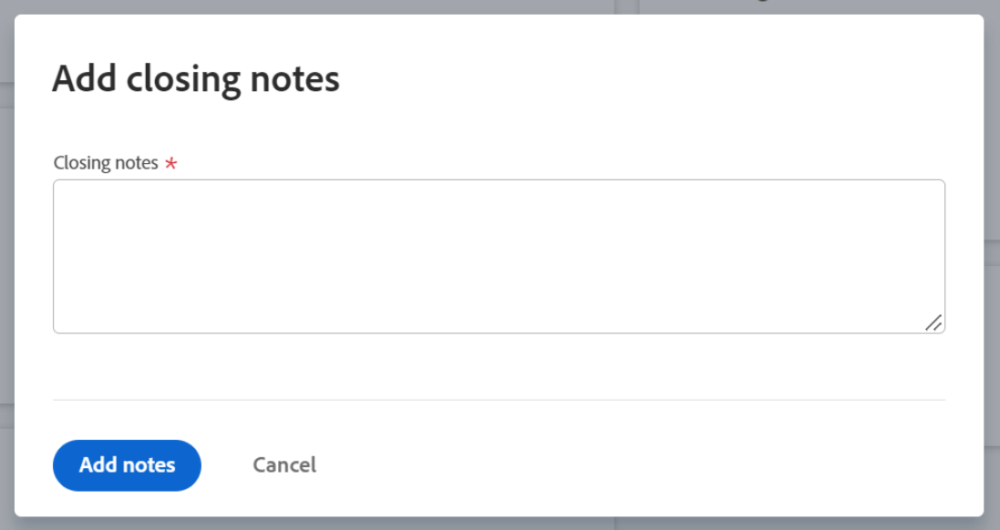

# 在Adobe Workfront目標中關閉和重新開啟目標

您可以在要指出下列項目時關閉目標：

* 目標會完成，原因可能是您已達成目標，或是時段已過。
* 你不再在做這件事，你也不打算在不久的將來做。

您可以重新開啟已關閉的目標，當這些目標再次變得相關時。

## 存取需求

<!--drafted for P&P release: 

<table style="table-layout:auto">
 <col>
 </col>
 <col>
 </col>
 <tbody>
  <tr>
   <td role="rowheader">Adobe Workfront plan*</td>
   <td>
   
Current plan: Select or higher

   Or
   
Legacy plan: Pro or higher

   
   </td>
  </tr>
  <tr>
   <td role="rowheader">Adobe Workfront license*</td>
   <td>
   
Current license: Contributor or higher

   Or
   
Legacy license: Request or higher
 
For more information, see <a href="../../administration-and-setup/add-users/access-levels-and-object-permissions/wf-licenses.md" class="MCXref xref">Adobe Workfront licenses overview</a>.
 </td>
  </tr>
  <tr>
   <td role="rowheader">Product</td>
   <td>
   
 Current product requirement: If you have the Select or Prime Adobe Workfront plan, you must also buy an additional Adobe Workfront Goals license.  Workfront Goals are included in the Ultimate Workfront Plan.

   Or
   
Legacy product requirement: You must purchase an additional license for the Adobe Workfront Goals to access functionality described in this article. 
 
For information, see <a href="../../workfront-goals/goal-management/access-needed-for-wf-goals.md" class="MCXref xref">Requirements to use Workfront Goals</a>. 
 </td>
  </tr>
  <tr>
   <td role="rowheader">Access level*</td>
   <td> 
Edit access to Goals
 
<b>NOTE</b>
If you still don't have access, ask your Workfront administrator if they set additional restrictions in your access level. For information on how a Workfront administrator can change your access level, see:

     <ul>
      <li> 
<a href="../../administration-and-setup/add-users/configure-and-grant-access/create-modify-access-levels.md" class="MCXref xref">Create or modify custom access levels</a> 
 </li>
      <li> 
<a href="../../administration-and-setup/add-users/configure-and-grant-access/grant-access-goals.md" class="MCXref xref">Grant access to Adobe Workfront Goals</a> 
 </li>
     </ul> 
 </td>
  </tr>
  <tr data-mc-conditions="">
   <td role="rowheader">Object permissions</td>
   <td>
    

     
View or higher permissions to the goal to view it

     
Manage permissions to the goal to edit it

     
For information about sharing goals, see <a href="../../workfront-goals/workfront-goals-settings/share-a-goal.md" class="MCXref xref">Share a goal in Workfront Goals</a>. 

    
 </td>
  </tr>
 </tbody>
</table>

-->

您必須具備下列條件：

<table style="table-layout:auto"> 
 <col> 
 <col> 
 <tbody> 
  <tr> 
   <td role="rowheader">Adobe Workfront計畫*</td> 
   <td> 
Pro或更高版本
 </td> 
  </tr> 
  <tr> 
   <td role="rowheader">Adobe Workfront授權*</td> 
   <td> 
要求或更高版本
 
如需詳細資訊，請參閱 <a href="../../administration-and-setup/add-users/access-levels-and-object-permissions/wf-licenses.md" class="MCXref xref">Adobe Workfront授權概觀</a>.
 </td> 
  </tr> 
  <tr> 
   <td role="rowheader">產品</td> 
   <td> 
您必須購買額外的Adobe Workfront目標授權才能存取本文所述的功能。 
 
如需詳細資訊，請參閱 <a href="../../workfront-goals/goal-management/access-needed-for-wf-goals.md" class="MCXref xref">使用Workfront目標的需求</a>. 
 </td> 
  </tr> 
  <tr> 
   <td role="rowheader">訪問級別配置*</td> 
   <td> 
編輯目標或更高版本的存取權
 
<b>附註</b>
如果您仍無權存取，請洽詢您的Workfront管理員，他們是否在您的存取層級設定其他限制。 如需Workfront管理員如何變更您的存取層級的詳細資訊，請參閱：
 
     <ul> 
      <li> 
<a href="../../administration-and-setup/add-users/configure-and-grant-access/create-modify-access-levels.md" class="MCXref xref">建立或修改自訂存取層級</a> 
 </li> 
      <li> 
<a href="../../administration-and-setup/add-users/configure-and-grant-access/grant-access-goals.md" class="MCXref xref">授予Adobe Workfront目標的存取權</a> 
 </li> 
     </ul> 
 </td> 
  </tr> 
  <tr data-mc-conditions=""> 
   <td role="rowheader">物件權限</td> 
   <td> 
    
 
     
管理目標的權限
 
     
如需共用目標的相關資訊，請參閱 <a href="../../workfront-goals/workfront-goals-settings/share-a-goal.md" class="MCXref xref">在Workfront目標中共用目標</a>. 
 
    
 </td> 
  </tr> 
 </tbody> 
</table>

&#42;若要了解您擁有的計畫、授權類型或存取權，請聯絡您的Workfront管理員。

## 必要條件

您必須具備下列條件，才能開始：

* 一種佈局模板，在主菜單中包括目標區域。

## 關閉或重新開啟目標時的考量事項

* 您必須先在存取層級中擁有編輯目標的存取權，才能關閉和重新開啟目標。 如需授與目標存取權的相關資訊，請參閱 [授予Adobe Workfront目標的存取權](../../administration-and-setup/add-users/configure-and-grant-access/grant-access-goals.md).
* 您只能關閉作用中的目標。 您無法關閉處於「草稿」狀態的目標。

   有關目標狀態的資訊，請參閱 [Adobe Workfront目標中的目標狀態概觀](../../workfront-goals/goal-management/goal-status-overview.md).

* 關閉目標會鎖定其進度，並讓您評估您在完成目標方面的表現。

   >[!CAUTION]
   >
   >在結束具有積極貢獻目標的目標時，其進度會在結束後改變，以指出貢獻積極目標的進度。 如需協調目標的相關資訊，請參閱 [在Adobe Workfront目標中將目標連結起來，以協調目標](../../workfront-goals/goal-alignment/align-goals-by-connecting-them.md).

* 在關閉目標之前，請更新目標的進度指標，以確保目標以準確的進度值關閉。 如果所有進展指標都已實現，那麼目標完成百分比應為100%，目標已實現。 如需更新目標的相關資訊，請參閱 [更新Adobe Workfront目標中的目標進度](../../workfront-goals/goal-review-and-workfront-goals-sections/check-in-goals.md).
* 保留任何最終評論，作為您關閉之目標的更新。 如需將註解新增至目標的相關資訊，請參閱 [管理Adobe Workfront目標中的目標註解](../../workfront-goals/goal-management/manage-goal-comments.md).
* 您無法再更新關閉目標的結果和活動進度。
* 如果要繼續處理，您可以重新開啟已關閉的目標。
* 如果尚未實現目標，請考慮將其大多數資訊複製到下一個時段（季度或年）。 對於從一個時間段到下一個時間段相同的目標，或者您仍需要努力在下一個時間段內實現的目標，這是絕佳的選擇。 如需複製目標的詳細資訊，請參閱 [複製Adobe Workfront目標中的目標](../../workfront-goals/goal-management/copy-goals.md). 您也可以更新目標的時段，而不是將其複製至其他時段。
* Workfront會在您重新開啟已關閉目標時刪除該目標的註解。 如果您必須保留意見，建議您複製已結束的目標，包括與其相關聯的任何結果，而非重新開啟該目標。

## 關閉目標

<!--
Closing goals differs depending on what environment you use. 

### Close goals in the Production environment

1. Click the **Main Menu** icon  > **Goals** in the upper-right corner.

   (!-- Add this when Shell is available to all: or (if available), click the **Main Menu** icon  in the upper-left corner)
   --)

   The Goal List opens. 

1. (Optional) Modify your filters to display only goals that are active.

   For information about filtering information in Workfront Goals, see [Filter information in Adobe Workfront Goals](../../workfront-goals/goal-management/filter-information-wf-goals.md). 

1. Click an active goal.

   The Goal Details panel displays on the right. 

1. (Optional and recommended) Click the **Updates** tab and add an update in the **Comment here** field about the reason you are closing the goal, then click **Post**. 

1. Click the **More icon**  to the right of the goal name, then click **Close** > **Close Goal**.

   This closes the goal and saves the current progress on the goal and its results and activities.

   >[!IMPORTANT]
   >
   >If the goal has contributing goals that are still active, the progress of the goal continues to update based on the progress of the aligned goals.
   >
   >
   >   >
   >

1. (Optional) Modify your filters again to display only closed goals. The goals you closed display on the screen.
-->

1. 按一下 **主菜單** 圖示  > **目標** 在右上角。

   「目標清單」隨即開啟。

   <!-- Add this when Shell is available to all: or (if available), click the **Main Menu** icon  in the upper-left corner)
   -->

1. （選用）修改您的篩選條件，僅顯示作用中的目標。

   如需篩選Workfront目標中資訊的詳細資訊，請參閱 [篩選Adobe Workfront目標中的資訊](../goal-management/filter-information-wf-goals.md).
1. 按一下作用中的目標。

   目標頁面隨即開啟。

   
1. 按一下 **更多** 功能表  在目標名稱的右側，然後按一下 **關閉**.

   目標關閉，畫面右上角會顯示確認訊息。

   

1. （選用）在確認方塊中，按一下 **添加結尾附註** 以新增關於此目標的意見，以及您需要關閉該目標的原因。
1. 新增結尾附註，然後按一下 **新增附註**.

   

   備注會顯示在目標頁面的「目標詳細資訊」區段中的「結束附註」區域。

   >[!NOTE]
   >
   >如果您稍後重新開啟已關閉的目標，Workfront會刪除結束附註。

## 重新開啟目標

如果您決定已重新建立相關性，且您需要繼續更新其進度，則可以重新開啟已關閉的目標。

<!--
Reopening goals differs depending on what environment you use.

### Reopen goals in the Production environment

1. Click the **Main Menu** icon  > **Goals** in the upper-right corner.

   (!-- Add this when Shell is available to all: or (if available), click the **Main Menu** icon  in the upper-left corner)
   --)

   The Goal List opens. 

1. (Optional) Modify your filters to display only goals that are closed.

   For information about filtering information in Workfront Goals, see [Filter information in Adobe Workfront Goals](../../workfront-goals/goal-management/filter-information-wf-goals.md).

1. Click a closed goal.

   This opens the Goal Details panel on the right. 

1. Click the **More icon**  to the right of the goal name, then click **Reopen** > **Reopen**.

   This reopens the goal and places it in a status of Active. The progress of the goal is recalculated starting with the current date. 

1. (Optional) Modify your filters again to display only active goals. The goals you opened display on the screen.

-->

1. 按一下 **主菜單** 圖示 > **目標** 在右上角。

   「目標清單」隨即開啟。

   <!-- Add this when Shell is available to all: or (if available), click the **Main Menu** icon  in the upper-left corner)
   -->

1. （選用）修改您的篩選器，僅顯示已關閉的目標。

   如需篩選Workfront目標中資訊的詳細資訊，請參閱 [篩選Adobe Workfront目標中的資訊](../goal-management/filter-information-wf-goals.md).
1. 按一下已關閉目標的名稱。

   目標頁面隨即開啟。
1. 按一下 **更多** 功能表  目標名稱的右側，然後 **重新開啟** > **重新開啟**.

   發生下列情況：
   * 目標現在為開啟，且狀態為「作用中」。
   * 從當前日期開始重新計算目標的進度。
   * 所有結束附註都會從「目標詳細資訊」頁面中刪除。 無法恢復已刪除的結尾附註。

1. （選用）再次修改您的篩選器以僅顯示作用中的目標。

   您開啟的目標會顯示在畫面上。

