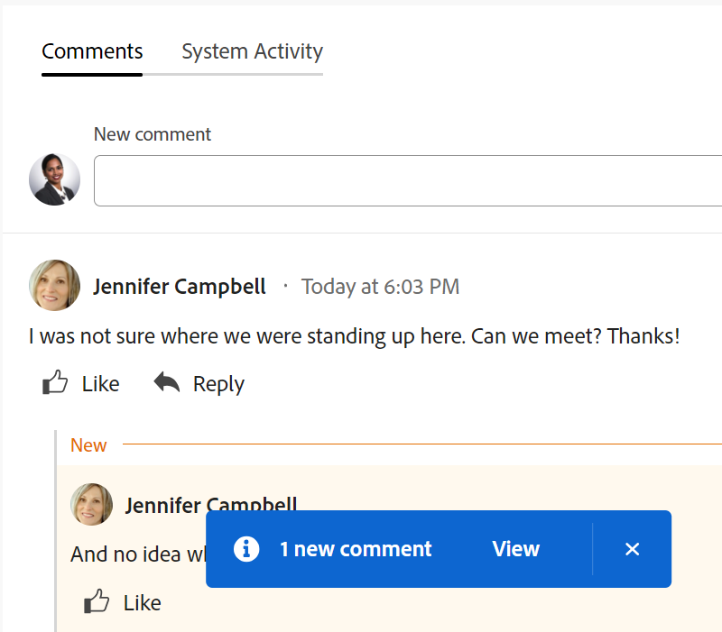

# 在Adobe Workfront目標中管理目標註解

<!--consider retiring this article when goals and all objects are in parity - after the new commenting experience goes to production GA-->

<!--The highlighted information on this page refers to functionality not yet generally available. It is available only in the Preview environment.-->

您可以將註解新增至所有可在Adobe Workfront目標中檢視的目標。

<!--drafted for P&P:

<table style="table-layout:auto">
 <col>
 </col>
 <col>
 </col>
 <tbody>
  <tr>
   <td role="rowheader">Adobe Workfront plan*</td>
   <td>
   
Current plan: Select or higher

   Or
   
Legacy plan: Pro or higher

   
   </td>
  </tr>
  <tr>
   <td role="rowheader">Adobe Workfront license*</td>
   <td>
   
Current license: Contributor or higher

   Or
   
Legacy license: Request or higher
 
For more information, see <a href="../../administration-and-setup/add-users/access-levels-and-object-permissions/wf-licenses.md" class="MCXref xref">Adobe Workfront licenses overview</a>.
 </td>
  </tr>
  <tr>
   <td role="rowheader">Product</td>
   <td>
   
 Current product requirement: If you have the Select or Prime Adobe Workfront plan, you must also buy an additional Adobe Workfront Goals license.  Workfront Goals are included in the Ultimate Workfront Plan.

   Or
   
Legacy product requirement: You must purchase an additional license for the Adobe Workfront Goals to access functionality described in this article. 
 
For information, see <a href="../../workfront-goals/goal-management/access-needed-for-wf-goals.md" class="MCXref xref">Requirements to use Workfront Goals</a>. 
 </td>
  </tr>
  <tr>
   <td role="rowheader">Access level*</td>
   <td> 
Edit access to Goals
 
<b>NOTE</b>
If you still don't have access, ask your Workfront administrator if they set additional restrictions in your access level. For information on how a Workfront administrator can change your access level, see:

     <ul>
      <li> 
<a href="../../administration-and-setup/add-users/configure-and-grant-access/create-modify-access-levels.md" class="MCXref xref">Create or modify custom access levels</a> 
 </li>
      <li> 
<a href="../../administration-and-setup/add-users/configure-and-grant-access/grant-access-goals.md" class="MCXref xref">Grant access to Adobe Workfront Goals</a> 
 </li>
     </ul> 
 </td>
  </tr>
  <tr data-mc-conditions="">
   <td role="rowheader">Object permissions</td>
   <td>
    

     
View or higher permissions to the goal to view it

     
Manage permissions to the goal to edit it

     
For information about sharing goals, see <a href="../../workfront-goals/workfront-goals-settings/share-a-goal.md" class="MCXref xref">Share a goal in Workfront Goals</a>. 

    
 </td>
  </tr>
 </tbody>
</table>
-->

## 存取需求

您必須具備下列存取權才能執行本文所述的動作：

<table style="table-layout:auto"> 
 <col> 
 <col> 
 <tbody> 
  <tr> 
   <td role="rowheader">Adobe Workfront計畫*</td> 
   <td> 
Pro或以上
 </td> 
  </tr> 
  <tr> 
   <td role="rowheader">Adobe Workfront授權*</td> 
   <td> 
要求或以上
 
如需詳細資訊，請參閱 <a href="../../administration-and-setup/add-users/access-levels-and-object-permissions/wf-licenses.md" class="MCXref xref">Adobe Workfront授權概觀</a>.
 </td> 
  </tr> 
  <tr> 
   <td role="rowheader">產品</td> 
   <td> 
您必須為Adobe Workfront目標購買額外的授權，才能存取本文所述功能。 
 
如需詳細資訊，請參閱 <a href="../../workfront-goals/goal-management/access-needed-for-wf-goals.md" class="MCXref xref">使用Workfront目標的需求</a>. 
 </td> 
  </tr> 
  <tr> 
   <td role="rowheader">存取層級*</td> 
   <td> 
檢視或更高的目標存取權
 
<b>附註</b>
如果您仍然沒有存取權，請詢問您的Workfront管理員是否對您的存取層級設定了其他限制。 如需Workfront管理員如何變更存取層級的詳細資訊，請參閱：
 
     <ul> 
      <li> 
<a href="../../administration-and-setup/add-users/configure-and-grant-access/create-modify-access-levels.md" class="MCXref xref">建立或修改自訂存取層級</a> 
 </li> 
      <li> 
<a href="../../administration-and-setup/add-users/configure-and-grant-access/grant-access-goals.md" class="MCXref xref">授予Adobe Workfront目標的存取權</a> 
 </li> 
     </ul> 
 </td> 
  </tr> 
  <tr data-mc-conditions=""> 
   <td role="rowheader">物件許可權</td> 
   <td> 
    
 
     
檢視或更高的目標許可權
 
     
如需關於共用目標的資訊，請參閱 <a href="../../workfront-goals/workfront-goals-settings/share-a-goal.md" class="MCXref xref">在Workfront目標中共用目標</a>. 
 
    
 </td> 
  </tr> 
 </tbody> 
</table>

*若要瞭解您擁有的計畫、授權型別或存取權，請聯絡Workfront管理員。

## 必要條件

開始之前，您必須具備下列條件：

* 包含主功能表中目標區域的版面配置範本。

## 找出「更新」區段

您可以在目標頁面的「更新」區段中，將註解新增至目標。

您可以回覆或喜歡您或其他人新增至此區域的評論。

1. 按一下 **主要功能表** 圖示  > **目標** 右上角。
這會開啟目標清單。
1. 找到您要新增註解的目標，然後按一下其名稱以開啟目標頁面。
1. 按一下  **更新** 在左側面板中。
1. 按一下 **註解** tab鍵來更新。
1. 開始在 **新註解** 方塊。

   

   >[!TIP]
   >
   >在您完成輸入和提交評論之前離開更新區段時，即使您登出並重新登入，頁面上的評論仍會以草稿模式顯示。 任何新增至註解的影像也會儲存在草稿中。 草稿會儲存7天，之後便會捨棄且無法復原。 草擬的註解僅對輸入註解的使用者可見。

1. （可選）若要新增RTF格式至更新、超連結或影像，請使用RTF工具列上的任何選項或旁邊的圖示。 如需詳細資訊，請參閱 [更新工作](../../workfront-basics/updating-work-items-and-viewing-updates/update-work.md).
1. （選用）在 **標籤人員或團隊** 區域，開始輸入使用者名稱或電子郵件，或您想包含在此評論中的團隊，然後當它顯示在清單中時選取它。
1. 選取 **我的公司私有** 切換即可讓註解僅對貴公司人員可見。

   >[!TIP]
   >
   >您必須在設定檔中指定公司，才能在更新區域使用此選項。

1. 按一下 **提交**.

   >[!TIP]
   >
   >如果其他使用者將評論提交給您正在更新的相同專案，將有帶有「新」指示器的紅線通知您較新的評論。
   >
   >指示器只會在評論提交至專案後才顯示，不會在評論仍然撰寫時顯示。
   >
   >「新」指標只有在輸入新更新的使用者以及目前輸入更新的使用者都使用新評論體驗時才會顯示。
   >

1. （可選）若要編輯註解，請按一下 **更多** 功能表  按一下「讚」圖示右側，然後按一下 **編輯**.
1. 編輯註解中的資訊、新增或移除影像，或移除任何已標籤的使用者。
您可以在提交評論後15分鐘內編輯評論。 「已編輯」指標會新增至更新評論時顯示的日期戳記左側。

   

   >[!TIP]
   >
   > * 系統會產生電子郵件，僅當您提交原始更新時，才會通知使用者您的更新。 編輯更新後不會產生電子郵件。
   >
   > * 日期戳記是原始註解的日期，而不是最新更新的日期。

   1. （可選）按一下 **更多** 功能表 ，然後按一下下列任一選項，將註解中的資訊複製到剪貼簿：

      * **複製連結** 複製更新的連結，而不進行回覆。
      * **複製內文** 以複製更新的文字。

         如需詳細資訊，請參閱 [更新工作](../../workfront-basics/updating-work-items-and-viewing-updates/update-work.md).

1. （可選）按一下 **更多** 功能表  ，然後按一下 **刪除** 以刪除您新增的註解。 如需詳細資訊，請參閱 [更新工作](../../workfront-basics/updating-work-items-and-viewing-updates/update-work.md).
1. （可選）按一下 **回覆** 若要回覆現有註解，請遵循上述步驟5-9。 <!--insure this stays accurate-->
1. （有條件和選擇性）如果其他使用者新增了在「更新」區段的可見區域外顯示的註解，請按一下 **檢視** 藍色內部 **新評論橫幅** 在熒幕底部顯示這些註解。

   

   熒幕底部會顯示其他註解。
1. （可選）按一下 **按讚** 圖示 喜歡其他人新增的註解。 圖示會隨著喜歡的數量而更新。

1. （可選）按一下 **系統活動** 索引標籤來檢視系統記錄的更新。 目標更新時，Workfront會產生該更新的相關附註，並顯示在「系統活動」標籤中。 當結果、活動或專案新增至目標或更新時，Workfront也會記錄系統更新。 <!--ensure the casing on the tab has not changed-->

<!--BELOW IS OLD, ATIIM/ WORKFRONT GOALS INFORMATION ABOUT COMMENTS: 

## Add comments to goals in the Check-in section

The Check-in section has been removed from the Preview environment. You can update goals by accessing the goal page. For information, see 
[Update goals in the Goal details section in Adobe Workfront Goals](../goal-management/update-goals-in-goal-details-panel.md). 

>[!TIP]
>
>You must have access to Edit Goals in your access level to view the Check-in section.

You can add comments to goals in the Check-in section of Workfront Goals, as part of updating your list of goals. For information about updating goals, see [Update goal progress in Adobe Workfront Goals](../../workfront-goals/goal-review-and-workfront-goals-sections/check-in-goals.md).

You can also like goal comments that other users have added to mark your approval of them in the Check-in section.

1. Click the **Main Menu** icon  > **Goals** in the upper-right corner.

   ( Add this when Shell is available to all: or (if available), click the **Main Menu** icon  in the upper-left corner))

   This opens the Workfront Goals area. 

1. Click the **Check-in** section in the left panel.

   

   Goals assigned to you or that have results and activities that are assigned to you display in this area. 

1. (Optional) Click the right-pointing arrow to the left of the goal name to expand the goal, if the goal is not already expanded. 
1. Type your comment in the **Add a comment to this goal (optional)** field, then click **Post**.

   Two most recent comments display by default under each goal.

1. Click **Show all comments** to display all comments on a goal. A number of total comments for the goal also displays. Comments display in the order they were entered, with the most recent first. 
1. (Optional) Click the **Like icon**  to like a comment. The icon updates with the number of likes. 

1. (Optional) Click the number of likes next to a comment and a list with the names of the users who liked the comment displays in the right panel.

   

1. (Conditional) Click **Back to Updates** to return to the Updates tab of the Goal Details panel, or click the **X icon** in the upper-right corner to close the right panel.

## Add comments to goals in the Pulse section

The Pulse section has been removed from the Preview environment. You can update goals by accessing the goal page. For information, see 
[Update goals in the Goal details section in Adobe Workfront Goals](../goal-management/update-goals-in-goal-details-panel.md). 

You can add comments to goals in the Pulse section of Workfront Goals, as part of reviewing goals that might affect yours. For information about reviewing goals in the Pulse section, see [Review goals in the Adobe Workfront Goals Pulse section](../../workfront-goals/goal-review-and-workfront-goals-sections/review-goals-in-pulse.md).

You can also like goal comments that other users have added to mark your approval of them in the Pulse section.

1. Click the **Main Menu** icon  > **Goals** in the upper-right corner.

   (Add this when Shell is available to all: or (if available), click the **Main Menu** icon  in the upper-left corner))

   This opens the Workfront Goals area. 

1. Click the Pulse section in the left panel.

   

   All current goals display in this section, regardless of their status.

1. Click **Add a comment**, then type your comment in the **Add a comment to this goal (optional)** field.
1. Click **Post**.

   Three comments display by default under each goal.

1. Click **Show all updates** to display all comments on a goal. A number of total comments for the goal also displays. Comments display in the order they were entered, with the most recent first. 
1. (Optional) Click the **Like icon**  to like a comment. The icon updates with the number of likes. 

1. (Optional) Click the number of likes next to a comment and a list with the names of the users who liked the comment displays in the right panel.

   

1. (Conditional) Click **Back to Updates** to return to the Updates tab of the Goal Details panel, or click the **X icon** in the upper-right corner to close the right panel.

-->

<!--
Locating goal comments differs depending on what environment you use. 

### Locate goal comments in the Production environment

You can add comments to goals in the following areas of Workfront Goals:

* The Goal Details panel
* The Check-in section 
* The Pulse section

Although the process for adding comments to goals is similar in these areas, there are differences in being able to edit, delete, or react to a comment when using one area versus another. When you enter a comment in any of these areas, the comment is visible in all areas where goal comments display.

>[!NOTE]
>
>You cannot add comments to results and activities.

-->

<!--
## Add comments to goals in the Goal Details panel

Adding comments to goals differs depending on what environment you use.

### Add comments to goals in the Production environment

You can add comments to goals in the Goal Details panel, as part of updating an individual goal.

You can edit or delete a comment that you entered in this area, or you can like comments.

1. Click the **Main Menu** icon  > **Goals** in the upper-right corner.

   (Add this when Shell is available to all: or (if available), click the **Main Menu** icon  in the upper-left corner))
   

   This opens the Workfront Goals area. 

1. Locate the goal you want to add comments to, then click its name to open the Goal Details panel to the right. 
1. Click the **Updates** tab.
1. Type your comment in the **Comment here** field, then click **Post**. 
1. (Optional and conditional) Select the **Comments** option at the top of the list to view your comment at the top of the list. It is enabled by default and comments display here with the most recent comment first. 
1. (Optional) Click **Edit** to edit your comment, then click **Save** to save your changes, or **Cancel** to revert to the original update.

   >[!TIP]
   >
   >* You can only edit comments you entered. 
   >* There is no time limit for how long after you enter a comment you are allowed to edit it.

1. (Optional) Click **Delete** to delete your comment, then click **Yes, Delete** to confirm.

   >[!TIP]
   >
   >* You can only delete comments you entered. 
   >* There is no time limit for how long after you enter a comment you are allowed to delete it.

1. (Optional) Click the **Like icon**  to like a comment that someone else added. The icon updates with the number of likes. 

1. (Optional) Click the number of likes next to a comment and a list with the names of the users who liked the comment displays in the right panel.

   <!--
   
(NOTE: this functionality might change)

   

   

1. (Conditional) Click **Back to Updates** to return to the Updates tab of the Goal Details panel, or click the **X icon** in the upper-right corner to close the right panel.

-->