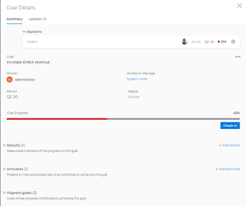

# 更新「Adobe Workfront目標」中「目標詳細資料」區段中的目標

<!--drafted for the goal redesign:
- change the title for Production to Update goals in the Goal details section in Adobe Workfront Goals. 
- update the description in the metadata above
-->

您可以存取目標詳細資訊面板，以更新個別目標的資訊。

>[!NOTE]
>
>您無法更新狀態為「已關閉」的目標。

## 存取需求

您必須具備下列條件：

<table style="table-layout:auto">
<col>
</col>
<col>
</col>
<tbody>
 <tr> 
   <td role="rowheader">Adobe Workfront計畫*</td> 
   <td> 
   
對於新計畫和授權結構：
  <ul><li>終極計畫 </li>
  或
  <li>適用於Prime或選取Adobe Workfront計畫的Adobe Workfront目標的其他授權。 </li></ul> 

對於目前的計畫與授權結構： 
<ul><li> A Pro或更高版本 </li>
  <li>除了Adobe Workfront授權之外，還有Workfront目標授權。</li></ul>

   </td> 
  </tr>
 <tr>
 <td role="rowheader">Adobe Workfront授權*</td>
 <td>
 
新授權：投稿人或以上版本

 或
 
目前授權：要求或以上
 
如需詳細資訊，請參閱 <a href="../../administration-and-setup/add-users/access-levels-and-object-permissions/wf-licenses.md" class="MCXref xref">Adobe Workfront授權總覽</a>.
 </td>
 </tr>
 <tr>
 <td role="rowheader">產品*</td>
 <td>
 
 新產品需求，下列其中一項： 

<ul>
<li>Select或Prime Adobe Workfront計畫以及額外的Adobe Workfront目標授權。</li>
<li>預設包含Workfront目標的Ultimate Workfront計畫。 </li></ul>
 
或

 
目前產品需求： Adobe Workfront Goals的Workfront計畫和額外授權。 
 
如需詳細資訊，請參閱 <a href="../../workfront-goals/goal-management/access-needed-for-wf-goals.md" class="MCXref xref">使用Workfront目標的需求</a>. 
 </td>
 </tr>
 <tr>
 <td role="rowheader">存取層級*</td>
 <td> 
編輯目標的存取權
 </td>
 </tr>
 <tr data-mc-conditions="">
 <td role="rowheader">物件許可權</td>
 <td>
  

  
檢視目標或更高許可權以檢視它

  
管理目標的許可權以編輯它

  
如需關於共用目標的資訊，請參閱 <a href="../../workfront-goals/workfront-goals-settings/share-a-goal.md" class="MCXref xref">在Workfront目標中共用目標</a>. 

  
 </td>
 </tr>
 <tr>
   <td role="rowheader">
版面配置範本
</td>
   <td> 
必須為所有使用者(包括Workfront管理員)指派一個版面配置範本，該範本包含主功能表中的「目標」區域。 
  
</td>
  </tr>
</tbody>
</table>

*如需詳細資訊，請參閱 [Workfront檔案中的存取需求](/help/quicksilver/administration-and-setup/add-users/access-levels-and-object-permissions/access-level-requirements-in-documentation.md).

## 更新「目標詳細資料」區段中的目標

您可以從目標清單存取個別目標。

<!--

Updating goals in the Goal Details panel differs depending on where you access the goal from. 

### Update goals in the Goal Details panel in the Production environment

1. Click the **Main Menu** icon  > **Goals** in the upper-right corner.

   (!-- Add this when Shell is available to all: or (if available), click the **Main Menu** icon  in the upper-left corner)
   --)

   This opens the Goals area in Workfront. 

1. Click the name of a goal in the Goal List, then click the name of a goal.

   This opens the Goal Details panel on the right.
   

   >[!TIP]
   >
   >You can also click the name of a goal in the Goal Alignment, Check-in, or Pulse sections. 
   >
   ><!-- drafted for goal redesign:
   >Add this to the TIP above with goal redesign: 
   >
   >The Check-in and Pulse sections have been removed from the Preview environment.
   >

1. On the Summary tab, click the **More icon** , then click any of the following options:

   1. **Edit**. For information about editing goals, see [Edit goals in Adobe Workfront Goals](../../workfront-goals/goal-management/edit-goals.md).
   1. **Copy**. For information about copying goals, see [Copy goals in Adobe Workfront Goals](../../workfront-goals/goal-management/copy-goals.md).
   1. **Activate**. This option is available only for drafted and inactive goals.

      For information about activating goals, see [Access and open goals in Adobe Workfront Goals](../../workfront-goals/goal-management/access-goals-in-wf-goals.md). 
   
   1. **Close**, then click**Close Goal**. This option is available only for active goals.

      For information about closing goals, see [Close and reopen goals in Adobe Workfront Goals](../../workfront-goals/goal-management/close-and-reopen-goals.md). 
   
   1. **Deactivate**. This option is available only for active goals. This deactivates the goal immediately.

      For information about deactivating goals, see [Delete and deactivate goals in Adobe Workfront Goals](../../workfront-goals/goal-management/delete-and-deactivate-goals.md).
   
   1. **Delete**, then click **Yes, Delete**.

      For information about deleting goals, see [Delete and deactivate goals in Adobe Workfront Goals](../../workfront-goals/goal-management/delete-and-deactivate-goals.md).

      >[!NOTE]
      >
      >Deleted goals cannot be recovered.

   1. **Reopen**, then click **Reopen**. This option is available only for closed goals that are from a current time period.

      For information about reopening goals, see [Close and reopen goals in Adobe Workfront Goals](../../workfront-goals/goal-management/close-and-reopen-goals.md). 
   
   1. (Conditional) If you clicked any of the options between steps a-i above except Delete or Reopen, click **Save**.    
   
      (!--ensure this is accurate)--)

1. Click **Align to another goal** in the upper-right of the Summary tab, then specify the name of a goal in the **Align to** **another goal** field that you want to align the current goal to. The current goal becomes the child of the goal you align it to. For information about child and parent goals, see [Align goals by connecting them in Adobe Workfront Goals](../../workfront-goals/goal-alignment/align-goals-by-connecting-them.md). 
1. Click **Add results**. Results drive the progress of your goal. For information about adding results, see [Add results to goals in Adobe Workfront Goals](../../workfront-goals/results-and-activities/add-results-to-goals.md).

1. Click **Add activities**. Activities drive the progress of your goal. For information about adding activities, see [Add activities to goals in Adobe Workfront Goals](../../workfront-goals/results-and-activities/add-activities-to-goals.md). 

1. Click the **Updates** tab. Here, you can view goal comments and review the entire editing history of the goal, activities, and results, to understand who changed what and when.

   

1. (Optional) Deselect any of the following options if you want to not display them in the Updates tab.&nbsp;They are selected by default: 

   | Option |Description  |
   |---|---|
   | Progress Updates |Displays information about the history of progress updates on results and activities.  |
   | Comments |Displays comments made by users on the goal.  |
   | Editing History |Displays information about creating and updating the goal, results, and activities.  |

1. (Optional) Click **Details** under a progress or an editing history update to display additional information about the update.

   

-->

1. 按一下目標清單中目標的名稱，然後按一下目標的名稱。

   如此將可開啟 **目標詳細資料** 區段內。

   

1. 按一下 **編輯圖示**  按一下「 」 **編輯全部** 或 **概觀**

   或

   開始在「目標詳細資料」區段的其中一個可編輯欄位中輸入資訊。 區段會變成可編輯的。

   >[!IMPORTANT]
   >
   >並非顯示在「目標詳細資料」區段中的所有欄位都可以編輯。 Workfront會計算某些欄位，且這些欄位為唯讀。

1. 更新或檢閱下列欄位：

   * **說明**：新增或更新目標的相關資訊。
   * **進度**：指出目前已完成目標的百分比。 您無法手動更新目標的進度。 目標進度是計算所有進度指示器。
   * **條件**：指出目標是新的且尚未更新、正在準時完成或落後。 您無法更新目標的條件。 Workfront會自動計算目標的條件。\
     如需目標條件和進度的詳細資訊，請參閱
     [Adobe Workfront目標中的目標進度和條件概觀](../goal-management/calculate-goal-progress.md).
   * **狀態**：您無法手動更新目標的狀態。 如需詳細資訊，請參閱 [Adobe Workfront目標中的目標狀態概觀](../goal-management/goal-status-overview.md).
   * **目標所有者**：按一下以更新目標擁有者的名稱。 開始輸入使用者、團隊、群組或組織名稱，然後在其顯示在清單中時選取它。 一個目標只能有一個擁有者。
   * **上層目標**：開始輸入目標名稱，您要將其設定為您所選目標的父系。 所選目標的進度將自動更新父目標的進度。

     >[!TIP]
     >
     >您無法更新下列有關上層目標的資訊：
     >    * 上層目標期間
     >    * 上層目標進度
     >    * 上層目標所有者。
     >      
     >您必須更新上層目標本身的這項資訊。

   * **期間**：按一下以更新目標的時段\
     或\
     選取 **啟用自訂日期** 若要指定目標的日期 **開始** 和 **結束日期**.
   * **關閉附註**：此欄位僅對狀態為「已關閉」的目標可見。 無法編輯已關閉的目標。 重新開啟已關閉的目標會永久刪除關閉附註。

