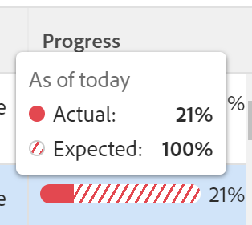

# 在Adobe Workfront目標中檢閱發生問題的目標

<!--

(NOTE: the status of goals in "red" used to be called At Risk. Now, it is "in trouble") 

-->

出現問題的進度目標有無法實現的危險，在Adobe Workfront目標中有紅色進度列表示。 您應該經常檢閱您的目標，並瞭解進度滯後的原因。 如需目標進度的相關資訊，請參閱[Adobe Workfront目標中的目標進度和條件總覽](../../workfront-goals/goal-management/calculate-goal-progress.md)。

## 存取需求

您必須具備下列條件：

<table style="table-layout:auto">
<col>
</col>
<col>
</col>
<tbody>
 <tr> 
   <td role="rowheader">Adobe Workfront計畫*</td> 
   <td> 
   
對於新計畫和授權結構：
  <ul><li>終極計畫 </li></ul>
   

對於目前的計畫與授權結構： 
<ul><li> A Pro或更高版本 </li>
  <li>除了Adobe Workfront授權之外，還有Workfront目標授權。</li></ul>

   </td> 
  </tr>
 <tr>
 <td role="rowheader">Adobe Workfront授權*</td>
 <td>
 
新授權：投稿人或以上版本

 或
 
目前授權：要求或以上
 
如需詳細資訊，請參閱<a href="../../administration-and-setup/add-users/access-levels-and-object-permissions/wf-licenses.md" class="MCXref xref">Adobe Workfront授權總覽</a>。
 </td>
 </tr>
 <tr>
 <td role="rowheader">產品*</td>
 <td>
 
 新產品需求，下列其中一項： 

<ul>
<li>Select或Prime Adobe Workfront計畫以及額外的Adobe Workfront目標授權。</li>
<li>預設包含Workfront目標的Ultimate Workfront計畫。 </li></ul>
 
或

 
目前產品需求： Adobe Workfront Goals的Workfront計畫和額外授權。 
 
如需詳細資訊，請參閱<a href="../../workfront-goals/goal-management/access-needed-for-wf-goals.md" class="MCXref xref">使用Workfront目標的需求</a>。 
 </td>
 </tr>
 <tr>
 <td role="rowheader">存取層級</td>
 <td> 
編輯目標的存取權
</td>
 </tr>
 <tr data-mc-conditions="">
 <td role="rowheader">物件許可權</td>
 <td>
  

  
檢視目標或更高許可權以檢視它

  
管理目標的許可權以編輯它

  
如需共用目標的相關資訊，請參閱<a href="../../workfront-goals/workfront-goals-settings/share-a-goal.md" class="MCXref xref">在Workfront目標中共用目標</a>。 

  
 </td>
 </tr>
 <tr>
   <td role="rowheader">
版面配置範本
</td>
   <td> 
必須為所有使用者(包括Workfront管理員)指派一個版面配置範本，該範本包含主功能表中的「目標」區域。 
  
</td>
  </tr>
</tbody>
</table>

*如需詳細資訊，請參閱Workfront檔案中的[存取需求](/help/quicksilver/administration-and-setup/add-users/access-levels-and-object-permissions/access-level-requirements-in-documentation.md)。

## Recommendations可防止目標達成有問題的進度

在目標達到「存在問題」的進度之前，您可以經常監控目標，並在目標達到「有風險」的進度時調整進度。 有風險的目標有陷入麻煩的危險。 如需目標進度的詳細資訊，請參閱[Adobe Workfront目標中的目標進度和條件總覽](../../workfront-goals/goal-management/calculate-goal-progress.md)

在您的目標達到「存在問題」的進度之前，我們建議執行以下操作：

* 稽核經常處於風險狀況的目標是否指派給您，以及指派給團隊、群組或組織的組織目標是否可能受目標進度影響。 面臨風險的目標有成為麻煩目標的危險。 有風險的目標會以黃色進度列標示。 使用目標清單來檢視屬於您、您的團隊、群組或您的組織的目標。

## 檢閱目標清單中的問題中目標

您可以在Workfront目標的任何區段中檢閱目標。 如需Workfront目標區段的詳細資訊，請參閱[Adobe Workfront目標區段概覽](../../workfront-goals/goal-review-and-workfront-goals-sections/overview-of-wf-goals-sections.md)。

本文說明如何檢閱目標清單中的目標。

1. 按一下右上角的&#x200B;**主要功能表**&#x200B;圖示 > **目標**。

   <!-- Add this when Shell is available to all: or (if available), click the **Main Menu** icon  in the upper-left corner)
   -->

   如此將可開啟Workfront目標區域，且預設會顯示目標清單區段。

1. （建議）針對「目標清單」區域調整下列篩選器，以檢閱有風險的目標：

   * 依序按一下「**公司**」、「**我的團隊**」、「**我的群組**」、「**個人**」目標，以檢視屬於您的組織、團隊、群組，以及您自己的目標。

     >[!TIP]
     >
     >在Adobe Workfront目標中，「公司」篩選器會顯示您的組織被選為所有者的目標。
     >
     >
     >您無法使用此欄位來搜尋公司。 依預設，僅選取擁有Workfront執行個體的組織。

   * 針對您在上方選取的每個組織單位，按一下&#x200B;**新增篩選器** > **進度** > **發生問題** >**套用。**
   * （選用）選取您要檢視目標的時間段。

     目標清單中每個目標的進度列指標都會以紅色顯示。

     如需使用右側面板中的所有其他條件篩選目標的詳細資訊，請參閱[在Adobe Workfront目標中篩選資訊](../../workfront-goals/goal-management/filter-information-wf-goals.md)。

1. 將滑鼠停留在進度列指標上，可檢視當天的實際進度百分比和預期值。

   

1. （選用）使用篩選器來尋找屬於特定擁有者的目標。

   選定使用者的問題中目標會顯示在目標清單中。

1. 按一下目標名稱以開啟目標頁面，然後按一下左側面板中的&#x200B;**進度指示器**。 檢視哪個進度指標導致目標落後，並在進度指標清單的&#x200B;**實際進度**&#x200B;欄中更新內嵌指標的進度。

   如需有關更新結果和活動的資訊，請參閱[在Adobe Workfront目標中更新目標進度](../goal-review-and-workfront-goals-sections/check-in-goals.md)

   

   >[!NOTE]
   >
   >您只能更新進度指示器清單中的結果和活動。 您必須透過存取目標來更新子目標的進度指示器，而且您必須更新已連線專案上的任務以更新專案的進度。

