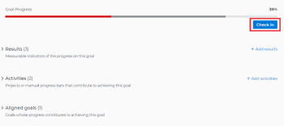
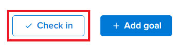

# 在Adobe Workfront目標中更新目標進度

<!-- Audited for P&P only: 4/2025-->

您必須定期檢閱您的目標並更新其進度，以確保其不會落後或變得無法達成。

<!--And: take this last sentence ^^ out when you update this for goal redesign production.-->

## 存取需求

+++ 展開以檢視本文中功能的存取需求。

您必須具備下列條件：

<table style="table-layout:auto">
<col>
</col>
<col>
</col>
<tbody>
 <tr> 
   <td role="rowheader">Adobe Workfront計畫*</td> 
   <td> 
   
對於新計畫和授權結構：
  <ul><li>Ultimate計畫 </li></ul>
   

對於目前的計畫與授權結構： 
<ul><li> A Pro或更高版本 </li>
  <li>除了Adobe Workfront授權之外，還有Workfront目標授權。</li></ul>

   </td> 
  </tr>
 <tr>
 <td role="rowheader">Adobe Workfront授權*</td>
 <td>
 
新授權：投稿人或以上版本

 或
 
目前授權：要求或以上
 
如需詳細資訊，請參閱<a href="../../administration-and-setup/add-users/access-levels-and-object-permissions/wf-licenses.md" class="MCXref xref">Adobe Workfront授權總覽</a>。
 </td>
 </tr>
 <tr>
 <td role="rowheader">產品*</td>
 <td>
   
 新產品需求：Workfront

   或
   
目前產品需求：除了Workfront授權之外，您必須購買Adobe Workfront Goals的授權。 
 
如需詳細資訊，請參閱<a href="../../workfront-goals/goal-management/access-needed-for-wf-goals.md" class="MCXref xref">使用Workfront目標的需求</a>。 
 </td>
 </tr>
 <tr>
 <td role="rowheader">存取層級</td>
 <td> 
編輯目標的存取權
</td>
 </tr>
 <tr data-mc-conditions="">
 <td role="rowheader">物件許可權</td>
 <td>
  

  
檢視目標或更高許可權以檢視它

  
管理目標的許可權以編輯它

  
如需共用目標的相關資訊，請參閱<a href="../../workfront-goals/workfront-goals-settings/share-a-goal.md" class="MCXref xref">在Workfront目標中共用目標</a>。 

  
 </td>
 </tr>
<tr>
   <td role="rowheader">
版面配置範本
</td>
   <td> 
必須為所有使用者(包括Workfront管理員)指派一個版面配置範本，該範本包含主功能表中的「目標」區域。 
  
</td>
  </tr>
</tbody>
</table>

*如需詳細資訊，請參閱Workfront檔案中的[存取需求](/help/quicksilver/administration-and-setup/add-users/access-levels-and-object-permissions/access-level-requirements-in-documentation.md)。

+++

## 先決條件

您必須先有作用中的目標，才能開始。

您無法更新草稿、非作用中或已關閉之目標的進度。

## 更新目標的考量事項

更新目標進度時，請考量下列事項：

* 當您更新目標的進度指標時，Workfront目標會自動計算目標的進度。

  >[!TIP]
  >
  >您無法直接更新目標的進度。 您必須更新目標的進度指示器（活動、結果、已連線的專案）的進度，這些進度指示器會更新目標的進度。 若要更新專案進度，您必須更新專案上的任務。

  另請參閱下列文章：

   * 如需將活動新增至目標的詳細資訊，請參閱[在Adobe Workfront目標中新增活動](../../workfront-goals/results-and-activities/add-activities-to-goals.md)。
   * 如需將結果新增至目標的詳細資訊，請參閱[在Adobe Workfront目標中新增結果](../../workfront-goals/results-and-activities/add-results-to-goals.md)。
   * 如需Workfront目標如何計算目標進度的相關資訊，請參閱[Adobe Workfront目標中的目標進度和條件總覽](../../workfront-goals/goal-management/calculate-goal-progress.md)。

* 您必須先建立並啟動目標，才能更新其進度。

  另請參閱下列文章：

   * 如需建立目標的相關資訊，請參閱[在Adobe Workfront目標中建立目標](../../workfront-goals/goal-management/create-goals.md)。
   * 如需啟用目標的相關資訊，請參閱[在Adobe Workfront目標中啟用目標](../../workfront-goals/goal-management/activate-goals.md)。

  >[!IMPORTANT]
  >
  >您無法更新草稿、已關閉或非使用中目標的進度。

* 您或其他人第一次更新目標上的結果或活動進度時，目標進度從新變更為開始，而Workfront目標則開始記錄目標的進度和進度狀態更新。

<!--

## Update goal progress by using Check-in in the Production environment

>[!IMPORTANT]
>
>  The Check-in functionality has been removed from the Preview environment and will be removed from Workfront Goals with the 23.1 release. See the [Update goal progress in the Preview environment](#update-goal-progress-in-the-preview-environment) section in this article to update goal progress in Preview. 

You can check in on goals at the individual goal level, or you can check in on multiple goals from the Check-in section of Workfront Goals.

* [Update individual goals](#update-individual-goals) 
* [Update goals in the Check-in section](#update-goals-in-the-check-in-section)

### Update individual goals {#update-individual-goals}

When you check in on a goal at the goal level, you can update the progress of the results and activities that are assigned to you or other users.

For information about how to update additional information about results and activities, see [Edit results and activities in Adobe Workfront Goals](../../workfront-goals/results-and-activities/edit-results-and-activities.md).

1. Click the **Main Menu** icon  > **Goals** in the upper-right corner.

   (!-- Add this when Shell is available to all: or (if available), click the **Main Menu** icon  in the upper-left corner)
   --)

   This opens the Workfront Goals area.

   All goals display by default. 

1. (Optional) Click any of the following sections in the left panel to access a list of goals:

   * Goal Alignment 
   * Pulse 
   * Check-in

   Or

   From the Goal List, click the name of a goal to open the **Goal Details** panel on the right.

   >[!TIP]
   >
   >You must have Edit access to Goals in your Access Level to view the Check-in section or the Check in button.

1. Click **Check in**.

   

   The progress of results and activities becomes editable.

1. Update the current progress on each of the results. Depending on what type of result you selected, you can do one of the following:

   * Update the quantity 
   * Update the currency amount
   * Update the percent complete

1. Update the percent complete on the Manual progress bar activity.

   >[!TIP]
   >
   >When you add projects as activities to your goals, you cannot manually update projects at the goal level. Workfront automatically updates project progress based on the project of their tasks. When the project percent complete updates in Workfront, the goal progress associated with the project also updates automatically.

1. Click **Back to Summary** to return to the Goal Details panel.

   Your goal progress updates as you update the results and activities of your goal. 

1. Click the **X icon** in the upper-right corner of the Goal Details panel to close it.

### Update goals in the Check-in section {#update-goals-in-the-check-in-section}

You can use the Check-in section to check in on goals when you want to quickly provide updates for several goals at the same time.

>[!TIP]
>
>You can access the Check-in section from any of the following sections:
>
>* Goal List 
>* Goal Alignment 
>* Pulse 
>

When you check in on a goal in the Check-in section, you can update the progress of the results and activities that are assigned only to you. You cannot update the progress of results and activities that are assigned to other users in this section.

1. Click the **Main Menu** icon  > **Goals** in the upper-right corner.

   (!-- Add this when Shell is available to all: or (if available), click the **Main Menu** icon  in the upper-left corner)
   --)

   This opens the Workfront Goals area and the Goal List section displays by default. 

1. Click Check-in in the left panel.

   Or

   (Conditional) If you are in the Goal List, Goal Alignment, or Pulse sections, click the **Check in** button in the upper-right of the screen. This opens the Check-in section.

   

   Goals display in a list and results and activities are listed under each goal.

   

1. (Optional) Click **Show all results**, **Show all activities**, or **Show all aligned goals** to the far right of the goal name to display all results, activities, and aligned goals of a goal whose progress you want to update.

   >[!CAUTION]
   >
   >You cannot directly update aligned goals, but you can update their results and activities.

1. Update the current progress on each of the results assigned to you. Depending on what type of result you selected, you can do one of the following:

   * Update the quantity 
   * Update the currency amount
   * Update the percent complete

   The result and the goal progress updated automatically and you receive a confirmation of your changes.

1. Update the percent complete on your Manual progress bar activity.

   >[!TIP]
   >
   >When you add projects as activities to your goals, you cannot manually update projects at the goal level. Workfront automatically updates project progress based on the project of their tasks. When the project percent complete updates in Workfront, the goal progress associated with the project also updates automatically.

   The activity and the goal progress updated automatically and you receive a confirmation of your changes.

1. (Optional) Add a comment for your goal, then click **Post** to save your comment.

-->

若要更新目標的進度：

1. 按一下右上角的&#x200B;**主功能表**&#x200B;圖示 > **目標**。

   <!-- Add this when Shell is available to all: or (if available), click the **Main Menu** icon  in the upper-left corner)
   -->

   如此將可開啟目標清單。 預設會顯示您有權檢視的所有目標。

   或者，您可以按一下左側面板中的「目標校準」 。

1. 從目標清單中，按一下目標的名稱以開啟目標頁面。
1. 按一下左側面板中的&#x200B;**進度指示器**。

   進度指示器清單會顯示您所選取目標的所有進度指示器。

   >[!NOTE]
   >
   >  * 您只能更新結果和活動。
   >  * 您必須更新子目標的進度指示器，以顯示子目標的進度。
   >  * 您必須更新已連線專案上的任務才能顯示專案進度。
   >   
   >    子目標的進度和專案的進度反過來也會推動所選目標的進度。

1. 若要更新結果或活動的進度，請按一下結果或活動的&#x200B;**實際進度**&#x200B;欄中的值，並輸入數字以更新其值，然後按Enter鍵。

   

   進度欄中進度指示器的進度列，以及目標標頭中的目標進度會立即更新。

