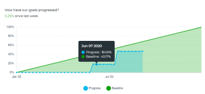

# 檢閱圖表以瞭解Adobe Workfront目標中的目標進度趨勢

<!-- drafted mostly for P&P release-->

您可以在Adobe Workfront目標的圖表區段中，檢視目標的整體健康狀態及其及時進度趨勢。 此區段中的圖表不會劃分每個目標的進度，而是為您提供所有目標的進度狀態及其在指定期間內的進度趨勢的整體快照。

>[!IMPORTANT]
>
>您可以在圖表區段中檢視所選期間的目標總數。 不過，Workfront目標在計算整體目標進度狀態和完成百分比時，只會考慮狀態為「作用中」和「已關閉」的目標。

## 存取需求

您必須具有下列存取權才能執行本文所述的動作：

<table style="table-layout:auto">
<col>
</col>
<col>
</col>
<tbody>
 <tr> 
   <td role="rowheader">Adobe Workfront計畫*</td> 
   <td> 
   
對於新計畫和授權結構：
  <ul><li>Ultimate計畫 </li></ul>
   

對於目前的計畫與授權結構： 
<ul><li> A Pro或更高版本 </li>
  <li>除了Adobe Workfront授權之外，還有Workfront目標授權。</li></ul>

   </td> 
  </tr>
 <tr>
 <td role="rowheader">Adobe Workfront授權*</td>
 <td>
 
新授權：投稿人或以上版本

 或
 
目前授權：要求或以上
 
如需詳細資訊，請參閱<a href="../../administration-and-setup/add-users/access-levels-and-object-permissions/wf-licenses.md" class="MCXref xref">Adobe Workfront授權總覽</a>。
 </td>
 </tr>
 <tr>
 <td role="rowheader">產品*</td>
 <td>
 
 新產品需求，下列其中一項： 

<ul>
<li>Select或Prime Adobe Workfront計畫以及額外的Adobe Workfront目標授權。</li>
<li>Ultimate Workfront計畫，預設包含Workfront目標。 </li></ul>
 
或

 
目前產品需求： Adobe Workfront Goals的Workfront計畫和額外授權。 
 
如需詳細資訊，請參閱<a href="../../workfront-goals/goal-management/access-needed-for-wf-goals.md" class="MCXref xref">使用Workfront目標的需求</a>。 
 </td>
 </tr>
 <tr>
 <td role="rowheader">
存取層級
</td>
 <td> 
編輯目標的存取權
 </td>
 </tr>
 <tr data-mc-conditions="">
 <td role="rowheader">物件許可權</td>
 <td>
  

  
檢視目標或更高許可權以檢視它

  
管理目標的許可權以編輯它

  
如需共用目標的相關資訊，請參閱<a href="../../workfront-goals/workfront-goals-settings/share-a-goal.md" class="MCXref xref">在Workfront目標中共用目標</a>。 

  
 </td>
 </tr>
 <tr>
   <td role="rowheader">
版面配置範本
</td>
   <td> 
必須為所有使用者(包括Workfront管理員)指派一個版面配置範本，該範本包含主功能表中的「目標」區域。 
  
</td>
  </tr>
</tbody>
</table>

*如需詳細資訊，請參閱Workfront檔案中的[存取需求](/help/quicksilver/administration-and-setup/add-users/access-levels-and-object-permissions/access-level-requirements-in-documentation.md)。

## Workfront目標中的圖表型別

「圖形」區段或Workfront目標提供下列圖表：

<table style="table-layout:auto"> 
 <col> 
 <col> 
 <tbody> 
  <tr> 
   <td role="rowheader">目標健康狀態圖</td> 
   <td> 
量測軌圖表，顯示下列專案：
 
    <ul> 
     <li>所選時段的目標總數。 任何狀態下的目標都會納入考量。 </li> 
     <li>狀態為「作用中」和「已關閉」之目標的進度狀態。</li> 
    </ul> 
如需Workfront目標如何計算進度狀態的詳細資訊，請參閱<a href="../../workfront-goals/goal-management/calculate-goal-progress.md" class="MCXref xref">Adobe Workfront目標中的目標進度和條件總覽</a>。
 </td> 
  </tr> 
  <tr> 
   <td role="rowheader">目標進度圖</td> 
   <td> 
折線圖會以每週的增量在目標期間顯示目標的更新。 目標進度表會顯示下列專案：
 
    <ul> 
     <li>所選期間內所有使用中及已關閉目標的平均預期完成百分比與實際完成百分比。 完成百分比進度會劃分為以節點標示的每週增量。 </li> 
     <li>自上一週以來，使用中和已關閉目標的整體平均進度百分比。 </li> 
    </ul> 
提示：在所選時段以外對目標進行更新時，目標進度圖可能不會顯示任何資訊。 
 </td> 
  </tr> 
 </tbody> 
</table>

## 以圖表檢閱目標進度

1. 按一下右上角的&#x200B;**主功能表**&#x200B;圖示 > **目標**。

   <!-- Add this when Shell is available to all: or (if available), click the **Main Menu** icon  in the upper-left corner)
   -->

   如此將可開啟Workfront目標區域。

1. 按一下左側面板中的&#x200B;**圖形**。

   

   「圖形」區段隨即顯示。

   依預設，「圖形」區段中顯示的目標受下列條件限制：

   * 套用至「圖形」區域的濾鏡。
   * 處於「作用中」和「草稿」狀態的目標。

1. （選擇性）更新「圖形」(Graphics)區段右上角的篩選條件，以選取您要顯示的資訊型別。

   如需有關篩選目標的詳細資訊，請參閱[在Adobe Workfront目標中篩選資訊](../../workfront-goals/goal-management/filter-information-wf-goals.md)。

   >[!TIP]
   >
   >如果您選取要顯示多個時段，則會針對每個時段顯示健康狀態圖（量測計）以及進度圖（折線）。

1. 檢閱「目標健康情況圖」時，請檢閱下表中的資訊。

   

   | 目標總數 | 圖表底部的數字表示所選期間內，您所選取的所有狀態中的所有目標數目。 |
   |---|---|
   | 平均完成百分比 | 在圖表頂端，此數字表示在所選時段內使用中和已關閉目標的平均完成百分比。 |
   | 目標及其進度 | 當您將滑鼠游標停留在圖表的區段上時，每個進度狀態區段的目標數。 只有狀態為「作用中」或「已關閉」的目標才會計入區段中。 |

1. 檢閱目標進度表時，請檢閱下表中資訊。

   

   <table style="table-layout:auto"> 
    <col> 
    <col> 
    <tbody> 
     <tr> 
      <td>基準線進度</td> 
      <td>綠色斜率線表示所選時段內使用中及已關閉目標的預期整體完成百分比平均值。 一個時段內的所有目標都會預期完成，因此在時段結束時，基準進度一律為100%。 </td> 
     </tr> 
     <tr> 
      <td>實際進度</td> 
      <td> 
藍線表示在選取的時段內，以每週為增量實際使用中及已關閉目標的整體完成百分比平均值。 目標期間內的每一週都會由行中的節點標示。 
 </td> 
     </tr> 
    </tbody> 
   </table>

1. 將游標停留在目標進度圖中的周節點，並檢閱下列專案：

   * **週日期**：所選周的月、日和年。
   * **進度**：所選周所有目標實際完成百分比的平均值。
   * **基準線**：所選周內所有目標之預期完成百分比的平均值。

1. （選擇性）按一下進度圖底部的&#x200B;**進度**&#x200B;以移除實際的整體進度線

   或

   按一下進度圖底部的&#x200B;**基準線**，從圖表中移除預期的進度。

 
