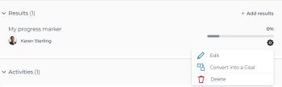

# 從Adobe Workfront目標中的目標中刪除進度指標

<!-- for goal redesign PRODUCTION RELEASE: Should this article be called "Remove or disconnect progress indicators from goals" when this is available to ALL progress indicators (including "disconnect goals")-- if yes, updte the title everywhere else where this is linked?
-->

如果結果、活動和專案不再相關，您可以從目標中移除這些項目。

如需建立目標，以及為目標新增結果和活動的相關資訊，請參閱下列文章：

* [在Adobe Workfront目標中建立目標](../../workfront-goals/goal-management/create-goals.md)
* [將活動新增至Adobe Workfront目標中的目標](../../workfront-goals/results-and-activities/add-activities-to-goals.md)
* [將結果新增至Adobe Workfront目標中的目標](../../workfront-goals/results-and-activities/add-results-to-goals.md)
* [編輯Adobe Workfront目標中的結果和活動](../../workfront-goals/results-and-activities/edit-results-and-activities.md)

目標也可以與父母目標一致，成為子女目標。 兒童目標也是父母目標的進展指標。

您可以移除目標之間的連線，以移除目標之間的對齊方式。 如需詳細資訊，請參閱 [移除Adobe Workfront目標中的目標對齊](../goal-alignment/remove-goal-alignment.md).

## 存取需求

<!--drafted - replace the table below with this one when P&P releases: 

<table style="table-layout:auto">
 <col>
 </col>
 <col>
 </col>
 <tbody>
  <tr>
   <td role="rowheader">Adobe Workfront plan*</td>
   <td>
   
Current plan: Select or higher

   Or
   
Legacy plan: Pro or higher

   
   </td>
  </tr>
  <tr>
   <td role="rowheader">Adobe Workfront license*</td>
   <td>
   
Current license: Contributor or higher

   Or
   
Legacy license: Request or higher
 
For more information, see <a href="../../administration-and-setup/add-users/access-levels-and-object-permissions/wf-licenses.md" class="MCXref xref">Adobe Workfront licenses overview</a>.
 </td>
  </tr>
  <tr>
   <td role="rowheader">Product</td>
   <td>
   
 Current product requirement: If you have the Select or Prime Adobe Workfront plan, you must also buy an additional Adobe Workfront Goals license.  Workfront Goals are included in the Ultimate Workfront Plan.

   Or
   
Legacy product requirement: You must purchase an additional license for the Adobe Workfront Goals to access functionality described in this article. 
 
For information, see <a href="../../workfront-goals/goal-management/access-needed-for-wf-goals.md" class="MCXref xref">Requirements to use Workfront Goals</a>. 
 </td>
  </tr>
  <tr>
   <td role="rowheader">Access level*</td>
   <td> 
Edit access to Goals
 
<b>NOTE</b>
If you still don't have access, ask your Workfront administrator if they set additional restrictions in your access level. For information on how a Workfront administrator can change your access level, see:

     <ul>
      <li> 
<a href="../../administration-and-setup/add-users/configure-and-grant-access/create-modify-access-levels.md" class="MCXref xref">Create or modify custom access levels</a> 
 </li>
      <li> 
<a href="../../administration-and-setup/add-users/configure-and-grant-access/grant-access-goals.md" class="MCXref xref">Grant access to Adobe Workfront Goals</a> 
 </li>
     </ul> 
 </td>
  </tr>
  <tr data-mc-conditions="">
   <td role="rowheader">Object permissions</td>
   <td>
    

     
View or higher permissions to the goal to view it

     
Manage permissions to the goal to edit it

     
For information about sharing goals, see <a href="../../workfront-goals/workfront-goals-settings/share-a-goal.md" class="MCXref xref">Share a goal in Workfront Goals</a>. 

    
 </td>
  </tr>
 </tbody>
</table>
-->

您必須具備下列條件：

<table style="table-layout:auto"> 
 <col> 
 <col> 
 <tbody> 
  <tr> 
   <td role="rowheader">Adobe Workfront計畫*</td> 
   <td> 
Pro或更高版本
 </td> 
  </tr> 
  <tr> 
   <td role="rowheader">Adobe Workfront授權*</td> 
   <td> 
要求或更高版本
 
如需詳細資訊，請參閱 <a href="../../administration-and-setup/add-users/access-levels-and-object-permissions/wf-licenses.md" class="MCXref xref">Adobe Workfront授權概觀</a>.
 </td> 
  </tr> 
  <tr> 
   <td role="rowheader">產品</td> 
   <td> 
您必須購買額外的Adobe Workfront目標授權才能存取本文所述的功能。 
 
如需詳細資訊，請參閱 <a href="../../workfront-goals/goal-management/access-needed-for-wf-goals.md" class="MCXref xref">使用Workfront目標的需求</a>. 
 </td> 
  </tr> 
  <tr> 
   <td role="rowheader">訪問級別配置*</td> 
   <td> 
編輯目標或更高版本的存取權
 
<b>附註</b>
如果您仍無權存取，請洽詢您的Workfront管理員，他們是否在您的存取層級設定其他限制。 如需Workfront管理員如何變更您的存取層級的詳細資訊，請參閱：
 
     <ul> 
      <li> 
<a href="../../administration-and-setup/add-users/configure-and-grant-access/create-modify-access-levels.md" class="MCXref xref">建立或修改自訂存取層級</a> 
 </li> 
      <li> 
<a href="../../administration-and-setup/add-users/configure-and-grant-access/grant-access-goals.md" class="MCXref xref">授予Adobe Workfront目標的存取權</a> 
 </li> 
     </ul> 
 </td> 
  </tr> 
  <tr data-mc-conditions=""> 
   <td role="rowheader">物件權限</td> 
   <td> 
    
 
     
管理目標的權限
 
     
如需共用目標的相關資訊，請參閱 <a href="../../workfront-goals/workfront-goals-settings/share-a-goal.md" class="MCXref xref">在Workfront目標中共用目標</a>. 
 
    
 </td> 
  </tr> 
 </tbody> 
</table>

*若要了解您擁有的計畫、授權類型或存取權，請聯絡您的Workfront管理員。

## 必要條件

您必須具備下列條件，才能開始：

* 一種佈局模板，在主菜單中包括目標區域。
* 具有結果、活動或專案的目標。

## 移除結果、活動和中斷專案與目標連線的考量事項

* 您只能從使用中的目標中移除結果和活動。
* 您可以刪除結果和活動，從目標中移除它們。 已刪除的結果和活動無法恢復。
* 從目標中移除結果或活動時，移除的結果或活動的進度會影響目標的整體進度。
* 您無法從目標中刪除專案，但可將其與目標斷開連接。 將專案與目標斷開連線後，專案的完成百分比將不再影響目標的進度。

   如需有關專案如何影響目標進度的資訊，請參閱 [將專案新增至Adobe Workfront目標中的目標](../../workfront-goals/results-and-activities/connect-projects-to-goals-overview.md).

* 您無法從目標中移除結果或活動，而且如果子目標或項目是目標的最後進度指標，則無法斷開該目標或項目的連接。
* 如果從「項目」區域刪除了項目，並且該項目是目標的最後一個進度指標，則目標將變為「非活動」。

## 從目標中刪除結果和活動

您可以刪除結果和活動，以從目標中移除它們。 從目標刪除結果和活動相同。

<!--
How you delete results and activities differs depending on the environment you use.

### Delete results and activities in the Production environment

1. Click the **Main Menu** icon  > **Goals** in the upper-right corner.

   (!-- Add this when Shell is available to all: or (if available), click the **Main Menu** icon  in the upper-left corner)
   --)

   This opens the Workfront Goals area and the Goal List displays by default. 

1. Click the name of a goal you want to remove results and activities from.

   This opens the Goal Details panel on the right.

1. Click **Results** to remove results or **Activities** to remove activities. 

1. Click the **gear icon**  to the right of the result or activity name, then click **Delete** > **Yes, delete**.

   

   The result or activity is deleted and cannot be recovered. The percent complete of the goal updates to exclude the deleted activity or result.

-->

1. 按一下 **主菜單** 圖示  在右上角，按一下 **目標**.

   <!-- Add this when Shell is available to all: or (if available), click the **Main Menu** icon  in the upper-left corner)
   -->
   這會開啟「Workfront目標」區域，並依預設顯示「目標清單」。

1. 按一下您要從中移除結果和活動的目標名稱。

   這會開啟目標頁面。

1. 按一下 **進度指標** 中。

1. 選取結果或活動，然後按一下 **刪除** 圖示  清單頂端。

1. 按一下 **刪除** 以確認刪除。 結果或活動被刪除，無法恢復。 目標完成百分比會更新以排除已刪除的活動或結果。

## 從目標中移除專案

<!--
Dsconnecting projects from goals differs depending on the environment you use.

### Disconnect projects from goals in the Production environment

1. Click the **Main Menu** icon  > **Goals** in the upper-right corner.

   (!-- Add this when Shell is available to all: or (if available), click the **Main Menu** icon  in the upper-left corner)
   --)

   This opens the Workfront Goals area and the Goal List displays by default. 

1. Click the name of a goal you want to remove results and activities from.

   This opens the Goal Details panel on the right.

1. Click the **right-pointing arrow** to the left of the Activities sections to expand it. 
1. Click the **gear icon**  to the right of the project name, then click **Disconnect**.

   

   The project is disconnected from the goal. The percent complete of the goal updates to exclude the percent complete of the disconnected project.
-->

1. 按一下 **主菜單** 圖示，然後按一下 **目標**.

   <!-- Add this when Shell is available to all: or (if available), click the **Main Menu** icon  in the upper-left corner)
   -->

   這會開啟「Workfront目標」區域，並依預設顯示「目標清單」。

1. 按一下您要從中移除結果和活動的目標名稱。

   這會開啟目標頁面。
1. 按一下 **進度指標** 中。
1. 選取專案，然後按一下 **斷開連接** 圖示  清單頂端。
1. 按一下 **斷開連接** 確認。

   專案不再連線至目標。 目標完成百分比會更新，以排除已中斷連線的專案。

