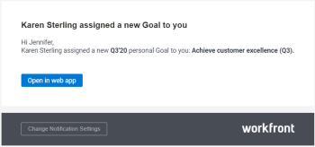

# 啟用Adobe Workfront目標通知

>[!IMPORTANT]
>
>您的組織必須具備下列專案，才能使用本文所述的功能：
>
>* 對於新計畫和授權結構：
>
>   * Ultimate Workfront計畫
>    
>* 對於目前的計畫與授權結構：
>
>   * Pro或更高版本Workfront計畫
>   * 除了Adobe Workfront授權之外，還有Workfront目標授權。
>
>請連絡您的Workfront客戶經理，以瞭解Workfront Goals授權。
> 
>如需存取Workfront目標的詳細資訊，請參閱[使用Workfront目標的需求](/help/quicksilver/workfront-goals/goal-management/access-needed-for-wf-goals.md)。

Adobe Workfront目標隨附一組事件通知，您可以為您的帳戶啟用這些通知。 每次符合事件定義的條件時，這些事件通知都會觸發電子郵件通訊。

如需可為Workfront目標啟用哪些通知的詳細資訊，請參閱[通知：目標](../../workfront-basics/using-notifications/notifications-goals.md)。

如需有關在Adobe Workfront中管理通知的資訊，請參閱[修改您自己的電子郵件通知](../../workfront-basics/using-notifications/activate-or-deactivate-your-own-event-notifications.md)。

<!--

<h2>Access requirements</h2>

(NOTE: drafted, no longer available from WF Goals proper. Documented at the links above.) 

You must have the following access to perform the actions described in this article:

<table style="table-layout:auto">
<col>
<col>
<tbody>
<tr>
<td role="rowheader">Adobe Workfront plan*</td>
<td> 
Pro or higher
 </td>
</tr>
<tr>
<td role="rowheader">Adobe Workfront license*</td>
<td> 
Request or higher
 
For more information, see <a href="../../administration-and-setup/add-users/access-levels-and-object-permissions/wf-licenses.md" class="MCXref xref">Adobe Workfront licenses overview</a>.
 </td>
</tr>
<tr>
<td role="rowheader">Product</td>
<td> 
You must purchase an additional license for the Adobe Workfront Goals to access functionality described in this article. 
 
For information, see <a href="../../workfront-goals/goal-management/access-needed-for-wf-goals.md" class="MCXref xref">Requirements to use Workfront Goals</a>. 
 </td>
</tr>
<tr>
<td role="rowheader">Access level*</td>
<td> 
View or higher access to&nbsp;Goals
 <note type="note">

If you still don't have access, ask your Workfront administrator if they set additional restrictions in your access level. For information on how a Workfront administrator can change your access level, see:

<ul>
<li> 
<a href="../../administration-and-setup/add-users/configure-and-grant-access/create-modify-access-levels.md" class="MCXref xref">Create or modify custom access levels</a> 
 </li>
<li> 
<a href="../../administration-and-setup/add-users/configure-and-grant-access/grant-access-goals.md" class="MCXref xref">Grant access to Adobe Workfront Goals</a> 
 </li>
</ul>
</note> </td>
</tr>
<tr data-mc-conditions="">
<td role="rowheader">Object permissions</td>
<td>

View or higher permissions on goals

For information about sharing goals, see <a href="../../workfront-goals/workfront-goals-settings/share-a-goal.md" class="MCXref xref">Share a goal in Workfront Goals</a>. 

 </td>
</tr>
</tbody>
</table>

*To find out what plan, license type, or access you have, contact your Workfront administrator.

<h2>Prerequisites: </h2>

You must have the following before you can start:

<ul>
<li> 
A Layout Template that includes the Goals area in the Main&nbsp;Menu.
 </li>
</ul>
<h2>Understand Workfront Goals notifications settings</h2>

Consider the following when configuring and receiving Workfront Goals notifications:

<ul>
<li>They are personal notifications which means that each user can manage their own notifications.</li>
<li>The Workfront administrator does not need to enable event notifications before each user can select which ones they want to receive. </li>
<li>They trigger as soon as the defined events happen on goals, activities, or results and cannot be part of a daily digest. </li>
<li>They trigger regardless of the status of the goal. </li>
<li>They do not trigger when you are the initiator of the event described in the notification setting. </li>
</ul>
<h2>Configure email notifications for Workfront Goals</h2>
<ol>
<li value="1"> 
Log in to Workfront and ensure that your Workfront administrator gave you access to&nbsp;Workfront Goals.
 
For information about access to&nbsp;Workfront Goals, see <a href="../../workfront-goals/goal-management/access-needed-for-wf-goals.md" class="MCXref xref">Requirements to use Workfront Goals</a>.
 </li>
<li value="2"> 
 
Click the <strong>Main Menu icon</strong>  in the upper-right corner of your screen, then click <strong>Goals</strong>.
 
This opens the Workfront Goals area. 
 
 </li>
<li value="3"> 
Click <strong>Goal Settings</strong> in the left panel.
 
  
 </li>
<li value="4"> 
Select any of the check boxes below to enable notifications for the following events:

<table style="table-layout:auto">
<col>
<thead>
<tr>
<th>Notification </th>
</tr>
</thead>
<tbody>
<tr>
<td> 
Someone created a new personal Goal for you.
 
This is enabled by default.
 <note type="tip">
A personal goal is a goal where you are designated as the owner.
</note> </td>
</tr>
<tr>
<td> 
Someone assigned a Result/ an Activity to you.
 
This is enabled by default. 
 </td>
</tr>
<tr>
<td>Someone left a comment on your Goal </td>
</tr>
<tr>
<td>Someone liked updates on your Goal</td>
</tr>
<tr>
<td>Someone liked a comment you left on a Goal</td>
</tr>
<tr>
<td>Someone liked your Aligned Goal</td>
</tr>
</tbody>
</table> </li>
<li value="5"> 
Click <strong>Save Settings</strong>. 
 </li>
</ol>

-->

## Workfront目標電子郵件通知範例

當由您啟用的通知所定義的事件發生時，您會收到一封說明該事件的電子郵件。 以下範例是電子郵件通知，您被指派為新目標的「所有者」：

