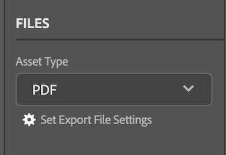

# 將檔案和校訂從[!DNL Adobe Workfront plugin]上傳到[!DNL Creative Cloud]

您可以上傳專案作為檔案，以進行快速檢閱和核准，或僅儲存於[!DNL Adobe Workfront]。

>[!NOTE]
>
>Premiere Pro和After Effects目前不支援上傳檔案和校樣。

## 檔案限制

本節概述[!DNL Workfront for Adobe Creative Cloud plugins]中的已知檔案限制。

### 新檔案版本僅接受上傳一個檔案

由於[!DNL Workfront]檔案不能包含多個檔案，因此必須停用某些設定，才能將新檔案版本上傳到Workfront。

>[!NOTE]
>
>如果您必須產生多個檔案，您可以改為建立校訂。 新的校樣將不會與原始檔案相關聯。

若要在[!DNL InDesign]中將切換變更為單一檔案：

1. 開啟&#x200B;**設定匯出檔案設定**&#x200B;對話方塊。

   

1. 找到您要匯出的資產型別，並依下列說明調整設定：

   <table>
    <tr>
    <td><strong>PDF和PDF-PRINT</strong>
    </td>
    <td>取消選取<strong>建立個別的PDF檔案</strong>。
    </td>
    </tr>
    <tr>
    <td><strong>EPS</strong>
    </td>
    <td>選取<strong>範圍</strong>並輸入單一頁碼。 
    

    <strong>附註</strong>：若要上傳完整檔案，您必須建立校訂。 
    </td>
    </tr>
    <tr>
    <td><strong>EPUB和EPUB — 已修正</strong>
    </td>
    <td>不需要調整。
    </td>
    </tr>
    <tr>
    <td><strong>IDML</strong>
    </td>
    <td>不需要調整。
    </td>
    </tr>
    <tr>
    <td><strong>JPG</strong>
    </td>
    <td>選取<strong>範圍</strong>並輸入單一頁碼。 
    

    <strong>附註</strong>：若要上傳完整檔案，您必須建立校訂。 
    </td>
    </tr>
    <tr>
    <td><strong>PNG</strong>
    </td>
    <td>選取<strong>範圍</strong>並輸入單一頁碼。 
    

    <strong>附註</strong>：若要上傳完整檔案，您必須建立校訂。 
    </td>
    </tr>
    <tr>
    <td><strong>XML</strong>
    </td>
    <td>不需要調整。 
    </td>
    </tr>
    </table>
