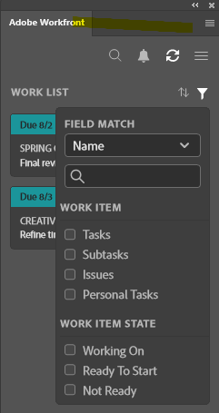

# 使用 [!DNL Adobe Workfront] 外掛程式

在 [!DNL Adobe Workfront] 而不要離開下列 [!DNL Adobe Creative Cloud] 應用程式：

{{cc-app-list}}

## 存取需求

您必須具備下列存取權，才能執行本文中的步驟：

<table style="table-layout:auto"> 
 <col> 
 <col> 
 <tbody> 
 <!-- <tr> 
   <td role="rowheader">[!DNL Adobe Workfront] plan*</td> 
   <td> 
[!UICONTROL Pro] or higher
 </td> 
  </tr> 
  <tr data-mc-conditions=""> 
   <td role="rowheader">[!DNL Adobe Workfront] license*</td> 
   <td> 
[!UICONTROL Work] or [!UICONTROL Plan]
 </td> 
  </tr> -->
  <tr> 
   <td role="rowheader">產品</td> 
   <td>您必須有 [!DNL Adobe Creative Cloud] 除了 [!DNL Workfront] 授權。</td> 
  </tr> 
 </tbody> 
</table>

&#42;若要了解您擁有的計畫、授權類型或存取權，請聯絡您的 [!DNL Workfront] 管理員。

## 必要條件

{{cc-install-prereq}}

## 使用 [!UICONTROL 工作清單] 訪問重要資訊

此 [!UICONTROL 工作清單] 可讓您在一個位置檢視指派給您的所有工作和問題。 您可以使用 [!UICONTROL 排序依據] 將項目分組在一起，然後使用 [!UICONTROL 篩選] 集中精力於需要完成的工作。

### 將類似的工作項與 [!DNL Sort By] 選項

使用 [!UICONTROL 排序依據] 將類似項目分組的選項 [!UICONTROL 工作清單]. 排序依據：

<table style="table-layout:auto"> 
 <col> 
 <col> 
 <tbody> 
  <tr> 
   <td> 
    <ul> 
     <li>[!UICONTROL到期日]</li> 
     <li>[!UICONTROL名稱]</li> 
     <li>[!UICONTROL項目名稱]</li> 
     <li>[!UICONTROL我的優先順序]</li> 
    </ul> </td> 
   <td>  </td> 
  </tr> 
 </tbody> 
</table>

### 使用篩選器縮小焦點

使用 [!UICONTROL 篩選] 來縮小對特定工作項目的關注。 有幾種方式可使用篩選器：

 

<table style="table-layout:auto"> 
 <col> 
 <col> 
 <tbody> 
  <tr> 
   <td> 
第一種是僅根據工作項類型或屬性進行篩選：
 
    <ul> 
     <li><strong>工作項</strong>:任務、子任務、問題或個人任務</li> 
     <li><strong>工作項狀態</strong>:[!UICONTROL正在工作]、[!UICONTROL準備開始]或[!UICONTROL未準備就緒]</li> 
    </ul> 
第二，使用工作項和工作項狀態一起進行過濾。 例如，您可以選擇「任務」和[!UICONTROL準備開始]以查找工作清單中準備工作的所有任務。
 
您也可以使用[!UICONTROL欄位符合]來搜尋篩選集內的特定項目。 
 </td> 
   <td>  </td> 
  </tr> 
 </tbody> 
</table>

## 搜索您的工作

使用 [!UICONTROL 搜尋] 欄，找出您需要的專案、工作、問題和檔案。

<table style="table-layout:auto"> 
 <col> 
 <col> 
 <tbody> 
  <tr> 
   <td> 
    <ul> 
     <li>請參閱最近的項目：您最多可以檢視5個透過案頭版或外掛程式版本Workfront存取的最新工作項目。</li> 
     <li>找到固定項目：您可以存取新Adobe Workfront體驗中釘選的專案、工作、問題和檔案。</li> 
     <li>找到您的最愛：您可以看到任何保存為收藏夾的項目、任務、問題或文檔。</li> 
    </ul> </td> 
   <td>  </td> 
  </tr> 
 </tbody> 
</table>

## 使用 [!UICONTROL 功能表] 導覽專案

您可以使用 [!UICONTROL 功能表] 圖示來導覽至專案中的父項目。

