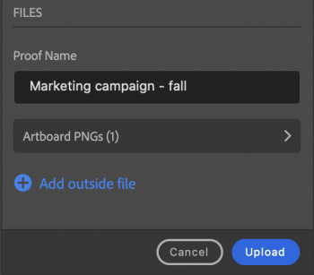

# 上傳校樣來源 [!DNL Photoshop]

您可以直接將您的圖片展示板上傳為校樣 [!DNL Adobe Workfront] 以進行徹底的檢閱和核准。

## 存取需求

您必須具有下列存取權才能執行本文中的步驟：

<table style="table-layout:auto"> 
 <col> 
 <col> 
 <tbody> 
  <tr> 
   <td role="rowheader">[!DNL Adobe Workfront] 計劃*</td> 
   <td> 
目前計畫： [！UICONTROL Pro]或更高版本
 
或
 
舊版計畫： [！UICONTROL Premium]
 
如需有關校訂不同方案的存取許可權的詳細資訊，請參閱。
 </td> 
  </tr> 
  <tr> 
   <td role="rowheader">[!DNL Adobe Workfront] 授權*</td> 
   <td> 
目前計畫： [！UICONTROL Work]或[！UICONTROL Proof]
 
舊版計畫：任何（您必須為使用者啟用校訂）
 </td> 
  </tr> 
  <tr> 
   <td role="rowheader">產品</td> 
   <td>您必須擁有 [!DNL Adobe Creative Cloud] 除了授權之外， [!DNL Workfront] 授權。</td> 
  </tr> 
  <tr> 
   <td role="rowheader">校訂權限設定檔 </td> 
   <td>[！UICONTROL Manager]或更高版本</td> 
  </tr> 
  <tr> 
   <td role="rowheader">物件許可權</td> 
   <td> 
編輯[！UICONTROL檔案]的存取權
 
如需請求其他存取許可權的詳細資訊，請參閱 <a href="../../workfront-basics/grant-and-request-access-to-objects/request-access.md" class="MCXref xref">要求物件的存取權</a>.
 </td> 
  </tr> 
 </tbody> 
</table>

&#42;若要瞭解您擁有的計畫、角色或校訂許可權設定檔，請聯絡您的Workfront或Workfront校訂管理員。

## 必要條件

* 您必須安裝 [!DNL Adobe Workfront for Photoshop] 上傳校樣之前，從 [!DNL Adobe Photoshop].

  如需指示，請參閱 [安裝 [!DNL Adobe Workfront for Photoshop]](../../workfront-integrations-and-apps/adobe-workfront-for-creative-cloud/wf-cc-install-ps.md).

## 上傳基本校訂

1. 按一下 **[!UICONTROL 選單]** 圖示並選取「 」，接著選取「 」 **[!UICONTROL 工作清單]**. 您也可以使用功能表導覽至父物件。

   

1. 前往您要上傳校樣的工作專案。
1. 按一下 **[!UICONTROL 檔案]** 圖示  導覽列中的。
1. 按一下 **[!UICONTROL 新增檔案]** 接近底部 [!DNL Workfront] 面板。
1. 啟用 **[!UICONTROL 建立校訂]** 切換。
1. （選用）在「 」中輸入校樣名稱 **[!UICONTROL 校訂名稱]** 文字方塊。
1. 在 **[!UICONTROL 校訂核准]** 區段，選取 **[!UICONTROL 基本]**.
1. （選用）新增核准者。
1. （可選）在「 」中輸入註解 **[!UICONTROL 更新]** 區域。

   

1. 選擇 **[!UICONTROL 資產型別]** （從下拉式功能表）。

1. （選用）選取 **[!UICONTROL 新增外部檔案]** 以從您的電腦新增檔案。
1. 按一下 **[!UICONTROL 上傳]**，然後根據上述選擇的資產型別設定任何所需的匯出選項。

   \
   檔案會顯示在 [!UICONTROL 檔案] 區域 [!DNL Workfront] 中的面板 [!DNL Photoshop] 和 [!DNL Workfront] 案頭應用程式。

## 上傳自動證明

1. 按一下 **[!UICONTROL 選單]** 圖示並選取「 」，接著選取「 」 **[!UICONTROL 工作清單]**. 您也可以使用功能表導覽至父物件。

   

1. 前往您要上傳校樣的工作專案。
1. 按一下 **[!UICONTROL 檔案]** 圖示  導覽列中的。

1. 按一下 **[!UICONTROL 新增檔案]** 接近底部 [!DNL Workfront] 面板。
1. 啟用 **[!UICONTROL 建立校訂]** 切換。
1. （選用）在「 」中輸入校樣名稱 **[!UICONTROL 校訂名稱]** 文字方塊。
1. 在 **[!UICONTROL 校訂核准]** 區段，選取 **[!UICONTROL 自動化]**.
1. （選用）在 **[!UICONTROL 工作流程範本]** 方塊中，輸入校訂工作流程範本的名稱。

{{adjust-proof-settings}}

>[!NOTE]
>
> 如果工作流程範本中有任何空白的必填欄位，自動校樣設定會自動開啟，並且您需填入這些欄位才能上傳校樣。

1. （可選）在「 」中輸入註解 **[!UICONTROL 更新]** 區域。

   

1. 選擇 **[!UICONTROL 資產型別]** （從下拉式功能表）。
1. （選用）選取 **[!UICONTROL 新增外部檔案]** 以從您的電腦新增檔案。
1. 按一下 **[!UICONTROL 上傳]**，然後根據上述選擇的資產型別設定任何所需的匯出選項。
檔案會顯示在 [!UICONTROL 檔案] 區域 [!DNL Workfront] 中的面板 [!DNL Photoshop] 和 [!DNL Workfront] 案頭應用程式。

## 上傳新的校訂版本

您可以上傳新版本的校訂。 外掛程式會記住先前版本上設定的校訂工作流程，但您可以視需要變更此設定。

1. 按一下 **[!UICONTROL 選單]** 圖示並選取「 」，接著選取「 」 **[!UICONTROL 工作清單]**. 您也可以使用功能表導覽至父物件。

   

1. 前往上載檔案所需的工作專案。
1. 按一下 **[!UICONTROL 檔案]** 圖示 導覽列中的。

1. 按一下 **[!UICONTROL 新版本]** 接近底部 [!DNL Workfront] 面板。
1. 啟用 **[!UICONTROL 建立校訂]** 切換。

1. 在 *[!UICONTROL *校訂核准]**區段，選擇 **[!UICONTROL 基本]** 或 **[!UICONTROL 自動化]**.

1. 新增 **[!UICONTROL 檢閱者]** 或 **[!UICONTROL 工作流程範本]** 根據您在步驟7中選取的核准型別。

1. （可選）在「 」中輸入註解 **[!UICONTROL 更新]** 區域。
1. 選擇 **[!UICONTROL 資產型別]** （從下拉式功能表）。
1. 按一下 **[!UICONTROL 上傳]**，然後根據上述選擇的資產型別設定任何所需的匯出選項。
檔案會顯示在 [!UICONTROL 檔案] 區域 [!DNL Workfront] 中的面板 [!DNL Photoshop] 和 [!DNL Workfront] 案頭應用程式。
