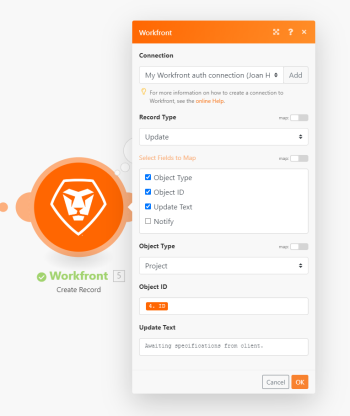

# Adobe Workfront整合方法

您可以將[!DNL Adobe Workfront]與協力廠商應用程式及其他[!DNL Adobe]產品整合。 這些整合可擴充[!DNL Workfront]的公用程式，並根據您組織的需求量身打造。 您可以根據對指定任務最有用的整合方式，使用任何或全部的這些整合。

## 內建整合

Workfront提供多種整合功能，您可以直接從Workfront進行設定，或透過為該應用程式安裝Workfront增益集從其他應用程式進行設定。 這些內建整合涵蓋許多常見的使用案例情境，並專注於為一般使用者擴充和連結使用者體驗。

Workfront內建的整合功能主要針對個人生產力與共同作業。 這些整合功能可減少個別使用者工作流程中的中斷情形，讓他們能夠接收Workfront通知、存取資訊，並在Workfront工作專案上採取行動，而不需離開整合應用程式。

內建整合的優點可能包括：

* 許多內建整合功能不需額外付費。 （其他客戶則需另行購買。）
* 內建整合涵蓋許多企業最常用的應用程式，例如[!DNL Slack]、[!DNL Google Drive]或[!DNL Adobe]產品，例如[!DNL Adobe Creative Cloud]或[!DNL Adobe Experience Manager] Assets。 如果您的公司已使用這些應用程式，整合將會順利進入您使用者的現有工作流程。
* 將[!DNL Workfront]與常用的應用程式整合可增加使用者的採用率。

>[!INFO]
>
>**範例：**
>
>透過[!DNL Workfront for Microsoft Teams integration]，您可以在[!DNL Microsoft Teams]中收到有關您[!DNL Workfront]個工作專案的通知。 您不必離開[!DNL Microsoft Teams]，即可執行核准、加上註解或變更工作專案狀態等動作。 您對來自[!DNL Microsoft Teams]的工作專案所做的任何變更也會反映在[!DNL Workfront]中。

如需內建整合的詳細資訊，包括目前可用的內建整合清單，請參閱[[!DNL Adobe Workfront] 內建整合總覽](../workfront-integrations-and-apps/built-in-integrations-non-admin.md)。

## 自訂OAuth2應用程式

Adobe[!DNL Workfront]管理員可以為您的[!DNL Workfront]執行個體建立OAuth2應用程式，允許其他應用程式存取[!DNL Workfront]。 之後，您的使用者可以授予這些其他應用程式存取其[!DNL Workfront]資料的許可權。 如此一來，您就可以將Workfront與您選擇的應用程式整合，包括您自己的內部應用程式。

>[!NOTE]
>
>在OAuth2的上下文中，「建立應用程式」是指在應用程式和伺服器(例如Workfront)之間建立此類存取連結的程式。

建立[!UICONTROL OAuth2]應用程式的優點可能包括：

* 使用者可以直接在[!DNL Workfront]中使用這些整合，類似於內建的整合。
* 設定或使用[!UICONTROL OAuth2]應用程式不需要其他技術知識，例如熟悉[!DNL Workfront] API。
* 您的組織可能會使用未提供為[!DNL Workfront]內建應用程式的軟體。 您仍然可以使用[!UICONTROL OAuth2]應用程式將此軟體與[!DNL Workfront]整合，即使此軟體是您組織的專有軟體亦然。

如需詳細資訊，請參閱[為Workfront整合建立OAuth2應用程式](../administration-and-setup/configure-integrations/create-oauth-application.md)。

## [!DNL Workfront] API

[!DNL Workfront]提供公用API （應用程式設計介面），可讓您擴充及增強您的Workfront體驗。 [!DNL Workfront] API的目標是透過引入透過HTTP運作的REST-ful架構，簡化您與[!DNL Workfront]的整合建置。 [!DNL Workfront] API確實需要一些技術知識，但它是用於擷取、建立和修改資料的強大工具。 您可以自訂API呼叫來執行非常特定的功能。

此外，[!DNL Workfront]還提供事件訂閱API。 當事件訂閱支援的[!DNL Workfront]物件上發生動作時，您可以設定[!DNL Workfront]將回應傳送至您想要的端點。 這表示協力廠商應用程式在更新發生後不久即可透過[!DNL Workfront] API接收來自[!DNL Workfront]互動的更新。

使用[!DNL Workfront] API的優點可能包括：

* 您可以使用[!DNL Workfront] API來連線到幾乎任何其他提供公用API的Web服務或應用程式。 因此，可以將[!DNL Workfront]與您要使用的幾乎任何Web服務或應用程式整合。
* [!DNL Workfront] API的彈性也延伸至您企業的專屬軟體。 您可以從您自己的軟體內部使用及修改[!DNL Workfront]資料。
* 由於API對於軟體而言是很常見的，因此您的內部開發人員可能也很熟悉。 [!DNL Workfront]使用REST-ful API，這是最常見的API型別，讓您的開發人員更容易快速上手。

>[!INFO]
>
>**範例：**
>
>以下API呼叫使用指定的ID將註解放入任務的更新流中。
>
>```
>https://`<your domain>`.workfront.com/attask/api-internal/note?noteText=<text of comment>&noteObjCode=TASK&objID=<task ID>&apiKey=<your API key>
>```

如需[!DNL Workfront] API的詳細資訊，請參閱[API基本知識](../wf-api/general/api-basics.md)。

如需事件訂閱的詳細資訊，請參閱[事件訂閱API](../wf-api/general/event-subs-api.md)。

## [!DNL Adobe Workfront Fusion]

[!DNL Workfront Fusion]可讓您自動化工作流程。 透過[!DNL Workfront Fusion for Work Automation and Integration]授權，您可以跨多個應用程式和Web服務建立這些自動化，建立應用程式協同工作以執行工作的情境。 案例是使用模組建置的任務或工作流程的視覺化表示法，這些模組是獨立任務，例如「下載檔案」或「建立專案」。 您可以將模組鏈結在一起以定義工作流程，然後當符合觸發條件時，工作流程就會自動執行。

[!DNL Workfront Fusion]的優點可能包括：

* [!DNL Workfront Fusion]所需技術知識不如API多，因為視覺介面有助於瞭解和設定工作流程。 這表示開發團隊以外的個人可以使用此功能，這可能會為您的組織節省時間和金錢。
* 由於[!DNL Workfront Fusion]是透過API運作，因此它可以存取大部分的應用程式和網頁服務。 許多應用程式都有模組可進行API呼叫，或者您可以使用HTTP、SOAP或JSON模組來與沒有專用[!DNL Workfront Fusion]聯結器的網頁服務互動。

>[!INFO]
>
>**範例：**
>
>[!DNL Workfront Fusion]中的下列[!DNL Workfront]模組已設定為新增註解至選取的專案。 執行模組後，註解會顯示在Workfront中專案的更新流中。
>
>

如需[!DNL Workfront Fusion]的詳細資訊，請參閱[[!DNL Adobe Workfront Fusion]](https://experienceleague.adobe.com/en/docs/workfront-fusion/using/home)。
