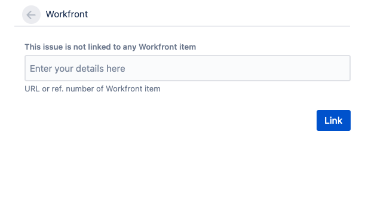

# 在 [!DNL Adobe Workfront] 和 [!DNL Jira]

您可以連結 [!DNL Jira] 問題 [!DNL Adobe Workfront] 自動或手動執行工作或問題。

中只有一個項目 [!DNL Workfront] 可連結至 [!DNL Jira]. 您永遠無法連結 [!DNL Workfront] 項目至多個 [!DNL Jira] 問題，也不是 [!DNL Jira] 問題至多個 [!DNL Workfront] 項目。

## 存取需求

您必須具備下列條件：

<table style="table-layout:auto"> 
 <col> 
 <col> 
 <tbody> 
  <tr> 
   <td role="rowheader"><a href="https://www.workfront.com/plans" target="_blank">[!DNL [!DNL Adobe Workfront] 計劃]</a>*</td> 
   <td> 
[!UICONTROL Pro]或更高版本
 </td> 
  </tr> 
  <tr> 
   <td role="rowheader"><a href="../../administration-and-setup/add-users/access-levels-and-object-permissions/wf-licenses.md" class="MCXref xref">Adobe [!DNL Workfront] 授權概述</a>*</td> 
   <td> 
計劃
 </td> 
  </tr> 
  <tr> 
   <td role="rowheader">吉拉訪問</td> 
   <td> 
系統管理員存取
 
<b>重要</b>

建議您在 [!DNL Jira] 和 [!DNL Workfront] 以專用於此整合，而非使用可能附加至使用者的現有整合。
 </td>
</tr> 
  <tr> 
   <td role="rowheader">訪問級別配置*</td> 
   <td> 
您必須是 [!DNL Workfront] 管理員。 如需 [!DNL Workfront] 管理員請參閱 <a href="../../administration-and-setup/add-users/configure-and-grant-access/grant-a-user-full-administrative-access.md" class="MCXref xref">授予使用者完整的管理存取權</a>.
 
<b>附註</b>

如果您仍無法存取，請詢問您的 [!DNL Workfront] 管理員。 若要了解 [!DNL Workfront] 管理員可修改您的存取層級，請參閱 <a href="../../administration-and-setup/add-users/configure-and-grant-access/create-modify-access-levels.md" class="MCXref xref">建立或修改自訂存取層級</a>.
 </td>
</tr> 
 </tbody> 
</table>

&#42;若要了解您擁有的計畫、授權類型或存取權，請聯絡您的 [!DNL Workfront] 管理員。

## 必要條件

在您可以連結項目之間之前 [!DNL Workfront] 和 [!DNL Jira]，您必須

* 安裝 [!DNL Workfront] for [!DNL Jira]

   如需安裝Jira適用的Workfront的指示，請參閱 [安裝Jira適用的Adobe Workfront](../../workfront-integrations-and-apps/use-workfront-with-jira/install-workfront-for-jira.md).

* 設定 [!DNL Workfront] 為吉拉

   如需為Jira配置Workfront的說明，請參閱 [為Jira配置Adobe Workfront](../../workfront-integrations-and-apps/use-workfront-with-jira/configure-workfront-for-jira.md).

## 自動連結 [!DNL Workfront] 項目 [!DNL Jira] 問題

As a [!DNL Workfront] 管理員，您可以定義可在 [!DNL Jira] 每次任務或 [!DNL Workfront]. Workfront和 [!DNL Jira] 項目會變成連結。

完成 [!DNL Workfront] 若為Jira，當項目在 [!DNL Workfront] 為了比對觸發器，系統會在 [!DNL Jira].\
建立和更新Workfront項目的Workfront使用者不需要 [!DNL Jira] 在中觸發建立項目的授權 [!DNL Jira].

如需定義自動建立Jira問題的觸發器的詳細資訊，請參閱  [設定 [!DNL Adobe Workfront] 為吉拉](../../workfront-integrations-and-apps/use-workfront-with-jira/configure-workfront-for-jira.md).

>[!NOTE]
>
>您可以建立 [!DNL Jira] 項目，方法是將模板附加到項目。 如果模板包含任務，且任務的分配符合 [!DNL Jira] 觸發，新任務產生新 [!DNL Jira] 問題。

自動連結 [!DNL Workfront] 問題 [!DNL Jira] 問題等同於自動連結 [!DNL Workfront] 任務 [!DNL Jira] 問題。

自動連結 [!DNL Workfront] 任務 [!DNL Jira] 問題：

1. 確保 [!DNL Jira] 系統管理員配置了用於自動建立 [!DNL Jira] 問題發生時 [!DNL Workfront] 指派項目，然後登入 [!DNL Workfront] 具有允許您建立任務的訪問級別。

   有關訪問任務的詳細資訊，請參閱 [授予任務的存取權](../../administration-and-setup/add-users/configure-and-grant-access/grant-access-tasks.md).

1. 前往專案並選取 **[!UICONTROL 工作]**  中。

1. 按一下 **[!UICONTROL 新任務]**

   或

   選擇現有任務，然後按一下 **編輯**.

1. 指定或更新任何可用於任務的欄位。
1. 按一下 **[!UICONTROL 分配]** 並將任務指派給在 [!DNL Jira] 整合。

1. 按一下 **儲存變更**.

   在Workfront中建立新任務。

   在 **[!UICONTROL 更新]** 在新任務的區域中，會有一則注釋，指出中也已建立新問題 [!DNL Jira].

   

1. （選用）按一下Jira問題的連結，在Jira中開啟它。

   或

   按一下 **[!UICONTROL 去吉拉]** 連結 **[!UICONTROL 整合]** 區域 **[!UICONTROL 詳細資料]** 區段或任務或問題標題，以開啟 [!DNL Jira] 問題。

   您的系統或群組管理員必須將 [!UICONTROL 整合] 欄位顯示在版面範本中，以將其顯示在任務或問題標題中。 如需詳細資訊，請參閱 [使用版面範本自訂物件標題](../../administration-and-setup/customize-workfront/use-layout-templates/customize-object-headers.md).

   任何 [!DNL Jira] 使用者可立即開始使用自動建立的項目 [!DNL Workfront] 並且其更新會轉移至 [!DNL Workfront] 不需要 [!DNL Workfront] 來做。

   僅限您作為 [!DNL Workfront] 管理員在 [!DNL Workfront] 已更新附加元件。

   如需有關同步Workfront和Jira之間欄位的詳細資訊，請參閱 [為Jira配置Workfront](../../workfront-integrations-and-apps/use-workfront-with-jira/configure-workfront-for-jira.md#configuring-the-add-on-for-jira) 區段  [為Jira配置Adobe Workfront](../../workfront-integrations-and-apps/use-workfront-with-jira/configure-workfront-for-jira.md).

   >[!NOTE]
   >
   >此 [!DNL Jira] 問題未指派給 [!DNL Jira] 從Workfront自動建立時。

## 手動連結 [!DNL Jira] 問題 [!DNL Workfront] 項目

在中建立項目後 [!DNL Jira] 和 [!DNL Workfront]，您可以手動連結 [!DNL Jira] 問題 [!DNL Workfront] 任務或問題。\
您無法手動連結 [!DNL Workfront] 項目自 [!DNL Workfront] 到現有 [!DNL Jira] 項目。

>[!NOTE]
>
>若 [!DNL Jira] 未在未識別為 [!DNL Workfront] 整合使用時，您無法手動將其連結至Workfront項目 [!DNL Jira] 內部部署。\
>如需為Workfront至Jira工作流程設定觸發器的詳細資訊，請參閱 [自動將Workfront項目連結至Jira問題](#automatically-link-workfront-items-to-jira-issues).

當 [!DNL Workfront] 和 [!DNL Jira] 項目已連結，則某個項目的某些欄位可自動更新另一個項目。\
如需更新連結項目的詳細資訊，請參閱 [更新Jira和Adobe Workfront之間的連結項目](../../workfront-integrations-and-apps/use-workfront-with-jira/update-linked-items-between-jira-wf.md).

若要手動連結 [!DNL Jira] 問題 [!DNL Workfront] 項目：

1. （條件性）登入 [!DNL Workfront] 並查找要連結到的問題或任務 [!DNL Jira] 問題。
1. （條件性）從項目的位址列複製 **URL** 在Workfront。

   或

   從 [!UICONTROL 詳細資料] 區域 ，複製 **[!UICONTROL 參考編號]** 在Workfront。

   >[!NOTE]
   >
   >您必須有 [!DNL Workfront] 登入的授權 [!DNL Workfront]. 否則， [!DNL Workfront] 使用者必須提供此資訊給您。

1. 在 [!DNL Jira]，導覽至您要手動連結至 [!DNL Workfront] 項目。
1. 在 [!DNL Workfront] 貼上右面板 **URL** 或 **[!UICONTROL 參考編號]** 的 [!DNL Workfront] 項目，以便連結至該項目。\
   

1. 按一下 **[!UICONTROL 連結]**.

   這兩個項目會連結，而 [!DNL Workfront] 右側面板中會填入 [!DNL Workfront] 項目。

   以下 [!DNL Workfront] 欄位在中顯示 [!DNL Jira]，預設為 [!DNL Workfront] 右面板：

   * 此 **[!UICONTROL 名稱]** （項目）:您可以存取 [!DNL Workfront] 項目。
   * **[!UICONTROL 專案名稱]**
   * 此 **[!UICONTROL 狀態]** 的
   * 此 **[!UICONTROL 優先順序]** 的
   * 建立日期 [!DNL Workfront]
   * 此 **[!UICONTROL 計畫小時數]** 的
   * 此 **[!UICONTROL 參考編號]**:您可以存取 [!DNL Workfront] 項目 [!UICONTROL 參考編號] 的下界。

如需如何啟用右側面板中顯示其他欄位的詳細資訊，請參閱 [在 [!DNL Jira] 和 [!DNL Workfront] 項目](../../workfront-integrations-and-apps/use-workfront-with-jira/configure-workfront-for-jira.md#setting-up-field-synchronization) 區段 [設定 [!DNL Adobe Workfront for Jira]](../../workfront-integrations-and-apps/use-workfront-with-jira/configure-workfront-for-jira.md). 來自 [!DNL Workfront] 與整合相關聯的管理員會張貼在 **[!DNL Workfront]** 的 [!DNL Jira] 確認新 [!DNL Jira] 項目已建立。 註解包含的連結 [!DNL Jira] 問題。

## 取消項目之間的連結 [!DNL Jira] 和 [!DNL Workfront]

之間的連結項目 [!DNL Jira] 和 [!DNL Workfront] 可手動從 [!DNL Jira].\
您無法取消連結 [!DNL Workfront] 項目 [!DNL Jira] 對應項 [!DNL Workfront].

您需要下列存取權才能取消連結手動連結的項目：

* 您是手動連結項目的使用者
* 您是 [!DNL Jira] 系統管理員

僅a [!DNL Workfront] 管理員可以取消連結自動連結的項目。

取消連結 [!DNL Jira] 來自 [!DNL Workfront] 項目：

1. 在 [!DNL Jira]，導覽至連結至 [!DNL Workfront] 任務或問題。
1. 前往 [!DNL Workfront] 按一下右側面板，然後按一下 **[!UICONTROL 取消連結]** 圖示，然後按一下 **[!UICONTROL 取消連結]**.\
   \
   先前連結的 [!DNL Jira] 和 [!DNL Workfront] 項目現在會取消連結。 將來可能在這些欄位上單獨更新的任何欄位、注釋或文檔都不會在其他應用程式中更新其以前的對應項目。
