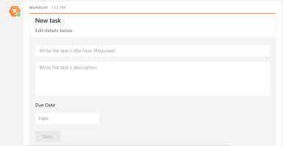

# 從[!DNL Microsoft Teams]建立[!DNL Adobe Workfront]個任務

>[!NOTE]
>
>適用於Microsoft Teams的Adobe Workfront整合目前僅支援傳統Microsoft Teams體驗。

## 存取需求

您必須具有下列存取權才能執行本文中的步驟：

<table style="table-layout:auto"> 
 <col> 
 <col> 
 <tbody> 
  <tr> 
   <td role="rowheader">[!DNL Adobe Workfront] 計畫*</td> 
   <td> 
任何
 </td> 
  </tr> 
  <tr> 
   <td role="rowheader">[!DNL Adobe Workfront] 授權*</td> 
   <td> 
[！UICONTROL Work]， [！UICONTROL計畫]
 </td> 
  </tr>
 </tbody> 
</table>

&#42;若要瞭解您擁有的計畫、授權型別或存取權，請連絡您的[!DNL Workfront]管理員。

## 先決條件

如果符合下列條件，您可以從[!DNL Microsoft Teams]在[!DNL Adobe Workfront]中建立個人工作：

* 團隊擁有者已為您的團隊安裝和設定[!DNL Workfront for Microsoft Teams]。
* 您已從[!DNL Microsoft Teams]登入[!DNL Workfront]。

>[!NOTE]
>
>[!DNL Microsoft Teams]不再支援[!DNL Internet Explorer]。 若要使用[!DNL Adobe Workfront for Microsoft Teams]整合，您必須使用[!DNL Internet Explorer]以外的網頁瀏覽器。

如需有關安裝[!DNL Workfront for Microsoft Teams]以及從[!DNL Microsoft Teams]登入[!UICONTROL Workfront]的資訊，請參閱[安裝 [!DNL Adobe Workfront for Microsoft Teams]](../../workfront-integrations-and-apps/using-workfront-with-microsoft-teams/install-workfront-ms-teams.md)。

## 從[!DNL Microsoft Teams]建立個人任務

1. 從[!DNL Microsoft Teams]登入[!DNL Workfront]。

   如需有關登入[!DNL Workfront]的資訊，請參閱[安裝 [!DNL Adobe Workfront for Microsoft Teams]](../../workfront-integrations-and-apps/using-workfront-with-microsoft-teams/install-workfront-ms-teams.md)。

1. 若要開啟&#x200B;**[!UICONTROL 新工作]**&#x200B;卡片：

   * 如果您在[!DNL Workfront]機器人聊天頻道，請在[!UICONTROL 交談]欄位中輸入&#x200B;**[!UICONTROL 新任務]**&#x200B;以建立新任務。
   * 如果您在[!DNL Workfront]機器人聊天頻道以外的聊天頻道：

      * 開始在[!UICONTROL 交談]欄位中輸入&#x200B;**[!DNL @workfront]**，然後選取您想要的[!DNL Workfront]機器人頻道。
      * 繼續在[!UICONTROL 交談]欄位中輸入&#x200B;**[!UICONTROL 新工作]**&#x200B;以建立新工作。

        [!UICONTROL 新任務]卡片會顯示在[!DNL Workfront]機器人頻道中。

        

1. 在[!UICONTROL Workfront]機器人頻道中，在[!UICONTROL 新增工作]卡片上指定下列資訊：

   * **[!UICONTROL 中的任務名稱撰寫任務的標題]**&#x200B;欄位。
   * 在&#x200B;**[!UICONTROL 寫入任務的描述]**&#x200B;欄位中的任務描述。
   * 必須在&#x200B;**[!UICONTROL 到期日]**&#x200B;欄位中完成工作的日期。

1. 按一下&#x200B;**[!UICONTROL 儲存]。**

   新的個人任務建立於[!DNL Workfront]。 [!UICONTROL 參考號碼]已指派給它，並顯示在[!UICONTROL 新任務]卡片上。

   如需參考編號的相關資訊，請參閱[瞭解 [!DNL Adobe Workfront]](../../workfront-basics/navigate-workfront/workfront-navigation/understand-objects.md)文章中的物件[[!UICONTROL 參考編號]物件](../../workfront-basics/navigate-workfront/workfront-navigation/understand-objects.md#understanding-reference-numbers-of-objects)區段。

1. （選擇性）按一下&#x200B;**[!UICONTROL 編輯]**&#x200B;以進一步編輯工作資訊。
1. （選擇性）按一下「**[!UICONTROL 在[!DNL Workfront]]**&#x200B;中檢視」以在「[!DNL Workfront]」的新索引標籤中開啟工作，並進一步編輯工作、將其移至專案或將其指派給其他人。
