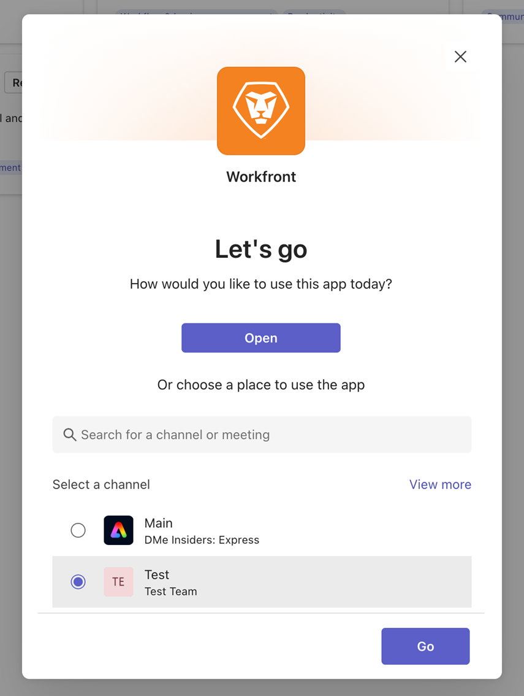

# 安裝Microsoft Teams的[!DNL Adobe Workfront]

<!-- Audited: 1/2024 -->

>[!IMPORTANT]
>
>隨著Microsoft轉換為新團隊使用者端，Classic Teams使用者端在2025年7月1日之後將不再可用。 為此，我們正在開發Microsoft Teams整合的新版本，此版本將與新團隊使用者端完全相容，並可在7月1日之前提供使用，以確保順利轉換。
>
>整合推出後，說明如何下載及安裝在新團隊使用者端中。

[!DNL Adobe Workfront for Microsoft Teams]應用程式可讓您在[!DNL Workfront]中執行基本動作，而不需離開[!DNL Microsoft Teams]聊天頻道。

>[!NOTE]
>
>[!DNL Microsoft Teams]不再支援[!DNL Internet Explorer]。 若要使用[!DNL Adobe Workfront for Microsoft Teams integration]，您必須使用[!DNL Internet Explorer]以外的網頁瀏覽器。

## 存取需求

+++ 展開以檢視本文中功能的存取需求。

您必須具有下列存取權才能執行本文中的步驟：

<table style="table-layout:auto"> 
 <col> 
 <col> 
 <tbody> 
  <tr> 
   <td role="rowheader">[!DNL Adobe Workfront] 計劃</td> 
   <td> 
任何
 </td> 
  </tr> 
  <tr> 
   <td role="rowheader">[!DNL Adobe Workfront] 授權</td> 
   <td>
新增：標準

    
目前： [！UICONTROL Work]， [！UICONTROL Plan]
 </td> 
  </tr> 
 </tbody> 
</table>

如需有關此表格的詳細資訊，請參閱Workfront檔案中的[存取需求](/help/quicksilver/administration-and-setup/add-users/access-levels-and-object-permissions/access-level-requirements-in-documentation.md)。

+++

## 先決條件

您必須是[!DNL Microsoft Teams]中的團隊擁有者才能為[!DNL Microsoft Teams]安裝[!DNL Workfront]。

## 安裝[!DNL Workfront for Microsoft Teams]

作為[!DNL Microsoft Teams]中的團隊擁有者，您可以從[!DNL Microsoft]市集或從[!DNL Workfront]提供的檔案為每個團隊安裝[!DNL Workfront for Microsoft Teams]應用程式。

### 從[!DNL Microsoft]存放區安裝[!DNL Workfront for Microsoft Teams]

1. 以團隊擁有者身分登入[!DNL Microsoft Teams]。
1. 選取您要為其安裝[!DNL Workfront for Microsoft Teams]應用程式的團隊。
1. 針對您要安裝用於Microsoft Teams整合的Workfront的團隊，按一下&#x200B;**[!UICONTROL 更多]**&#x200B;圖示
1. 按一下「**[!UICONTROL 應用程式]**」標籤。
1. 在&#x200B;**[!UICONTROL 搜尋App和其他]**&#x200B;方塊中，輸入&#x200B;*[!DNL Workfront]*。
1. 按一下&#x200B;**新增**。
1. 在開啟的對話方塊中按一下&#x200B;**[新增**]。
1. 在「選取管道」區段中，選取您要新增Workfront應用程式的團隊，然後按一下「**執行**」。

   
1. 按一下&#x200B;**登入** Workfront以存取適用於Microsoft Teams的Workfront。

   如需有關登入[!DNL Workfront]的資訊，請參閱本文中的[從Microsoft Teams登入Workfront](#log-in-to-workfront-from-microsoft-teams)一節。

### 從私人檔案安裝[!DNL Workfront for Microsoft Teams]

如果您的組織限制從[!DNL Microsoft]市集下載應用程式的存取權，您必須連絡我們的支援團隊，並要求[!DNL Workfront for Microsoft Teams]應用程式的私人檔案以安裝應用程式。

如需連絡支援團隊的詳細資訊，請參閱[連絡客戶支援](../../workfront-basics/tips-tricks-and-troubleshooting/contact-customer-support.md)。

若要從私人檔案安裝[!DNL Workfront for Microsoft Teams]：

1. 將您從[!DNL Workfront]收到的私人檔案儲存在電腦上。
1. 以[!DNL Microsoft]團隊擁有者的身分登入[!DNL Microsoft Teams]。
1. 按一下您要安裝[!DNL Workfront for Microsoft Teams]之團隊的&#x200B;**[!UICONTROL 更多]**&#x200B;圖示。

1. 按一下&#x200B;**[!UICONTROL 管理團隊]**。
1. 選取「應用程式」標籤，然後按一下畫面左上角的「上傳應用程式」 。
1. 瀏覽您儲存在電腦上的私人檔案，然後依照安裝步驟安裝[!DNL Workfront for Microsoft Teams]。
1. 安裝完成後，您選取之團隊的「一般」頻道中會顯示安裝成功的通知。 團隊的所有成員都可以看到此通知。

## 從[!DNL Microsoft]團隊登入[!DNL Workfront]

您身為[!DNL Microsoft Teams]團隊擁有者，必須先為團隊安裝[!DNL Workfront for Microsoft Teams]應用程式，您或團隊中的任何人員才能登入[!DNL Workfront from Microsoft Teams]。

當您從[!DNL Microsoft Teams]登入[!DNL Workfront]時，您可以在[!DNL Workfront]機器人頻道中接收[!DNL Workfront]個通知，或者您可以從[!DNL Microsoft Teams]在[!DNL Workfront]中執行某些動作。

如需有關安裝[!DNL Workfront]應用程式的資訊，請參閱本文中的[安裝 [!DNL Workfront for Microsoft Teams]](#install-workfront-for-microsoft-teams)一節。

如需有關從[!DNL Microsoft Teams]存取[!DNL Workfront]以執行特定動作的資訊，請參閱[從 [!DNL Microsoft Teams]](../../workfront-integrations-and-apps/using-workfront-with-microsoft-teams/access-workfront-from-ms-teams.md)存取 [!DNL Adobe Workfront] 。

若要從[!DNL Microsoft Teams]登入[!DNL Workfront]：

1. 前往已安裝[!DNL Workfront for Microsoft Teams]應用程式的團隊之&#x200B;**[!UICONTROL 一般]**&#x200B;頻道，然後按一下&#x200B;**[!UICONTROL 登入Workfront]**。

   [!DNL Workfront]機器人聊天頻道已新增到您的[!DNL Microsoft Teams]聊天頻道。

1. 移至[!DNL Microsoft Teams]中的[!DNL Workfront]機器人聊天頻道，並在&#x200B;**[!UICONTROL 中輸入&#x200B;*[!UICONTROL 登入]*在此處輸入您的問題]**&#x200B;或&#x200B;**輸入訊息**&#x200B;欄位。

   或

   按一下&#x200B;**[!UICONTROL 登入]**。

   新的瀏覽器標籤隨即開啟。

1. 依照提示使用Enhanced Authentication、OAuth 2.0或您的安全性宣告標籤語言(SAML) URL登入[!DNL Workfront]。

   >[!NOTE]
   >
   >* 當系統提示您輸入[!DNL Workfront]帳戶的網域時，請使用此格式輸入它： *yourCompany&#39;sDomain.my.workfront.com*。 您公司的網域通常是您公司的名稱。
   >* 增強式驗證必須由[!DNL Workfront]系統管理員針對這項整合啟用才能使用。
   >* 適用於Microsoft Teams的Workfront與Workfront沙箱環境不相容。

1. 關閉您用來登入的瀏覽器標籤並返回[!DNL Microsoft Teams]。

   [!DNL Workfront]機器人聊天頻道中會顯示通知，以確認您已成功登入[!DNL Workfront]。
