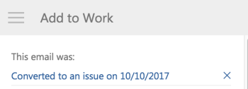

# 新增 [!DNL Outlook] 以任務或問題形式將電子郵件發送到項目

您可以將電子郵件轉換為 [!DNL Adobe Workfront] 工作或問題。 轉換電子郵件後，任務或問題會顯示在您要轉換時選取的專案上。

## 存取需求

您必須具備下列存取權，才能執行本文中的步驟：

<table style="table-layout:auto"> 
 <col> 
 <col> 
 <tbody> 
  <tr> 
   <td role="rowheader">[!DNL Adobe Workfront] 計劃*</td> 
   <td> 
任何
 </td> 
  </tr> 
  <tr> 
   <td role="rowheader">[!DNL Adobe Workfront] 授權*</td> 
   <td> 
[!UICONTROL工作], [!UICONTROL計畫]
 </td> 
  </tr> 
 </tbody> 
</table>

&#42;若要了解您擁有的計畫、授權類型或存取權，請聯絡您的 [!DNL Workfront] 管理員。

## 必要條件

您的 [!DNL Workfront] 管理員必須啟用 [!DNL Outlook for Office] with [!DNL Workfront] 才能使用此整合。

## 新增 [!DNL Outlook] 以任務或問題形式發送電子郵件到項目

1. 在中選取電子郵件 [!DNL Outlook] 要轉換為任務或問題的資訊。
1. 按一下 **[!DNL Workfront]** 圖示來顯示Workfront增益集。

   您可能需要按一下電子郵件右上方的向下箭頭，才能存取 [!DNL Workfront] 表徵圖。

1. 按一下 **[!UICONTROL 功能表]** 表徵圖以顯示可用清單 [!DNL Workfront] 選項。

   

1. 按一下 **[!UICONTROL 添加到工作]**.

   

1. 選取 **[!UICONTROL 新增至專案]** 欄位。
1. 開始在 **[!UICONTROL 專案]** 欄位，然後在清單中出現時選取它。
1. 選取 **[!UICONTROL 任務]** 選項。

   或

   選取 **[!UICONTROL 問題]** 選項。

1. （可選）指定此任務或問題在 **[!UICONTROL 將此項指派給]** 欄位。
1. （選用）指定 **[!UICONTROL 按日期到期]**. 這會變成 [!UICONTROL 計畫完成日期] 的子句。
1. （可選）在以任務或問題形式保存以下資訊之前（必填欄位前面帶有星號），請更新電子郵件中的以下資訊。

   <table style="table-layout:auto">
      <tr>
        <td>[!UICONTROL任務或問題名稱]</td>
        <td>依預設，任務名稱與電子郵件主旨相同。 您可以視需要修改任務名稱。</td>
        <td></td>
      </tr>
      <tr>
        <td>[!UICONTROL描述]</td>
        <td>依預設，說明與電子郵件內文相同。 您可以視需要修改說明。</td>
      </tr>
      <tr>
        <td>[!UICONTROL附件]</td>
        <td>任何電子郵件附件都將保存到任務或問題的[!UICONTROL文檔]區域。 您可以在將電子郵件儲存為任務或問題之前刪除任何附件。</td>
      </tr>
   </table>

1. 按一下 **[!UICONTROL 新增]**.

   任務或問題將添加到指定的項目

1. （選用）按一下 **[!UICONTROL 檢視[!DNL Workfront]]** 顯示 [!DNL Workfront] 應用程式。

1. （選用）返回 [!DNL Outlook]，然後選取轉換的電子郵件。

   在 [!DNL Workfront] 外掛程式面板中，請注意含有新增電子郵件的連結的確認 [!DNL Workfront] 作為任務或問題。 連結包含轉換日期。

   
