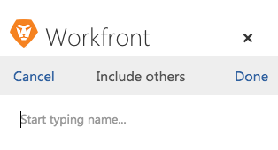

# 從 [!DNL Outlook] 電子郵件

您可以更新現有的項目、任務或問題，其資訊來自 [!DNL Outlook] 電子郵件。

## 存取需求

您必須具備下列存取權，才能執行本文中的步驟：

<table style="table-layout:auto"> 
 <col> 
 <col> 
 <tbody> 
  <tr> 
   <td role="rowheader">[!DNL Adobe Workfront] 計劃*</td> 
   <td> 
任何
 </td> 
  </tr> 
  <tr> 
   <td role="rowheader">[!DNL Adobe Workfront] 授權*</td> 
   <td> 
[!UICONTROL工作], [!UICONTROL計畫]
 </td> 
  </tr> 
 </tbody> 
</table>

&#42;若要了解您擁有的計畫、授權類型或存取權，請聯絡您的 [!DNL Workfront] 管理員。

## 必要條件

您的 [!DNL Workfront] 管理員必須啟用 [!DNL Outlook for Office] with [!DNL Workfront] 才能使用此整合。

## 從 [!DNL Outlook] 電子郵件

1. 在 [!DNL Outlook]，請選取包含您要納入之資訊的電子郵件 [!DNL Adobe Workfront update].
1. 按一下 **[!DNL Workfront]** 圖示來顯示Workfront增益集。\
   您可能需要按一下電子郵件右上方的向下箭頭，才能存取 [!DNL Workfront] 表徵圖。

1. 按一下 **[!UICONTROL 功能表]** 表徵圖以顯示可用清單 [!DNL Workfront] 選項。\
   

1. 按一下 **[!UICONTROL 更新] 在Workfront**.\
   \
   您可以在將下列資訊儲存為任務之前，先從電子郵件更新：

   * **[!UICONTROL 類型]**:選擇要更新的對象類型。 您可以選取 **[!UICONTROL 專案]**, **[!UICONTROL 任務]**，或 **[!UICONTROL 問題]**. 您選取的物件會決定顯示在 **[!UICONTROL 名稱]** 欄位。 如果不確定對象類型，請選擇 **[!UICONTROL 全部]** 來同時搜尋專案、工作和問題。

   * **[!UICONTROL 名稱]**:開始鍵入要更新的項目、任務或問題的名稱。 出現在下拉式清單中時，按一下名稱。
   * **[!UICONTROL 更新]**:依預設，更新與電子郵件內文相同。 您可以視需要修改更新。\

      此 [!UICONTROL 更新] 在Workfront中會顯示為更新狀態。

   * **[!UICONTROL 附件]**:任何電子郵件附件都會儲存至 [!UICONTROL 檔案] 任務的區域。 您可以在提交更新之前刪除任何附件。

1. （選用）按一下 **[!UICONTROL 包括其他]**，開始輸入您要納入更新的使用者名稱，然後在下拉式清單中出現時按一下名稱。\
   重複此程式以包含其他使用者，然後按一下 **[!UICONTROL 完成]**.\
   依預設，您回覆的使用者會收到通知，無論您是否加入。\
   

1. （選用）按一下 **[!UICONTROL 鎖定]** 圖示來限制此更新只適用於公司內的使用者。 當更新鎖定時，您公司外的使用者將看不到更新。

   * **[!UICONTROL 未鎖定]:** 任何有權訪問更新所在的項目、任務或問題的用戶都可以查看更新。\

      預設情況下，更新處於解鎖狀態。\
      

   * **[!UICONTROL 已鎖定]:** 只有您公司內的使用者可以檢視更新。\

      

1. 按一下 **[!UICONTROL 更新]**.
1. （選用）按一下 **[!UICONTROL 在Workfront中檢視]** 若要檢視已更新項目，並搭配 [!DNL Workfront] 整合 [!UICONTROL Outlook].
