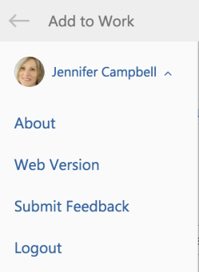

# 查看有關 [!DNL Adobe Workfront for Outlook] 登出

您可以檢視版本的詳細資訊 [!DNL Adobe Workfront] 用於 [!DNL Outlook]、直接導覽至網頁版本、提交意見或登出。

## 存取需求

您必須具備下列存取權，才能執行本文中的步驟：

<table style="table-layout:auto"> 
 <col> 
 <col> 
 <tbody> 
  <tr> 
   <td role="rowheader">[!DNL Adobe Workfront] 計劃*</td> 
   <td> 
任何
 </td> 
  </tr> 
  <tr> 
   <td role="rowheader">[!DNL Adobe Workfront] 授權*</td> 
   <td> 
[!UICONTROL工作], [!UICONTROL計畫]
 </td> 
  </tr> 
 </tbody> 
</table>

&#42;若要了解您擁有的計畫、授權類型或存取權，請聯絡您的 [!DNL Workfront] 管理員。

## 必要條件

您的 [!DNL Workfront] 管理員必須啟用 [!DNL Outlook for Office] with [!DNL Workfront] 才能使用此整合。

## 查看有關 [!DNL Adobe Workfront for Outlook] 登出

1. 在中選取電子郵件 [!DNL Outlook].
1. 按一下 **[!DNL Workfront]** 圖示來顯示Workfront增益集。
1. 按一下您使用者名稱旁的下拉式箭頭。

   

1. 按一下下列其中一個選項：

   * **[!UICONTROL 關於]:** 檢視Workfront增益集的相關資訊，包括最新版本、新增功能，以及Workfront說明網站上作法資訊的連結。
   * **[!UICONTROL 網頁版本]:** 在新的瀏覽器視窗中啟動完整的Workfront應用程式。
   * **提交反饋：** 向提交意見回饋 [!DNL Workfront] 關於Workfront增益集。
   * **[!UICONTROL 登出]:** 登出 [!DNL Workfront] 載入項。

      此選項不會將您登出 [!DNL Outlook].
